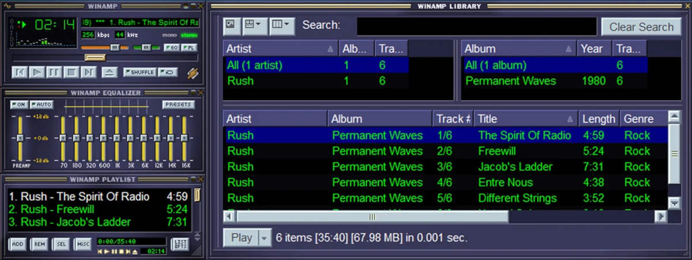

Olen käyttänyt Spotifyta vuosikaudet, mutta kasvava tyytymättömyys on ajanut minua takaisin vanhaan aikaan.

<!--more-->

Ennen striimauspalveluiden aikakautta omistin kaiken kuuntelemani musiikin. Ensiksi C-kaseteilla sekä LP-levyillä, sitten CD-levyillä ja lopulta MP3-tiedostoina. Minulla oli varsin kattava musiikkikokoelma ja soittimena toimi tietenkin [Winamp](https://en.wikipedia.org/wiki/Winamp).

Tullessaan Spotify tuntui unelmapalvelulta. Se tarjosi uskomattoman määrän musiikkia, eikä se alun perin maksanut juuri mitään. Mainoksiakin tuli harvakseltaan, joten se tuntui köyhälle opiskelijalle täydelliseltä. Tuohon aikaan olin niin sinisilmäinen, ettei minulle tullut mieleenkään ajatella negatiivisia puolia, joita striimauspalveluun sitoutumiseen liittyi. Niinpä tuhosin myös oman musiikkikokoelmani kovalevytilaa tuhlaamasta. Eikä siinä lopulta mennyt kovin pitkään, kun Spotifyn toiminta alkoi muuttua.

### Spotifyn ongelmat

Spotifyssa on lukuisia asioita, joista en erityisemmin pidä. Ylivoimaisesti suurin on se, että kuuntelemani musiikki voi kadota sieltä milloin tahansa. Minä en yksinkertaisesti omista kuuntelemaani musiikkia enkä voi vaikuttaa sen säilyvyyteen mitenkään. Tämä tökkii paitsi käytännössä, niin myös periaatteellisella tasolla.

Vielä joskus Spotify oli yllättävän hyvä työkalu uuden musiikin löytämiseen. Nykyisin algoritmi on lähes yhdentekevä. En ole tänä vuonna löytänyt Spotifyn kautta yhtään uutta artistia, biisejäkin vain muutaman. Spotify tuntuu soittavan samoja suosittuja biisejä. Tämä on aika tyypillistä algoritmeille: suosituista tulee entistä suositumpia ja harvinaisuudet jäävät löytymättä.

Spotifyn käyttöliittymä on muuttunut vuosi vuodelta sekavammaksi. Lisäksi joudun toistuvasti katsomaan mainoksia, vaikka maksan kuukausimaksua. Spotify tosin kutsuu näitä ilmoitukseksi. Toki ne liittyvät aiheeseen, sillä "ilmoituksissa" mainostetaan uusia albumeita. En halua nähdä mainoksia artisteilta, joita en kuuntele ja joista en ole kiinnostunut.

Palvelun maine ja bisnesmalli on viime vuosina ryvettynyt melkoisesti. Erityisesti tapa, jolla se maksaa artisteille, ei tunnu erityisen reilulta. Eikä palvelun mainetta ole auttaneet [250 miljoonan dollarin diilit](https://apnews.com/article/joe-rogan-spotify-deal-76fa0e2c9d4b137f510428528ea6226b) Joe Roganin kanssa. Samaan aikaan kun tuhannet artistit saavat parhaimmillaan senttejä, yksi tyyppi kerää taskuunsa satoja miljoonia kyseenalaisilla höpinöillä.

### Oma striimauspalvelu

Halusin palata takaisin digitaalisten tiedostojen maailmaan. En kuitenkaan kaivannut 90-luvussa sitä, että musiikki olisi kuunneltavissa vain yhdellä tietokoneella. Halusin oman striimauspalvelun, joka olisi täysin minun hallinnassani. Päädyin [Navidromeen](https://www.navidrome.org/).

Navidrome on ilmainen, avoimen lähdekoodin sovellus musiikin striimaamiseen. Se tarjoaa kätevän web-käyttöliittymän, jolloin musiikin kuuntelemiseen riittää pelkkä selain. Tätä käytän kuunnellessani musiikkia tietokoneella.



[Subsonic](https://www.subsonic.org) on vastaavanlainen sovellus, mutta suljettu ja lisäominaisuudet vaativat maksullisen tilauksen. Tästä huolimatta heidän kehittämästään Subsonic API:sta on muodostunut jonkinlainen standardirajapinta, joka lähti elämään omaa avoimempaa elämäänsä [OpenSubsonic API:n](https://opensubsonic.netlify.app/) muodossa. Kyseessä on siis ohjelmointirajapinta, joka mahdollistaa sen, että kuka tahansa voi tehdä sovelluksia, jotka osaavat striimata musiikkia rajapintaa tukevista palveluista. Myös Navidrome [tukee](https://www.navidrome.org/docs/developers/subsonic-api/) OpenSubsonic-rajapintaa.

Niinpä käyttäjille on tarjolla useita mobiilisovelluksia musiikin kuunteluun. Itse päädyin käyttämään Android-puhelimessani ilmaista avoimen lähdekoodin [Tempo](https://github.com/CappielloAntonio/tempo)-sovellusta. Se tukee myös biisien lataamista offline-tilaan.

Itselleni yksi Navidromen kivoista ominaisuuksista on [ListenBrainz](https://listenbrainz.org/)-tuki. ListenBrainz on [Last.fm](https://www.last.fm/):n kaltainen musiikin tilastointipalvelu, mutta pohjautuu avoimeen dataan. Kuunnelluimpien artistien lista [Nyt]()-sivulla tulee ListenBrainz-palvelusta.

### Musiikin organisointi

Olen tallentanut omat musiikkitiedostoni verkkolevylle. MP3-tiedostojen sijaan käytän paremman laadun tarjoavia [FLAC](https://en.wikipedia.org/wiki/FLAC)-tiedostoja. Navidrome pyörii erillisellä Linux-palvelimella. Verkkolevyllä sijaitsevat tiedostot toin Navidromen saataville [SSHFS](https://github.com/libfuse/sshfs):llä. Sen avulla tiedostot näkyvät palvelimella, niin kuin ne olisivat paikallisia tiedostoja, mutta eivät vie siellä tilaa. Tiedostojen säilyttäminen verkkolevyllä on senkin puolesta kiva, että ne tulevat automaattisesti varmuuskopioiduksi.

Navidrome ei tarjoa työkaluja musiikin metatietojen editoimiseen. Tässä päädyin kokeilemaan avoimen lähdekoodin [MusicBrainz Picardia](https://picard.musicbrainz.org/), joka osoittautui aivan loistavaksi työkaluksi. Se osaa hakea biisien tiedot ja albumien kansikuvat [MusicBrainz](https://musicbrainz.org/)-palvelusta. MusicBrainz on käytännössä avoin musiikkitietokanta, joka toimii myös ListenBrainzin ytimenä.

Picardin avulla minun ei tarvitse kirjoitella mahdollisia puuttuvia tietoja käsin ja sovellus on ainakin toistaiseksi toiminut uskomattoman luotettavasti. Jos jokin tieto puuttuu MusicBrainz-palvelusta, voin käydä lisäämässä sen sinne itse. Näin pystyn korjaamaan puutteet itse, en ole riippuvainen palvelun omasta päivitystahdista ja pystyn samalla auttamaan muita käyttäjiä. Ei pöllömpi yhdistelmä!

### Musiikin ostaminen

Vaikka olenkin hyvin kaikkiruokainen musiikin suhteen, kuuntelen eniten elektronista musiikkia. Erityisesti viime vuosina olen innostunut kuuntelemaan 80-luvun henkeä kantavaa synthwave-musiikkia, sekä demoscenestä ja vanhoista pelikonsoleista tuttuja chiptune-ralleja.

Toistaiseksi olen ostanut kaiken musiikkini [Bandcamp](https://bandcamp.com/)-palvelusta. Sen lisäksi, että se on osoittautunut hyväksi aarrearkuksi elektroniselle musiikilla, sen kautta löytää myös paljon uutta kuunneltavaa. Pidän myös siitä, että se maksaa artisteille kelvollista korvausta. Sikaa ei tarvitse osaa säkissä, sillä kaikkia biisejä pääsee kuuntelemaan ennen niiden ostamista.

Vuosia sitten käytin myös [Beatport](https://www.beatport.com/)-palvelua, josta löytyy hyvin erityisesti trancea, teknoa, housea ja muita tanssimusiikin alalajeja.

Navidromea käytettyäni minulle on valjennut, että suosikkiartisteillani on suuri määrä biisejä, joita en ole koskaan kuunnellut. Kokonaiset EP:t ja singlet ovat saattaneet mennä täysin ohi. Spotify ei ole niitä minulle soittanut, vaikka joitakin artisteja olen kuunnellut useita vuosia. Tätä voi osaltaan selittää se, etten juurikaan kuuntele musiikkia albumeittain. Se kuitenkin alleviivaa sitä, että palvelun algoritmi ei osaa hakea niitä vähemmän suosittuja biisejä edes niiltä artisteilta, joiden musiikista pidän.

Minulla on edelleen Spotify-tilaus, mutta huomaan, etten kaipaa sitä lainkaan. En loppujen lopuksi tarvitse Spotifyn miljoonien biisien arkistoa, eikä heidän algoritmi palvele minua mitenkään. Pystyn kuuntelemaan samat biisit ilman kuukausimaksua ja nyt omistan musiikin, jota kuuntelen. Lisäksi musiikkiin käyttämästäni rahasta tuntuvasti suurempi osa menee juuri niille artisteille, joiden musiikkia kuuntelen. Tykkään!
