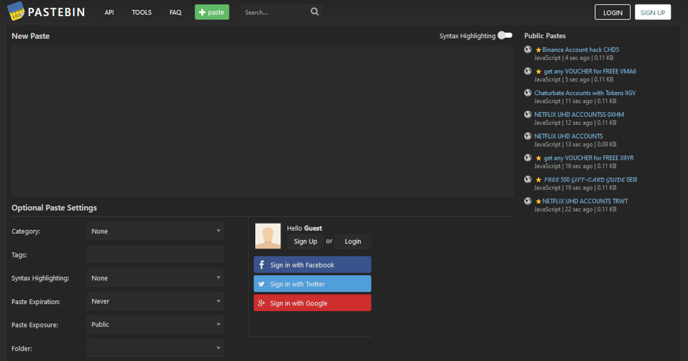

Innostuin taas korvaamaan yhden käyttämistäni palveluista itse tehdyllä ja itse hostattavalla ratkaisulla. Tällä kertaa leikkuri kohdistui Pastebin.comiin.

<!--more-->

Kaikessa yksinkertaisuudessaan [Pastebin.com](https://pastebin.com/) on palvelu, jonne voit tallentaa tekstimuotoisia dokumentteja ja muokata niitä suoraan selaimessa. Lisäksi voit halutessasi jakaa dokumentteja muiden kanssa. Sen voi ajatella olevan selainkäyttöinen tekstieditori, joka tarjoaa muutamia erikoisominaisuuksia. Ei siis varsinaisesti mikään tajuntaa räjäyttävä palvelukonsepti.

Olen kuitenkin suuresti pitänyt siitä, sillä se on aivan täydellinen satunnaisten muistiinpanojen kirjoittamiseen. Minullahan on myös Obsidian, josta olen [kirjoitellut]() [aikaisemminkin](). Obsidianissa on kuitenkin se ongelma, että sen järkevä käyttäminen vaatii Obsidian-sovelluksen. Lisäksi en halua avata siellä olevia dokumentteja ulkomaailmaan, enkä missään tapauksessa halua edes vahingossa jakaa näitä muistiinpanoja muille. Pastebin on tähän pieneen tarpeeseen hyvä ratkaisu.

Pastebinissa on kuitenkin tuttu ongelma: en omista siellä olevia tietoja. Palvelun käyttöehdot ovat kyllä asialliset, mutta niin pitkään kun kaikki sijaitsee ulkopuolisessa palvelussa, minulla ei ole tuottamaani sisältöön hirvittävästi kontrollia.

Palvelussa on omiin tarpeisiin nähden ihan liikaa ominaisuuksia. Sitä ei ole kehitetty moneen vuoteen ja onkin alkanut vaikuttaa siltä, että koko palvelu on hylätty. Lisäksi se tuntuu olevan täynnä roskaa ja erilaisia huijauksia suoltavia botteja.

Pastebin.com ei ole suinkaan ainut tällainen palvelu. Lisäksi avoimen lähdekoodin itse hostattavia Pastebin-sovelluksia on tarjolla vaikka kuinka paljon. Kannattaa tutustua esimerkiksi [Awesome Selfhosted -listan tarjontaan](https://github.com/awesome-selfhosted/awesome-selfhosted?tab=readme-ov-file#pastebins). Testasin useampaa listan sovellusta, mutta useimmat niistä olivat aivan tarpeettoman monimutkaisia omiin tarpeisiini, tai sitten en pitänyt niistä muuten vaan.

Niinpä päätin tehdä [oman Pastebin-sovelluksen](https://github.com/saaste/pastebin). Sen lähtökohdat ovat minun tekeleille tutut: minimalismi, yksinkertaisuus, helppokäyttöisyys ja avoin lähdekoodi.

Sovellus ei vaadi erillisiä tietokantoja, siinä ei ole käyttäjähallintaa, salausta, kategorisointia, tägejä tai hakuja. Se keskittyy ratkaisemaan yhden ongelman: kuinka voin kirjoittaa ja muokata tekstidokumentteja miltä tahansa nettiin kytketyltä tietokoneelta tai mobiililaitteelta. Siinä on lisäksi kolme ominaisuutta, joita kaipasin omaan käyttöön.

1) Sovellukseen on olemassa salasana, joten dokumentit ovat jollain tavalla suojattuja
2) Yksittäisiä dokumentteja voi laittaa julkiseksi, jolloin niitä pääsee lukemaan ilman salasanaa
3) Tekstieditori osaa värittää tiettyjen tiedostomuotojen sisällöt



Sovellus on toteutettu [Go-ohjelmointikielellä](https://go.dev/), joka on tämän hetken suosikkini. Kaikki dokumentit tallennetaan yhteen tiedostoon, joka on [YAML](https://fi.wikipedia.org/wiki/YAML)-muotoinen. Tämä mahdollistaa sen, että dokumentit on helppo varmuuskopioida. Lisäksi YAML-tiedostoja voi lukea millä tahansa tekstieditorilla ja voin helposti hyödyntää samaa YAML-tiedostoa jossain toisessa sovelluksessa.

Koodia värittävää editoria en sentään lähtenyt itse rakentaamaan, vaan päätin käyttää siinä [Acea](https://ace.c9.io/). Muu käyttöliittymä on toteutettu ihan yksinkertaisella HTML:llä ja JavaScriptillä, eikä raskaita kirjastoja ole käytössä.

Ajan itse omalla palvelimella käytännössä kaikkea softaa [Dockerilla](https://www.docker.com/), joten tämäkin sovellus on suunniteltu sen päällä ajettavaksi. Go:ta tuntevat voivat tietenkin ajaa sitä myös ilman Dockeria. Tällä kertaa päätin tehdä Dockerin käyttämisestä aikaisempaa helpompaa.

Julkaisen jokaisesta versiosta itse Docker-imagen, joten ihmisten ei ole pakko ladata lähdekoodia itselleen. Riittää, että he kopioivat [docker-compose.yaml.example](https://github.com/saaste/pastebin/blob/main/docker-compose.yaml.example) sekä [config.yaml.example](https://github.com/saaste/pastebin/blob/main/config.yaml.example) tiedostot itselleen. Lisäksi heidän on luotava tyhjä `documents.yaml` tiedosto, joka toimii sovelluksen tietokantana. Tämän jälkeen sovelluksen voi käynnistää yhdellä komennolla:


docker compose up -d


Päivittäminenkin on helppoa ja onnistuu seuraavalla loitsulla, joka hakee tuoreen imagen, luo uuden containerin tuoretta imagea käyttäen ja siivoaa sen jälkeen vanhat imaget pois:


docker-compose pull && docker-compose up --force-recreate -d && docker image prune -f


Olen nyt itse käyttänyt sovellusta jo jonkin aikaa ja ainakin omassa käytössä se toimii hyvin. Siinä on vielä pieniä puutteita, mutta koetan taklata ne lähipäivien aikana.

Nyt minun ei tarvitse murehtia muiden palvelujen sopimuksista tai siitä, mitä tiedostoillani tehdään tai kuinka pitkään ne ovat tallessa. Ne pyörivät minun palvelimella eivätkä poistu sieltä mihinkään. Dokumentit päätyvät minun varmuuskopioihin.

Nämä ovat hetkiä, kun olen kiitollinen siitä, että pystyn ratkaisemaan oman elämäni pieniä ongelmia ohjelmoimalla.

Pastebin-sovelluksen [lähdekoodi löytyy GitHubista](https://github.com/saaste/pastebin/).