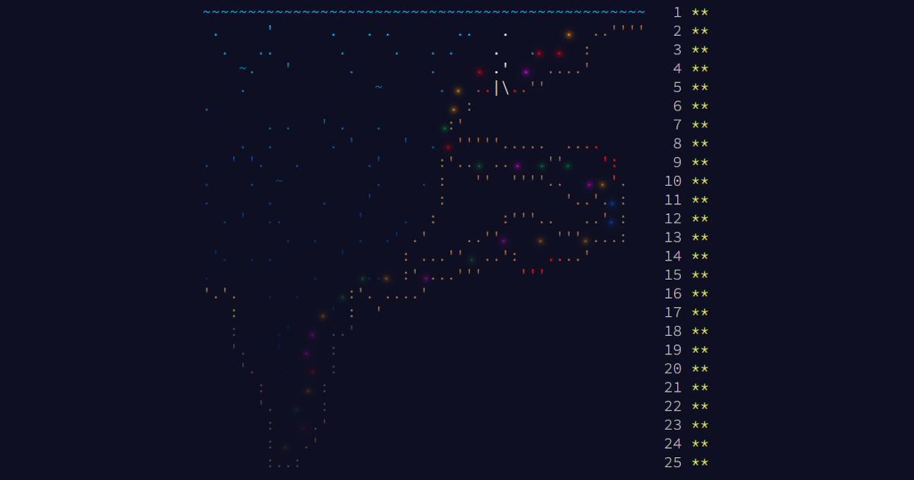

Joulukuun alkuun on enää reilu kuukausi. Joulukuu tarkoittaa tietenkin joulukalenteria! Perinteisiin suklaakalentereihin kyllästyneille tarjolla on täysin ilmainen ja terveellinen, joskin haastava vaihtoehto: Advent of Code.

<!--more-->

[Advent of Code](https://adventofcode.com/) on ohjelmoijille tarkoitettu joulukalenteri. Siitä on tullut itselleni jonkinlainen perinne, johon olen osallistunut useampana vuonna. Viime vuonna riemu meni harmillisesti ohi muuton takia, mutta tänä vuonna aion olla taas mukana.

Joulukalenteri kertoo höpsön joulutarinan, joka on täynnä haasteita ja vastoinkäymisiä. Et ole kuitenkaan pelkkä passiivinen tarinan lukija, sillä sinun tehtävänä on löytää ratkaisut annettuihin ongelmiin.

Joka aamu tarina esittelee sinulle uuden pulman, jossa on kaksi osaa. Nähdäksesi jälkimmäisen osan, sinun on kyettävä ratkaisemaan ensimmäinen. Jälkimmäinen on usein paljon vaikeampi. Usein käykin niin, että ensimmäisenä mieleen tullut ratkaisu voi toimia ensimmäisessä osassa, mutta ei toisessa.

Advent of Coden toteutus on siitä nerokas, että se on täysin riippumaton ohjelmointikielestä. Voit osallistua millä kielellä tahansa. Monet hyödyntävätkin joulukalenteria uuden ohjelmointikielen opetteluun. Itse puolestaan nautin siitä, että pääsen virkistämään algoritmisia taitojani, joita päivätöissä tarvitsee verrattain vähän. Joka vuosi opin myös jotain uutta joko algoritmeista tai matematiikasta.

Joka päivälle sinulle esitellään pulma ja annetaan siihen pieni esimerkki. Esimerkki auttaa sinua alkuun ja sen avulla voit varmistaa, että tekemäsi ratkaisu toimii niin kuin pitää - ainakin isolta osin.

Joukalenterissa ei kuitenkaan etsitä oikeaa vastausta, vaan *ratkaisua*. Esimerkin lisäksi saat **henkilökohtaisen** syötteen, jota sinun on käytettävä varsinaisessa ratkaisussa. Tästä johtuen myös vastaus on yksilöllinen. Pulmasta ei siis selviä kopioimalla naapurin vastausta, koska jokaisen käyttäjän vastaus on eri.

Pulmien vastaus on aina joku kokonaisluku. Kun luulet löytäneesi vastauksen, syötät sen palveluun ja se kertoo, oliko vastauksesi oikein, liian suuri tai liian pieni. Muutaman virheellisen yrityksen jälkeen joudut odottamaan joitakin minuutteja, ennen kuin voit yrittää uudelleen. Oikeaa vastausta ei näin ollen voi löytää myöskään arvaamalla.

Yksi joulukalenterin ensimmäisistä haasteista on se, että osaat kirjoittaa koodin, joka pureskelee annetun tekstisyötteen käytettävään muotoon. Vasta tämän jälkeen voit alkaa ratkoa varsinaista ongelmaa. Useimmat haasteista ovat matemaattisia ja loogisia. Monet niistä vaativat sopivan algoritmin löytämistä.

Ei kuitenkaan kannata säikähtää, vaikket olisikaan matemaattisesti lahjakas, eikä työkalupakistasi löytyisi vahvaa algoritmiosaamista. En ole itse matemaattisesti erityisen lahjakas ja ehkä juuri tästä syystä oma kokemukseni on, että pulmien ensimmäinen osa ratkeaa lähes aina loogisella päättelyllä, perusmatematiikalla sekä yksinkertaisilla ohjelmointitaidoilla. Tämä pätee usein myös pulmien toiseen osaan, mutta niiden kohdalla oikea ratkaisu voi vaatia tiettyjen algoritmien hyödyntämistä tai ymmärrystä koodin optimoinnista.

Monesti toisen osan ongelmaksi muodostuu suorituskyky. Naiivi koodi, joka ratkaisee ensimmäisen osan sekunneissa, saattaa jauhaa toista osaa 10 000 vuotta. Tästä syystä joulukalenteriin osallistuminen on loistava tapa oppia sekä optimoinnista, että algoritmeista. 

Joka vuosi joulukalenterissa on ollut pulmia, joita en ole saanut itse ratkaistua. Onneksi Redditistä löytyy [Advent of Code -subreddit](https://www.reddit.com/r/adventofcode/), jossa ihmiset auttavat umpikujaan joutuneita. Mikä parasta, valmiiden ratkaisujen sijaan ihmiset pyrkivät auttamaan pulaan joutuneita opastamalla heitä oikeaan suuntaan. Pidän tästä, koska se antaa jokaiselle mahdollisuuden kokea onnistumisen riemun. Valmiita ratkaisujakin näkee, mutta useimmiten ne piilotetaan spoiler-palkkien alle.

Kaikesta avusta huolimatta vuosi 2021 oli edellinen kerta, kun onnistuin ratkaisemaan joka haasteen itse. Toissa vuonna muutama pulma jäi ratkaisematta. Olisin tietenkin voinut kopioida jonkun valmiin ratkaisun, mutta mitäs järkeä siinä on?

Itse aion toteuttaa tämän vuoden ratkaisut [Go:lla](https://go.dev/). Käytin sitä työssäni, joten se on minulle tuttu. Pidän siitä myös siksi, että ydinkirjasto ei tarjoa läheskään niin paljon apuvälineitä, kuin monissa muissa ohjelmointikielissä. Aasioita joutuu siis tekemään enemmän itse. Hyvänä puolena on se, että Go on todella tehokas kieli, joten hieman huonommatkin ratkaisut saattavat pulauttaa vastauksen ulos inhimillisessä ajassa.

Aion julkaista kaikki tekemäni ratkaisut [GitHubissa](https://github.com/saaste/advent-of-code-2024). Koodin laatu tulee tuttuun tapaan olemaan aivan järkyttävää roskaa, mutta se onkin yksi Advent of Coden hienouksista: voit keskittyä ongelmaan, eikä kukaan ole marmattamassa sinulle joutavista koodauskäytännöistä. Voit antaa luovuudelle ottaa vallan!

Mikäli haluat virkistää matemaattisia ja algoritmisia taitojasi, opetella uuden ohjelmointikielen tai käyttää muuten vaan hoksottimiasi, nyt siihen on hyvä tilaisuus. Tässä on vielä reilu kuukausi aikaa ja voit valmistautua tulevaan jouluseikkailuun esimerkiksi [edellisten](https://adventofcode.com/2023) [vuosien](https://adventofcode.com/2022) [joulukalentereilla](https://adventofcode.com/2021). Jos osallistut joulukalenteriin, kannustan julkaisemaan omat räpellykset avoimena lähdekoodina!