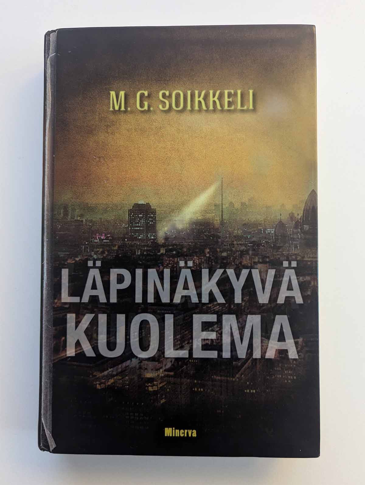

Kirjastosta sattumalta mukaan tarttuneen valvontayhteiskuntaan sijoittuvan Läpinäkyvän kuoleman takakansiteksti loi suuria odotuksia. Harmillisesti M. G. Soikkelin teos oli tylsä pettymys.

<!--more-->

### Tarina

Ihmiskunta on menettänyt hedelmällisyytensä. Uusia lapsia syntyy todella harvoin ja ilmassa on vääjäämättömän sukupuuton tuntu. Rikkaimmat koettavat pidentää jäljellä olevaa elämäänsä telomeerihoidoilla ja elinsiirroilla. Köyhimmät joutuvat tyytymään siihen aikaan jonka heidän syntykehonsa tarjoaa. Kansakunta vanhenee vääjäämättä ja kuolemattomuus on yrityksistä huolimatta pelkkä haave, jota rahakaan ei tee todellisuudeksi.

Etsivä **Jordan**, komisario **Richter** sekä sihteeri **Carmen** ovat Dammerburgissa asuvia poliiseja. Itse asiassa he ovat koko kaupungin poliisivoimat. Poliisille ei ole tarvetta, sillä Dammerburg on käytännössä rikoksista vapaa.

Kaupunki toteuttaa äärimmilleen vietyä avoimuutta. Se on paikka, jossa kamerat sekä mikrofonit valvovat ja tallentavat kaikki liikkeesi ja keskustelusi. Ihmisen henkilöllisyys on tiivistynyt taskussa kulkevaan puhelimeen, joka sekin toimii jäljityslaitteena. Kansalaisten koko elämä tallentuu *Arkistoon*, josta kuka tahansa voi kaivaa mitä tahansa tietoa kenestä tahansa - salaisuuksia tai yksityisyyttä ei ole. Rikosten tekeminen tällaisessa ympäristössä on käytännössä mahdotonta jäämättä kiinni. Tai näin kaikki ajattelivat.

Kaupungissa tapahtuu murha - asia, jota Dammerburg ei ole kohdannut vuosikymmeniin. Poliisijoukko olettaa tapauksen olevan läpihuutojuttu, mutta käy ilmi, että murhaaja on onnistunut työssään jälkiä jättämättä.

Murhaakin pahempi asia on se, että rikoksen yhteydessä on kadonnut pieni lapsi. Sukupuuttoa odottavalle ihmiskunnalle harvinaiset lapset ovat kaikista arvokkain asia.

Kolme poliisia eivät ole koskaan joutuneet kohtaamaan tällaista rikosta. Heille murhat ovat tarinoita historian kirjoista. Nyt he joutuvat etsimään näkymätöntä murhaajaa maailmassa, jossa kaiken piti olla näkyvää, ja etsimään kadonnutta lasta, vaikka kenenkään ei pitäisi pystyä piiloutumaan.

### Sekava maailma

Halusin todella paljon pitää kirjasta ja sen dystooppisesta maailmasta. Yrityksestä huolimatta näin ei kuitenkaan tapahtunut.

Täysin läpinäkyvä maailma on haastava, sillä lähes jokainen tarina tarvitsee jonkinlaisia salaisuuksia ja mysteereitä. Jos jokaisella kansalaisella on kaikki samat tiedot käytössään, mikä erottaa heidät toisistaan? Mikä erottaa poliisin tavallisesta kadun tallaajasta? Miten paikat eroavat toisistaan, jos ne kaikki ovat samalla tavalla valvottuja? Minusta tuntui, että kirjailija oli tajunnut tämän itsekin, mutta ei tiennyt kuinka se ratkaistaan.

Niinpä ratkaisut päätyivät olemaan varsin halpoja. Esimerkiksi poliisilaitoksen keittiö oli täysin vapaa kameroista ja mikrofoneista. Miksi? En tiedä. Tuntui, että näitä mystisiä valvomattomia paikkoja tuli vastaan aina kun tarina niitä tarvitsi salaisuuksien rakentamiseen. Jos poliisit pystyivät piiloutumaan valvonnalta, mikä estäisi murhaajaa tekemään samaa? Koko kirjan jännittävältä tuntunut lähtökohta täydellisestä avoimuudesta romahti aika nopeasti.

Kirjan iso ongelma oli se, että se kertoi, eikä näyttänyt. Lapsettomuus oli merkittävä juttu, koska kirja sanoi niin. Tarinan tai päähenkilöiden kannalta se oli yhdentekevää. Rikkaiden ja köyhien välillä oli suuri kuilu. Tämä oli tärkeää, koska kirja kertoi niin. Mitenkään se ei asiaa hyödyntänyt.

Minulla oli alusta asti vaikeuksia ymmärtää, että minkälaista maailmaa Soikkeli on yrittänyt rakentaa. Onko täydellinen läpinäkyvyys hyvä vai huono asia? Kuinka sen asukkaat suhtautuvat siihen? Miksi ihmiset hyväksyvät valvonnan? Miten tähän on päädytty? Kenen etua se oikeasti ajaa? Kirja kertoi kovasti asioita, mutta se ei onnistunut näyttämään minulle maailmaa, jossa voisin omaksua ja ymmärtää nämä asiat itse.

Kirja vaikutti läjältä irrallisia ideoita. Välillä meno muistutti 2000-luvun alkua salkkutietokoneineen ja kännyköineen. Seuraavassa hetkessä puhuttiinkin jonkinlaisen tietoisuuden siirtämisestä tietokoneeseen, tekoälystä ja aivoihin istutettavista siruista, joilla voidaan ohjelmoida koko ihmisyys uusiksi. Joukkoon oli tungettu myös telomeerihoitoja, geenimanipulaatiota, uskonnollisia lahkoja ja paljon muuta. Kaikki tuntui päälle liimatulta purkalta, jolla oli hyvin vähän tekemistä tarinan kanssa.

### Sekavat henkilöt

Sekavuus jatkui myös henkilöissä. Välillä kirja antoi ymmärtää, että ihmiset ovat menettäneet lisääntymiskykynsä lisäksi kyvyn tuntea vetovoimaa ja tunteita, mutta toisessa hetkessä näin ei ollutkaan. Kolmen päähenkilön tittelit olivat etsivä, komisario sekä sihteeri, mutta he kaikki tekivät ihan samoja asioita täysin samoilla tiedoilla. Mikä merkitys näillä rooleilla oikein oli? Miksi henkilöitä ylipäätään oli kolme?

Jordan ja Richer olisivat voineet olla käytännössä yksi ja sama henkilö, sillä oikeastaan mikään ei erottanut heitä toisistaan. Carmeniin erikoisuus oli jonkinlainen kyky hakkerointiin, mutta tämäkin päätyi olemaan samanlainen kömpelö oikotie kuin mystisesti valvonnalta vapaat huoneet. Oliko edessä palomuuri? Hakkeroi se. Oliko edessä lukittu ovi? Hakkeroi se. Tarvitsitko suojattua tietoa? Hakkeroi se. Hakkerointi oli näppärä yleisavain kaikkien ovien avaamiseen ja teki Carmenista jonkinlaisen yli-ihmisen, jolla ei ollut todellisia haasteita.

Kirjan alussa selviää, että Jordanilla on yhteys Dammerburgin eräänlaiseen orpokotia muistuttavaan laitokseen. Yksityiskohta olisi voinut olla kiinnostava, jos kirja olisi hyödyntänyt sitä jotenkin. Siihen ei kuitenkaan käytännössä palattu mitenkään alun jälkeen.

En onnistunut pääsemään sisään yhteenkään päähenkilöön. Jokainen heistä tuntui ihan yhdentekevältä. He hyppivät sattumasta toiseen ja tuntuivat omassa tarinassaan sivuhahmoilta. Minua ei kiinnostanut yhdenkään henkilön kohtalo. Tarinan vastavoimana toimivat henkilöt kärsivät samoista ongelmista. Hahmojen toimintaa ohjaavat motivaatiot olivat todella ohuita tai niitä ei ollut lainkaan.

Jos hahmoilla oli jonkinlainen kehityskaari, minä en sitä nähnyt. Kukaan tarinan päähenkilöistä ei tuntunut muuttuvan tarinan aikana.

### Kiinnostava idea, kömpelö toteutus

Minun on annettava pisteet kirjalle sen loistavasta ideasta. Tykkäsin siitä, kuinka murhaajasta oli tehty eräänlainen haamu, joka onnistui tavalla tai toisella väistämään lähes kaiken valvonnan ja tietojen keräämisen. Mikä parasta, kirja onnistui tuomaan murhamysteerin päätökseen varsin uskottavalla tavalla. Näkymättömälle tappajalle löytyi selitys, joka istui toimivalla tavalla rakennetun maailman sääntöihin - olkoonkin, että ne säännöt olivat melkoinen sekamelska.

Kirjan hyvät puolet jäivätkin sitten siihen. Pystyin kyllä näkemään kirjailijan päässä olleen vision, mutta toteutus oli pitkästyttävä ja tuntui keskeneräiseltä sekä puutteelliselta.

Jatkuva oikoteiden ja sattumien käyttäminen kävi todella ärsyttäväksi. Se vei pohjan kaikelta jännitykseltä, koska lukijana tiesit, että päähenkilöt selviävät kaikesta tuurilla tai jonkin kummallisen oikotien avulla. Heillä ei ole todellisia haasteita, eikä haasteiden voittaminen tunnu palkitsevalta.

Esimerkkinä kohtaus, jossa päähenkilöt yrittävät etsiä kadonnutta henkilöä rakennuksesta, jonka kirja kuvailee olevan koko kaupungin ylle kurkottava jättimäinen ja brutaali rakennelma, jossa työskentelee tuhansia ihmisiä, joka on täynnä vartijoita ja jossa liikkuminen on mahdollista vain erityisluvalla - ja silloin todella rajoitetusti. Yksittäisen henkilön löytäminen tällaisesta tuntui mahdottomalta. Käytännössä päähenkilöt kuitenkin kävelevät rakennukseen kuin kotiinsa ja lampsivat tuurilla juuri sinne, jossa kadonnut henkilö sijaitsi.

Kirjan loppupuolella näitä älyttömyyksiä on niin paljon, että minun oli vaikeuksia jaksaa lukea kirja loppuun.

Pidin noin yleisesti Soikkelin kirjoitustyylistä. Kirjassa ei ollut vaikeaselkoisia asioita ja sen henkilömäärä oli kohtuullinen. Kerronta itsessään oli selkeää ja helppoa seurata. Kirjailijalla oli outo viehtymys kuin-vertailuihin, joita hän viljeli niin usein, että se muuttui häiritseväksi maneeriksi:
- "He tarkkailivat toisiaan kuin kamerat."
- "Tohtorin ironia oli kuolemanvakaa kuin veitset hänen praktiikassaan."
- "Perimä siivottiin ja solmittiin uudelleen kuin ihmislajin kunniaa esittelevä seinävaate."
- "...se näkyi kaikkialle kuin hattu kaupungin harteilla."
- "...puhe oli kuin huokaileva tuuli tai levoton laineikko äärettömällä rannalla."

Vielä puolen välin jälkeen toivon, että kirja onnistuisi voittamaan minut puolelleen, mutta se ei sitä tehnyt. Tarina on täynnä kiinnostavia ideoita ja pohtii kiinnostavia kysymyksiä, mutta ei osaa solmia niitä ehjäksi kokonaisuudeksi. Läpinäkyvä kuolema päätyi harmillisesti olemaan tämän vuoden tylsimpiä tarinoita. Se on harmi, koska halusin todella pitää kirjasta.
