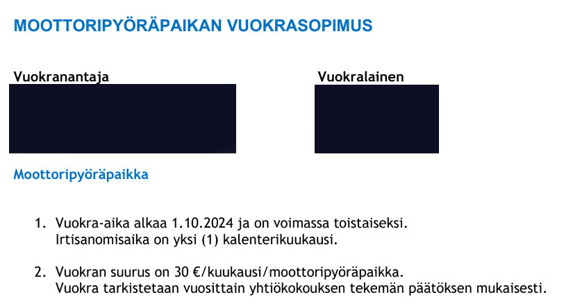

Tämä on tarina kuormapyörästä ja parkkipaikasta. Samalla se on tarina autolähtöisestä ajattelusta ja sen järjettömyydestä.

<!--more-->

### Vuokrasopimuksen allekirjoittaminen

Etsimme vuoden 2023 lopulla puolisoni kanssa uutta asuntoa. Yksi asunnon vaatimuksista oli, että siellä oli oltava *kunnollinen* säilytysmahdollisuus kuormapyörälle. Kunnollisella tarkoitan sellaista säilytystä, jossa pyörä ei ole säiden, ilkivallan tai varkaiden armoilla.

Löysimme asunnon, jossa oli kaikki muut asiat kunnossa, mutta kuormapyörän säilytyspaikka puuttui. Taloyhtiön pihalla oli kylmä *ulkoiluvälinevarasto*, mutta se oli täynnä pyöriä ja muuta törkyä. Siellä ei ollut tilaa edes tavalliselle pyörällä, kuormapyörästä puhumattakaan.

Varastorakennus oli jaettu kahteen osaan ja jostain syystä toinen puolikas oli täysin tyhjä. Ehdotin, että siitä voisi tehdä kuormapyörien pysäköintipaikan. Se kelpaisi minulle oikein hyvin ja samaan tilaan voisi pysäköidä myös esimerkiksi vanhusmopot ja muut vastaavat liikkumisavustimet. Tämä ei kuitenkaan sopinut vuokranantajalle. Tila haluttiin mieluummin pitää tyhjänä. Ihmettelin päätöstä, mutta en alkanut asiaa sen enempää kyseenalaistamaan[^1].

Taloyhtiön pihakannen alla oli kaksikerroksinen pysäköintihalli. Koska pidimme asunnosta niin paljon, olimme valmiita vuokraamaan sieltä pysäköintiruudun kuormapyörälle. Itse asiassa ruudun saaminen oli ehtona vuokrasopimuksen allekirjoittamiselle. Myyjä varmisti asian isännöitsijältä, joka vahvisti, että asia on kunnossa ja saisimme sieltä ruudun.

Pysäköintihallia pyöritti erillinen yhtiö. He lähettivät minulle pian vuokrasopimuksen sekä pysäköintihallin sopimusehdot. Onneksi luin ehdot.

Niissä oli kohta, jossa mainittiin, että pysäköintihallissa saa säilyttää ainoastaan aktiivisessa käytössä olevia henkilö- ja pakettiautoja. Näiden lisäksi ainoastaan moottoripyörät oli poikkeuksena sallittu. Kaikki muut kulkuneuvot oli kielletty. Hallissa ei saanut myöskään säilyttää tavaraa, seisonnassa olevia autoja, asuntoautoja tai peräkärryjä. Huomionarvoista oli myös se, että ehdoissa ja sopimuksessa hallia kutsuttiin nimenomaan autohalliksi pysäköintihallin sijaan.

Luonnollisesti olin asiasta yhteydessä vuokranantajaan ja kerroin, ettemme suostu vuokraamaan pysäköintiruutua, jota emme saa käyttää. Sen myötä emme allekirjoita myöskään asunnon vuokrasopimusta. He lupasivat selvittää asian parkkihalliyhtiöstä. Pian sainkin vahvistuksen ja minulle kerrottiin, että saan pysäköidä kuormapyörän halliin poikkeusluvalla.

Niinpä allekirjoitimme sekä asunnon, että pysäköintiruudun vuokrasopimukset.

### Ensimmäinen ongelma

Ensimmäiset epäselvyydet syntyivät muuttopäivänä. Olimme saaneet ohjeet pysäköintihallin käyttöön. Yksi vaatimuksista oli, että pysäköintilupa pitäisi jättää tuulilasiin auton sisäpuolelle. Oletuksena oli jälleen, että halliin pysäköitäisiin vain autoja. Luonnollisesti kuormapyörässä tällaista mahdollisuutta ei ole ja kuka tahansa voisi viedä lupalapun, jos jättäisin sen suoraan pyörän päälle.

Vieläkin suurempi ongelma oli se, että viedessäni pyörää vuokrasopimuksessa mainittuun ruutuun, siinä oli auto pysäköitynä. Olin yhteydessä auton omistajaan ja hän kertoi, että he eivät ole pysäköintihallissa vuokralla, vaan omistavat kyseisen ruudun osakkeet. Se oli heidän pysäköintiruutu.

Olin taas yhteydessä vuokranantajaan. Kävi ilmi, että luvattu parkkiruutu ei ollutkaan meille nimetty ruutu, vaan oikeus pysäköidä johonkin vapaana olevista yhteiskäyttöisistä ruuduista. Olin hieman typertynyt, että asiaa ei meille selkeästi kerrottu, mutta en alkanut asiasta sen enempää napisemaan. Ei minulle ollut lopulta väliä, että missä ruudussa pyöräni on pysäköitynä.

Pysäköintilupa sen sijaan oli monimutkaisempi. Minun piti olla yhteydessä vuokranantajan lisäksi pysäköintihallin huollosta sekä pysäköinnin valvonnasta vastaaviin firmoihin. Kukaan ei tuntunut tietävän, miten asia pitäisi hoitaa, ja sysäsi vastuun toiselle. Usean puhelun jälkeen ongelma ratkesi: pysäköinninvalvonnasta vastaavan firman järjestelmään laitettiin merkintä, että pyörälle on lupa ja voisin sen pyydettäessä esittää. Minulle jäi mysteeriksi, miksi tämä oli näin vaikeaa, sillä hallissa oli ennestään pysäköitynä moottoripyöriä, joihin liittyi sama haaste kuin kuormapyörään.

Näiden ensimmäisten päivien aikana puolisoni oli käyttänyt oman pyöränsä säilyttämiseen sekä ulkona sijaitsevaa ulkoiluvälinevarastoa, että sisällä talon kellarikerroksessa sijaitsevaa ulkoiluvälinevarastoa. Ulkovarastoon ei mahtunut juuri mitään ja sisävarasto oli lukuisten lukittujen ovien, kapeiden käytävien sekä rappusten/hissin takana. Kummankin hyödyntäminen päivittäisessä käytössä oli hankalaa ja epäkäytännöllistä.

Kysyin vuokranantajalta, että saisiko vuokrattuun ruutuun pysäköidä myös puolison pyörän. Tilaahan olisi vaikka kymmenelle pyörälle, ruutu palvelisi edelleen yhtä taloutta ja samalla vuokrattu paikka olisi tehokkaammassa käytössä. Vastaus oli, että ei käy. Ruudussa saa olla vain kuormapyörä.

Kysyin myös, että saisinko ladata pyörääni parkkiruutuun kuuluvan pistokkeen kautta. Pyörän latauksen vaativa energiamäärä on ihan olematon verrattuna autojen lämmittimeen, joten kustannuskysymys se ei ainakaan pitäisi olla. Myös tähän vastaus oli kielteinen. Pistorasiat on kuulemma tarkoitettu vain autojen lämmittämiseen eikä niitä saa käyttää mihinkään muuhun.

Ei sitten.

Tässä kohtaa tarinaa on hyvä mainita, että pysäköintihalli on usean eri taloyhtiön käytössä. Ruudut on jaettu näiden yhtiöiden kesken, joten oman taloyhtiön pysäköintiluvalla ei saa pysäköidä toisen taloyhtiön vapaaseen ruutuun. Meidän käytössä oli siis vain tälle taloyhtiölle osoitetut paikat, ei koko parkkihalli. Palaan tähän kirjoituksen lopussa.

### Ensimmäinen valitus

Pyörä ehti olla hallissa alle viikon kun vuokranantaja oli minuun yhteydessä. He kertoivat, että joku oli valittanut hallissa olevasta kuormapyörästä ja se pitäisi viedä sieltä pois. Täytyy myöntää, että tämä uhkaavan käskyn oloinen aloitus hämmensi.

Vastasin, etten vie pyörääni mihinkään. Muistutin heitä siitä, että olimme allekirjoittaneet alle kuukausi sitten sopimukset, jossa pysäköinnistä on sovittu. Lisäksi asia oli varmistettu useaan otteeseen vuokranantajan, huoltofirman, pysäköintiyhtiön sekä pysäköinnin valvonnan kautta. Kaiken päälle olin maksanut ensimmäisen vuokran.

Tiesin, että kaikki oleellinen viestintä oli hoidettu kirjallisesti, joten pystyin helposti osoittamaan, että olin oikeassa. Lisäksi olin antanut heille ennen sopimusten allekirjoittamista useita mahdollisuuksia todeta, että he eivät voi järjestää pyörälle säilytyspaikkaa. Jos he olisivat näin toimineet, olisimme jatkaneet sopivan asunnon etsintää. He eivät kuitenkaan tähän mahdollisuuteen tarttuneet ja hyvä niin! Arvostin sitä, kuinka he halusivat oma-aloitteisesti ratkaista ongelman ja löytää kaikkia miellyttävän ratkaisun.

Vastauksestani seurasi useampi puhelu taloyhtiön isännöitsijän kanssa. Hän oli aina minua kohtaan hyvin ymmärtäväinen ja ystävällinen. Hän myös totesi aika suoraan, ettei valituksessa ole mitään järkeä ja oli ainakin omien sanojensa mukaan asiassa minun puolella.

Puheluissa muistutin häntä siitä, että minä maksan parkkiruudusta ihan samaa hintaa kuin kaikki muutkin. Lisäksi kuormapyörä ajaa meidän taloudessa samaa roolia kuin monissa talouksissa auto: hoidamme sillä päivittäisit askareet, kuljetamme ostoksia ja ihmisiä sekä käytämme sitä työmatkoihin. Pysäköinnin näkökulmasta sillä ei pitäisi olla merkitystä, että kyseinen kulkuvälinen luokitellaan polkupyöräksi. Juttelimme myös siitä, että kaupunki ja maailma on hyvää vauhtia menossa poispäin autolähtöisestä ajattelusta. Talo- ja pysäköintiyhtiön pitäisi olla mukana tässä kehityksessä ja kannustaa ihmisiä kestäviin liikkumismuotoihin. Tähän liittyen muistutin siitä, että olin ehdottanut ulkovaraston muuttamista kuormapyöräpysäköinniksi ja olisin itse ollut tyytyväinen tähän ratkaisuun.

Ihmettelin ääneen sitä kuinka pysäköintihalli nähdään autoilijoiden yksinoikeutena. Ehdotinkin, että pysäköintiyhtiön sopimuksia pitäisi muuttaa niin, ettei niissä puhuttaisi autohallista, vaan pysäköintihallista. Sopimuksen pitäisi sallia kaikki arkikäytössä olevat liikkumisvälineet ja hallin pitäisi palvella kaikki pysäköinnistä maksavia asukkaita kulkuvälineestä riippumatta. Isännöitsijä lupasi välittää viestin seuraavaan pysäköintiyhtiön kokoukseen.

Sovimme myös, että pyörä saa jäädä halliin, kunnes asiaan saadaan virallinen ratkaisu.

### Ensimmäinen ratkaisu

Olin tammi- ja helmikuussa Indonesiassa tekemässä [divemaster-kurssia](). Siellä ollessa sain viestin isännöitsijältä. Hän kertoi, että pysäköintiyhtiön hallitus oli päättänyt, että pyörä saa jäädä halliin aivan kuten oli sovittu.

En tarkalleen ottaen tiedä, mitä kokouksessa oli keskusteltu ja päätetty. Minä olen vain vuokralainen, joten tällaiset asiat eivät minua siinä mielessä kosketa. Olin tyytyväinen siihen, että joutavasta valittaja oltiin saatu hiljennettyä ja sekä talo- että parkkiyhtiö olivat päätyneet minun puolelle.

Palasimme reissusta kotiin ja olin mielissäni siitä, ettei minun tarvinnut enää säätää asian kanssa. Ratkaisu ei kylläkään ollut erityisen halpa, sillä ruudun vuokraaminen moninkertaisti kuormapyörään liittyvät juoksevat ylläpitokulut. Se oli kuitenkin hinta, jonka olin valmis maksamaan, koska asunto itsessään oli todella paljon minun ja puolisoni mieleen.

Kevät ja kesä meni ongelmitta ja luulin, että taistelut olivat takana päin. Olin väärässä.

### Toinen valitus

Olimme puolisoni kanssa elo-syyskuussa [interrail-matkalla](), kun sain yhteydenoton isännöitsijältä. Hän kertoi, että joku oli tehnyt uuden valituksen pyörästäni. En tiedä, oliko valittaja sama kuin aikaisemmin.

Luulin, että yhtiöt olivat lyöneet asian lukkoon. En tiedä miten yksittäisillä valittajilla voi olla niin paljon valtaa, että he onnistuvat kääntämään kokonaisten yhtiöiden päätökset. Etenkin, kun huomioidaan, että kuormapyörästäni ei ole hallissa mitään haittaa. Muistutan myös siitä, että maksan pysäköintioikeudesta **samaa hintaa** kuin kaikki muutkin. Pysäköintiyhtiö ei siis edes menetä tuloja.

Tällä kertaa heillä oli kuitenkin tarjota myös ratkaisu. Pysäköintihallin yhteen reunaan maalattaisiin kapeampia moottoripyöräpaikkoja. Kyllä, näitä kutsuttiin *moottoripyöräpaikoiksi*, eikä pysäköintiruuduiksi tai parkkipaikoiksi. Saisin pysäköidä kuormapyöräni näihin ruutuihin ja samalla he alentaisivat vuokraa. Pyörä pitäisi siirtää uusiin ruutuihin syyskuun loppuun mennessä.

Kerroin, että olen matkoilla enkä aio tuhlata lomaani tämän asian hoitamiseen. Palaisin kuitenkin syyskuun puolessa välissä takaisin. Isännöitsijä kysyi, että voiko hän antaa yhteystietoni pysäköintiyhtiölle, jotta joku voisi soittaa sieltä minulle kun palaan kotiin. Se sopi minulle.

Kotiin palattuani jäin odottelemaan puhelua, mutta sitä ei koskaan tullut. Ainut yhteydenotto oli viime hetkellä allekirjoitettavaksi lähetetty vuokrasopimus. Sopimuksen otsikko: moottoripyöräpaikan vuokrasopimus.

Olin jälleen yhteydessä vuokranantajaan ja kerroin, että lupauksista huolimatta kukaan ei soittanut minulle ja selvittänyt asiaa. Minulle lähetettiin vain sopimus allekirjoitettavaksi, mutta jälleen kerran sopimuksessa puhutaan moottoriajoneuvoista, eikä kukaan ole selvittänyt minulle, että mihin minä olen tässä lopulta sitoutumassa. Entä mitä tapahtuu vanhalle sopimukselle, joka on jostain syystä tehty aivan eri yhtiön kanssa? Yksinkertainen pyörän pysäköinti alkoi muuttua aivan käsittämättömän sekavaksi sotkuksi.

Sain vastauksen, että uusi sopimus on ihan oikea, vanha mitätöityy automaattisesti ja minulla on lupa pysäköidä kuormapyörä moottoripyöräpaikalle. Koska en halunnut alkaa asiasta taistelemaan sen enempää, minulle ei jäänyt juuri vaihtoehtoja. Allekirjoitin sopimuksen. Sanoin kuitenkin isännöitsijälle, että jos tämän jälkeen joku vielä valittaa pyörästä, minä en halua kuulla siitä. Olen tehnyt asiat omalta osaltani niin hyvin kuin pystyin, ja jos yhtiöt ovat allekirjoittaneet katteettomia lupauksia, se on heidän ongelmansa.

Kuun vaihtuessa vein pyörän uusille maalatuille paikoille. Ei niin yllättäen ne oli maalattu kaksikerroksisen hallin alimman kerroksen kauimmaiseen nurkkaan.



Ajattelin, että säätäminen loppuisi tähän, mutta toisin kävi. Pysäköintiyhtiö ei nimittäin koskaan lähettänyt minulle maksutietoja. Maksamattomat laskut päätyisivät ennemmin tai myöhemmin minun riesaksi, joten minun piti itse huudella niiden perään. Olin asiasta yhteydessä 2.10.2024 ja sain maksutiedot eilen 11.11.2024. Reilu kuukausi meni siinäkin.

Aika näyttää, että saanko vihdoinkin pitää pyöräni hallissa, vai valittaako joku siitäkin, että sähköavusteinen kuormapyöräni on ruudussa, joka on sopimuksen mukaan moottoripyöräpaikka.

### Autolähtöistä ajattelua

Kerron tämän tarinan, koska se on niin loistava esimerkki autolähtöisestä ajattelusta. Tässä ajattelussa auto ja autoilu nähdään ylimpänä liikkumisen muotona, ja sitä kautta siihen liittyy synnynnäisiä etuoikeuksia, jotka eivät kuulu millekään muulle kulkumuodolle.

Järkevässä ajattelussa tällaisten pysäköintihallien kuuluisi palvella *ihmisiä*. Autoaivoisessa ajattelussa ne palvelevat lähes yksinomaan *autoja*. Kun autoaivoinen näkee pysäköintiruudussa pyörän, sen veri alkaa kiehua, sillä pyhän auton lepopaikka on häpäisty.

Todellisuudessahan pyörästäni ei ollut hallissa mitään haittaa. Maksoin siitä normaalia hintaa, joten edes talouden näkökulmasta se ei ollut keneltäkään pois. Pysäköintiruutu palveli talon asukkaita, aivan kuten pitääkin. Jos olisimme saaneet pysäköidä ruutuun myös puolison pyörän, olisimme voineet hyödyntää arvokkaan parkkiruudun tehokkaammin. Se olisi palvellut useampaa ihmistä, koko meidän taloutta. Autolähtöisessä ajattelussa tämä oli kuitenkin kiellettävä. Oli paljon parempi, että ruutu pysyi isolta osin tyhjänä, kuin että se olisi taloyhtiön asukkaiden käytössä.

Vitsikästä on se, että tätä käytettiin myöhemmin vasta-argumenttina. Koska pyörä vie niin vähän tilaa, autolähtöisessä ajattelussa se hukkaa pysäköintiruudun tarjoaman tilan. Jostain syystä prioriteetti on sillä, joka liikkuu eniten tilaa rohmuavalla kulkuneuvolla. Ei suinkaan sillä, joka hyödyntää tilaa tehokkaimmin. Olisimme mielellämme hyödyntäneet koko ruudun, jos se olisi meille sallittu.

Autolähtöisyys näkyy myös sanoissa ja nimissä. Kun pyöräni käskettiin viemään pienempään ruutuun, minulle kerrottiin, että isot ruudut ovat *autopaikkoja*. Halli oli nimeltään *autohalli*. Pienemmät ruudut olivat nimeltään *moottoripyöräpaikkoja*. Kaikki valitut sanat kielivät autolähtöisestä ajattelusta, joka ihannoi ja suosii saastuttavia ja kovaäänisiä kulkuvälineitä.

Vastaavasti taloyhtiöstä ei löydy ensimmäistäkään *pyörähallia* tai *pyöräpysäköintiä*. Niitä ei yksinkertaisesti ole olemassa. Pyöräilijöiden käytössä on *ulkoiluvälinevarasto*. Pyörä luokitellaan suksien ja pulkkien kaltaiseksi välineeksi. Sitä ei pysäköidä, vaan se varastoidaan kaiken muun roskan keskelle.

Tämä näkyy myös toteutuksessa. Kun autoilijoille on rakennettu liiketunnistimilla ja kaukosäätimillä avautuvat ovet, pehmeät luiskat ja tilavat ruudut, pyörät on kuljetettava useiden lukittavien ovien ja rappusten läpi. Varastot ovat ahtaita ja jostain syystä pyörät on nostettava seinille. Erittäin vaikeaa ja epäkätevää. Vanhusten tapauksessa vaatimus pyörien nostelusta on käytännössä mahdoton toteuttaa.

Hämmentävä yksityiskohta on se, että jostain syystä moottoripyöräilijät ovat saaneet kultaisen kädenpuristuksen autoaivoisilta. Pysäköintihallissa oli moottoripyöriä jo ennen kuin vein sinne pyöräni ja ne oli erikseen sallittu myös sopimusehdoissa.

Miksi moottoripyörät eivät aiheuta samanlaista ahdistusta kuin kuormapyörät? Tämä on erityisen hämmentävää, sillä tyypillisen moottoripyörän arkikäytön mahdollisuudet ovat lähes olemattomat verrattuna kuormapyörään. Kuormapyöräni vie suunnilleen saman verran tilaa kuin tyypillinen moottoripyörä, mutta toisin kuin useampi moottoripyörä, kuormapyörä on ympärivuotisessa käytössä. Suurin erottava tekijä on se, että kuormapyörä on hiljainen, päästötön, edistää terveyttä ja on kestävä tapa liikkua. Se on oikeasti hyödyllinen, toisin kuin moottoripyörä, joka näyttää useimmille olevan lähinnä harrasteväline, jolla tuhotaan ympäristön hiljaisuus muutaman kuukauden ajan vuodessa.

### Kuka pysäköinnin lopulta maksaa?

Autolähtöinen ajattelu on lopulta ajattelun puutetta. Se unohtaa sujuvasti, että monesti autoilijat eivät maksa pysäköinnistä sen *todellista* hintaa.

Pysäköintihallien rakentamisen hinta vaihtelee suuresti, mutta kun selvittelin asiaa, yksittäinen pysäköintiruutu maksaa noin 25 000 - 40 000 euroa. Olisitko sinä valmis maksamaan tällaisia summia autosi seisottamisesta?

Et luultavasti, eikä ole moni muukaan. Siksi monissa taloyhtiöissä pysäköintiratkaisujen hintalappu jyvitetään osaksi asuntojen hintaa. Toisin sanoen autopysäköinnin kustannukset päätyvät kaikkien asukkaiden maksettavaksi, käyttivät he autoa tai ei. Näin oli myös edellisessä omistusasunnossa, jossa jouduimme osallistumaan kaikkiin autopysäköinnin kustannuksiin, vaikka meillä ei ollut autoa. Tämä koski myös pysäköintiruutujen latauspaikkojen lisäämistä. Tällä hetkellä asumme vuokralla, mutta todennäköisesti meidänkin vuokrassa on siivu pysäköintihallia, josta minua niin kovasti oltiin hätistelemässä pois.

Edellä mainittu 25 000 - 40 000 euroa on kuitenkin vain jäävuoren huippu. Nykyisessä hallissa pysäköintiruudun vuokra on 52 euroa kuukaudessa. Jos ajatellaan, että yksittäisen ruudun hinta olisi 25 000 euroa, vuokrasummalla ruudun takaisinmaksuaika olisi noin 40 vuotta. Ja tämä siis sillä oletuksella, että hallissa olisi jatkuva 100 %:n täyttöaste - mitä se ei koskaan ole.

Tämäkään ei kuitenkaan riitä, sillä summa kattaa pelkästään hallin rakennuskustannukset. Halliin liittyy lukuisia juoksevia ylläpitokustannuksia ja 40 vuoden kohdalla useimmat hallit joudutaan peruskorjaamaan, jolloin puhutaan helposti kymmenien miljoonien lisäkustannuksista. Tälle summalle ei löydy maksajia koska - kuten sanottua - autoilijat eivät halua maksaa auton lepopaikasta sen todellista hintaa. Suosittelen lukemaan Hege Miettisen kirjoittaman aihetta sivuavan blogikirjoituksen [Ovatko parkkitalot aikapommeja?](https://hegemiettinen.fi/2022/09/20/parkkitalot/).

### Puolityhjä halli tavaroineen

Kaikesta tästä taistelusta huolimatta olen ihan tyytyväinen siihen, että minulle on kuormapyörälle nyt paikka, jossa se ei ole säiden ja ilkivallan armoilla. Vaikka ihmettelenkin sitä, miksi lihasvoimalla käytettävät ajoneuvot piti sijoittaa hallin vaikeimpaan ja pimeimpään nurkkaan, pärjään asian kanssa. Pyörässäni on sähköavustus, joten jaksan kyllä polkea hallin alimmasta kerroksesta ylös. Alempi vuokrakin sopii minulle, vaikka edelleen se moninkertaistaa pyörän lähes olemattomat ylläpitokulut.

On vitsikästä huomata, että hallin käyttöaste vaikuttaisi olevan noin 60-70 %. Kuten alussa mainitsin, halli on jaettu usealle eri taloyhtiölle. Koska paikat on jaettu etukäteen, seurauksena on se, että paikkoja ei voida jakaa todellisen tarpeen mukaan. Jos toisessa taloyhtiössä olisi tarve parkkiruudulle, mutta heidän paikat ovat täynnä, se on voi voi. Muiden taloyhtiöiden ruutuja ei voi käyttää, vaikka ne olisivat tyhjänä. Tämä ei kuitenkaan ole todellisuutta, sillä yksikään taloyhtiö ei minun tietojen mukaan ole ilman paikkoja. Jopa meidän taloyhtiössä on koko tämän ajan ollut vapaita paikkoja ja nyt niitä on yksi lisää, kun minut hätisteltiin pienempään ruutuun.

Puolityhjää hallia katsellessa onkin hämmentävää, että joku jaksoi nähdä niin paljon vaivaa siihen, että koetti savustaa minua ja pyörääni sieltä pois. Ilmeisesti on siis parempi, että ruudut ovat tyhjänä ilman vuokraajaa, kuin että ruutua vuokrataan kuormapyörää käyttävälle asukkaalle.

Vuoden aikana olen kiinnittänyt huomiota siihen, että vaikka säännöissä erikseen kielletään tavaroiden säilyttäminen, käytäntö on jotain ihan muuta. Oleellista näyttäisi olevan se, että jos tavara on joskus käynyt autossa, sitä voi säilyttää parkkihallissa. Useissa ruuduissa on mitä kummallisinta roinaa, mutta tämä ei tunnu häiritsevän ketään - toisin kuin kuormapyöräni.

Tilanteesta tulee vielä absurdimpi kun muistaa, että pakettiautojen pysäköinti hallissa on sallittua. Voit siis käyttää pysäköintiruutua vaikka varastona, kunhan roinan ympärillä on autoa muistuttava laatikko. Itse asiassa minä ja puolisoni olisimme voineet säilyttää molempien pyöriä ruudussa, kunhan ne olisivat olleet pakettiauton sisällä. Tämä näkyy myös käytännössä. Hallissa on useita pakettiautoja, jotka ovat täynnä roinaa. Jos jotain tavaraa ei autossa juuri sillä hetkellä tarvita, sitä säilytetään pysäköintiruudussa.

[^1]: Varastorakennuksen toinen puolikas on edelleen, vuotta myöhemmin, tyhjänä eikä sitä käytetä mihinkään.