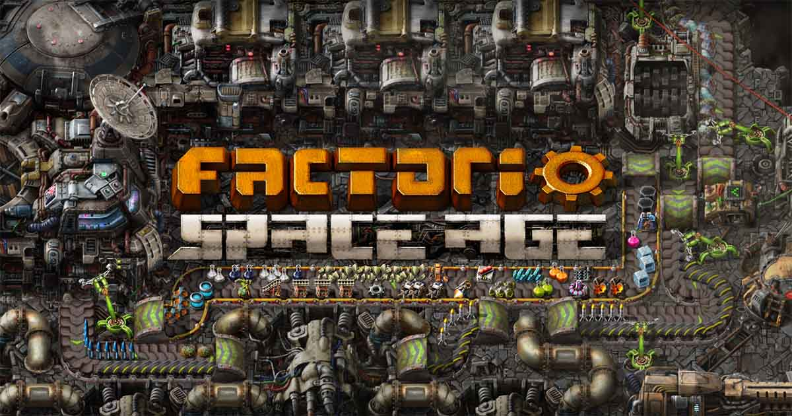
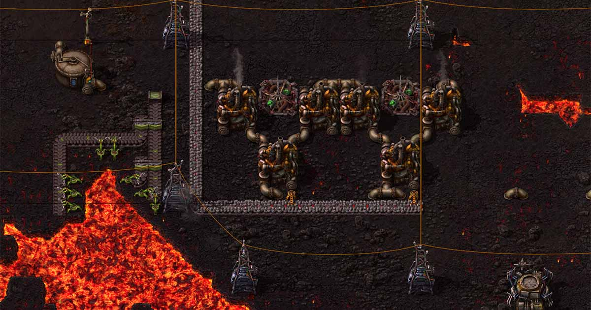
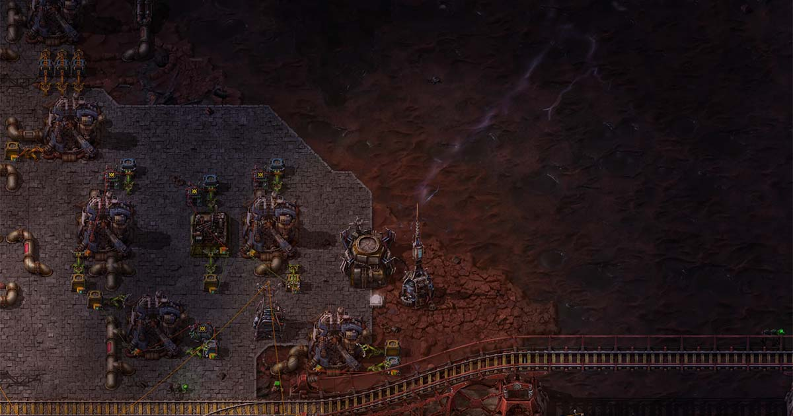
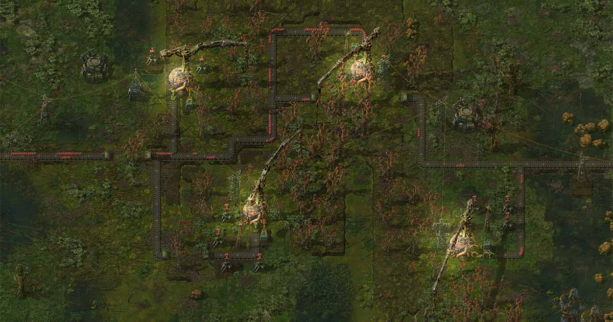
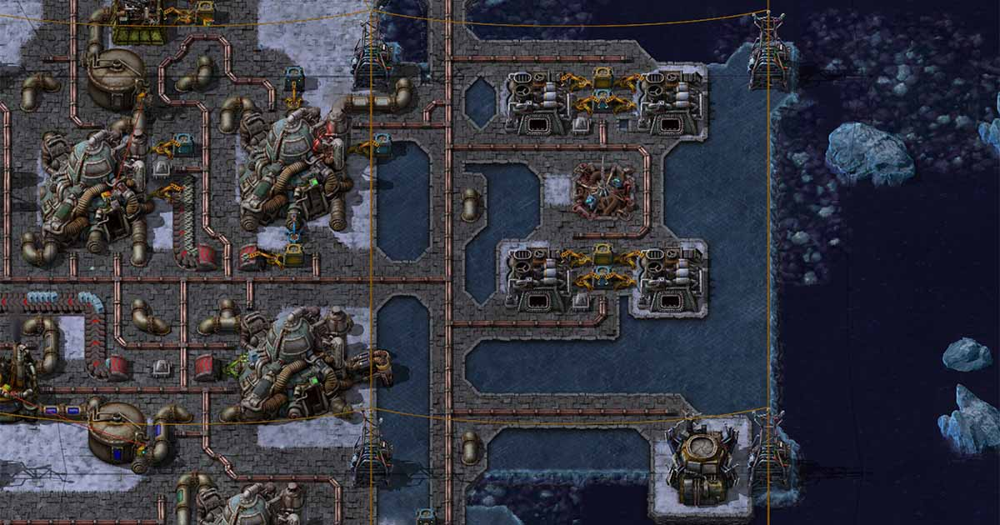

Lokakuun loppupuolella Factorio sai Space Age -lisäosan ja samalla peruspeli päivitettiin versioon 2.0. Julkaisun myötä aloitin uuden pelin, jotta saisin kokea kaikki muutokset ja uudistukset puhtaalta pöydältä.

Mikäli Factorio ei ole sinulle tuttu, voit lukea pohjalle [peruspelin arvostelun]().

<!--more-->

### Space Age vai 2.0?

Space Agen julkaisu yhtä aikaa versiopäivityksen kanssa aiheutti hämmennystä. Ihmisten oli vaikea erottaa, että mitkä muutoksista tulivat lisäosan mukana ja mitkä kuuluivat peruspeliin.

2.0 päivitys ei tuonut peliin juurikaan uusia ominaisuuksia, vaan se keskittyi elämää helpottaviin parannuksiin. Kaikki parannukset olivat erittäin tervetulleita. Mukana oli muun muassa tykkitornien priorisoinnit, fiksummin toimivat junat, paremmat logiikkapiirit, parannuksia blueprinttien toimintaan sekä kokonaan uudelleen kirjoitettu nesteiden simulointi.

Nesteet toimivat aikaisemmassa versiossa erittäin sekavasti ja voin oman kokemuksen perusteella todeta, että uusi versio on paljon parempi. Enää ei tarvitse miettiä, että miksi paine putkien sisällä laskee äkisti tai miksi yksi säiliö täyttyy muita nopeammin. Kaikki vaan toimii, eikä järkyttäville logiikkapiirien ohjaamille pumppuvirityksille ole enää tarvetta.

Kaikki uudet teknologiat sen sijaan ovat osa Space Age -lisäosaa.

### Space Age vie tehtaat uusille planeetoille

Peruspelissä pelaaja rysähtää avaruusaluksellaan planeetalle. Vaikka peliä voi jatkaa loputtomiin, saavutat virallisen lopun, kun onnistut laukaisemaan ensimmäisen avaruusraketin. Käytännössä pelaaja ei kuitenkaan koskaan poistu planeetalta. Toisin on Space Agessa.

Space Age tuo peliin avaruusasemat. Ne ovat planeetan kiertoradalla toimivia itsenäisiä minitehtaita. Avaruusasemat voivat myös liikkua planeettojen välillä hieman samaan tapaan kuin junat. Asemat voivat pudottaa tavaraa kiertoradalta planeetalle, eikä tämä vaadi pelaajalta erillistä rakentamista. Sen sijaan tavaran toimittaminen planeetalta avaruusasemalle tehdään raketeilla. Peruspelissä lukuisien rakettien rakentamiselle oli hyvin vähän syitä, ellet rakentanut massiivista megatehdasta. Space Agessa raketit ovat keskeisessä roolissa ja niitä voi olla kymmeniä.

Lisäosan mukana tulee neljä uutta planeettaa: Vulcanus, Fulgora, Gleba sekä Aquilo. Jokainen planeetta tarjoaa omat teknologiat, erityispiirteensä sekä haasteensa. Kolme ensimmäistä ovat pelaajan ulottuvilla välittömästi ensimmäisen raketin laukaisun jälkeen. Aquilolle on mahdollista mennä vasta, kun kolme ensimmäistä planeettaa on valloitettu ja tuottavat planeetan yksilöllisiä tiedepaketteja.

Space Agen sisältö pääsee kunnolla vauhtiin vasta ensimmäisen raketin myötä. Pelin alku ja uuden tehtaan rakentaminen kotiplaneetalla ei juurikaan hyödy Space Age -lisäosasta. Pieni eroja kuitenkin näkyy. Esimerkiksi osa vanhoista teknologioista, kuten vaikkapa kallioita tuhoavat kranaatit, eivät olekaan saatavilla pelin alussa. Niiden avaaminen ja valmistaminen tapahtuu toisella planeetalla.

Rajoituksia kompensoidaan sillä, että ensimmäisen raketin rakentaminen on tehty pykälän verran helpommaksi. Ymmärrettävä muutos, sillä lisäosan suola on nimenomaan avaruuslogistiikassa. Tämän lisäksi varsinainen raketin laukaiseminen onnistuu huomattavasti pienemmällä resurssimäärällä. Tämäkin käy järkeen, sillä raketit ovat ainut tapa välittää roinaa avaruusasemille. Ne eivät ole enää pelkkä tiedepaketteja tuottava harvinaisuus, vaan ihan oikeasti hyödyllisiä härveleitä.

Avaruusasemat tarvitsevat toimiakseen sähköä. Liikkumiseen ne tarvitsevat polttoainetta. Tärkeimmät raakamateriaalit saadaan kiertoradalla lentelevistä asteroideista. Lisäksi kotiplaneetan kiertoradan ulkopuolella asemien uhkana ovat suuremmat asteroidit, jotka aseman on kyettävä tuhoamaan. Pelaaja saa itse suunnitella asemansa kuten haluaa, kunhan se selviää näistä haasteista. Koska avaruusasemat rakennetaan kuten muutkin tehtaat, niissä voi valmistaa erilaisia materiaaleja. Itse en tätä mahdollisuutta hyödyntänyt, mutta se mahdollisuus on olemassa.

Sitten onkin aika siirtyä uudelle planeetalle. Kun olet laskeutunut kapselilla uuden planeetan pinnalle, sieltä ei ole paluuta, ennen kuin saat rakennettua raketin laukaisualustan. Kannattaa siis varmistaa, että kotiplaneetalla asiat ovat kunnossa, sinulla on riittävästi botteja ja että avaruusasema toimii niin kuin pitää. Muuten tuloksena voi olla se, että olet jumissa ja joudut lataamaan aikaisemman talletuksen.

Jokainen planeetta on erilainen ja tarjoaa omat haasteensa. Yhdelläkään planeetalla ei löydy kaikki pelin perusraaka-aineita. Joko ne on kuljetettava kotiplaneetalta tai asiat on valmistettava muilla keinoin. Jokaisella planeetalla on myös omat yksilölliset raaka-aineensa ja teknologiat, jotka aukeavat vain sen planeetan kautta.

### Vulcanus
Vulcanus on lähimpänä aurinkoa sijaitseva planeetta. Tästä syystä aurinkoenergiaa piisaa, joskin päivät ja yöt ovat todella lyhyet. Tulikuuman planeetan pintaa koristavat laavalammikot, joiden läpi ei voi rakentaa liukuhihnoja tai putkia. Luonnollisesti laavassa ei voi myöskään kulkea. Lisäksi planeetta on täynnä kallioita, jotka hankaloittavat liikkumista ja rakentamista. Planeetalta ei löydy lainkaan vettä.

Vaikka aloitusalue on turvallinen, sen ympärillä on jättimäisten *demolishereiden*, suurien laavamatojen, reviiriä. Madot eivät hyökkää, mutta ne puolustavat reviiriään ärhäkästi. Mikäli erehdyt hyökkäämään niiden kimppuun tai rakentamaan mitään niiden reviirille, ne tulevat ja tuhoavat kaiken hetkessä. Tehtaan laajentaminen vaatii siis matojen tuhoamista. Siinä missä kotiplaneetan viholliset kaatuvat rynnäkkökiväärillä, nämä jättiläiset eivät siitä välitä. Kuinka lierot sitten listitään? Jätän sen sinun selvitettäväksi.

Vulcanus tuo teknologiaa, joka pohjautuu laavan hyödyntämiseen. Oman kokemukseni mukaan Vulcanus on tehtaan rakentamisen kannalta lähimpänä kotiplaneetta. Sen haaste tulee vaikeasta ympäristöstä sekä madoista, jotka jarruttavat laajentamista. Myös energian saanti voi etenkin alkuvaiheessa tuottaa pientä päänvaivaa. Itselleni Vulcanus oli pelin helpoin planeetta, mutta osaltaan tätä voi selittää se, missä järjestyksessä kävin planeetat läpi.

### Fulgora
Fulgora on muinaisen rodun hylkäämä planeetta, jota ruoskivat yölliset rajut ukkosmyrkyt. Myrskyt ovat pelaajalle hengenvaarallisia ja ainut tapa suojautua niiltä, on pysytellä ukkosenjohdattimien lähellä. Salamat tuhoavat myös turhan vapaana lentelevät botit.

Planeetan pinta on isolta osin öljymaata. Sen päällä voi kävellä, joskin hitaasti. Sinne ei voi kuitenkaan rakentaa mitään muuta kuin korkeiden tolppien päällä kulkevia rautateitä.

Öljymaalla on onneksi myös saaria, joista löytyy tukevaa maaperää. Pienimmät saaret pursuavat resursseja, mutta niillä on äärimmäisen vähän tilaa rakentaa. Suuremmat saaret tarjoavat tilaa, mutta eivät juuri lainkaan resursseja.

Ukkosen lisäksi planeetan erikoisuus on se, ettei sieltä löydy raskaan öljyn lisäksi muuta raakamateriaalia kuin muinaisen rodun jälkeensä jättämää roskaa. Tämä roska on kierrätettävä, jotta siitä saa irti käyttökelpoista raakamateriaalia. Planeetalta ei löydy myöskään vettä.

Fulgoralla ei ukkosen lisäksi ole vihollisia. Sen haaste tulee saarista, jotka pakottavat pelaajan rakentamaan rautateihin pohjautuvan logistiikan. Myös energia on omanlaisensa haasteensa, sillä Fulgora on niin kaukana auringosta, että aurinkoenergiaa on tarjolla 20 % normaalista. Onneksi ukkosen viskomat salamat tarjoavat tähän ratkaisun.

Fulgora oli planeetoista oma suosikkini. Kierrätysmasiinat toivat peliin kokonaan uuden ulottuvuuden. Pidän myös juniin pohjautuvista ratkaisuista, joten Fulgora oli kuin luotu minulle.

### Gleba
Gleba on kosteaa rämemaata, jossa kasvit ja sienet kukoistavat. Planeetan erikoisuus on siinä, että siellä raakamateriaaleja ei louhita tai rakenneta. Niitä viljellään.

Kaikki planeetalla tuotettava materiaali on elävää. Elävällä materiaalilla on oma käyttöaikansa, jonka jälkeen se pilaantuu. Gleballa asioiden varastointi säiliöihin ei juurikaan ole mahdollista, vaan valmistettu materiaali on käytettävä nopeasti. Jos valmistat asioita liikaa, tuloksena on hirvittävä läjä pilaantunutta mössöä, joka saattaa tukkia koko logistiikkaketjun.

Tämä onkin Gleban suurin haaste. Se keskittyy logistiikkaketjujen sujuvuuteen ja siihen, että asioita valmistetaan sopiva määrä. Koska kaikki voi pilaantua missä tahansa kohtaa logistiikkaketjua, tämä asettaa haasteen myös rakentamiselle. Pilaantunut moska kun pitää pystyä poistamaan kaikissa ketjun osissa, jotta se ei jäisi tukkimaan tuotantoa. Osa materiaaleista voi pilaantua minuutissa, toiset parissa tunnissa. Gleban voi suhtautua jonkinlaisena ruokalogistiikkasimulaationa, jossa kylmäketju ei saa katketa missään kohtaa.

Monet Gleban ainutlaatuisista valmistuslaitoksista eivät toimi sähköllä, vaan ravinteilla. Sähkön lisäksi pelaajan on siis huolehdittava ravinteiden riittävyydestä. Touhua sotkee sekin, että myös viholliset, tai lähinnä niiden munat, toimivat raakamateriaalina. Mikäli niitä ei käytä ajoissa, ne eivät pilaannu, vaan kuoriutuvat. Mikäli täytät tehtaasi munilla, etkä käytä niitä ajoissa, tuloksena vai olla satoja ympäri tehdasta kuoriutuvia *pentapodeja*.

Gleba on uusista planeetoista ainut, jossa viholliset käyvät aktiivisesti tehtaan kimppuun. Ympäristökin luo omat haasteensa, sillä suomaalla liikkuminen on hidasta, eikä sinne voi rakentaa, ennen kuin maaperä on muutettu kiinteämmäksi. Vettä sen sijaan on tarjolla reilusti, vaikka moni muu perusraaka-aine puuttuu.

Gleba oli kaikista planeetoista oma inhokkini. En pitänyt lainkaan siitä, että materiaaleilla oli käyttöikä.

### Aquilo

Aquilo on jäinen planeetta, joka sijaitsee kaukana auringosta. Aurinkoenergiasta on käytössä vaivainen 1 %. Planeetta on käytännössä pelkkää ammoniakkimerta. Tehdas on rakennettava pienen meressä kelluvan jäälautan päälle. Osa lautastakin on niin heikkoa, ettei sen päälle voi rakentaa ilman lisävahvistusta.

Aquilolla ei löydy käytännössä mitään perusmateriaaleista. Se on eniten riippuvainen planeettojen välisestä logistiikasta ja planeetta, jonne jää todennäköisimmin jumiin. Vihollisia ei ole, mutta rakennusalue on erittäin pieni ja tehtaan käynnistäminen konstikasta.

Asiaa monimutkaistaa se, että kylmyydestä johtuen kaikki rakennukset on lämmitettävä. Tämä tapahtuu lämpöputkilla, jotka on sijoitettava rakennusten viereen. Lämpöputkia ei voi viedä jään alle, joten ne rajoittavat rakentamista tuntuvasti. Kylmyyden takia myös botit toimivat huonosti.

Aquilo on planeetta, jossa hyvin toimiva tehdas voi lamaantua täysin pienen virheen takia. Esimerkiksi lämmityksen hajoaminen voi tarkoittaa sitä, että koko tehdas jäätyy. Sen jälkeen sähkön tuotanto katoaa, ja löydät itsesi tilanteesta, jossa et saa tehdasta enää käyntiin. Jäässä olevien generaattorien sulattaminen vaatii lämpöä, joka taas vaatii polttoainetta, jonka tekeminen vaatii sähköä, mutta sitä ei ole, koska generaattorit ovat jäässä.

Tämä moka kävi itselleni ja voin kertoa, että ei ollut helppo ongelma ratkaista.

### Uusi laatujärjestelmä

Yksi Space Agen uusista jutuista on laatujärjestelmä. Ominaisuutta ei ole pakko hyödyntää ja sen voi kytkeä jopa pois päältä niin halutessaan.

Osa pelaajista inhoaa koko ominaisuutta, sillä siinä on uhkapelin piirteitä. Ideana on, että pelaaja voi asettaa rakennuksiin uusia quality-moduuleita. Nämä moduulit lisäävät todennäköisyyttä sille, että valmistetut asiat ovat parempaa laatua. Laatutasoja on neljä: uncommon, rare, epic ja legendary. Mitä paremmasta laadusta on kyse, sitä harvemmin niitä syntyy.

Vaikka likipitäen kaikista materiaaleista ja rakennuksista on eri laatuversiot, läheskään kaikkien kohdalla laatu ei tuo todellista hyötyä. Esimerkiksi liukuhihnat saavat vain lisää energiaa, joten niiden valmistaminen paremmalla laadulla on täysin hyödytöntä. Sen sijaan esimerkiksi legendary-tason aurinkopaneelit tuottavat 250 % enemmän sähköä kuin tavalliset, joten niistä voi olla tuntuvaa hyötyä.

Korkeamman laadun rakentaminen ei ole kuitenkaan täysin tuurin varassa. Rakennukset voi asettaa suoraan rakentamaan parempaa laatua, mutta tämä vaatii, että kaikkien raakamateriaalien oltava samaa laatua. Ei huonompaa eikä parempaa. Laatuja ei voi sotkea keskenään.

Itse hyödynsin quality-ominaisuutta jonkin verran, mutta en uppoutunut kovin syvälle siihen maailmaan. Uskoisin, että laatutasot tulevat olemaan iso osa end-gamea ja jättimäisiä megatehtaita.

### Epäkohdat ja turnausväsymys

Space Agen julkaisu oli varsin onnistunut - ainakin nykymittapuulla. Itse en törmännyt yhteenkään peliä rikkovaan bugiin tai muuhun ongelmaan. Pienempiä bugeja kuitenkin oli, mistä muistutuksena on julkaisun jälkeen tulleet päivitykset ja niiden pitkät [muutoslokit](https://wiki.factorio.com/Version_history/2.0.0). Positiivista on se, että kehittäjät ovat kuunnelleet aktiivisesti pelaajien palautteita ja virheraportteja, ja nuijineet bugeja pois hurjalla tahdilla.

Factorio on perinteisesti tunnettu pelinä, joka pyörii ikivanhalla raudalla. Space Agen grafiikkapäivitykset muuttivat tilannetta. Ei se edelleenkään tarvitse viimeisintä huutoa olevaa peli-pc:tä, mutta aivan moporaudalla sitä ei enää ajella. Pelin Mac-versiossa on lisäksi jokin ongelma, joka ilmenee ulkoista näyttöä ja ruudun skaalausta käytettäessä. Itse ratkaisin ongelman poistamalla ruudun skaalauksen käytöstä.

Glebaa lukuun ottamatta uudet planeetat toivat mukavia haasteita. Monet pelaajat ovat pitäneet Glebaa yhtenä suosikkiplaneetoista, mutta se ei ollut minua varten. Asioiden pilaantuminen ei vaan sopinut siihen fiilikseen, joka minulle on Factoriosta. Haluan keskittyä tehtaan rakentamiseen ja laajentamiseen, en jatkuvaan hätäilyyn tai flown optimointiin.

Vaikka viihdyinkin pelin parissa hyvin, huomasin Aquiloon päästyäni, että minua alkoi vaivata turnausväsymys. Peli palkitsee onnistumisesta uusilla teknologioilla, mutta samaan aikaan tiesin, että niiden palkintojen takana odottaa vain uusi haaste. Jatkuva, koko ajan vaikeutuvien haasteiden määrä alkoi vaan jossain kohtaa puuduttaa.

Minun olikin otettava haasteisiin etäisyyttä ja vietin pelin loppupuolella pitkän tovin keskittyen olemassa olevien tehtaiden paranteluun. Pidän Factoriosta sen hiekkalaatikkomaisen pelikokemuksen takia ja toistuva haasteesta toiseen meneminen kävi pidemmän päälle raskaaksi.

Toinen puoli turnausväsymystä tuli siitä, että Space Age on yllättävän vaikea. Jos kuvittelit, että peruspelin logistiikkaketjut olivat monimutkaisia, ne eivät ole mitään lisäosaan verrattuna. Kun kaikkia asioita ei voi tai ei kannata valmistaa jokaisella planeetalla, joudut miettimään yksittäisten tehtaiden lisäksi planeettojen välistä logistiikka ja sitä, mistä kaikki asiat löytyvät ja tuotetaanko jokaista asiaa riittävästi jokaisen planeetan tarpeisiin.

En ollut myöskään erityisen tyytyväinen uudistukseen, jossa loppupelin teknologiat vaativat vihollisten viljelyä. Kyllä, sinun on kasvatettava vihollisten toukkia jopa kotiplaneetalla rakentaaksesi teknologiaa. Toukilla on sama mekanismi kuin Gleban munilla: ne kuoriutuvat tietyn ajan jälkeen. Ymmärrän kyllä, että pelin suunnittelijat ovat halunneet tuoda lisää haastetta, mutta muutos oli itsestäni lähinnä tylsä. Monet Factoriota aktiivisesti striimaavat pelaajat ovat kytkeneet pelistä viholliset kokonaan pois päältä, koska kokevat ne lähinnä häiriötekijäksi, joka pilaa kivan tekemisen. Olen isolta osin samaa mieltä.

Nämä ovat kuitenkin vain pieniä epäkohtia, jotka kumpuavat minun henkilökohtaisista mieltymyksistä. Jos aloittaisin nyt uuden pelin, olisin luultavasti huomattavasti valmiimpi uusiin haasteisiin, eivätkä ne tuntuisi niin raskailta.

### Tuttua hupia pitkäksi aikaa

Factorio: Space Agessa saa rahoilleen vastinetta. Reilun 33 euron hintainen lisäosa tarjosi minulle yli 233 tuntia viihdettä. Eikä sen suinkaan olisi tarvinnut loppua siihen, sillä pelin virallisen lopun jälkeen tarjolla on endgame-teknologiaa kehitettäväksi.

Space Age teki mahtavasta pelistä vieläkin paremman ja olen edelleen sitä mieltä, että Factorio on yksi parhaista peleistä, joita olen koskaan pelannut. Se ei tarjoa eeppistä tarinaa, mutta sen riemu syntyy hiekkalaatikosta, jossa pelaaja saa ratkoa ongelmia parhaaksi katsomallaan tavalla. Peli ei ole varmasti kaikkia varten, mutta tiedän monia, jotka kokevat sen olevan todella addiktoiva.

### Suositus planeettojen järjestyksestä (spoilereita!)
Kerron lopuksi oman suositukseni siitä, missä järjestyksessä planeetat kannattaa käydä läpi. Mikäli haluat välttyä teknologioihin liittyviltä spoilereilta lukeminen kannattaa lopettaa tähän.

Oma suositukseni on, että otat ensimmäiseksi kohteeksi Fulgoran. Koska planeetalla jylvivä ukkonen ratkaisee energiaongelmat, planeetta on varsin helppo ensimmäinen kohde. Lisäksi Fulgora avaa kierrätysmasiinan, jolla minkä tahansa tuotteen voi pilkkoa takaisin raakamateriaaleiksi. Tästä laitteesta on iso apu joka planeetalla, ja se on käytännössä pakollinen, mikäli haluat leikkiä quality-ominaisuuden kanssa.

Kenties vieläkin tärkeämpi syy Fulgorasta aloittamiseen on se, että sieltä saa uuden mech-haarniskan, jolla voi lentää! Voit unohtaa junien alle jäämisen, sillä puku osaa automaattisesti väistää ne. Sen lisäksi voit kulkea kaikkien rakennusten, putkien ja puiden yli. Voit lentää jopa merien päällä!

Seuraavaksi suosittelen valloittamaan Vulcanusin. Nyt kun sinulla on uusi mech-haarniska, kalliot ja laavalätäköt eivät ole niin suuri ongelma. Vulcanusilta saat teknologiaa, jolla tiettyjen asioiden rakentaminen on huomattavasti helpompaa ja nopeampaa. Esimerkiksi vihreiden, punaisten ja sinisten sirujen valmistamiseen Vulcanus on täydellinen kohde. Laava on loputon resurssi, joten sinun ei tarvitse harrastaa juuri lainkaan raakamateriaalien louhimista.

Vulcanusilta saat kallioita tuhoavat kranaatit, joka tekee kotiplaneetan laajentamisesta vähän helpompaa. Sieltä aukeavat myös uudet turbo-liukuhihnat sekä suuret louhintaporat.

Gleban jättäisin kolmanneksi. Uuden haarniskan avulla voit lentää suoalueiden yli ja nopeat liukuhihnat varmistavat, että tuotteet eivät ehdi pilaantua. Glebalta saat auki stack inserterit, jotka tulevat tarpeen erityisesti pelin loppupuolella. Muovin rakentaminen kannattaa hoitaa Gleballa, sillä se on siellä naurettavan helppoa ja resurssit ovat rajattomat.

Aquilo on tietenkin viimeinen, koska sinne pääsee vasta, kun kaikki kolme muuta planeettaa on tutkittu.

Aquiloon kannattaa lähteä isolla avaruusasemalla, jossa on *reilusti* varastotilaa. Ota mukaan iso läjä rakennuksia ja raaka-aineita. Älä unohda lämpöputkia!

Suosittelen ottamaan mukaan pieneen ydinvoimalaan vaadittavat tarvikkeet sekä polttoainetta sen pyörittämiseen. Ydinvoimala toimii Aquilossa hyvin, sillä energian lisäksi se tuottaa lämpöä. Koska planeetta on niin kaukana auringosta, tarvitset joka tapauksessa avaruusaseman, joka pyörii ydinvoimalla.

Pidä kuitenkin huoli siitä, ettei polttoaine lopu kesken. Et voi valmistaa polttoainetta Aquilossa, joten sitä on kuljetettava sinne säännöllisesti kotiplaneetalta. Mikäli polttoaine loppuu planeetalta tai avaruusasemasta, olet hyvin nopeasti pulassa ja pahimmillaan jumissa.
