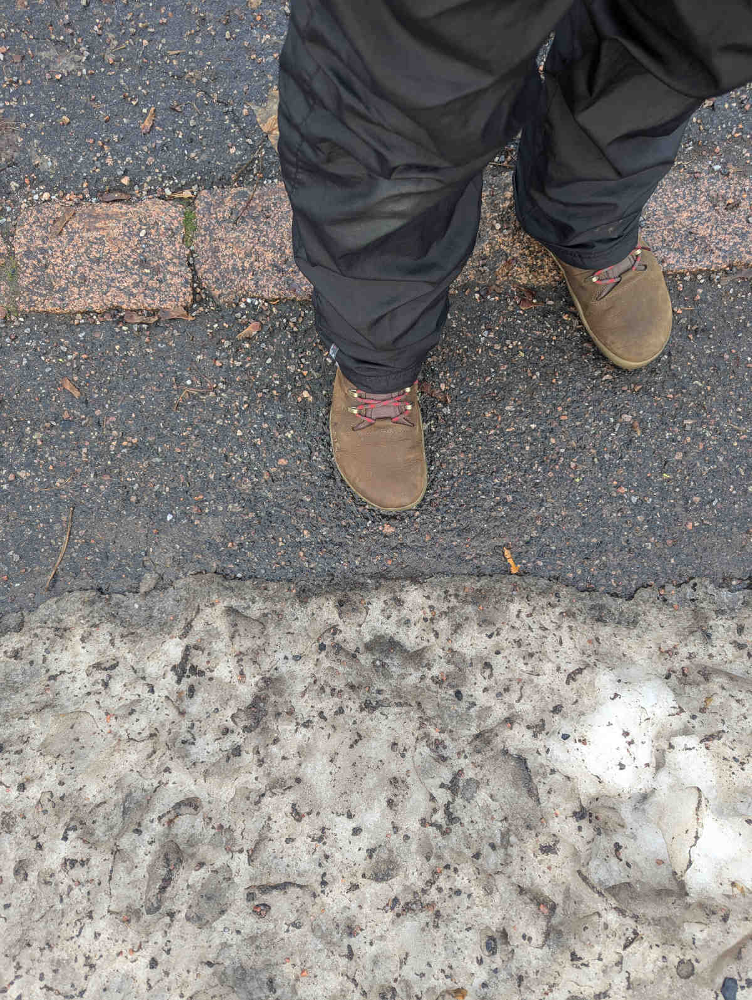

Sen sijaan, että tyytyisin vaan harmittelemaan huonoa talvikunnossapidon tasoa, päätin tehdä tänä talvena jotain toisin. Ilmoittauduin Helsingin seudun pyöräilijöiden ([Hepo](https://hepo.fi)) talviagentiksi.

<!--more-->

Kaupunki- ja liikennesuunnitteluharrastukseni myötä olen kiinnittänyt tavanomaista enemmän huomiota talvikunnossapitoon. Myönnän suoraan olevani todella kyllästynyt ja turhautunut siihen, kuinka huonolla tolalla jalkakäytävien ja pyöräteiden talvikunnossapito on vuodesta toiseen.
 
Kyllästymistä pahentaa kaksi asiaa. Ensimmäinen on se, että meillä on Oulu, joka on jo usean vuoden ajan toiminut esimerkkinä siitä, [mitä hyvä talvikunnossapito vaatii](https://www.youtube.com/watch?v=X6EaJ1Zd8Kk). Muiden tarvitsisi vain ottaa mallia. Toinen on se, että ajoradat ovat käytännössä läpi vuoden timanttisessa kunnossa. Käytännössä me siis jo teemme hyvää talvikunnossapitoa. Valitsemme vaan tehdä sitä pelkästään autoilijoille.

[Talviagenttina](https://hepo.fi/toiminta/talviagentit2024/) tehtäväni on raportoida muutamia kertoja talven aikana pyöräväylien kunnosta. Talviagenttitoiminta toteutetaan yhteistyössä Hepon ja Helsingin kaupungin kanssa. Raporttien tulokset välitetään kaupungille ja toiveena on tietenkin se, että kaupunki parantaisi toimintaansa raporttien pohjalta.

Pääkaupunkiseutu sai viime viikolla niskaansa ensimmäisen kunnon lumimyrskyn. Yksi myrsky riitti osoittamaan, että talviagenteille on tarvetta. Talvikunnossapidon räävittömän huono laatu ja vinoutuminen yksityisautoilua suosivaksi on iso ongelma.

Asiaa voi katsoa monesta näkökulmasta. Itse näen talvikunnossapidon ensisijaisesti esteettömyysasiana. Muutama sentti lunta ajoradalla ei estä autojen liikkumista. Kyllä, myös hälytysajoneuvot kulkevat hangessa.

Sen sijaan jalankulkuun ja pyöräilyyn lumella ja huonolla talvikunnossapidolla on tuntuva vaikutus. Jo muutama sentti lunta tai sohjoa tekee pyöräilystä käytännössä mahdotonta. Tervejalkainen kyllä tarpoo hangessa, mutta entä kaikki rollaattoria tarvitsevat vanhukset? Pyörätuolilla tai kainalosauvoilla liikkuvat? Tai sokeat? Suomi on pullollaan myös lastenrattaita työntäviä vanhempia.

Viime vuosina olemme saaneet lukea lehdistä vanhuksista, jotka ovat päätyneet kotiensa vangeiksi huonon talvikunnossapidon takia. Edes ruokakauppaan ei pääse. Tällainen on epäinhimillistä ja anteeksiantamatonta.

Aina talvikunnossapito ei ole pelkästään välinpitämätöntä. Joskus se on aktiivisesti haitallista. Tyypillisiä esimerkkejä tästä ovat ajoradoilta jalkakäytäville aurattavat lumet, risteysalueille auratut korkeat lumivallit sekä lumikinosten alle peitetyt anelunapit. Usein se on nimenomaan jalkakäytävä ja pyörätie, joka päätyy olemaan lumen säilytyspaikka. Nämä ovat kaikki haittoja, joita yksityisautoilua priorisoiva talvikunnossapito aktiivisesti tuottaa.

Viime viikon lumimyräkästä on nyt jo monta päivää, mutta siitä seuranneen huonon talvikunnossapidon seuraukset näkyvät yhä. Välittömästi ensimmäisten lumien myötä jalkakäytävien ja pyöräteiden käytettävissä oleva tila pieneni puoleen. Joissain paikoissa näyttää siltä, ettei jalkakäytävää ole aurattu lainkaan ja sinne on heitetty lumi kaikilta muilta väyliltä. Samaan aikaan ajoradat ovat mustalla asfaltilla ja nuoltu reunasta reunaan. Alla pari kuvaa Pitäjänmäestä, jotka nappasin eilen töistä tullessani.

Päätin jo aikaisemmin loppukesästä, että en aio tänä talvena pahoittaa mieltäni huonon talvikunnossapidon takia. En ainakaan niin paljoa kuin yleensä. Tämä on mahdollista, koska käytössäni on niin hyvät julkiset yhteydet. Minun ei ole pakko pyöräillä. Haluaisin, mutta en pysty - kiitos surkean talvikunnossapidon. En vaan jaksa taistella tuulimyllyjä vastaan tavalla, jossa panoksena on oma arjessa pärjääminen ja henkinen hyvinvointi.

Päätöksestä huolimatta tulen varmasti pyöräilemään myös talvella silloin kun tiedän, että se onnistuu sujuvasti ja turvallisesti. Kävellen liikun tietenkin läpi talven. Talvella pyöräily on mukavaa ja kuten olen usein todennut, sää tai lämpötila ei ole estä talvipyöräilylle. Ainoastaan huono talvikunnossapito on.

Toivottavasti pystyn talviagenttina kantamaan oman pienen korteni kekoon, vaikka en tänä vuonna olekaan niin aktiivinen talvipyöräilijä kuin aikaisempina vuosina.
