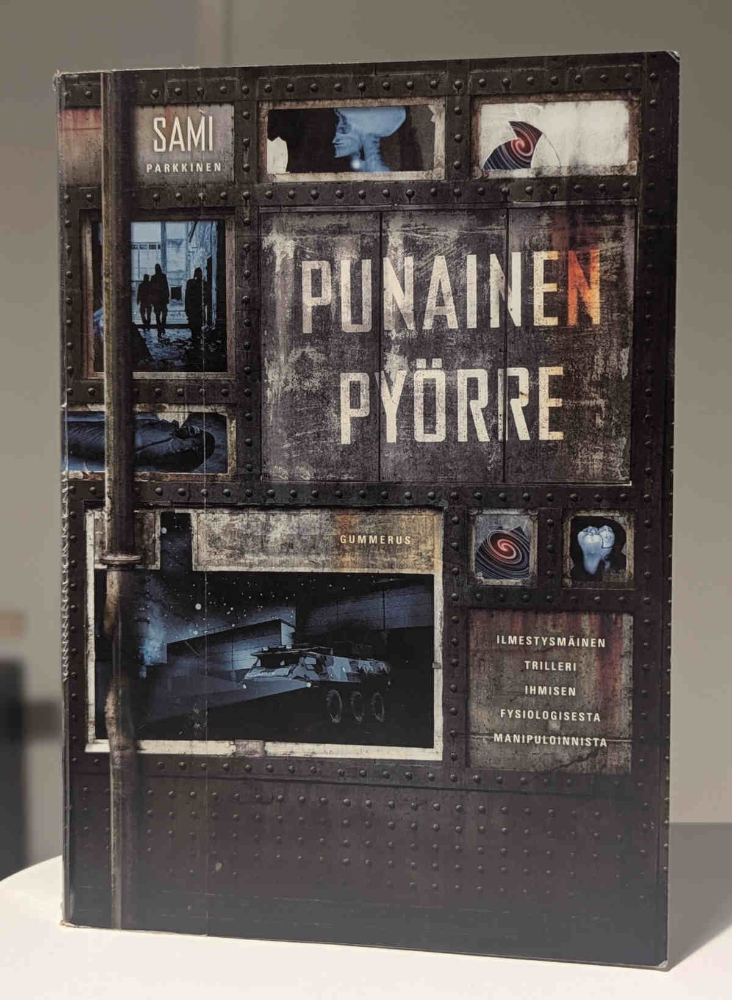

Sami Parkkisen varovaisilla scifi-elementeillä varustettu jännäri oli viihdyttävää luettavaa, mutta ei osannut sulkea kaikkia avaamiaan ovia.

<!--more-->

### Tarina

Carl-Johan Hakala eli **CJ** on suorittamassa asevelvollisuuttaan. Hän ei kaipaa lomia tai vapaa-aikaa, sillä varuskunta tarjoaa täydelliset puitteet paeta menneisyyttä ja omia ajatuksia. Se sijaitsee keskellä jättimäistä teollisuusaluetta, joka on suurien, hylättyjen hallien muodostama aavikko. Massiivinen konkurssiaalto on tappanut ison osan teollisuusyrityksistä.

Teollisuusalueella toteutetaan erikoiskoulutusta, johon CJ on valittu. Hän oppi säätämään jonkinlaista laitetta, jota kutsutaan tolpaksi. Mihin tolppaa käytettiin ja mikä sen tarkoitus oli, sitä CJ:lle ei kerrottu eikä hän jaksanut vaivata asialla päätään.

CJ:n arki muuttuu, kun  naapuritalossa asuva 20-vuotias nainen, **Liesel**, tulee hädissään pyytämään apua. Hän on CJ:n esimiehen, eversti **Schlomo Glicksteinin** tytär. Schlomo on saanut jonkinlaisen väkivaltaisen kohtauksen ja CJ:lle selviää, että hän voi auttaa everstiä saamansa erikoiskoulutuksen avulla. Glicksteinin keho on täynnä jonkinlaista elektroniikkaa ja tahdistimia.

Kohtauksen myötä CJ:lle alkaa paljastua, mistä tolpassa on kysymys. Samalla nousee kuitenkin läjäpäin uusia kysymyksiä. CJ:lle selviää, ettei laite ole alkuunkaan armeijan teknologiaa. Kuka tahansa laitteen takana onkin, hän on päättänyt ottaa Glicksteinin tähtäimeensä.

Saman tähtäimen kohteena on myös Glicksteinien naapurissa asuva **Henrik Granberg**. Hän toimii jonkinlaisena talonmiehenä varuskunnassa. Yksinkertainen kaveri, jonka rujo ja karvainen ulkonäkö saa hänet muistuttamaan ihmisapinaa. Hänellä ja Glicksteinillä on yhteistä historiaa, eikä hän suinkaan aina ole ollut yhtä ruma ilmestys.

Näistä lähtökohdista alkaa nelikon pakomatka läpi massiivisen teollisuusalueen. Aina ei ole varmuutta siitä, kuka heitä todella jahtaa ja miksi. CJ joutuu johtamaan joukkoa tilanteessa, jota hän ei ymmärrä ja tekemään päätöksiä, joita hän ei haluaisi tehdä. Tilannetta ei auta se, että hänen oma menneisyytensä palaa riivaamaan.

### Henkilöt

Parkkinen on kirjoittanut tarinaansa mukavalla tavalla kiinnostavia hahmoja. CJ:n, Schlomo, Liesel ja Henrik ovat kaikki omanlaisia hahmoja. Pidin siitä, kuinka helppo heidät oli erottaa toisistaan.

Jokaisella on oma taustansa, joka yhdistyy kirjan tarinaan sen edetessä. Taustat selittävät myös henkilöiden motivaatioita, joten heidän valintansa ja päätöksensä tuntuivat useimmiten loogisilta ja ymmärrettäviltä. CJ käy kiinnostavan kehityskaaren, jossa menneisyyden möröt kohtaavat nykyhetken.

Mielenkiintoisesti yksi kirjan parhainta antia olikin henkilöiden historiaan liittyvien mysteerien avaaminen. Jokainen neljästä hahmosta aloittaa matkansa varsin tuntemattomina, mutta mitä pidemmälle kirjaa lukee, sitä paremmin heitä oppii tuntemaan.

Kirjassa on psykologisen jännityksen piirteitä ja etenkin CJ:n kohdalla tarina käyttää mukavasti aikaa siihen, kuinka CJ käsittelee omaa historiaansa samalla, kun koettaa selviytyä käsillä olevasta kriisistä.

Liesel on mukava piristys kolmen vakavan armeijaäijän joukossa. Hän synnyttää myös pientä jännitettä itsensä ja CJ:n välille, eikä aina ole selvää, että onko tämä kipinä hyvä vai huono asia. Osa hänen toimistaan on vähän turhan päälle liimatun oloisia. Ne antoivat kuvan, että kyse on jonkinlaisesta kirjailijan henkilökohtaisesta fantasiamimmistä.

Neljän päähenkilön lisäksi kirjassa on myös muutama muu hahmo, joita en avaa sen tarkemmin, jotta en paljasta tarinan yksityiskohtia. Oleellisimmat henkilöt ovat kyllä ihan mielenkiintoisia, mutta syyt ja motivaatiot heidän toimilleen jäävät jostain syystä pahasti auki ja tämä on yksi kirjan isoista pettymyksistä.

Tarinassa on myös joitakin sivuhahmoja, joiden merkitys ei koskaan auennut minulle. He tuntuivat lähinnä täytteeltä, jolla ei ollut mitään todellista merkitystä varsinaisen tarinan kannalta.

### Scifiä vai ei?

Punaisessa pyörteessä on hämmentävä tunnelma. Se on kuin vaihtoehtoinen kuvaus nykyhetkestä. Se ei maalaile erikoisia scifi-maailmoja, vaan tuo realistiselta tuntuvaan todellisuuteen pieniä vinoumia, jotka istuvat hyvin psykologiseen tarinankerrontaan. Maailma tuntuu tutulta, mutta samaan aikaan synkän epätodelliselta.

Pysähdyin usein miettimään, että onko tarina edes scifiä, mutta sitten se heitti kierrepallon, joka muistutti, että kyllä se on. Ainakin vähän.

Pidin siitä, kuinka Parkkinen onnistuu luomaan maailman varsin hienovaraisilla vihjeillä. Hän ei käytä sivukaupalla aikaa ympäristön kuvailuun, vaan tuo sen näkyviin päähenkilöiden kokemusten ja toimien kautta. Maailma vaikuttaa dystooppiselta ja synkältä, mutta se ei mene siinä äärimmäisyyksiin.

Vaikka tarinassa tapahtuu ihan kiinnostavia ja jännittäviä asioita, itselleni parasta antia on tarinan psykologinen puoli. Päähenkilöiden sisäiset kriisit, epävarmuudet ja henkilöiden väliset suhteet sekä epäilykset pitivät minut koko ajan varpaillaan. Mitä enemmän henkilöitä oppi tuntemaan, sitä enemmän heihin halusi tutustua. Etenkin CJ:n tausta oli kiinnostavaa luettavaa.

Ikävä kyllä kirja unohtaa osan hahmoista kirjan loppupuolella.

### Mysteerit jäävät mysteereiksi

Minulla ei ollut missään kohtaa kirjaa sellainen olo, että pitkästyisin. Päinvastoin, kirja piti otteessaan loppuun asti. Se availi koko ajan uusia mysteerejä ja myös ratkaisi niitä tyydyttävällä tavalla. Läheskään kaikki mysteerit eivät kuitenkaan saa ansaitsemaansa ratkaisua. Kirja unohtaa myös osan henkilöistä täysin. Siitä tuli petetty olo, koska kirjan alkupuolisko sai minut välittämään heistä, mutta sitten heidät vaan pudotettiin kyydistä ilman selkeää syytä.

Minulle tuli olo, että kirjailijalla oli useita hienoja ideoita, mutta hän ei tiennyt mitä tehdä niillä. Monet suuret kysymykset, joihin odotin vastausta, jäävät kokonaan ilman vastausta. Tarina tuntui jäävän kesken.

Tämä oli yllättävää, sillä minusta Parkkinen oli onnistunut rakentamaan kiinnostavan ja ehjän tuntuisen tarinan, joka eteni sujuvasti. Ikään kuin hän olisi vaan yksi päivä kyllästynyt kirjan kirjoittamiseen ja päättänyt, että en jaksa enempää, lopetetaan tähän. Kirjan lopusta tuli mieleen modernit elokuvat, jossa tarinat pilkotaan keinotekoisesti trilogiaksi ja katsoja pakotetaan katsomaan kaikki osat.

Lukukokemuksen jälkeen olo on aika ristiriitainen. Tuntuu niin kuin minua olisi huijattu.

### Hyvää viihdettä

Vaikka kirjan loppu olikin itselleni aika iso pettymys, viihdyin kirjan parissa erinomaisesti. Sen yksinkertainen ja konstailematon tyyli sopi minulle. Vaikka tarinassa on tarpeettoman paljon henkilöitä, se onnistui käsittelemään niitä tavalla, joka ei sekoittanut päätäni. Tarina on looginen, johdonmukainen ja jännittävä. Pidin myös maailmasta, jossa asiat tapahtuvat.

Psykologista jännitystä ja scifi-elementtejä yhdistelevä, realistinen tarina oli kuin luotu minulle. Ei tämä välttämättä mikään mestariteos ole, etenkään tällaisella lopulla, mutta ainakin se tarjosi minulle hyvää pakoa arjessa.

Annan Punaiselle pyörteelle varovaisen suosituksen tylsästä lopusta huolimatta.
