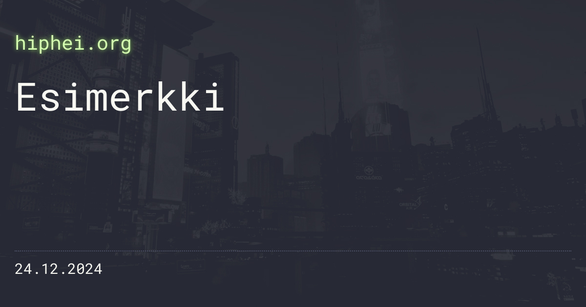

Kerroin edellisessä kirjoituksessa tekemästäni työkalusta, jonka avulla generoin kotisivujen ja erityisesti blogipostausten Open Graph -kuvat. Työkalu löytyy nyt GitHubista.

<!--more-->

Mielikuvituksellisesti nimetty Open Graph Image Creator tekee kolme asiaa:
1) Tarjoilee web-sivun, joka toimii Open Graph -kuvan pohjana
2) Ottaa kuvaruutukaappauksen sivusta
3) Tarjoilee otetun PNG-kuvan

Koska ajelen itse käytännössä kaikkia itse hostattuja sovelluksia Dockerissa, myös tämä on suunniteltu sitä silmällä pitäen. Sinun ei siis tarvitse asennella mitään ylimääräistä, jos koneeltasi löytyy Docker.

En mene tässä sen enempää teknisiin yksityiskohtiin siitä kuinka sovellus on tehty, koska siinä ei totta puhuen mitään erityistä kerrottavaa.

Kun sovellus on käynnissä, sen käyttö on varsin yksinkertaista. Ensiksi sinun on suunniteltava Open Graph -kuva. Mukana tulee valmis HTML-pohja. Sinun tarvitsee vain muokata tyylitiedostoa tarpeidesi mukaan.

Huomionarvoista on, että softa olettaa, että HTML-pohjasta löytyy elementti, jonka `class`-attribuutista löytyy `opengraph`. Tämä elementti toimii kuvan pohjana ja se määrittää myös sen, minkä kokoinen kuvasta tulee. Tästä syystä tyylitiedostoon on syytä määritellä `width` ja `height` arvot:


.opengraph {
    width: 1200px;
    height: 630px;
}


HTTP-palvelu tarjoaa kaksi polkua. Juuresta (`http://localhost:8080/`) löytyy tyylittelemäsi web-sivu. Se toimii hyvänä esikatseluna kun säädät tyylejä kuntoon, mutta tämä on myös se osoite, josta kuvaruutukaappaus otetaan. Toinen osoite on `http://localhost:8080/opengraph.png`. Kun tähän osoitteeseen tulee pyyntö, sovellus ottaa web-sivusta kuvaruutukaappauksen ja palauttaa sen sinulle PNG-kuvana.

Voit tallentaa kuvan manuaalisesti, tai jos käytät [Hugon](https://gohugo.io) tai [Eleventyn](https://www.11ty.dev) kaltaista staattisen sivun generaattoria, ne voivat kutsua osoitetta suoraan ja luoda automaattisesti paikallisen kopion. Tämä on se tapa, jolla itse käytän sovellusta.

Oleellista sovelluksessa on tietenkin se, että kuvassa näkyviin teksteihin voi vaikuttaa. Molemmat aikaisemmin mainituista osoitteista tottelevat neljää URL-parametria. Näistä kolme (`title`, `site` sekä `date`) määrittelevät kolmen eri tekstialueen sisältöä. Mikäli sovelluksen asetuksiin on asetettu salasana, tällöin kutsun mukana pitää kulkea myös `secret`-parametri, jonka arvon on oltava asetettu salasana. Tämä on lähinnä pieni turvallisuusominaisuus, jolla voi estää sen, etteivät satunnaiset ihmiset pommita palvelinta jatkuvalla kuvageneroinnilla.

Kuvan voi siis generoida esimerkiksi osoitteella `http://localhost:8080/opengraph.png?title=Esimerkki&site=hiphei.org&date=24.12.2024`, jolloin tulos voi näyttää tältä:

Sovellus on avointa lähdekoodia, joten siitä vaan vapaasti käyttämään, jos koet sen itsellesi tarpeelliseksi. Yritin dokumentoida kaikki oleelliset asiat, mutta mikäli sinulla on kysyttävää, voit laitella kysymyksiä vaikka [Mastodonissa](https://mementomori.social/@saaste). Sovelluksen lähdekoodit ja asennusohjeet löytyvät [GitHubista](https://github.com/saaste/opengraph-image-creator).

