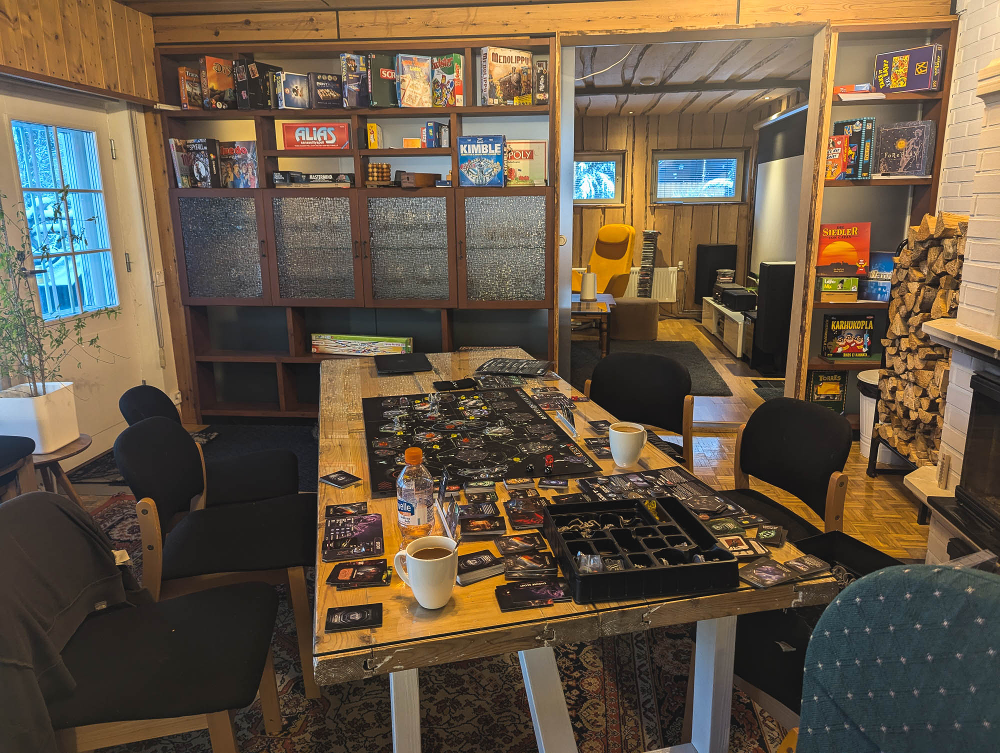
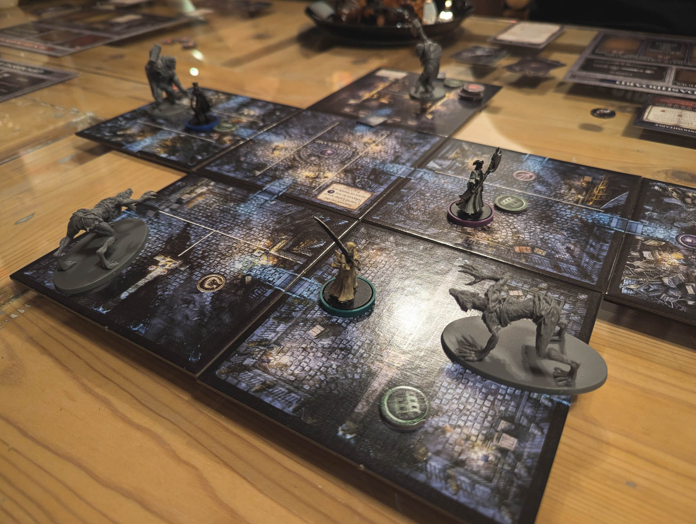

Kokoonnuimme taas kavereiden kanssa saman pöydän ääreen pelailemaan lautapelejä.

<!--more-->

Koska osa pelaajista tuli pääkaupunkiseudulta ja osa Tampereelta, päätimme järjestää peli-illan puolivälissä ja kokoonnuimme Hämeenlinnassa. Toisin kuin [kesällä](), nyt perheellisten arki ei sallinut sitä, että olisimme pelailleet koko viikonlopun. Pelasimme siis vain lauantain ja osan sunnuntaista.

Koska majapaikkaan oli mahdollista mennä heti aamusta, hurautin Hämeenlinnaan junalla heti lauantai aamuna, ja kävelin asemalta majapaikkaan. Tampereelta saapunut kaverini tuli sinne samoihin aikoihin.

Tällä kertaa olimme varanneet käyttöömme paritalon puolikkaan. Paikka oli kuin rakennettu lautapelien pelaamiseen. Paikan omistaja vaikutti olevan myös jonkinlainen lautapelien ystävä, sillä olohuoneen hylyssä oli useita perinteisiä lautapelejä.

Paikassa oli useampi makuuhuone, hyvin varusteltu keittiö, kotiteatterihuone sekä suuri pöytä, joka oli täydellinen lautapelien pelaamiseen.

Saunominen kuuluu olennaisena osana meidän lautapeli-iltoihin, joten luonnollisesti myös tästä paikasta löytyi sauna. Erikoisena bonuksena kylpytiloissa oli suuri poreamme.

Peli-illan pelejä oli tällä kertaa kaksi: [Nemesis](https://boardgamegeek.com/boardgame/167355/nemesis) sekä [Bloodborne: The Board Game](https://boardgamegeek.com/boardgame/273330/bloodborne-the-board-game).

### Nemesis

Ennen kahden muun pelaajan saapumista ehdimme pelata kaverini kanssa yhden erän [Nemesistä](https://boardgamegeek.com/boardgame/167355/nemesis). Peli oli minulle uusi kokemus, mutta se oli nopea oppia. Tykästyin peliin välittömästi. Se pääsi aivan uudelle tasolle, kun kaksi muuta kaveria saapui paikalle ja pääsimme aloittamaan nelinpelin.

Pelissä avaruusaluksen miehistö herää cryo-unesta. He muistavat nimensä ja joitakin perusasioita, mutta he eivät muista, miksi he ovat aluksessa, tai mihin heidän pitäisi mennä. Sen he tietävät, että aluksen keulassa on ohjaamo ja perässä moottorit, mutta aluksen muu rakenne on täysin hämärän peitossa. 

Cryohuoneen keskellä on ruumis. Ruumiin rintakehässä on suuri aukko, josta on kuoriutunut jokin otus. Ilmastointikanavista kuuluu kolinaa. Emme ole yksin. Aluksen hälytysvalot vilkkuvat ja varoitusäänet huutavat.

Nemesiksen pelimekaniikka on mielenkiintoinen, sillä se on tietyssä mielessä co-op -peli, mutta samaan aikaan se ei ole sitä ollenkaan. Pelin alussa jokainen haluaa pelastua ja päästä takaisin kotiin, Maahan. Ajan myötä pelaajien muisti palaa ja jokainen tajuaa, että heillä on edelleen tehtävä tehtävänä - oli se sitten henkilökohtainen tai yrityksen määräämä.

Pelin voittaakseen on toteutettava oma tavoite ja pelastauduttava sen jälkeen aluksesta. Tavoite saattaa olla vihollisten biologian tutkiminen, mutta yhtälailla se voi olla varmistaa, ettei kukaan muu miehistöstä selviä elossa kotiin. Pelissä on todella vaikea pärjätä yksin, mutta samaan aikaan et voi luottaa kunnolla kehenkään.

Jokainen pelaa eri hahmolla, jolla on omat erikoiskyvyt. Pelimekaniikan keskiössä on se, että lähes kaikki tieto on lähtökohtaisesti salaista. Jos selvität aluksen määränpään, vain sinä tiedät mikä se on. Jos selvität moottoreiden kunnon, vain sinä tiedät sen. Koukku on siinä, että sinä voit kertoa löydöksesi muille. Voit myös valehdella. Kaikki on sallittua. Mekaniikassa on jotain tuttua [Among Usin](https://fi.wikipedia.org/wiki/Among_Us) kanssa.

Nemesiksessä pelaajat eivät voi tappaa toisiaan suoraan. Mikäli tehtävänä on tuhota muut pelaajat, voit tehdä sen ainoastaan epäsuorasti. Voit esimerkiksi avata ilmalukon huoneessa, jossa toinen pelaaja on. Tällöin kaikki tietävät, että sinuun ei voi luottaa. Vaihtoehtoisesti voit yrittää pelata koko pelisi juonittelulla ja valheilla, ja antaa kuvan, että olet samalla puolella. Aina kysymys ei ole kuitenkaan näin mustavalkoisesta asetelmasta. Yhden pelaajan tavoitteena voi olla päästä Maahan, mutta toisen Marsiin. Alus voi mennä vain yhteen kohteeseen.

Tämä juonittelu olisi helppoa, ellei peli olisi armoton. Tehtävien toteuttaminen on todella vaikeaa, sillä pelaajat ovat jatkuvasti alakynnessä. Aluksessa mellastavat viholliset ovat todella vaarallisia ja ympäriltä hajoava alus tekee toimimisesta vieläkin vaikeampaa. Tietyn tason yhteistyö on siis lähes välttämätöntä. Meidän neljän pelaajan pelistä ainoastaan yksi pelaaja onnistui tehtävässään ja hänkin juuri ja juuri. Kaikki muut kuolivat.

Hauskaa peliä paransi se, että sen tunnelma ja visuaalinen tyyli on upea. Tästä tuli yksi suosikkipeleistäni!

### Bloodborne: The Board Game

Kyseessä on tunnetun [Bloodborne](https://fi.wikipedia.org/wiki/Bloodborne)-pelin [lautapeliversio](https://boardgamegeek.com/boardgame/273330/bloodborne-the-board-game). Se on täysi yhteistyöpeli, joka onnistuu hyvällä menestyksellä tuomaan esikuvansa elementtejä mukaan.

Mikäli tuntee Bloodbornen tai muita Fromsoftwaren pelejä, ei ole yllätys, että tämäkään ei ole erityisen helppo peli päihittää. Viholliset osaavat olla todella kuolettavia ja vaativat usein yhteistä suunnitelmaa.

Pelissä pelaajat joutuvat tutkimaan karttaa, joka on erilainen jokaisella pelikerralla. Kartalta on löydettävä tietyt kohdepaikat ja toteutettava siellä olevat tehtävät. Kaikki tehtävät pohjautuvat alkuperäispeliin.

Pelaajat voivat myös löytää kartalta esineitä, jotka auttavat taisteluissa. Tapetuilta vihollisilta saaduilla blood echoilla omaa hahmoaan voi parantaa vierailemalla Hunter's Dreamissa, mutta samalla kaikki viholliset heräävät uudelleen henkiin - aivan kuten esikuvassaan.

Yksi soulslike -pelien keskeisistä elementeistä on aina ollut se, että opit tuntemaan vihollisesi. Tämä toteutuu hyvin myös lautapelissä, erityisesti pomojen kohdalla. Ensimmäisillä iskuilla vihollisten temput tulevat hienoisena yllätyksenä, mutta varsin pian opit tuntemaan ne ja sen myötä pystyt paremmin ennakoimaan, mitä on tulossa.

Tämä oli toinen kerta kun pelasimme Bloodbornea. Jatkoimme kampanjaa, jonka aloitimme edellisellä pelikerralla. Pääsimme taas yhden chapterin läpi, joten voimme jatkaa tarinaa jälleen seuraavalla kerralla.

### Mukavaa, mutta uuvuttavaa hupia

Oli jälleen hauska kokoontua saman katon alle pelaamaan ja vaihtamaan kuulumisia. Tällaiset illat ovat aivan mahtavaa irtautumista arjesta. Jokaisella oli omat tarpeensa saada pientä etäisyyttä arkeen, joten peli-illoissa ei puhuta juuri arkisista asioista. Keskittyminen on peleissä ja pelaamisessa.

Pitkän pelisession päätteeksi oli mukava pitää pieni tauko, käydä saunassa ja hypätä porealtaaseen. Pelit jatkuivat hieman yli puolen yön ja jatkoimme niitä heti seuraavana aamuna.

Niin kivoja kuin nämä sessiot ovatkin, ne muistuttavat jälleen siitä, kuinka uuvuttavia tällaiset sosiaaliset, ulkoisia ärsykkeitä täynnä olevat illat minulle ovat. Vaikka olikin hurjan kivaa, kotiin päästyä olin taas aivan poikki ja halusin mennä vaan oman huoneen hiljaisuuteen.

Kaikesta huolimatta aloimme heti miettimään seuraavaa lautapelisessiota.