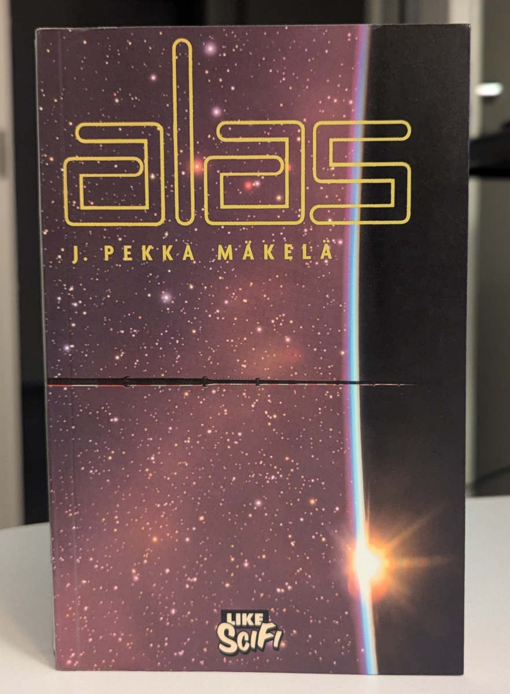

Suomalaisen kirjallisuuden teemavuosi on tullut päätökseen. Sen viimeiseksi kirjaksi jäi J. Pekka Mäkelän kirjoittama Alas.

<!--more-->

Eletään tulevaisuudessa. Avaruusmatkailu ja -turismi mullistuivat avaruushissien myötä. Nykyiset tähtialukset kykenevät valoa nopeampaan matkustamiseen. Ihmiskunta on levittäytynyt muille planeetoille. 50 valovuoden päässä sijaitsee ihmisten siirtokunta, isolta osin meren peittämä Alshain. Alshainissa on hyvin vähän luontoa, eikä sen kiinteällä maaperällä elä muita eläimiä, kuin ihminen. Planeetan ainut vähäinen elämä löytyy merestä. Kaikkialla on hiljaista.

Vaikka ihmiskunta on levittäytynyt muualle, sen ongelmat eivät ole muuttuneet. Tietynlainen ryhmiytyminen ja muukalaisviha on edelleen voimissaan. Tietyissä piireissä alun perin Maassa syntyneitä ihmisiä halveksitaan. Jotkut taas pitävät syntyperäisiä alshainalaisia toisten menneillä ponnistuksilla ratsastavina pummeina. Oma ryhmänsä ovat planeetan pinnalle ensimmäisenä astuneiden tiedemiesten jälkeläiset, jotka pitävät geeniperimään pohjautuvaa arvojärjestelmää yllä omalla asuinalueella, jonne huono-osaisilla ei ole asiaa.

Yksi Alshainin kolmesta avaruushissistä tuhoutuu. Iso osa 40 000 km korkeasta hissistä rysähtää planeetan pinnalle, aiheuttanut massiivista tuhoa. Sen yläosa jää pyörimään planeetan kiertoradalle. Lukuisia ihmisiä kuolee. Tapahtumalla on suuri vaikutus Alshainin pinnalla sinnitteleviin ihmisiin, joiden kodit ovat tuhoutuneet. Lisäksi joukko ihmisiä on jumissa kiertoradalla. Yhteydet planeetan ja yläosan välillä ovat katkennut.

Miksi näin kävi? Oliko teko tahallinen? Jos oli, kuka sen takana oli ja miksi?

### Erikoista kerrontaa

Kirjan kerrontatapa on hieman poikkeuksellinen, sillä se kertoo samat tapahtumat useaan kertaa monen eri ihmisen silmin. Samalla se liikkuu ihmisten välillä tavalla, joka toi itselleni mieleen [Memento](https://www.imdb.com/title/tt0209144/)-elokuvan.

Luvun aikana tai sen lopussa lukija törmää uuteen henkilöön. Hänkilö on isolta osin mysteeri, mutta hänen vaikutuksensa tapahtumiin paljastuu. Seuraavassa luvussa aikaa keritään taaksepäin, ja nyt nähdään, kuka tämä henkilö on ja miten hän päätyi osaksi avaruushissin tuhoutumista.

Pidin kovasti J. Pekka Mäkelän aikaisemmasta [Karsta]()-kirjasta. Vaikka Alas tarjoilee hieman saman tyylistä, kuvailevaa ja soljuvaa kerrontaa, se ei yllä Karstan tasolle.

Tällä teoksella on Karstan kanssa yhteistä myös se, ettei tässäkään kirjassa tapahdu ihan kauheasti. Näiden kahden kirjan perusteella minulla on tunne, etteivät Mäkelän kirjat pohjaudu monimutkaisiin tai tapahtumarikkaisiin tarinoihin. Hän haluaa kertoa ihmisistä, sekä heidän ajatuksistaan ja kohtaloistaan.

Harmillisesti Alas ei kiinnostavista lähtökohdistaan huolimatta yllä Karstan tasolle. Kirja tuntui todella tylsältä, eikä se jännittävän alun jälkeen onnistunut pitämään minua otteessaan. Jos kirja ei olisi ollut teemavuoden viimeinen, olisin saattanut jättää sen kesken. Nyt sinnittelin. Se onneksi palkittiin.

Yritin miettiä, miksi koin kirjan niin tylsäksi. En keksinyt muuta syytä kuin sen, että Mäkelän kuvaileva tyyli yhdistettynä saman tapahtuman toistamiseen ei vaan toimi. Kun torni sortuu ensimmäisen kerran, seuraavat luvut eivät kerro oikein mitään uutta. Erityisesti lukujen loppuosat kävivät puuduttavaksi, koska tiesit kaikki tapahtumat etukäteen. Nyt niitä samoja juttuja vaan kuvailtiin toisesta näkökulmasta. Nämä näkökulmat toivat tapahtumiin mitään hyvin vähän mitään uutta. Ne veivät vaan seuraavaan henkilöön ja touhu alkoi taas alusta.

Toinen ongelma - ja tämä voi olla vain minun henkilökohtainen ongelma - on se, ettei kirja kerro lukijalle, kuinka se kertoo tarinansa. Kuvittelin kirjan alussa, että avaruushississä työskentelevä rohkea opas olisi tarinan päähenkilö. Toista lukua lukiessa olin hämmentynyt, koska tapahtumat eivät tuntuneet mitenkään liittyvän ensimmäiseen lukuun. Sitten avaruushissitorni alkoi sortua uudelleen. Hämmennys syveni entisestään. Tajusin vasta aivan toisen luvun lopussa, että koko luku kertoi tarinan toisen ihmisen näkökulmasta, eikä oppaalla ollut mitään tekemistä toisen luvun tapahtumien kanssa.

Tätä ongelmaa syvensi se, että kirja kerrotaan ensimmäisessä perspektiivissä. Jokaisen luvun päähenkilön nimeä näkee todella vähän, jos lainkaan. Vasta kolmannessa luvussa tajusin, kuinka kirja toimii, mutta silti lukujen aloitukset aiheuttivat jonkinlainen hämmennyksen.

Tavasta, jolla tarina on kerrottu, seuraa väistämättä se, ettei tarinassa ole päähenkilöä. Jokainen hahmo jää ohueksi. Itse en onnistunut luomaan minkäänlaista suhdetta yhteenkään heistä. Paria henkilöä lukuun ottamatta he tulevat mukaan kappaleen lopussa ja sitten heidät unohdetaan seuraavan kappaleen jälkeen.

Tarinassa oli yksi piirre, joka tuntui niin päälle liimatulta, etten tiennyt kuinka suhtautua siihen. Jostain syystä tarinan jokainen hahmo vaikutti jonkinlaiselta seksipedolta. Olipa luvun päähenkilö mies tai nainen, he vaikuttivat aina miettivän seksiä, koskettelua tai arvioimaan sitä, millaista seksi jonkun toisen ihmisen kanssa olisi. Toisilleen lähes tuntemattomat ihmiset saattoivat päätyä iholle hyvin köykäisin perustein.

Välillä kuvailut olivat niin hämmentävän yksityiskohtaisia ja irrallisia, että ne tuntuivat vaivaannuttavilta. Ikään kuin olisin lukenut jonkun omia seksifantasioita. Tässä ei itsessään tietenkään olisi mitään vikaa, jos nämä kuvailut istuisivat jotenkin tarinaan ja kirjan muuhun tyyliin. Nyt näin ei kuitenkaan ollut.

### Loppu palkitsi

Tästä kritiikistä huolimatta näen silti, mitä Mäkelä on yrittänyt. Hän ei myöskään epäonnistu yrityksessään täysin. Kirjan loppupuolella kerrontatyyli voitti minut puolelleen ja saman tapahtuman toistaminen alkoi muuttua yllättävän jännittäväksi. Hämmennyskin muuttui oikeanlaiseksi. Pystyin tietyllä tavalla tuntemaan tapahtumien aiheuttaman hämmennyksen, jonka tarinan henkilöt kokivat, kun torni alkoi tärähdellä ensimmäisiä kertoja. Uusien henkilöiden kautta myös tornin romahtamisen syyt alkoivat aueta.

Mäkelän kirjoitustyyli ja ihmisiin keskittyminen on jotain, mistä pidin myös tässä kirjassa. Alas kaipaisi kuitenkin kipeästi selkeitä päähenkilöitä. Minun on vaikea välittää tapahtumista, jos en välitä tapahtumien keskellä olevista ihmisistä. Niistä taas on mahdotonta välittää, jos ne tulevat ja menevät.

Mäkelä on epäilemättä taitava kirjailija, joka osaa käyttää sanoja. Kirjan lähtökohta on hurjan kiinnostava. Koska Alas tapahtuu samassa maailmassa, kuin Mäkelän aikaisempi [Alshain](https://finna.fi/Record/helmet.1778393)-kirja, maailma tuntuu hyvin rakennetulta. Mäkelä osaa myös kuvata sitä mielenkiintoisella tavalla. Se tuntuu uskottavalta ja rivien välistä pystyy aistimaan historian, joka planeettaan ja avaruusmatkailuun liittyy.

Vaikka mainitsin kirjan olevan tylsä, sen loppu on itse asiassa varsin jännittävä. Se onnistuu sitomaan satunnaiset henkilöt ainakin isolta osin yhteen. Mysteerit saavat ansaitsemansa päätöksen. Se päätös on varsin yllättävä ja mielikuvituksellinen. Se tuntui mukavalta palkinnolta alkupuoliskon sinnittelyn jälkeen.

Karstan jälkeen Alas oli kuitenkin kokonaisuudessaan aikamoinen pettymys. Jos pitää Mäkelän kirjoitustyylistä, eikä kaipaa tarinaan selkeitä päähenkilöitä, Alas voi olla ihan viihdyttävää luettavaa. Se kertoo mielenkiintoisesta maailmasta ja jännittävästä tapahtumasta, mutta ainakaan minuun tämä teos ei uponnut.