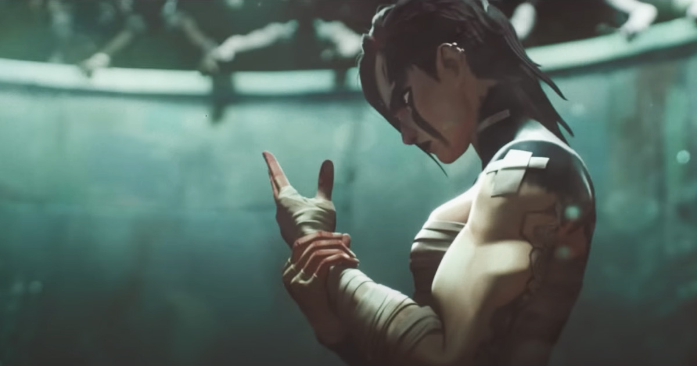
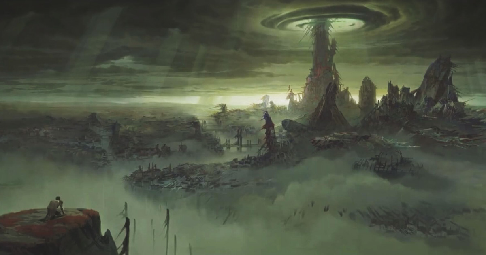
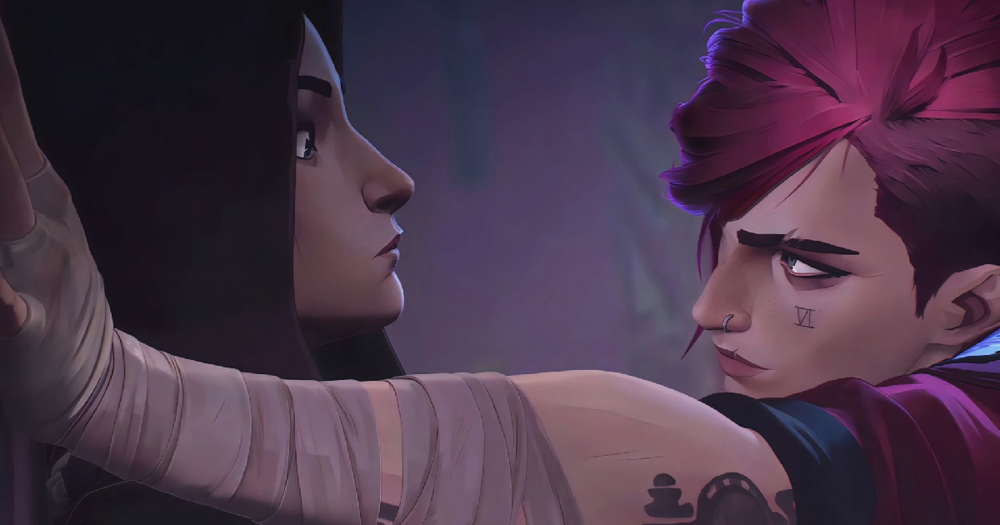

Ostin Netflixin kuukaudeksi ihan vain siksi, että saisin katsoa Arcanen toisen tuotantokauden. Mahtava sarja, joka oli myös samalla hienoinen pettymys.

<!--more-->

**Arvostelu sisältää spoilereita!**



### Ystävällinen silmille ja korville

Pidin todella paljon Arcanen ensimmäisestä kaudesta. Itse asiassa Arcanen ensimmäinen kausi on kenties paras sarja, mitä olen koskaan katsonut. Tykkäsin kaikista sen osa-alueista: animaatiosta, visuaalisesta tyylistä, ääninäyttelystä, hahmoista ja tietenkin ajatuksia herättävästä ja aikuisia teemoja käsittelevästä tarinasta. Lähdin toiseen kauteen odottavaisin mielin.

Toisen kauden visuaalinen tyyli on vähintään yhtä komea, ellei jopa komeampi, kuin ensimmäisessä kaudessa. Jokainen kuva tuntuu kuin pieneltä taideteokselta. Pidän hurjasti Arcanen tyylistä, joka yhdistää 3D-animaatiota, maalattuja taustoja sekä perinteisestä animaatiosta tuttuja 2D-tehosteita. Olen nähnyt joitakin sarjoja ja elokuvia, jotka ovat tavoitelleet samaa, mutta Arcane on aivan omassa sarjassaan.

Jos sarja on karkkia silmille, se on sitä myös korville. Ääninäyttelijät ovat hoitaneet hommansa timanttisesti ja tunteet välittyvät tavasta, jolla hahmot puhuvat. Tunteita Arcanessa riittää. Äänitehosteet tukevat visuaalista tyyliä ja sopii maailmaan, jossa on häivähdys steampunkia.

Useampi Arcanen episodi alkoi kohtauksella, joka muistutti musiikkivideota. Vaikka en ihan joka hetki välittänytkään näistä räppiä ja poppia sisältävistä kohtauksista, sarjan soundtrack noin kokonaisuudessaan on ihan hullun mukavaa kuunneltavaa. Se istuu myös tarinaan.

### Traagisia hahmoja

Arvostelujani lukeneet tietävät, että pidän henkilöhahmoista, jotka ovat monitahoisia ja moraalisesti harmaalla alueella. Iso syy, miksi pidin ensimmäisestä kaudesta, oli Arcanen hahmot. Erityisesti päähenkilöt **Vi** ja **Jinx** ja heidän traaginen tausta sekä vaikea suhde puhuttelevat minua isosti.

Yksi Arcanen hienouksista on se, ettei yksikään hahmo ole puhtaasti hyvä tai paha. Jokaisella on motivaationsa ja taustansa. Jokainen kokee toimintansa oikeaksi ja minun on helppo samaistua heihin. Ymmärrän, miksi he toimivat riippumatta siitä, ovatko ne maailman valoisalla vai pimeällä puolella.

Itse koin, että toinen kausi vei hahmojen ristiriitaisuuden vieläkin pidemmälle. Sarjaa seuratessa on todella vaikea sanoa, kuka on oikeasti hyvä ja kuka paha. Hahmojen veivaaminen hyvän ja pahan välillä meni ehkä vähän liiankin pitkälle. Ei se suuri ongelma ollut, mutta se tuntui välillä vähän päälle liimatulta.

En ole pelannut [League of Legends](https://www.leagueoflegends.com/en-gb/) -peliä, johon sarja pohjautuu, joten en tiedä kuinka suuri osa hahmoista tulee pelistä. Olivatpa hahmot pelistä tai ei, pidin niistä kaikista. Jokainen on omalla tavallaan kiinnostava, oli sitten hyvä tai paha. Ne ovat pääsääntöisesti myös hyvin kirjoitettu.

Hahmojen design on kuin tehty minulle. Ne ovat suunniteltu joko hoikiksi tai sitten hurjan lihaksikkaaksi. Jokainen voi olla näistä mitä mieltä tahansa, mutta minä tykkään! Hahmoista erityisesti **Vi**, **Sevika** ja **Mel** sekä **Vander** upposivat minuun ihan kympillä jo ensimmäisellä kaudella. Toisen kauden suosikkeja oli **Ambessa** sekä mykkä pikkutyttö **Isha**.

### Sekava ja hätäilty tarina

Kaikista näistä ylistyssanoista huolimatta Arcanen toinen tuotantokausi oli itselleni hienoinen pettymys. Siihen on vain yksi syy: tarina.

Ensimmäisen tuotantokauden keskiössä oli **Vin** ja **Jinxin** suhde. Se kertoi siitä, kuinka siskosten traaginen ja vaikea lapsuus päätyi ajamaan heidän hyvin eri suuntiin. Sen päälle oli **Caitlynin**, **Jaycen**, **Victorin** sekä **Silcon** tarinat. Vaikka Arcanen maailmaan kuuluu taikuus ja konfliktit, ensimmäinen kausi pohjautui lähes täysin ihmiskohtaloille.

Toinen tuotantokausi oli epämääräinen sekasotku, joka pohjautui enemmän ulkoiseen toimintaan kuin hahmoihin. Toki tässäkin on hahmokehitystä mukana, mutta se tuntui paljon köykäisemmältä kuin ensimmäisessä tuotantokaudessa. Minulle tuli fiilis, että tekijät olivat unohtaneet, mitä hahmot olivat ensimmäisessä tuotantokaudessa. Osa hahmoista, etenkin Jinx, vaikutti kokonaan uudelta hahmolta. Ymmärrän, että hän muuttui tapahtumien seurauksena, mutta se ei vaan tuntunut kovin uskottavalta.

Kauden jonkinlainen perusajatus tuntui olevan se, että tehdään hyvistä hahmoista pahoja ja pahoista hyviä. Tässä ei lähtökohtaisesti ole mitään väärää, mutta iso osa näistä muutoksista olisi kaivannut paljon enemmän lihaa luiden ympärille. Etenkin niissä kohdissa, jossa toinen kausi oli jollain tavalla ristiriidassa ensimmäisen kauden kanssa, muutoksia olisi pitänyt rakentaa paljon syvemmin ja paremmin.

Itselleni suurin ongelma oli kuitenkin se jäätävä sekamelska, mitä tarina koetti viedä eteenpäin. Ehkä nämä asiat ovat tuttuja League of Legends -peliä pelanneille, mutta minun oli vaikea ymmärtää, mitä ihmettä tarinassa tapahtuu. Se esitteli aivan liikaa uusia ilmiöitä, elementtejä ja taikuutta.

Siinä kohtaa kun mukaan tuotiin 2020-luvun elokuvien vakiovieras multiversumi, taikamaailmat ja aikamatkailu, aloin menettää mielenkiintoani. Millään tapahtumalla ei ole oikein mitään väliä, jos kaiken voi peruuttaa tai katsoa toisesta universumista käsin. Arcane ei onneksi mene tässä kovin pitkälle, mutta ensimmäisen kauden nerokkuuteen verrattuna se tuntui tosi köyhältä. Myönnän kuitenkin, että tapa, jolla tarina hyödynsi aikamatkailua, oli hetkittäin aika nerokas ja viihdyttävä. Asiaa auttoi se, että aikasekoilua hyödyntävä Ekko on niin sympaattinen ja vilpitön hahmo.

Tarina alkaa varsin mielenkiintoisella tavalla, mutta mitä lähemmäksi loppua mennään, sitä hätäisemmäksi touhu menee. Vaikka tarinassa onkin ihan kiinnostavia ihmiskohtaloita, se rakentui niin isosti hextech-sekoilun päälle, etten vaan jaksanut innostua siitä. Kolme viimeistä jaksoa lähtee niin kovaa tangentin suuntaan, että minun oli vaikea pysyä perässä, että mitä hittoa tarinassa oikein tapahtuu. Tarinassa on myös useita hölmöyksiä ja aukkoja. Vaikka en odottanut tarinan yltävän ensimmäisen kauden tasolle, odotin silti käsikirjoituksen olevan laadultaan yhtä korkealuokkaista. Se ei ollut.

Henkilöiden puolella yksi suurimmista pettymyksistä oli Vi. Ei siksi, että hän olisi ollut huonosti kirjoitettu, vaan siksi, että hän jäi niin pahasti paitsioon. Vi oli mielestäni ensimmäisen tuotantokauden kiinnostavin hahmo ja nyt hän tuntui haahuilevan paikasta toiseen lähinnä matkustajan roolissa. Hän oli myös yksi kovimmista hahmoista ja nyt hän tuntuu lähinnä muiden eteismatolta. Jopa Caitlyn ja Jinx pystyvät pistämään hänelle kampoihin. En ymmärrä, miksi Vin hahmo piti tällä tavalla rikkoa.

Onneksi tilalla oli Melin ja Ambessanin välinen äiti-tytär-suhde, joka kantoi upeasti alusta loppuun. Ambessa oli muutenkin tuotantokauden kiinnostavin hahmo, joka kannatteli koko kautta lihaksikkailla käsivarsillaan. Myös Jinxin ja Ishan suhde oli onnistunut veto. Se istui hienosti myös Jinxin hahmoon sekä hänen taustaan.

Monet Arcanen hahmoista lähentelevät androgyynejä. Siinä missä ensimmäinen tuotantokausi onnistui käsittelemään toimivalla tavalla vahvoja naishahmoja ja seksuaalivähemmistöjä, toinen ei onnistunut siinä ihan yhtä hyvällä menestyksellä.

Erityisesti hyväosaisen kermaperseen Caitlynin muuttaminen jonkinlaiseksi girlbossiksi ei vaan toiminut. Tätä ongelmaa ei ollut Vin, Sevikan tai Ambessan kanssa, jotka olivat alusta asti esitelty vahvoina hahmoina. Toinen kausi vaan vahvisti Ambessan kuvaa vahvana sotilasjohtajana. Hänen koko olemuksensa huokui uskottavuutta ja käskyvaltaa. Hän myös näytti siltä, että pystyi pistämään jengiä poikki ja pinoon. Pidin Caitlynin hahmosta ja tarinasta ensimmäisessä osassa, mutta nyt se ei vaan toiminut.

Ensimmäisen kauden jälkeen toivoin, että Vin ja Caitlynin väliseen suhteeseen olisi käytetty kunnolla aikaa. Se tuntui muun tarinan tapaan kiirehdityltä ja jämähti epämääräisen on-off -suhteen tasolle. Kun kaikki oli aivan päin helvettiä, jengiä kuolee, sisko uhkaa tappaa itsensä ja maailma palaa ympärillä, mikäpäs sen parempi hetki lesboseksille kylmässä ja kivisessä vankisellissä. Tarina olisi voinut saada niin paljon enemmän syvyyttä, kun heidän välisen suhteen rakentamiseen olisi käytetyt enemmän aikaa ja sitä olisi osattu hyödyntää tarinassa. Nyt se jäi satunnaisen irtosuhteen tasolle, eikä asiaa auttanut se, että Caitlyn sekoili myös muiden kanssa.

Toinen kausi olisi kaivannut Vanderin kaltaista rehellistä ja hyväsydämistä isähahmoa. Vander esiintyy lähinnä takautumana ja vaihtoehtoisessa universumissa. Loris tarjosi hyvää potentiaalia, mutta häntä ei osattu käyttää oikein mitenkään. Tarinassa on kyllä siivu isän ja tyttärien välistä suhdetta, mutta tapa, jolla se toteutetaan, jätti ainakin minut kylmäksi. Onneksi tarinan hahmot ovat niin hyvän rakennettuja, ettei tämä jäänyt isommin häiritemään.

### Epäkohdistaan huolimatta loistava sarja

Vaikka kirjoitin pettymyksistä pitkästi, ei kannata käsittää niitä niin, että pitäisin Arcaden toista tuotantokautta huonona. Kirjoitan pettymyksistä siksi, että toivoin toiselta tuotantokaudelta niin paljon enemmän. Sen suurin ongelma on se, että se sattuu olemaan jatkoa lähes täydelliselle ensimmäiselle tuotantokaudelle.

Kaikista epäkohdista huolimatta Arcaden toinen tuotantokausi on näin 2024-luvulla kuin raikas tuulahdus. Siinä on aivan käsittämättömän paljon hyvää ja voin lämpimästi suositella sitä. Ei kuitenkaan kannata odottaa ensimmäisen kauden kaltaista mestariteosta. Siitä se jää aika kauaksi jälkeen ja sen tarina vaatii sitä, ettet ajattele sitä liikaa.

**Muokkaus 22.12.2024**: lisätty joitakin huomioita, jotka tulivat mieleen alkuperäisen kirjoituksen jälkeen