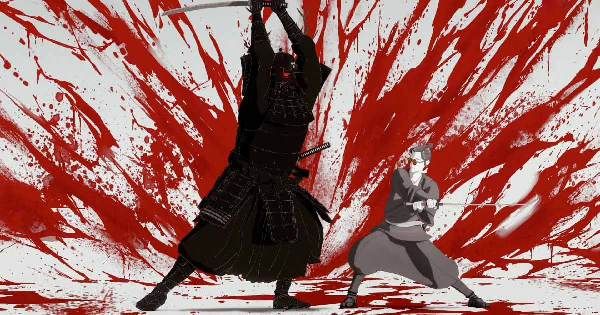
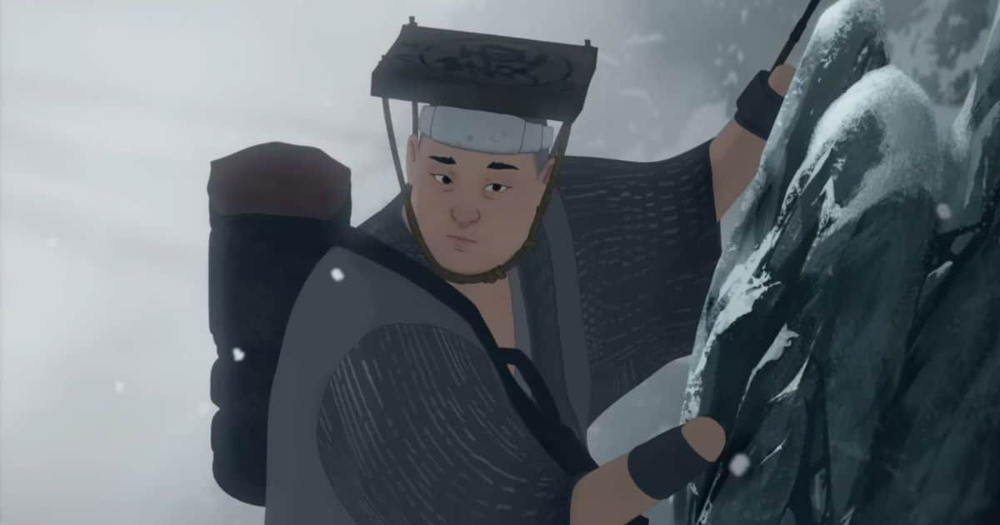

Olin kuullut hyvää Netflixin Blue Eye Samurai -sarjasta, joten päätin katsoa sen. Ei tarvinnut pettyä!

<!--more-->

Blue Eye Samurai sijoittuu 1600-luvun Japaniin. Maata hallitsee Tokugawa-shōgunaatti, joka sulki maan rajat muulta maailmalta. Länsimaisia ihmisiä ja kulttuureja pidetään pahana, eikä maata haluttu tärvellä valkoisen saastan vaikutuksilla.

Tästä huolimatta maahan jäi neljä valkoista miestä vastoin lakia. Raakalaisten seurauksena syntyi sekarotuisia lapsia, jotka eivät kestäneet päivänvaloa ja tulivat tapetuksi isiensä toimensa. Joukossa oli kuitenkin yksi, joka vältti tämän kohtalon: sinisilmäinen **Mizu**. Hän kasvoi eristyksissä ja äitinsä suojelussa. Lapsuutensa Mizu vietti piilotellen, sillä muu maailma ei olisi katsonut sekarotuista ja sinisilmäistä äpärää hyvällä.

Piilotusyritys epäonnistuu ja Mizu päätyy orvoksi, sillä joku valkoisista miehistä tappaa tämän äidin.

Surkeasta alusta huolimatta orvosta, sinisilmäisestä lapsesta kasvaa seppä ja taitava miekan käsittelijä. Hän vannoo kostavansa äitinsä murhan sekä surkean lapsuutensa, ja tappavansa kaikki neljä valkoista miestä - mukaan lukien isänsä.



Lähtökohta on yksinkertainen, mutta Blue Eye Samurai on upeasti kirjoitettu tarina. Se ei kerro vain yhtä tarinaa. Päätarinan mukana kulkee useampi sivujuoni, jotka tuntuvat saaneen aivan yhtä paljon huomiota, kuin päätarina. Kaikki nivoutuu sarjan aikana yhteen. En halua kertoa tarinasta sen enempää, jotta en spoilaa mitään.

Blue Eye Samurai on kirjoitettu selkeästi aikuisille. Tarina käsittelee monia teemoja kuten kosto, luottamus, viha, ystävyys, uskollisuus, syrjintä sekä vallanhimo. Se käsittelee teemoja taidokkaalla ja monitahoisella tavalla.

Vaikka kyseessä on animaatio, se on raaka ja väkivaltainen. 1600-luvun Japani on täynnä bordelleja ja tarinassa on seksiä, joka on paikoin väkivaltaista ja rajoja koettelevaa. Tämä ei ole lasten sarja, eikä se välttämättä ole kaikista kevyintä katsottavaa herkimmille aikuisille.

En tunne Japanin historiaa, joten en tiedä, kuinka tarkasti sarja ammentaa todellisuudesta. Mikäli maailma pohjautuu todellisuuteen, 1600-luvun Japani on ollut karsea paikka elää. Ympäröivän maailman jokainen ihminen tuntuu olevan itsekäs kusipää, joka kohtelee jokaista vastaantulijaa kuin roskaa. Maailma vaikuttaa rakentuvan väkivaltaisten miehien, huorien ja päähän potkittujen huono-osaisten päälle. Elämä on jatkuvaa selviämistä tai valtataistelua. Enkä ymmärrä, kuinka ihmiset tarkenevat t-paidoissa, kun joka paikassa sataa lunta.

Visuaalisesti animaatio on upeaa katsottavaa, vaikka sen visuaalinen tyyli ei puhutellut minua yhtä paljon kuin [Arcane](). Blue Eye Samurai muistuttaa enemmän perinteistä animea. Sen kahdeksaan jaksoon mahtuu kohtauksia, jotka on aivan hillittömän hienosti tehty. Välillä se leikittelee myös erilaisilla visuaalisilla tyyleillä. Osa taustoista on niin upeasti maalattu, että minun oli kelattava taaksepäin ihan vaan nähdäkseni ne uudelleen.

Äänimaailma on toimiva ja suurin osa ääninäyttelijöistä on osaavaa porukkaa. Pidin erityisesti sarjan päähenkilön ääninäyttelijän *Maya Erskinen* työstä. Hän onnistuu tuomaan rikkinäiseen, koston sokaisemaan ja lähes tunteettomaan Mizuun juuri oikean määrän eloa. Mukana on myös useampi näyttelijäkonkari, kuten *George Takei*, *Masi Oka*, *Kenneth Branagh* sekä *Cary-Hiroyuki Tagawa*.

Sarjan musiikki on pääsääntöisesti toimivaa, mutta joukkoon mahtuu muutaman aivan älytön valinta, jotka tappoivat ainakin oman fiiliksen. Miksi 1600-luvun Japanissa tapahtuvan taistelukohtauksen päälle on pitänyt laittaa 1960-luvun rock'n'rollia? Olin myös aika pettynyt siihen, että treenausmontaasin taustalle oli valittu Tomoyasu Hotein [Battle Without Honor or Humanity](https://www.youtube.com/watch?v=gw5vAd5icAg). Hyvä biisi, mutta aivan loppuun kulutettu, eikä minulle ei tule siitä mitään muuta mieleen kuin [Kill Bill](https://www.themoviedb.org/movie/24-kill-bill-vol-1).

Blue Eye Samurain ylivoimaisesti parasta antia ovat sen henkilöt. Jokainen hahmo on kirjoitettu kiinnostavaksi. Jaksan toistaa tätä samaa virttä, muta pidän hahmoista, jotka eivät ole mustavalkoisia. Tässä sarjassa hyvän ja pahan raja on hyvin häilyvä, mutta jokaisen hahmon taustalla on selkeä motivaatio. Heidän toimiaan on helppo ymmärtää. Olin myös iloinen siitä, ettei sarjassa ole yhtään tyhmää hahmoa. Jokaisen toiminta on järkevää, eivätkä he toimi luonteensa vastaisesti, tai tee täysin idioottimaisia valintoja vain siksi, että loput tarinasta voisi tapahtua.

Oma suosikkini on päähenkilö **Mizu**. Rikkinäinen, koston sokaisema ja salaisuuksia mukanaan kantava samurai, joka ei halua ketään lähelleen, mutta kaipaa silti jotain. Juuri sellainen hahmo, joka uppoaa minuun täysillä. Pidin myös siitä, että sarja malttaa ylläpitää hahmon identiteettiä yllä aivan loppuun asti. Vaikka hetkittäin Mizu keikkuukin jonkinlaisen yli-ihmisen rajoilla, se tuntui silti sopivan tarinaan, sillä sarja kertoo, kuinka hänestä tuli sellainen. Juuri kun kuvittelet, että hänen sisällään kytevä hyvyys kuplii pintaan, pahuus saa hänestä vallan. Hän on tarinan vahva sankari, mutta samaan aikaan sen rikkinäinen ja vikoja täynnä oleva pahis. Vaikka hän on taitava, hän saa myös matkan aikana useamman kerran oikein kunnolla turpaansa, eikä selviä jokaisesta vastoinkäymisestä yksin.

Pidin myös **Taigenista**. Hän on menetettyä kunniaansa jahtaava samurai, joka on samaan aikaan Mizun lähin tuki, mutta myös hänen vihollisensa. Hän sattuu olemaan myös yksi lapsista, jotka kiusasivat Mizua heidän ollessa lapsia. Tykkään tällaisista ristiriidoista!

**Akemi** on piloille hehmoteltu tyttö, jonka vaikutusvaltainen isä haluaa naittaa itsekeskeiselle sikailijalle. Akemi ei tätä kuitenkaan sulata, sillä hänellä on oma ihastuksensa. Lisäksi hänen maailmassa naisten pitäisi olla muutakin kuin nyrkin ja hellan välissä olevaa kauppatavaraa.

Tarinan pahiksetkin ovat hyvin rakennettuja ja älykkäitä. Ne tarjoavat Mizulle aitoa vastusta ja pidin siitä, että pahiksien välillä on myös keskinäistä kamppailua. Kukaan heistä ei ole tyhmä tai vähäpätöinen.

Sarja kuljettaa koko tarinan läpi tietynlaista vammaisuuden ja syrjinnän huntua ja tekee sen tyylillä! Keskiössä on tietenkin sinisilmäinen "sekasikiö" Mizu. Tämä ei ole suuri spoileri, sillä katsojalla asia vahvistuu viimeistään ensimmäisen jakson lopussa: sen lisäksi, että Mizu joutuu piilottamaan länsimaisten geenien värittämät siniset silmänsä, hän joutuu piilottamaan myös sukupuolensa.

Mizun lähin isähahmo on sokea seppä. Mizun mukana kulkee hieman höntti kokki **Ringo**, jonka kädet loppuvat ranteisiin, mutta joka haaveilee silti olevansa samurai. Hän ei koskaan tunnu henkilöltä, jolla yritetään kalastella sääliä. Päinvastoin, hän on yksi sarjan vahvimpia hahmoja, jotka saavat miettimään, mitä hyvyydellä voi saada aikaiseksi. Hän yrittää löytää omaa paikkaansa maailmasta rajoituksistaan huolimatta.

Sarja käsittelee naisten alistamista ja syrjintää tavoilla, joka tuntuu uskottavalta, mutta ei liioitellulta. Blue Eye Samurai ei missään kohtaa tee näistä päälle liimattuja yksityiskohtia, joilla kalastellaan modernilta yleisöltä diversiteettipisteitä. Ne on kirjoitettu onnistuneesti ja hahmoilla on ihan oikea rooli. He myös kasvavat tarinan aikana, jonka takia heihin on helppo samaistua. He tuntuvat oikeilta ihmisiltä haaveineen ja vaikeuksineen.

Pidin myös siitä, kuinka jokaisesta sorretusta ei tule automaattisesti sankaria. Blue Eye Samurai uskaltaa nostaa pöydälle myös sen, että sorretuista voi tulla sortajia, mikäli he saavat siihen tilaisuuden. Aina löytyy joku, joka on vielä alempana hierarkiassa. Mukava katsoa vuonna 2024 sarjaa, joka onnistuu käsittelemään tällaisia aiheita tavalla, joka ei tunnu poliittiselta paasaamiselta. Blue Eye Samurai keskittyy ensisijaisesti kertomaan hyvän tarinan.

Satunnaisten musiikkivalintojen lisäksi sarjassa on vain yksi asia, josta en erityisemmin pitänyt: se loppuu hölmösti. Toivoin, että tämä olisi ehjäksi kokonaisuudeksi kirjoitettu sarja, jolla on yksi tuotantokausi, mutta tämä taitaa olla turha toive. Sarjan loppu antaa aika vahvoja viitteitä siitä, että sille on tulossa jatkoa. En pidätä hengitystä sen puolesta, että toinen tuotantokausi kykenee samaan kirjoittamisen laatuun kuin ensimmäinen.

Tarina jäi omaan makuun aivan liian pahasti kesken, eikä lopun cliffhanger tuntunut uskottavalta. Blue Eye Samurai kuljettaa useampaa pientä tarinaa, mutta liian moni niistä jää auki. En tuntenut katsojana saavani tyydyttävää ratkaisua ja olo oli hieman huijattu sekä petetty. Tämä tuntuu nykyään olevan enemmän sääntö, kuin poikkeus. Ärsyttävää.

Lopusta huolimatta pidin Blue Eye Samuraista tosi paljon. Jos kaipaat fiksusti kirjoitettua, aikuisille suunnattua tarinaa kiinnostavilla hahmoilla, tässäpä sinulle sellainen! Suosittelen lämpimästi!
