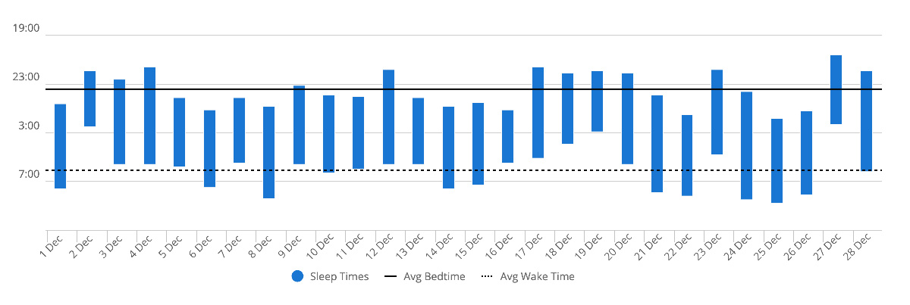

Kirjoitan tätä 02:27, muutaman onnettoman nukutun tunnin jälkeen. Aloin miettiä ihmisen sisäistä kelloa ja sitä, kuinka huonosti ulkomaailma on sen kanssa synkassa.

<!--more-->



Kuuntelin pari päivää sitten [Feel Better Live More -podcastin jakson](https://drchatterjee.com/the-new-science-of-the-body-clock-how-to-boost-your-immune-system-reclaim-your-energy-improve-your-mental-health-with-dr-kristen-holmes/), jossa keskustellaan sisäisestä kellosta ja sen vaikutuksesta ihmisen hyvinvointiin. Olen [ihmetellyt aikaisemminkin]() ajatusta aamu- ja iltavirkkuudesta.

Jaksossa podcastin juontaja, lääkäri **Rangan Chatterjee**, sekä haastateltava tutkija **Kristen Holmes**[^1] tyrmäävät tämän ajatuksen lähes täysin. Tutkimusnäyttö näiden niin sanottujen *chronotyyppien* olemassaolosta on horjuva. Silloinkin kun ne on pystytty jotenkin osoittamaan, niiden todellinen vaikutus unirytmiin on paljon pienempi, kuin mitä ihmiset usein kuvittelevat. Sen sijaan näyttö siitä, että aamu- ja iltavirkkuus on enemmän opittu tapa ja seurausta ympäristöstä, on varsin vahva.

Tämä käy hyvin omaan järkeen ja tunnistan ilmiön myös omasta elämästä. Olen ollut sekä aamu- että iltavirkku. Kun katson lähellä eläviä ihmisiä, minun on helppo nähdä, kuinka he itse ylläpitävät tietynlaista rytmiä omalla tekemisellä ja valinnoilla. He itse tietenkin ajattelevat, että ovat vain matkustajia ja kaikki johtuu siitä, että he ovat syntyneet aamu- tai iltavirkuksi.

Holmes toteaa, että koko ajatus chronotyypeistä on syntynyt lähinnä kätevyydestä. Harmillisesti hän ei avaa tätä kommenttia sen enempää, mutta tulkitsin sen niin, että se on jälleen yksi tapa, jolla on näppärä selittää asioita tekemättä niille itse lopulta mitään.

### Sisäisen kellon säätäminen

Itselleni jakson kiinnostavinta sisältö oli keskustelu sisäisestä kellosta. Se on lopulta varsin yksinkertainen idea, joka ei käytännössä ole aivan niin yksinkertainen.

Ihmiskehon toiminta noudattaa varsin säännöllistä biologista 24 tunnin rytmiä, jota ohjaa ensisijaisesti kaksi asiaa: valo ja ravinto. Tutustuin tähän ilmiöön vuosia sitten kärsittyäni [vakavasta unettomuudesta](). Sisäinen kello ohjaa kaikkea: ruoansulatusta, vireystilaa, aivojen toimintaa, nukkumista ja niin edelleen.

Matkat usean aikavyöhykkeen läpi ovat tarjonneet hyvän mahdollisuuden kokea sisäisen kellon toiminta ihan käytännössä. Olen pyrkinyt matkustamaan niin, että olen perillä ruoka-aikaan - mieluiten aamulla, jos mahdollista. En juurikaan syö lennoilla ja nukkumisenkin pyrin minimoimaan.

Kun pääsen perille, olen väsynyt ja nälkäinen. Menen heti ensimmäisenä syömään, oli se sitten aamupala, lounas tai päivällinen. Se antaa täysin sekaisin olevalle sisäiselle kellolle signaalin käynnistyä uudelleen.

Tämän jälkeen edessä on päivä, jonka aikana on sinniteltävä väsymystä vastaan. Tässä auttaa se, että pyrin olemaan aktiivinen. Sen sijaan, että jäisin lahnailemaan majapaikkaan, lähden kävelylle ja tutkimaan lähialuetta. Altistan itseni luonnonvalolle ja pysyn liikkeessä. Päivän aikana jatkan syömistä paikalliseen rytmiin. Illalla olen rättiväsynyt ja menen nukkumaan paikallisesta näkökulmasta normaaliin ilta-aikaan.

Tämän kaiken seuraus on se, etten juurikaan kärsi jetlagista. Ensimmäisen 24 tunnin jälkeen sisäinen kelloni on synkannut itsensä uuteen rytmiin ja viimeistään 48 tunnin jälkeen en edes muista, että elän aivan eri rytmissä. Samat temput ovat toimineet aina myös matkaseuralleni riippumatta siitä, väittävätkö he olevan aamu- vai iltavirkkuja.

Suurin aikaero, jonka olen tällä tavalla selättänyt, oli yhdeksän tuntia, kun kävin Australiassa.

### Toisenlainen jetlag

Kun elämä on epäsynkassa sisäisen kellon kanssa, keho joutuu tekemään paljon enemmän työtä. Se on käytännössä jatkuva stressitila, joka on helppo havaita esimerkiksi sydämen [sykevälivaihtelua (HRV)](https://www.haataja.eu/sykevalivaihtelu-hrv/) mittaamalla.

Podcastissa Holmes korostaa sitä, että ylivoimaisesti tärkein hyvinvointia ja terveyttä edistävä teko on säännöllinen unirytmi. Usein ihmiset elävät viikonloppuja eri rytmissä kuin arkipäiviä. Syitä tähän on tietysti useita, mutta omalla kohdalla yksi on ylitse muiden: "Nyt on viikonloppu! Voin valvoa myöhempään kun ei ole töitä!"

Se on käytännössä oma valinta, joka kumpuaa jonkinlaisesta kummallisesta anarkistisesta vapaudentarpeesta. Epäsäännöllisen unirytmin kaverina on usein myös arjesta poikkeava ruoka sekä ruokarytmit. Tästä arjen jatkuvaa unirytmin vaihtelua kutsua sosiaaliseksi jetlagiksi. Pidämme usein itse huolen siitä, että olemme jatkuvassa jetlagissa.

Pirullista asiassa on se, että ihminen on mestari mukautumaan. Me totumme kaikkeen ja tästä haitallisesta tilasta tulee uusi normaali, emmekä edes tajua sitä. Tottuminen ei kuitenkaan poista aiheutuvaa haittaa.

### Valo ja vuodenajat

Holmesin ja Chatterjeen keskustelussa sisäinen kello sidottiin vahvasti auringon valoon. Se on ihan kiva, jos satut asumaan päiväntasaajan seudulla. Entä kaikki ne ihmiset, jotka asuvat eteläisellä- ja pohjoisella pallonpuoliskolla? Rovaniemellä päivän pituus on tätä kirjoittaessa reilut kaksi tuntia. Heinäkuussa se on 24 tuntia. Pitäisikö meidän horrostaa talvet ja valvoa kesät?

Minua vaivasi se, että tämä tosiasia ohitettiin jaksossa parilla lauseella. Käytännössä he totesivat, että talvella unen määrä on enemmän ja kesällä se on vähemmän. Plääh.

Toisaalta tämä on omakin havainto, eikä se kosketa vain unta. Oma yleinen vireystaso romahtaa talvisin täysin. Pimeydellä on myös musertava vaikutus henkiseen hyvinvointiin ja aktivoi helposti masennuksen. Vaikka mukautumiskykymme mahdollistaa asumisen näillä leveysasteilla, ehkä meitä ei ole vaan tehty tällaiseen.

Tutkimusnäyttö puhuu kuitenkin sisäisen kellon puolesta, joten ehkä asiaan pitäisi suhtautua toisella tavalla. Vaikka aurinko ei talvisin paistakaan, ehkä meidän kannattaisi pyrkiä elämään ja rakentamaan ympäristömme ikään kuin eläisimme päiväntasaajalla.

### Ympäröivä maailma on epäsynkassa

Maailmanlaajuisesti unihäiriöt näyttävät kasvavan. Tähän on varmasti useita syitä, kuten [melusaaste](), mutta keinovalot ovat varmasti yksi niistä. Elämme maailmassa, jossa pimeyttä ei juurikaan ole, vaikka aurinko olisikin horisontin alapuolella. Keinovaloja on kaikkialla ja nykyään meillä jokaisella on sellainen taskussa.

Istumme valaistuissa huoneissa ja tuijottelemme valaistuja näyttöjä aamusta iltaan. Jos valo on yksi merkittävimmistä sisäistä kelloa ohjaavista ulkoisista tekijöistä, jatkuva valolle altistuminen sotkee sitä.

Pidän itse tunnelmavalaistuksesta. Yksi talvien kivoista puolista on se, että kotiin on mahdollista järjestää mukavan lämmin valaistus, josta tulee kodikas olo. Puolisoni kysyykin usein, että "Miksi sinä istut täällä hämärässä?"

Ehkä olisikin parempi, että jättäisin hämärän tunnelmavalaistuksen ilta kuuden jälkeiseen aikaan, ja koettaisin valaista kodin mahdollisimman kirkkaasti. Mitä lähemmäksi iltaa menen, sitä pimeämpää ympäristössä pitäisi olla. Sitä vähemmän pitäisi istua ruutujen ääressä.

Toinen ongelma on se, etten elä maailmassa yksin. Vaikka minä menisin nukkumaan ajoissa, muut ihmiset eivät mene. Tämä tulee erityisen selvästi näkyviin kerrostalossa asuessa.

Aloitin kirjoittamaan tätä keskellä yötä, että koska lomalla oleva puolisoni päätti tyypilliseen tapaan venyttää omaa unirytmiään myöhäisempään hetkeen. Heräsin kolinaan, jota hän piti mennessään nukkumaan vasta puolen yön aikaan. Tämän jälkeen sain kuunnella yläkerran naapurin kovaäänistä puhetta puoli kahteen. Yritin saada unta ja pyörin sängyssä 45 minuuttia, mutta lopulta luovutin.

On jotenkin vitsikästä nähdä, kuinka aamuvirkuiksi itsensä luokittelevat sanovat, että maailma pyörii iltavirkkujen ympärillä, kun samaan aikaan iltavirkut sanovat, että se pyörii aamuvirkkujen ympärillä. Minä luulen, että se pyörii niiden ympärillä, jotka vähät välittävät unirytmistä. Se pyörii niiden ympärillä, jotka eivät välitä toisten unista.

### Rytmistä on ollut apua univaikeuksiin

Kun korjasin lääkärin avulla [omaa unettomuuttani](), yksi keskeisiä korjaustoimenpiteitä oli rytmin palauttaminen. Sain yrittää nukkumista vain tiettyyn kellonaikaan ja kun se aikaikkuna meni ohi, päivä pyhitettiin valvomiselle ja siihen yhdistettiin säännöllinen ruokailurytmi.

En tajunnut sitä silloin, mutta jälkeenpäin on helppo nähdä, että tässä synkattiin elämä sisäiseen kelloon. Minusta rakennettiin ihminen, joka elää auringon tarjoamassa rytmissä. Se auttoi!

Univaikeudet eivät ole kokonaan poissa ja melusaasteen pahentaman ääniherkkyyden myötä nukkuminen on minulle vaikeaa. Ilman hiljaista ympäristöä, minun on vaikea saada kunnollista unta.

Holmes mainitsee podcastissa, että tasainen unirytmi on usein tärkeämpi, kuin riittävä määrä unta. Syyksi hän kertoo sen, että tasainen unirytmi mahdollistaa *laadukkaammat* unet. Kun uni on laadukasta, sitä ei tarvitse niin paljoa. Tästä huolimatta hän kuitenkin muistuttaa, että noin keskimäärin 7-8 tuntia unta on se, mihin ihmisten pitäisi keskimäärin pyrkiä.

### Haluaisin korjata rytmini

Olen pyrkinyt ylläpitämään säännöllistä unirytmiä, mutta menestys ei ole kovin hyvä. Ranteessani 24/7 oleva urheilukello kertoo sen kyllä minulle. Joiltain osin voin katsoa tässä vain peiliin.

Yksi isoista ulkoisista ongelmista on se, että puolisoni on ihan toivoton tapaus, mitä tulee unirytmin ylläpitämiseen. Hänen käsityksensä hiljaisuudesta on myös, noh, sanotaanko näin, että aika erilainen kuin minulla. On vaikea ylläpitää rytmiä, jos toinen ei sitä pidä. Asiassa eivät auta meluavat naapurit tai pihassa ovia paiskovat autoilijat - pihassa, jossa autoilu ja autojen pysäköinti on kielletty.

Haluaisin korjata asian, mutta se on ympäristön ja muiden ihmisten takia vaikeaa. Se tuntuu tosi turhauttavalta. Hintana on kuitenkin oma terveyteni.

Olen muutaman kuluneen vuoden aikana huomannut, että säännöllisellä unirytmillä ja hyvillä yöunilla on aivan käsittämätön vaikutus omaan hyvinvointiin. Sen lisäksi, että laadukas ja riittävä uni ylläpitää henkistä hyvinvointiani ja on tehokas lääke taistelussa masennusta vastaan, se pitää yllä myös fyysistä hyvinvointia. Esimerkiksi [ärtyvän suolen oireyhtymä]() reagoi herkästi vaihtelevaan rytmiin ja huonoihin yöuniin.

Omien unettomuuskokemuksien ja nykyisten nukkumisvaikeuksien takia olen oppinut arvostamaan riittävää ja laadukasta unta aivan uudella tavalla. Minulle on tärkeää kunnioittaa myös toisten yöunia.

Tiedostan asuvani kerrostalossa, joten pidän huolen siitä, että annan muille ihmisille yörauhan. Tämä ei sinänsä vaadi minulta mitään ylimääräistä, koska nautin itsekin niin paljon hiljaisuudesta ja inhoan kovaäänistä keskustelua.

Kun puolisoni menee nukkumaan kahden aikaan yöllä ja nousee sängystä kymmeneltä, minä vietän tuntikausia omassa huoneessa ollen hipihiljaa. Jos haluan pelata, katsella televisiota tai kuunnella musiikkia, teen sen kuulokkeilla.

Yleensä en syö edes aamupalaa, koska en halua mennä kolistelemaan keittiöön. Tämä on tietenkin hieman tyhmää, koska minun rytmin kannalta olisi järkevää, että söisin heti herättyäni. Lienee taas [miellyttäjämörkö](), joka nostaa rumaa päätään.

Kaikesta huolimatta otan tavoitteeksi priorisoida aikaisempaa enemmän oman unirytmin ylläpitämistä. Katsotaan, kuinka hyvin se onnistuu. Mikäli ympäristö ei sitä mahdollista, sitten lienee taas aika miettiä ympäristön vaihtamista.

[^1]: Kristen Holmes työskentelee [Whoop](https://www.whoop.com/)-yritykselle, joten joihinkin hänen kommentteihin kannattaa suhtautua pienellä varauksella. Hänen roolinsa ei kuitenkaan vähennä tutkimustulosten merkitystä ja jaksossa viitataankin useampaan tutkimukseen, jotka ovat täysin riippumattomia sekä podcastin juontajasta, että haastateltavasta.