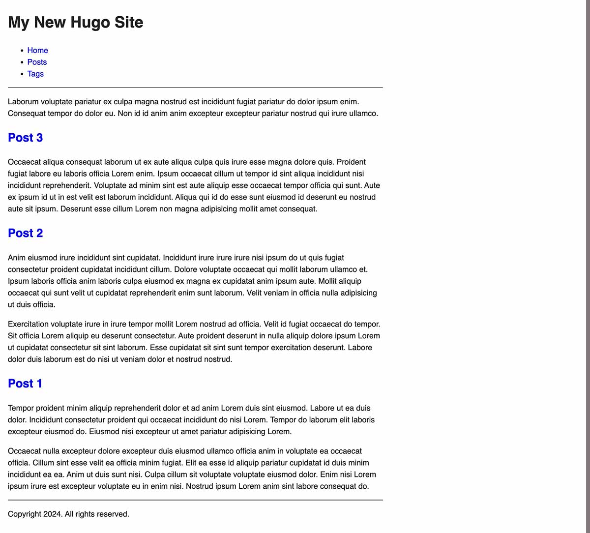

Tämä on ensimmäinen osa pienestä oppaasta, jossa käydään läpi kotisivujen tekeminen Hugolla.

<!--more-->

[Hugo](https://gohugo.io) on niin sanottu *staattinen sivugeneraattori*. Se generoi HTML-tiedostoja sinun luomasi sisällön ja sivupohjien avulla.

Mikäli kotisivusi koostuvat vain muutamasta alasivusta, Hugolle ei ole välttämättä mitään tarvetta. Jos taas haluat rakentaa monipuolisemman sivun, joka sisältää satoja kirjoituksia sisältävän blogin, HTML-tiedostojen ylläpitäminen käsin muuttuu nopeasti hyvin työlääksi.

Staattisten sivugeneraattorien lähtökohta on usein se, että kun sivun ulkoasu on rakennettu, ylläpitäjä voi keskittyä lähes täysin sisällön tuottamiseen.

Tämä opas olettaa, että osaat käyttää terminaalia ja asentaa sen kautta käytettäviä sovelluksia. Toinen oletus on, että sinulla on perusymmärrys HTML-sivujen tekemisestä. Oppaassa ei käydä läpi HTML:n tai CSS:n perusteita, joten tämä ei sovi aivan aloittelijoille. Hugoon liittyy asioita, jotka voivat olla haastavia ihmisille, joilla ei ole ohjelmointitaustaa. Olen yrittänyt parhaani mukaan avata näitä asioita mahdollisimman selkokielisesti.

Taitojen lisäksi oppaassa oletetaan, että seuraat sitä järjestyksessä. Myöhemmät osat hyödyntävät asioita, joita teit edellisissä osassa.

Suosittelen, että kun luet opasta, teet samalla kaiken myös itse. Pelkkä ohjeen lukeminen voi nopeasti pistää pään sekaisin, ellet kokeile asioita omin pikku kätösin.

### Hugon asentaminen

Hugo on saatavilla Windows-, macOS- sekä Linux-järjestelmille. Mikäli olet valmis aloittamaan, suuntaa [Hugon asennusohjeeseen](https://gohugo.io/installation/) ja asenna sovellus koneellesi.

Kun Hugo on asennettu, voit varmistaa sen toiminnon *hugo version* komennolla. Vastaukseksi pitäisi tulla versionumero, joka on alla olevassa esimerkissä 0.139.3.


$ hugo version
hugo v0.139.3+extended+withdeploy darwin/arm64 BuildDate=2024-11-29T15:36:56Z VendorInfo=brew


### Kotisivuprojektin luonti
Hugon toiminta pohjautuu tiettyihin nimeämiskäytäntöihin. Se olettaa, että projektista löytyy tietyn nimiset tiedostot ja hakemistot. Näitä ei kuitenkaan tarvitse tehdä itse.

Luo uusi projekti *hugo new site* komennolla:


$ hugo new site minun-kotisivut
Congratulations! Your new Hugo site was created in /Users/tunnus/minun-kotisivut.


Yllä olevassa komennossa *minun-kotisivut* on hakemisto, jonka Hugo luo. Voit nimetä sen haluamallasi tavalla.

Uuteen hakemistoon Hugo loi *hugo.toml* tiedoston ja läjän alihakemistoja. Nämä ovat vielä tässä kohtaa isolta osin tyhjiä.

### Teeman luonti

Sivuilla ei ole minkäänlaista sisältöä, mutta sieltä puuttuvat myös ulkoasun määrittelevä teema. Siirry ensiksi äsken luotuun projektihakemistoon:

$ cd minun-kotisivut


Sen jälkeen luo uusi teema *hugo new theme* komennolla:


$ hugo new theme minun-teema
Creating new theme in /Users/tunnus/minun-kotisivut/themes/minun-teema


Hugo loi *themes* hakemiston alle *minun-teema* alihakemiston, joka sisältää läjän teemaan liittyviä tiedostoja sekä alihakemistoja. Seuraavaksi Hugolle pitää kertoa, mitä teemaa haluamme käyttää.

Avaa projektin juuressa oleva *hugo.toml* asetustiedosto ja lisää sinne uusi rivi:

theme = 'minun-teema'


### Hugon käynnistäminen

Nyt sinulla on kasassa peruspuitteet, joiden avulla Hugo voi generoida sivut. Voi esikatsella sivujasi *hugo serve*  komennolla:

$ hugo serve
...
Environment: "development"
Serving pages from disk
Web Server is available at http://localhost:1313/ (bind address 127.0.0.1) 
Press Ctrl+C to stop


Mikäli kaikki on kunnossa, Hugon pitäisi kertoa sinulle osoite, jossa sivut ovat katseltavissa. Esimerkin tapauksessa osoite on *http://localhost:1313/*.

Avaa osoite selaimeen ja sinun pitäisi nähdä alla olevan kuvan kaltainen näkymä.

Ei ole häävin näköinen sivu, mutta se on alku! Käynnissä olevan esikatselun voit sammuttaa painamalla *Ctrl+C*.

Oppaan seuraavassa osassa käymme läpi, kuinka sisältöä hallinnoidaan.