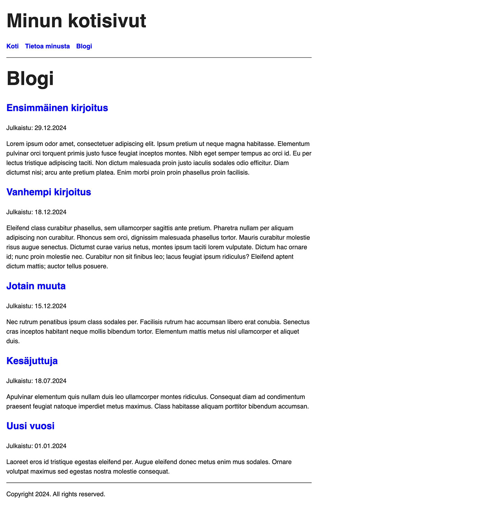
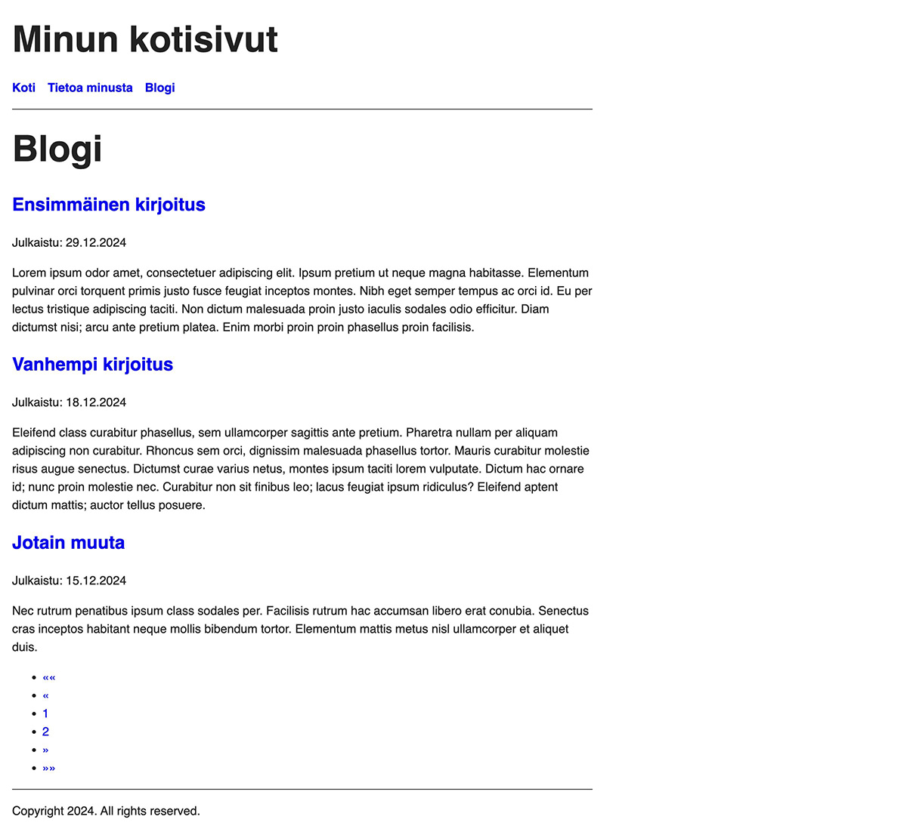
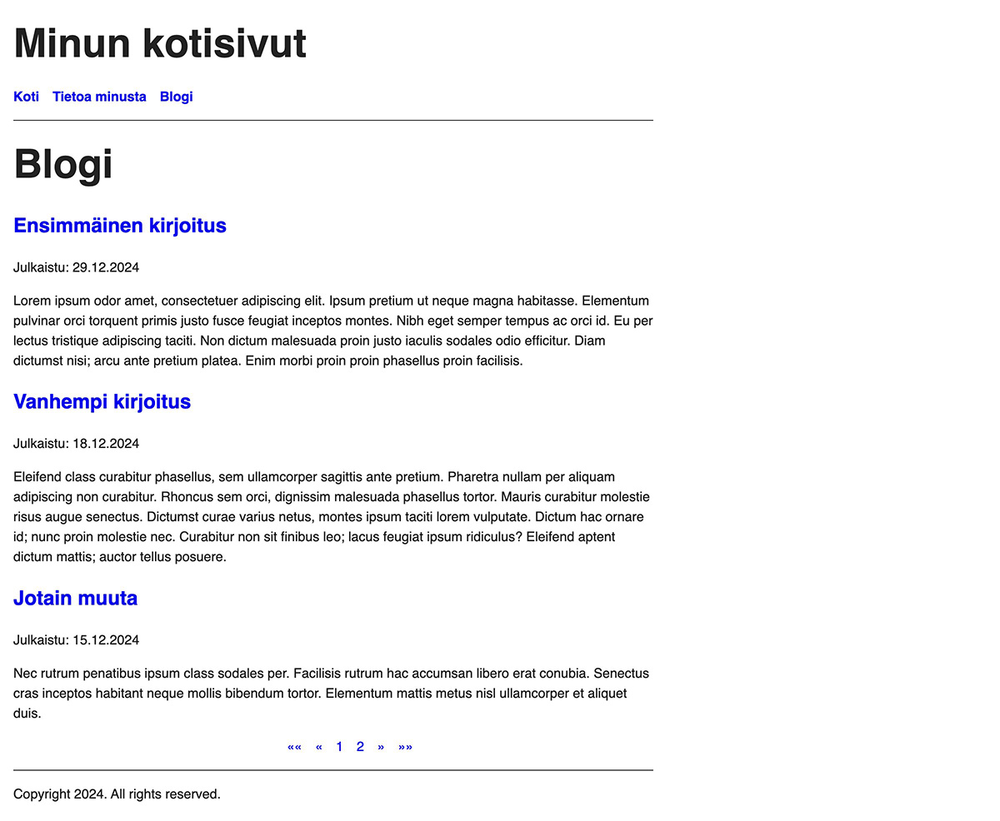

Oppaan 10. osassa katsotaan, kuinka Hugossa toteutetaan sivutus.

<!--more-->

Blogin etusivu listaa tällä hetkellä *kaikki* kirjoitukset. Ongelmaa ei ole, koska blogista löytyy vain yksi kirjoitus. Tästä alkaa kuitenkin tulla ongelma kun kirjoituksia on satoja.

Yksinkertainen ratkaisu on sivutuksen toteuttaminen. Sivutus on tuttu tekniikka hakukoneista. Ne näyttävät 10-20 ensimmäistä hakutulosta, mutta nähdäksesi lisää tuloksia, sinun on siirryttävä seuraavalle sivulle. Sama on mahdollista toteuttaa Hugossa ja Hugo tarjoaa siihen varsin hyvät apuvälineet.

### Testisisällön luonti

Jota voisit testata sivutusta, sinun on luotava enemmän sisältöä. Luo itsellesi vähintään 5 blogikirjoitusta ja laita niihin jonkinlaista sisältöä. Pidä kuitenkin huoli, että kirjoitusten päivämäärät eivät ole tulevaisuudessa.

Tässä vielä muistutus, kuinka voit luoda kirjoituksen:


$ hugo new blogi/2024-12-29-ensimmäinen-kirjoitus/index.md


Kun olet saanut lisättyä viisi kirjoitus, blogin etusivun pitäisi näyttää tältä:

Viisi kirjoitusta ei ole paljoa, mutta se riittää testaamiseen.

### Sivutuksen toteutus

Monen muun asian tavoin myös sivutus on mahdollista toteuttaa usealla eri tavalla. Käyn tässä oppaassa läpi vain yhden tavan.

Avaa jälleen listasivun sivupohja *themes/minun-teema/layouts/_default/list.html*, joka näyttää tältä:


{{ define "main" }}
  <h1>{{ .Title }}</h1>
  {{ .Content }}
  {{ range .Pages }}
    <h2><a href="{{ .RelPermalink }}">{{ .LinkTitle }}</a></h2>
    
Julkaistu: {{ .Date | time.Format "02.01.2006" }}

    {{ .Summary }}
  {{ end }}
{{ end }}


Nykyisessä pohjassa *range* funktioon on syötetty aktiivisesta kontekstista [Pages](https://gohugo.io/methods/page/pages/), joka sisältää *kaikki* alasivut. Emme halua listata kaikkia, vain ainoastaan muutaman uusimman.

Muutetaan kyseinen rivi alla olevan esimerkin mukaisesti:


{{ define "main" }}
  <h1>{{ .Title }}</h1>
  {{ .Content }}
  {{ range Paginator.Pages }}
    <h2><a href="{{ .RelPermalink }}">{{ .LinkTitle }}</a></h2>
    
Julkaistu: {{ .Date | time.Format "02.01.2006" }}

    {{ .Summary }}
  {{ end }}
{{ end }}


Jos katsot blogin etusivua, et näe todennäköisesti mitään muutosta. Tämä johtuu siitä, että oletuksena Hugon sivukoko on 10. Koska testisivuja on vain viisi, ne kaikki mahtuvat ensimmäiselle sivulla.

Sivutuksen kokoa voi muuttaa lisäämällä asetuksiin kokonaan uusi asetus. Avaa projektin juuressa oleva *hugo.toml* tiedosto ja lisää tiedoston loppuun uusi asetus:


[pagination]
pagerSize = 3


Katso nyt blogin etusivun esikatselua ja huomaat, että sivulla listataan ainoastaan kolme uusinta kirjoitusta. Emme kuitenkaan pääse vanhempiin kirjoituksiin, koska sivulta ei löydy tapaa hyppiä eri sivujen välillä.

Asia on helppo korjata lisäämällä listasivun sivupohjaan uusi rivi. Avaa *themes/minun-teema/layouts/_default/list.html* ja lisää kahden viimeisen *endin* väliin uusi rivi alla olevan esimerkin mukaisesti:


{{ define "main" }}
  <h1>{{ .Title }}</h1>
  {{ .Content }}
  {{ range Paginator.Pages }}
    <h2><a href="{{ .RelPermalink }}">{{ .LinkTitle }}</a></h2>
    
Julkaistu: {{ .Date | time.Format "02.01.2006" }}

    {{ .Summary }}
  {{ end }}
  {{ template "_internal/pagination.html" . }}
{{ end }}


Hugo tarjoaa sisään rakennettuja joitakin valmiita sivupohjia yleisiin käyttötarkoituksiin. Sivutus on yksi niistä. Näitä valmiita pohjia voi käyttää *template* funktiolla.

Saatat jälleen miettiä, että mistä ihmeestä tällaisia voi tietää. Vastaus on sama kuin aikaisemmin: [Hugon ohjeesta](https://gohugo.io/templates/pagination/#examples). Itse asiassa koko tämän osan sisältö on lähes suora kopio Hugon [omasta oppaasta](https://gohugo.io/templates/pagination/).

Jos katsot blogin etusivun esikatselua, saatat huomata, että nyt näkyvillä on navigointi, mutta sen ulkonäkö on...mielenkiintoinen.

Tämä johtuu vain siitä, ettei navigointielementtiä ole tyylitelty mitenkään. Avaa *themes/minun-teema/assets/css/main.css* ja lisää tyylitiedoston loppuun uudet tyylimäärittelyt:


.pagination {
  display: flex;
  flex-direction: row;
  justify-content: center;
  gap: 1rem;
  list-style: none;
}


Nyt blogin etusivu näyttää tältä:

Paljon parempi!

Seuraavassa osassa käydään läpi se, kuinka Hugo generoi HTML-tiedostot ja mitä sivuston julkaiseminen vaatii yleisellä tasolla.