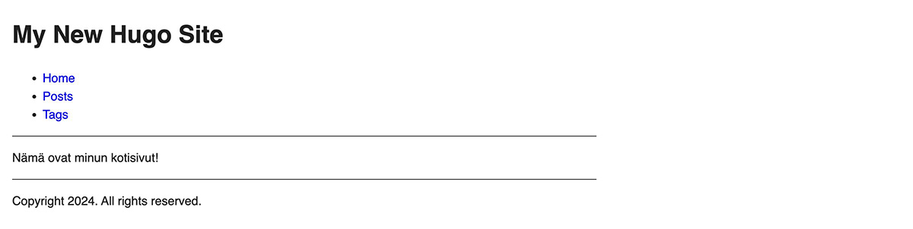
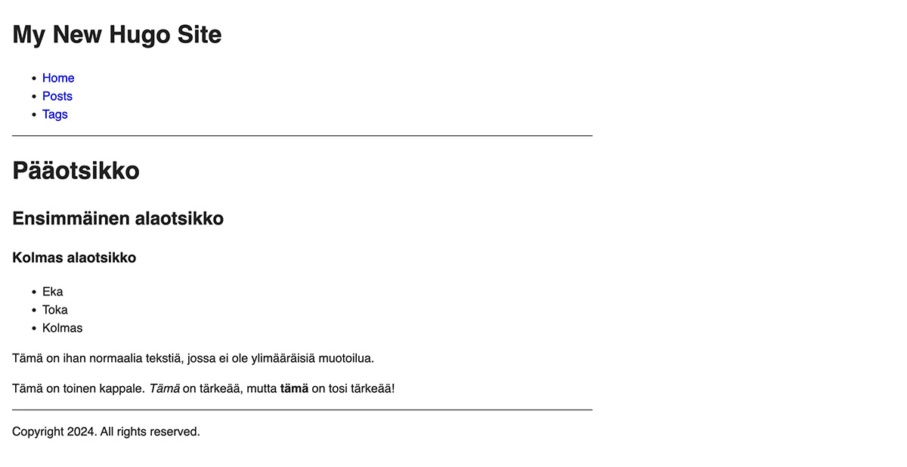

Oppaan toisessa osassa keskitytään sisällön luontiin.

<!--more-->

### Sisällön ja ulkoasun erottaminen toisistaan

Ensimmäisessä osassa Hugo loi projektin juureen läjän hakemistoja. Näistä hakemistoista *content* on tarkoitettu sivujen sisällölle. Kun avasit sivujen esikatselun, sivulla oli sisältöä. Jos katsot oman projektisi *content* hakemistoa, huomaat sen olevan tyhjä. Mistä sisältö tuli?

Ja katsot luomasi teeman hakemistoa, huomaat, että myös siellä on *content* hakemisto, eikä se ole tyhjä. Esikatselun sisältö tuli sieltä.

Hugo mahdollistaa sisällön ja ulkoasun erottamisen toisistaan. Vaikka tämä ei ole pakollista, suosittelen tekemään niin. Silloin voit helposti muuttaa sivun ulkoasua, etkä sotke vahingossa sivujen sisältöä.

### Etusivun luonti

Voit poistaa ensimmäiseksi *themes/minun-teema/content* hakemiston ja kaikki siellä olevat tiedostot. Ne ovat Hugon luomaa esimerkkisisältöä, etkä tarvitse niitä mihinkään. Tämä opas lähtee myös siitä ajatuksesta, että sisältö on kokonaan erillään teemasta.

Seuraavaksi voit luoda kotisivujesi aloitussivun *hugo new content* komennolla:


$ hugo new content _index.md
Content "/Users/tunnus/minun-kotisivut/content/_index.md" created


Hugo loi projektin juuressa olevaan *content* hakemistoon *_index.md* tiedoston. Palaan hieman myöhemmin siihen, miksi tiedosto on juuri tuon niminen.

Avaa juuri luotu tiedosto. Sen pitäisi näyttää jotakuinkin tältä:


+++
date = '2024-12-28T14:57:41+02:00'
draft = true
title = ''
+++


### Sivun metatiedot eli front matter

Kahden *+++* merkin välissä oleva teksti on niin sanottu [front matter](https://gohugo.io/content-management/front-matter/). Se sisältää metatietoa kyseisestä sivusta. Oletuksena Hugo lisää sinne kolme kenttää:

- *date*, jolla määritellään sivun julkaisuaika
- *draft*, jolla määritellään, onko sivu luonnos vai ei
- *title*, jolla määritellään sivun otsikko

Kenttiä on paljon muitakin, mutta pärjäät tässä kohtaa noilla kolmella. Täytä *title* kenttään jotakin ja sen lisäksi voit lisätä tekstiä alemman *+++* kohdan alle. Esimerkiksi:


+++
date = '2024-12-28T14:57:41+02:00'
draft = true
title = 'Etusivu'
+++

Nämä ovat minun kotisivut!


Nyt voit käynnistää Hugon esikatselun samalla tavalla kuin ensimmäisessä osassa:


$ hugo serve


Mikäli avaat Hugon ilmoittaman osoitteen, törmäät todennäköisesti sivuun, jossa ei lue muuta kuin "Page Not Found". Tämä johtuu siitä, että oletuksena Hugo ei näytä sivuja, jotka ovat luonnostilassa, joten projektin etusivua ei Hugon näkökulmasta ole olemassa.

Sammuta Hugo painamalla *Ctrl+C* ja käynnistä se sen jälkeen uudelleen, mutta tällä kertaa lisää mukaan *buildDraft* parametri:


$ hugo serve --buildDrafts


Nyt sivujen pitäisi näyttää tältä:

### Sisällön luonti

Hugo käyttää sisällöissä niin sanottua [markdown](https://www.markdownguide.org/cheat-sheet/)-syntaksia. Sen avulla sisältöön voi määritellä rakenteellisia asioita, kuten otsikoita, listoja, linkkejä sekä kuvia. Siinä ei oteta kantaa ulkonäköön.

Voit testata markdown-syntaksia muuttamalla *_index.md* tiedoston sisältöä esimerkiksi näin:


+++
date = '2024-12-28T14:57:41+02:00'
draft = true
title = ''
+++

# Pääotsikko
## Ensimmäinen alaotsikko
### Kolmas alaotsikko

* Eka
* Toka
* Kolmas

Tämä on ihan normaalia tekstiä, jossa ei ole ylimääräisiä muotoilua.

Tämä on toinen kappale. *Tämä* on tärkeää, mutta **tämä** on tosi tärkeää!


Mikäli sinulla on *hugo serve* komento edelleen ajossa, sivujen pitäisi päivittyä automaattisesti heti kun tallennat muutokset. Sinun ei tarvitse käynnistää Hugoa joka kerta uudelleen. Sivujen pitäisi näyttää nyt tältä:

Esimerkissä määritellään kolme eri tasoista otsikkoa, lista sekä pari kappaletta, joista toisessa on kaksi eri tasoista korostusta. Vaikka selaimessa nämä elementit näyttävät eri näköisiltä, se johtuu vain siitä, että selaimet esittävät nämä elementit oletuksena eri tyyleillä.

Sivulla näkyy myös sisältöä, jota ei löydy *_index.md* tiedostosta. Palaan niihin oppaan seuraavassa osassa. Sitä ennen on kuitenkin hyvä ymmärtää, miksi tiedosto nimenä on nimenomaan *_index.md*.

### Tiedostonimet

*Content* hakemistossa on periaatteessa kahden tyyppistä sisältöä, mutta toinen näistä voidaan toteuttaa kahdella eri tavalla, joten vaihtoehtoja on kolme.

*_index.md* on erityinen siksi, että Hugo luokittelee sen eräänlaiseksi etusivuksi. Kun loit kyseisen tiedoston *content* hakemiston juureen, siitä tuli käytännössä kotisivujen etusivu. Hugon oletus on, että tällaiset sivut sisältävät alasivuja.

Luo nyt toinen tiedosto, mutta nimeä se esimerkiksi *tietoa-minusta.md*:


$ hugo new content tietoa-minusta.md


Jos katsot Hugon esikatselua, huomaat, että sivuille on ilmestynyt *Tietoa Minusta*-linkki. Hugo tunnisti luomasi tiedoston ja ymmärsi, että se on alasivu. Se osasi myös listata sen ilman, että sinun tarvitsi tehdä mitään.

Klikkaa linkkiä ja näet, että osoitteena on nyt http://localhost:1313/tietoa-minusta/.

Mikäli nimeät sisältötiedoston joksikin muuksi kuin *_index.md*, siitä tulee automaattisesti sisältösivu. Hugon näkökulmasta se on itsenäinen sivu, joka ei sisällä alasivuja.

Tiedoston nimi määrittelee myös sen, mikä sivun osoitteeksi tulee. Tässä tapauksessa tiedoston nimi on *tietoa-minusta.md*, joten myös osoitteen polku on */tietoa-minusta/*.

Itsenäisiä sivuja voi tehdä myös toisella tavalla. Luo vielä toinen alasivu, mutta anna sen nimeksi nyt *yhteystiedot/index.md*:


$ hugo new content yhteystiedot/index.md


Esikatselusta huomaat, että etusivulle ilmestyi uusi alasivu, *Yhteystiedot*. Jos klikkaat linkkiä, sen polku toimii ihan samalla tavalla, kuin tietoa minusta -sivulla. Erona on kuitenkin se, että tälle sivulle luotiin kokonaan oma hakemisto.

Nämä ovat niin sanottuja [page bundleja](https://gohugo.io/content-management/page-bundles/). Page bundlet ovat sivuja, joihin liittyy muitakin resursseja, kuten kuvia. Voit järjestellä sisällöt selkeämmin, kun kaikki yhteen alasivuun liittyvät resurssit löytyvät yhdestä hakemistosta.

Yksinkertaistettuna voit ajatella, että jos sivu sisältää pelkkää tekstiä, sinulle riittää todennäköisesti yksittäinen md-tiedosto. Mikäli sivu on monimutkaisempi, hyödyntää kuvia ja muita resursseja, on page bundle todennäköisesti fiksumpi vaihtoehto.

Palaan resurssien käyttöön oppaan myöhemmässä osassa. Seuraavassa osassa pureudutaan Hugon asetustiedostoon ja käydään läpi, mistä esikatselussa näkyvä valikko, sekä pääotsikko tulevat.