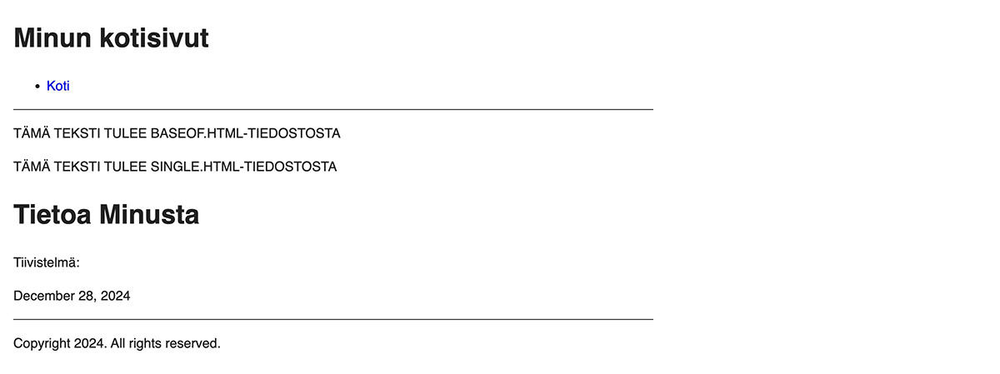

Oppaan neljännessä osassa pureudutaan sivupohjiin, jotka määrittelevät, miltä sivusto näyttää ja kuinka sisällöt esitetään.

<!--more-->

Tässä kohtaa oletan, että sinulla on perusymmärrys HTML-kielestä ja ymmärrät, mitä HTML-tagit ovat. Mikäli et ole koskaan ohjelmoinut, sivupohjat voivat ensialkuun tuntua hämmentäviltä. Ei kannata kuitenkaan huolestua, sillä käymme ne läpi vaihe vaiheelta.

### Sivupohjien sijainti

Teemat määritellään teeman alla *themes/minun-teema/layouts* hakemistossa. Saatoit huomata, että myös projektin juuressa on *layouts*-hakemisto. Aivan kuten sisällöt ja asetukset, myös sivupohjat voi määrittää sekä suoraan projektiin, että teemaan.

Haluan pitää edelleen kiinni siitä, että sivun ulkoasu on erotettu sisällöstä, joten oppaassa määrittelemme ne teeman alle.

Teeman alla olevassa *layouts* hakemistossa on kaksi alihakemistoa: *_default* sekä *partials*.

*_default* hakemistosta löytyy sivupohjat kolmelle eri tyyppiselle sivulle - niistä kohta lisää. Lisäksi siellä on neljäntenä eräänlainen peruspohja, joka toimii kaikkien muiden pohjien äitinä.

*partials* hakemisto on tarkoitettu pienemmille pohjille, jotka toimivat sivujen osana. Näitä voi ajatella pienempinä komponentteja, joita voidaan käyttää muiden pohjien sisällä.

Sivupohjat voi nähdä puurakenteena. Hugo aloittaa yhdestä pohjasta, joka kutsuu muita pohjia, jotka kutsuvan edelleen pienempiä partials-pohjia. Alla oleva kuva ei välttämättä vielä tässä kohtaa aukea kokonaan, mutta toivottavasti se selkiyttää kokonaiskuvaa viimeistään sitten, kun olet päässyt tämän osan loppuun.

### Sivupohjien tyypit
Jos katsot *themes/minun-teema/layouts/_default* hakemistoa, näet siellä neljä *html*-tiedostoa:
- *baseof.html*, joka on kaikkien sivupohjien äiti
- *home.html*, joka toimii etusivun sivupohjana
- *single.html*, joka toimii yksittäisten sivujen sivupohjana
- *list.html*, joka toimii listasivujen sivupohjana

*baseof.html* on sivupohja, josta Hugo alkaa rakentaa sivun ulkoasua. Se lukee sen ensimmäisenä. Jos avaat tiedoston, se näyttää tältä:


<!DOCTYPE html>
<html lang="{{ site.Language.LanguageCode }}" dir="{{ or site.Language.LanguageDirection `ltr` }}">
<head>
  {{ partial "head.html" . }}
</head>
<body>
  <header>
    {{ partial "header.html" . }}
  </header>
  <main>
    {{ block "main" . }}{{ end }}
  </main>
  <footer>
    {{ partial "footer.html" . }}
  </footer>
</body>
</html>


Tämä sivupohja määrittää käytännössä HTML-dokumentin perusrungon. Se on isolta osin normaalia HTML:ää, mutta joukossa on myös joitakin kryptisen näköisiä rivejä. Palaamme niihin hieman myöhemmin. Tässä kohtaa riittää, jos ymmärrät, että tämä on kotisivujesi perusrunko, josta Hugo aloittaa hommat.

Avaa seuraavaksi *home.html* tiedosto:


{{ define "main" }}
  {{ .Content }}
  {{ range site.RegularPages }}
    <h2><a href="{{ .RelPermalink }}">{{ .LinkTitle }}</a></h2>
    {{ .Summary }}
  {{ end }}
{{ end }}


Täällä ei juurikaan HTML:ää näy, mutta se toimii aivan samalla tavalla kuin *baseof.html*. Hugo lukee tämän tiedoston ja rakentaa sen ohjeiden mukaan lopullisen HTML-dokumentin. Oleellista on ymmärtää, että *home.html* määrittelee kotisivujen **etusivun** ulkonäön.

Hakemistossa on vielä kaksi muuta tiedostoa: *single.html* sekä *list.html*. Näistä ensimmäinen määrittää **yksittäisen** sivun ulkonäön. Esimerkiksi aikaisemmin tehty tietoa minusta -sivu oli tällainen.

Vastaavasti *list.html* määrittelee **listasivujen** ulkonäön. Käytännössä etusivukin on sellainen, mutta se on pieni poikkeus, koska sillä on oma sivupohja.

Kuvittele esimerkiksi tilanne, jossa sinulla on blogi. Blogin pääsivulla haluat listata viisi viimeisintä blogikirjoitusta. Blogisivu olisi listasivu ja käyttäisi *list.html*-sivupohjaa.

Näiden lisäksi Hugo mahdollistaa myös sen, että pystyt luomaan itse uusia sivutyyppejä. Emme kuitenkaan mene siihen tässä oppaassa.

Käydään seuraavaksi läpi joitakin kryptisiä kohtia, joita sivupohjissa vilahteli.

### Lohkot
Hugo on toteutettu [Go-ohjelmointikielellä](https://go.dev) ja se käyttää myös Go:n syntaksia sivupohjissa. Käytännössä ne ovat normaalia HTML:ää, mutta HTML:n joukkoon on mahdollista laittaa myös hieman koodia. Koodin tunnistaa siitä, että se alkaa ja päättyy kaarisulkeisiin.

Otetaan esimerkiksi *single.html* tiedosto:


{{ define "main" }}
  <h1>{{ .Title }}</h1>
  {{ $dateMachine := .Date | time.Format "2006-01-02T15:04:05-07:00" }}
  {{ $dateHuman := .Date | time.Format ":date_long" }}
  <time datetime="{{ $dateMachine }}">{{ $dateHuman }}</time>
  {{ .Content }}
  {{ partial "terms.html" (dict "taxonomy" "tags" "page" .) }}
{{ end }}


Sinun ei tarvitse ymmärtää, mitä jokainen rivi tekee, mutta käydään kaksi keskeistä kohtaa läpi.

Ensimmäisenä on sivupohjan ensimmäinen ja viimeinen rivi: 

{{ define "main" }}
...
{{ end }}


Sivupohjat voivat määritellä useita eri **lohkoja** (block). Se tapahtuu *define* avainsanalla, jonka perässä on lohkon nimi. Tässä tapauksessa lohkoja on vain yksi ja sen nimi on *main*. Nimellä ei ole mitään erityistä merkitystä, sen voi valita itse. Main on vain nimi, joka on valittu Hugon oletuspohjaan.

Lohko alkaa *define* avainsanalla ja se jatkuu niin pitkään, kunnes vastaan tulee *end* avainsana. Tässä tapauksessa se on tiedoston lopussa.

Toisin sanoen, *single.html* ei tee muuta, kuin määrittelee yhden lohkon, jonka nimi on *main*. Palaan hieman myöhemmin siihen, kuinka lohkoja käytetään.

### Sisällön esittäminen

Jotta sivupohjista olisi mitään hyötyä, niiden on kyettävä esittämään *content* hakemistossa olevien sisältötiedostojen sisältöä.

Go:n syntaksissa tämä tapahtuu kahdella **aaltosulkeella** ({}). *single.html* sivupohjasta löydät kaksi esimerkkiä:


{{ .Title }}
...
{{ .Content }}


Jos sinulla on sisältö, jonka otsikkona on "Kikkeliskokkelis", yllä olevassa esimerkissä *{{ .Title }}* tullaan korvaamaan sanalla *"Kikkeliskokkelis"*. Jos saman sivun sisältö muodostaa 300 sivuisen romaanin, *{{ .Content }}* tullaan korvaamaan kyseisellä romaanilla. Nämä sisällöt tulevat *content* hakemistossa olevista md-päätteisistä tiedostoista, joita muokkasit aikaisemmassa osassa.

Muut sivupohjan rivit voit tässä kohtaa unohtaa.

### Toisiaan kutsuvat sivupohjat

Hugo mahdollistaa sen, että sivupohjat voidaan pilkkoa pieniin kokonaisuuksiin. Tästä on suuri hyöty silloin, kun sivujen rakenne on monimutkainen, tai sivusto kostuu tuhansista alasivuista.

Kuvitellaan esimerkiksi yrityssivua, jossa on tuhansien tuotteiden tuotekatalogi. Eri tuotteista voidaan näyttää hieman erilaisia tietoja, mutta jokaisesta tuotteesta on kuva. Tästä kuvaelementistä voidaan tehdä oma pieni sivupohja, jota varsinaisen tuotteen sivupohja käyttää hyväksi.

Voit ajatella sitä niin, että tuotesivun sivupohja toteaa: "Tiedän, että tähän tulee kuva, mutta en tiedä kuinka se esitetään. Pyydän sitä sivupohjalta, joka osaa sen tehdä." Sen jälkeen se pyytää toista sivupohjaa hoitamaan kuvan esittämisen.

Tämä pyyntö voidaan tehdä kahdella tavalla. Molemmat tavat on nähtävissä *baseof.html*  tiedostossa, joten avaa se esille. Alla olevasta esimerkistä on poistettu epäoleellisia rivejä:


<body>
  <header>
    {{ partial "header.html" . }}
  </header>
  <main>
    {{ block "main" . }}{{ end }}
  </main>
</body>


Ensimmäinen tapa on käyttää *partial* avainsanaa. Kaikessa yksinkertaisuudessaan sen avulla voidaan ladata *partials* alihakemistossa oleva tiedosto. Yllä olevassa esimerkissä ladataan *header.html* tiedosto. Älä väliä sen perässä olevasta pisteestä vielä tässä kohtaa.

Voit ajatella, että *header* tagien väliin tulee kaikki se sisältö, mitä *header.html* tiedostoon on kirjoitettu.

Toinen tapa on käyttää *block* avainsanaa. Se toimii isolta osin samalla tavalla, mutta on hieman monipuolisempi. Tästä syystä se on myös päätettävä *end* avainsanalla.

Block ei pyydä sisältöä määritellystä tiedostosta, vaan se pyytä tiettyä *lohkoa*. Jos muistat, lohko määriteltiin *single.html* tiedostossa. Hugo on sillä tavalla fiksu, että se tietää, mistä tiedostosta se lähtee lohkoa etsimään. Sinun tarvitsee vain kertoa, minkä nimistä lohkoa olet vailla.

Molemmissa tapauksissa sisältö haetaan toisesta tiedostosta. Näiden kahden erona on se, että käytettäessä *partial* avainsanaa, sisältö näkyy aina samalla tavalla riippumatta siitä, minkälaista sivua ollaan tekemässä. Esimerkiksi *baseof.html* tiedosto käyttää *partial* avainsanaa sivun head-osiossa, koska se on aina samanlainen. Sen sijaan se käyttää *block* avainsanaa main-osiossa, koska tämä voi olla eri näköinen riippuen siitä, ollaanko etusivulla, yksittäisellä alasivulla vai listasivulla.

Huomio myös, että sivupohjat voivat muodostaa ketjuja. Yllä olevassa esimerkissä sisältö haetaan *header.html* tiedostosta, mutta jos avaat kyseisen tiedoston (*themes/minun-teema/layouts/partials/header.html*), huomaat, että myös sieltä löytyy *partial* avainsana. Tällä kertaa sisältö tuleekin *menu.html* tiedostosta. Tämän osan alussa oleva diagrammi voi auttaa hahmottamaan näitä ketjuja.

Tämä voi aluksi tuntua tarpeettomalta monimutkaistamiselta. Tämä asioiden pilkkominen pieniin osiin helpottaa kuitenkin ylläpitoa tuntuvasti, kun sivujen rakenne monimutkaistuu.

### Harjoitus

Jotta edellä olevat asiat muuttuisivat hieman konkreettisemmaksi, tehdään sivupohjiin pieniä muutoksia.

Avaa ensiksi *single.html* ja lisää sen alkuun *define* rivin jälkeen tekstiä. Esimerkiksi:


{{ define "main" }}
  
TÄMÄ TEKSTI TULEE SINGLE.HTML-TIEDOSTOSTA

  <h1>{{ .Title }}</h1>
  ...
{{ end }}


Avaa seuraavaksi *baseof.html* ja lisää sinne ennen *block* avainsanaa vastaavanlainen rivi:


<!DOCTYPE html>
...
  <main>
    
TÄMÄ TEKSTI TULEE BASEOF.HTML-TIEDOSTOSTA

    {{ block "main" . }}{{ end }}
  </main>
...
</html>


Tallenna muutokset ja avaa esikatselu. Etusivun pitäisi näyttää nyt tältä:

Kuten huomaat, *baseof.html* tiedostoon tehty muutos on näkyvissä. Tarkasta myös kaksi alasivua. Muutos näkyy myös niissä. Miksi?

Siksi, että Hugo aloittaa sivujen generoinnin *baseof.html* tiedostosta, kaikkien sivupohjien äidistä. Tästä syystä siihen tehdyt muutokset vaikuttavat kaikkiin sivuihin.

Saatoit myös huomata, että *single.html* sivupohjaan tehdyt muutokset eivät näy etusivulla, mutta ne näkyivät kahdella alasivulla. Miksi?

Siksi, että etusivulle on olemassa oma sivupohja (*home.html*), johon et koskenut. Sen sijaan kaksi muuta alasivua käyttävät *single.html* tiedostoa, johon teit muutoksen.

Avaa vielä esikatseluun tietoa minusta -sivu. Sen pitäisi näyttää tältä:

Tämä toimii esimerkkinä siitä, kuinka sivupohjat kutsuvat toisiaan. Koska lisäsit uuden rivin *baseof.html* tiedostossa ennen *block* avainsanaa, se näkyy sivulla ylimmäisenä. *baseof.html* pyytää jotain toista sivupohjaa tarjoamaan *main* lohkon.

Tämän jälkeen *single.html* hyppää peliin mukaan ja tarjoaa oman *main* lohkonsa.

Tehdään vielä yksi pieni muutos. Avaa *single.html*. Lisää *{{ .Title }}* rivin jälkeen toinen rivi alla olevan esimerkin mukaisesti:


{{ define "main" }}
  
TÄMÄ TEKSTI TULEE SINGLE.HTML-TIEDOSTOSTA

  <h1>{{ .Title }}</h1>
  
Tiivistelmä: {{ .Summary }}

  ...
{{ end }}


Tietoa minusta -sivun pitäisi nyt näyttää tältä:

Sivulle ilmestyi *Tiivistelmä:*, mutta sen perässä ei lue mitään. Tämä johtuu siitä, että sivupohja pyytää sivun tiivistelmää, mutta sellaista ei ole sivulle määriteltynä. Lisätään se!

Avaa *content/tietoa-minusta.md* ja lisää tiedoston alussa olevaan front matteriin uusi *summary*-kenttä:


+++
date = '2024-12-28T15:35:00+02:00'
draft = true
title = 'Tietoa Minusta'
summary = 'Tällä sivulla kerron itsestäni'
+++


Nyt tietoa minusta -sivu näyttää tältä:

Tämä toimii esimerkkinä siitä, kuinka sivupohjat pyytävät sisältöä varsinaisilta sisältötiedostoilta. Samalla opit, kuinka sivulla voidaan määritellä erillinen tiivistelmä.

Seuraavassa osassa selvitetään, mikä sivupohjissa toistuva mystinen piste on.

**Päivitys 30.12.2024**: Lisäsin diagrammin selventämään sivupohjien hierarkiaa ja lisäsin myös tekstiin joitakin tarkennuksia