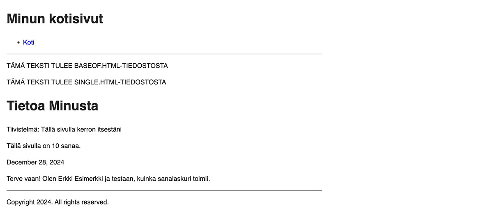

Tässä osassa käydään läpi konteksti, joka lienee Hugon vaikeimpia konsepteja ymmärtää.

<!--more-->

### Mikä on konteksti?

Jotta sivupohjat voisivat esittää sivujen sisällön, niiden on päästävä siihen jotenkin käsiksi. Edellisen osan lopussa lisäsit sivupohjaan *{{ .Summary }}* rivin, jolla sait sivun tiivistelmän näkyviin. Esitin toiminnan niin, että sivupohja "hakee" tiivistelmän md-tiedostosta. Todellisuudessa Hugo ei kuitenkaan toimi aivan näin.

Sivupohjat eivät voi mielivaltaisesti pyydellä mitä sattuu tietoja. Niiden tarvitsema tieto on paketoitu yhteen paikkaan. Tämä paikka on nimeltään *konteksti*.

Kontekstin sisältö vaihtuu sen mukaan, mitä millaista sivua tai sivun osaa Hugo on käsittelemässä. Esimerkiksi yksittäisen alasivun kohdalla kontekstissa voi olla kyseisen sivun otsikot, tiivistelmät ja tekstisisällöt, mutta ei minkäänlaista tietoa muista sivuista. Jos taas kyse on listasivusta, se voi sisältää kaikki aikaisemmat tiedot, mutta myös tietoa listaan kuuluvista alasivuista.

Kontekstista löytyy sellaisiakin tietoja, jotka eivät liity mihinkään yksittäiseen sivuun. Sieltä löytyy esimerkiksi asetustiedostossa asettamasi sivuston otsikko sekä kieli.

Voit ajatella kontekstia eräänlaisena puuna, jossa on oksia, jotka haarautuvat pienemmiksi oksiksi. Lopulta pienempien oksien päästä kasvaa lehtiä. Yksinkertaistettuna se voisi näyttää tältä:


|
|-- Asetukset (aina saatavilla)
|    |-- Sivuston otsikko
|    |-- Sivuston kieli
|
|-- Listasivu (.)
|    |-- Listasivun otsikko
|    |-- Listasivun sisältö
|    |-- Alasivu 1
|    |     |-- Alasivun otsikko
|    |     |-- Alasivun tiivistelmä
|    |     |-- Alasivun sisältö
|    |-- Alasivu 2
|          |-- Alasivun otsikko
...


Hugon manuaali kutsuu näitä haaroja *objekteiksi*. Tämä on hyvä muistaa, jos satut pläräämään [Hugon manuaalia](https://gohugo.io/documentation/). Objekteja on eri tyyppisiä ja ne sisältävät eri tyyppistä tietoa. Iso kysymys on tietenkin se, että mitä milloinkin on saatavilla?

Ikävä kyllä tähän ainut vastaus on, että se on katsottava [manuaalista](https://gohugo.io/methods/). Olen käyttänyt Hugoa lähes vuoden, mutta en tiedä suurinta osaa tiedoista, joita kontekstissa on tarjolla. Onneksi kaikkea ei tarvitsekaan tietää. Perusasioilla pääsee pitkälle.

### Kuinka aktiivista kontekstia käytetään

Aikaisemmassa osassa sivupohja esitti sivun otsikon näin: *{{ .Title }}*. Vastaavasti sivun tiivistelmä esitettiin näin: *{{ .Summary }}*.

Kun komento alkaa pisteellä, se tarkoittaa, että tietoa haetaan *aktiivisesta kontekstista*. Aktiivisella kontekstilla tarkoitetaan juuri sillä hetkellä käsittelyssä olevan sivun tarjoamaa kontekstia.

Oletetaan, että Hugo on käsittelemässä tietoa minusta -sivua. Kyseessä on yksittäinen sivu, jolloin aktiivisen kontekstin tyyppi on [Page](https://gohugo.io/methods/page/). Tiedän tämän, koska olen ehtinyt käyttää Hugoa ja tutustunut sen ohjeisiin.

Jos avaat edellisen linkin, näet kaikki tiedot, mitä Page-objektilla on tarjolla. Löydät sieltä myös aikaisemmin käytetyt *Title* ja *Summary* kentät. Tehdään pieni testi, ja lisätään sivupohjaan kohta, joka kertoo, kuinka monta sanaa sivulla on. Hyödynnämme siinä *WordCount* kenttää, jonka löydät samalta sivulta.

Avaa ensiksi *content/tietoa-minusta.md* ja lisää sinne jotakin sisältöä. Esimerkiksi:


+++
date = '2024-12-28T15:35:00+02:00'
draft = true
title = 'Tietoa Minusta'
summary = 'Tällä sivulla kerron itsestäni'
+++

Terve vaan! Olen Erkki Esimerkki ja testaan, kuinka sanalaskuri toimii.


Avaa seuraavaksi *themes/minun-teema/layouts/_default/single.html* ja lisää sinne uusi rivi, joka hakee aktiivisesta kontekstista *WordCount* kentän. Esimerkiksi:


{{ define "main" }}
  
TÄMÄ TEKSTI TULEE SINGLE.HTML-TIEDOSTOSTA

  <h1>{{ .Title }}</h1>
  
Tiivistelmä: {{ .Summary }}

  
Tällä sivulla on {{ .WordCount }} sanaa.

  ...
{{ end }}


Avaa seuraavaksi tietoa minusta -sivu esikatseluun. Sen pitäisi näyttää tältä:

### Kontekstin välittäminen sivupohjien välillä

Aikaisemmissa osissa aktiivisesta kontekstista kertova piste on vilahdellut myös muissa yhteyksissä. Avaa jälleen *baseof.html* tiedosto. Huomaat, että jokaisen *partial* ja *block* kutsun perässä on piste:


...
  <header>
    {{ partial "header.html" . }}
  </header>
  <main>
    
TÄMÄ TEKSTI TULEE BASEOF.HTML-TIEDOSTOSTA

    {{ block "main" . }}{{ end }}
  </main>
  <footer>
    {{ partial "footer.html" . }}
  </footer>
</body>
</html>


Tämä tarkoittaa vain sitä, että kun sivupohja pyytää sisältöä toiselta sivupohjalta, se antaa sen käyttöön oman aktiivisen kontekstin. Esimerkiksi yllä olevassa pohjassa *header.html* saa käyttöönsä tismalleen saman kontekstin, joka *baseof.html* tiedostolla on käytössä.

Näin ei kuitenkaan aina tarvitse olla. Sivupohja voi välittää kontekstista vain tietyn osan, esimerkiksi:


{{ partial "header.html" .Title }}


Yllä olevassa esimerkissä *header.html* saisi käyttöönsä pelkästään aktiivisesta kontekstista löytyvän *Title* kentän, eli sivun otsikon. Älä kuitenkaan tee esimerkin muutosta, sillä *header.html* vaatii toimiakseen koko kontekstin.

### Kontekstit silmukoissa

Emme ole vielä käsitelleet silmukoita, joten hoidetaan se ensiksi alta pois.

Jos muistat, tällä hetkellä etusivulla listataan kaikki alasivut. Juuri nyt niitä on vain kaksi, mutta niitä voisi olla enemmänkin, jopa satoja.

Avaa etusivun ulkoasusta vastaava sivupohja *home.html* niin näet, kuinka se on toteutettu. Olen poiminut alle oleelliset kohdat sivupohjasta:


{{ range site.RegularPages }}
  <h2><a href="{{ .RelPermalink }}">{{ .LinkTitle }}</a></h2>
  {{ .Summary }}
{{ end }}


Ensimmäisenä vastassa on uusi avainsana *range*. Mikäli sinulla on lista asioita, esimerkiksi lista alasivuja, rangen avulla voit käydä ne yksi kerrallaan läpi. Nämä ovat silmukoita, eli englanniksi *loop*.

Avainsanan perässä on *site.RegularPages*. [Site](https://gohugo.io/methods/site/) on esimerkki globaalista objektista. Se pitää sisällään koko sivustoon liittyvää tietoa. Jos kurkkaat edellä olevaa linkkiä, löydät sivulta kuvauksen siitä, mitä *RegularPages* pitää sisällään: "Returns a collection of all regular pages."

Globaalista objektista voidaan hakea tietoa aivan samalla tavalla kuin aktiivisesta kontekstista, mutta silloin kutsua ei aloiteta pisteellä.

Käytännössä sivupohja siis hakee *Site*-tyyppisestä *globaalista objektista* kaikki normaalit alasivut. Nämä sivut annetaan *rangelle*, joka alkaa käydä niitä yksi kerrallaan läpi.

Aivan kuten *define* ja *block* avainsanat, myös *range* vaatii, että se päätetään *end* avainsanalla. Kaikki rangen ja endin välissä olevat asiat toteutuvat jokaiselle listan elementille. Yllä olevassa esimerkissä sivupohja näyttää jokaisesta alasivusta otsikon sekä tiivistelmän.

Mutta hetkinen, rangen sisällä olevissa kutsuissa näkyy pisteitä, mikä viittaa siihen, että siellä haetaan asioita aktiivisesta kontekstista. Eikö jokaisen listan jokaiseen kohtaan pitäisi tulla etusivun otsikko ja tiivistelmä, sillä sehän on aktiivinen konteksti?

Ei, ja tämän kanssa on oltava tarkkana. Tietyt asiat Hugossa luovat väliaikaisen aktiivisen kontekstin. *Range* kuuluu tähän kategoriaan. Kun Hugo alkaa käydä läpi jokaista alasivua, silmukan sisällä aktiiviisena kontekstina on aina käsittelyssä oleva listaelementti. Tämä mahdollistaa sen, että voimme ylipäätään listata jokaisen alasivun otsikon.

Kun Hugo saa kaikki elementit käytyä läpi ja ohittaa rangen päättävän *end* avainsanan, aktiivinen konteksti palautuu normaaliksi. Esimerkin tapauksessa se olisi sivuston etusivu.

Konteksti voi olla vaikea asia ymmärtää ja vaatia testailua, ennen kuin sen sisäistää kunnolla. Mikäli olet selviytynyt tänne asti, onneksi olkoon! Olet päässyt todennäköisesti pahimman vaiheen yli!

Seuraavassa osassa tutustutaan muuttujiin ja funktioihin.

