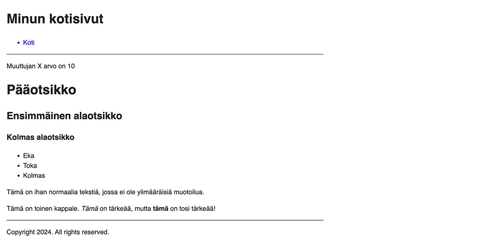
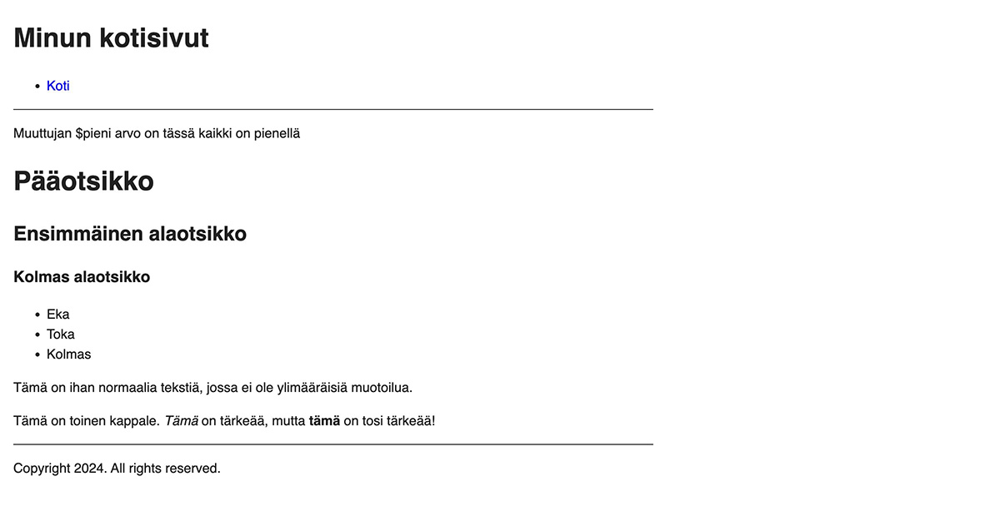
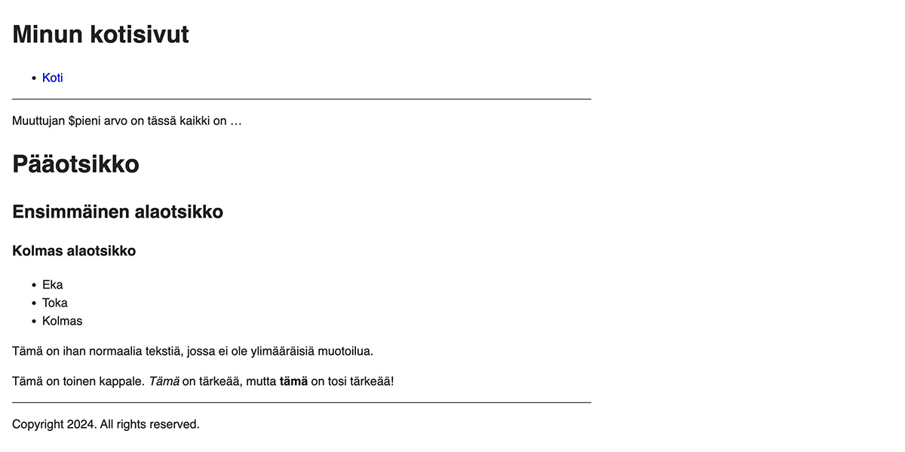

Tässä osassa tutustutaan muuttujiin ja funktioihin.

<!--more-->

### Sivupohjien siistiminen

Tähän mennessä kaikki sisältö on ollut lähinnä satunnaista testailua. Tiedämme Hugosta sen verran, että voimme muokata sivupohjia sekä sivujen sisältöjä niin, että ne muistuttavat enemmän oikeaa kotisivua. Rumaa kotisivua.

Poistetaan ensiksi *baseof.html* sivupohjasta ylimääräiset kommentit, jotka lisäsimme sinne aikaisemmin. Varmista, että sivupohja näyttää tältä:


<!DOCTYPE html>
<html lang="{{ site.Language.LanguageCode }}" dir="{{ or site.Language.LanguageDirection `ltr` }}">
<head>
  {{ partial "head.html" . }}
</head>
<body>
  <header>
    {{ partial "header.html" . }}
  </header>
  <main>
    {{ block "main" . }}{{ end }}
  </main>
  <footer>
    {{ partial "footer.html" . }}
  </footer>
</body>
</html>


Avaa seuraavaksi etusivusta vastaava sivupohja *home.html*. Kaikkien alasivujen listaaminen tuntuu hieman hölmöltä, joten poista kaikki muu, paitsi sisällön näyttäminen. Pohjan pitäisi näyttää tältä:


{{ define "main" }}
  {{ .Content }}
{{ end }}


Siivotaan vielä lopuksi yksittäisten sivujen sivupohja, joten avaa *single.html* ja poista sieltä turha sotku, jonka lisäsimme aikaisemmin. Pohjan lopussa on myös *partial* kutsu, mitä ei loppujen lopuksi tarvita, joten poistetaan sekin. Lopputulos näyttää tältä:


{{ define "main" }}
  <h1>{{ .Title }}</h1>
  {{ $dateMachine := .Date | time.Format "2006-01-02T15:04:05-07:00" }}
  {{ $dateHuman := .Date | time.Format ":date_long" }}
  <time datetime="{{ $dateMachine }}">{{ $dateHuman }}</time>
  {{ .Content }}
{{ end }}


Tässä pohjassa on edelleen asioita, jotka voivat näyttävät vieraalta, joten tsekataan, mitä ne ovat.

### Muuttujat

Muuttujat pitävät sisällään jonkin arvon, kuten matematiikassa.

Jos näet ensin *X = 5* ja sen jälkeen *X + X = ?*, osaat luultavasti päätellä, että vastaus on *10*. X on muuttuja, joka pitää sisällään arvon 5.

Voit käyttää muuttujia myös sivupohjissa. Esimerkiksi:

  {{ $x := 10 }}


Kun muuttujia käsitellään sivupohjissa, niiden nimen alussa on oltava *$*. Muuttujan arvo asetetaan *:=* merkeillä.

Jos haluaisit näyttää sivulla luvun *10*, voisit lisätä sivupohjaan *{{ $x }}*. Itse asiassa, tehdään niin. Lisää etusivun sivupohjaan *home.html* muuttujan alustus ja sen tulostus:


{{ define "main" }}
  {{ $x := 10 }}
  
Muuttujan X arvo on {{ $x }}

  {{ .Content }}
{{ end }}


Etusivun esikatselusta näet, että rivi, jossa muuttuja alustetaan, ei näy sivulla mitenkään. Se on sivupohjassa oleva rivi, joka suorittaa koodia, mutta ei tulosta mitään. Sen sijaan *{{ $x }}* näkyy myös sivulla.

Muuttujien käyttö tällaisenaan on kuitenkin varsin hyödytöntä. Poista *home.html* sivupohjasta kaksi lisäämäsi riviä, tallenna muutokset ja palaa sen jälkeen *single.html* sivupohjaan.

Nyt tiedät, että alla olevat kaksi riviä alustavat kaksi muuttujaa, *$dateMachine* sekä *$dateHuman*, mutta mitä ihmettä niiden arvoksi asetetaan?


{{ $dateMachine := .Date | time.Format "2006-01-02T15:04:05-07:00" }}
{{ $dateHuman := .Date | time.Format ":date_long" }}


### Funktiot

Tässä tarvitsee tietää, mitä funktiot ovat. Funktiot ottavat vastaan yleensä yhden tai useamman arvon, tekevät niille jotain, ja pulauttavan sen jälkeen ulos lopputuloksen. Tehdään taas esimerkki. Avaa jälleen etusivun sivupohja *home.html* ja lisää sinne kaksi uutta riviä.


{{ define "main" }}
  {{ $pieni := strings.ToLower "TäSSä Kaikki On pieNELLÄ" }}
  
Muuttujan $pieni arvo on {{ $pieni }}

  {{ .Content }}
{{ end }}


Jos avaat etusivun esikatselun, se näyttää tältä:

Kuten huomaat, muuttujan arvo ei ole aivan sitä, mitä alustukseen kirjoitit. Kaikki isot kirjaimet ovat muuttuneet pieniksi.

Alustuksessa käytit [strings.ToLower](https://gohugo.io/functions/strings/tolower/) funktiota. Se ottaa sisään jonkin merkkijonon, muuttaa kaikki siinä olevat kirjaimet pieneksi, ja palauttaa sen jälkeen lopputuloksen.

Funktioita voidaan käyttää myös toisella tavalla. Muuta sivupohjaa näin:


{{ define "main" }}
  {{ $pieni := "TäSSä Kaikki On pieNELLÄ" | strings.ToLower }}
  
Muuttujan $pieni arvo on {{ $pieni }}

  {{ .Content }}
{{ end }}


Katso etusivun esikatselua ja huomaat, että mikään ei ole muuttunut. Tässä käytetään ketjutusta.

Ensin määritellään syöte ja sen jälkeen se viskataan funktiolle *|* merkillä. Tämä on kätevää silloin, kun haluat ketjuttaa useamman funktion peräkkäin. Esimerkiksi:


{{ define "main" }}
  {{ $pieni := "TäSSä Kaikki On pieNELLÄ" | strings.Truncate 15 | strings.ToLower }}
  
Muuttujan $pieni arvo on {{ $pieni }}

  {{ .Content }}
{{ end }}


Esimerkissä sinulla on ensiksi merkkijono, jonka olet itse kirjoittanut. Se merkkijono viskataan [strings.Truncate](https://gohugo.io/functions/strings/truncate/) funktiolle, joka ottaa merkkijonosta 15 ensimmäistä merkkiä ja lisää perään kolme pistettä (*...*). Funktion lopputulos heitetään edelleen [strings.ToLower](https://gohugo.io/functions/strings/tolower/) funktiolle, joka muuttaa kaiken pieneksi. Lopputulos näyttää tältä:

Poista jälleen luodut esimerkit *home.html* pohjasta, ja palaa takaisin *single.html* pohjaan. Ehkä nyt osaat päätellä, mitä pohjassa olevien muuttujien arvot ovat.


{{ $dateMachine := .Date | time.Format "2006-01-02T15:04:05-07:00" }}
{{ $dateHuman := .Date | time.Format ":date_long" }}


*$dateMachine* muuttujan alustuksessa näkyy tuttu piste, joten siinä haetaan ensiksi *aktiivisesta kontekstista* [Date](https://gohugo.io/methods/page/date/) kentän arvo. Se kertoo päivämäärän ja kellonajan, jolloin sivu on luotu.

Tämä arvo heitetään [time.Format](https://gohugo.io/functions/time/format/) funktiolle, joka esittää päivämäärän ja kellonajan tietyssä muodossa. Toisin kuin aikaisemmin käytetty [strings.ToLower](https://gohugo.io/functions/strings/tolower/), [time.Format](https://gohugo.io/functions/time/format/) tarvitsee sisäänsä kaksi arvoa.

Ensimmäinen kertoo, missä muodossa päivämäärä halutaan esittää. Toinen on päivämäärä, joka halutaan esittää. Kun funktioita ketjutetaan, viskattu arvo on aina viimeisenä.

Sanallisesti ilmaistuna *$dateMachine* muuttujan arvon määritys kuuluisi: "Hae aktiivisesta kontekstista sivun julkaisupäivä ja pyydä *time.Format* muuttujaa esittämään se muodossa 2026-01-02T15:04:05-07:00".

Päivämäärän muoto annetaan [Go:n käyttämässä formaatissa](https://gosamples.dev/date-time-format-cheatsheet/), joka on totta puhuen hieman vaikea käyttää ja muistaa.

Jälkimmäinen *$dateHuman* muuttuja asetetaan ihan samalla tavalla, mutta nyt päivämäärän muotona annetaan esimääritelty arvo [:date_long](https://gohugo.io/functions/time/format/#localization).

Muuttujien käyttäminen ei ole läheskään aina pakollista, mutta niiden käyttäminen tekee sivupohjista usein selkeämpiä lukea. *single.html* voitaisiin toteuttaa myös ilman muuttujia, jolloin se näyttäisi tältä:


{{ define "main" }}
  <h1>{{ .Title }}</h1>
  <time datetime="{{ .Date | time.Format "2006-01-02T15:04:05-07:00" }}">{{ .Date | time.Format ":date_long" }}</time>
  {{ .Content }}
{{ end }}


Omaan silmään tämä näyttää kuitenkin paljon sekavammalta.

### Hugon dokumentaatio

Hugossa on hillitön määrä asioita, eikä kaikkea voi millään muistaa. Jokaisen version myötä uusia asioita tulee aina vaan lisää.

Suosittelenkin tutustumaan [Hugon dokumentaatioon](https://gohugo.io/documentation/). Se ei ole joka hetki se kaikista helppokäyttöisin, mutta kun vietät sen parissa aikaasi, alat ymmärtää, mistä asiat löytyvät.

Kannattaa hyödyntää hakua. Sen avulla olen löytänyt suurimman osan käyttämistäni ominaisuuksista. Yksi hyvistä tavoista oppia on tutustua olemassa oleviin teemoihin. Voit tutkia, kuinka ne on toteutettu ja kun törmäät johonkin itsellesi vieraaseen funktioon tai kontekstin kenttään, voit etsiä sitä dokumentaatiosta.

Hugo on monipuolinen sovellus, joka mahdollistaa uskomattoman monimutkaisien asioiden tekemisen. Suurin osa sivustoista syntyy kuitenkin muutaman perusominaisuuden avulla.

Seuraavassa osassa korjataan valikko ja katsotaan, kuin CSS-tyylejä käytetään Hugossa.