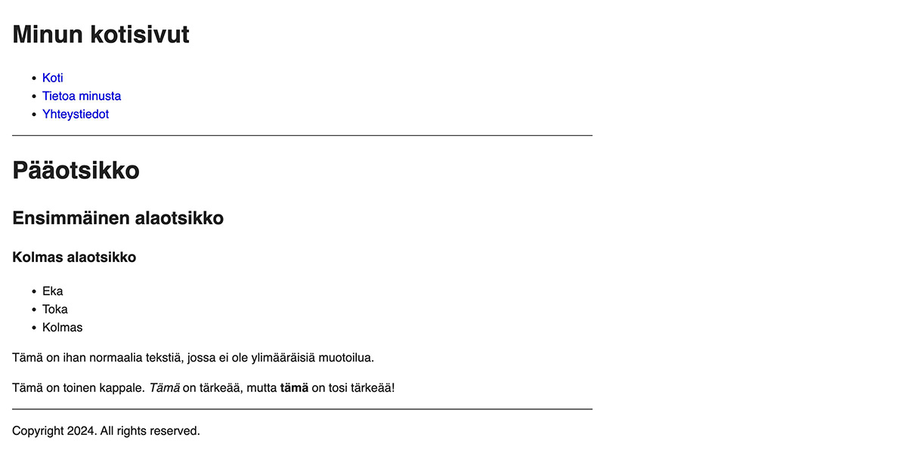
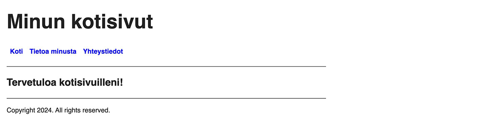

Oppaan seitsemännessä osassa laitetaan aikaisemmin rikottu valikko kuntoon ja opitaan, kuinka CSS-tyylitiedostot toimivat Hugossa.

<!--more-->

### Valikon korjaaminen
Oppaan alkupuolella etusivulla listattiin kaikki alasivut. Myöhemmässä osassa pyysin sinua siistimään *home.html* sivupohjaa, jonka seurauksena alasivuja ei enää listata. Tämän seurauksena käsissä on pelkkä etusivu, jossa ei ole linkkejä alasivuille. Korjataan asia.

Avaa projektin juuressa oleva *hugo.toml*, jossa sivujen päävalikko on määritelty. Lisää sinne kaksi uutta valikkoelementtiä:


baseURL = 'https://example.org/'
languageCode = 'fi'
title = 'Minun kotisivut'
theme = 'minun-teema'

[[menus.main]]
name = 'Koti'
pageRef = '/'
weight = 10

[[menus.main]]
name = 'Tietoa minusta'
pageRef = '/tietoa-minusta'
weight = 20

[[menus.main]]
name = 'Yhteystiedot'
pageRef = '/yhteystiedot'
weight = 30


Nyt etusivulla on valikko, josta löytyy linkit kahdelle alasivulle.

Sivut ovat edelleen pelkkää mustaa tekstiä valkoisella pohjalla. Sivupohjat osaavat kyllä askarrella HTML:n rakenteen läjään, mutta varsinaisen ulkonäön hierominen tehdään CSS-tyyleillä. Emme tee tämän oppaan esimerkkisivusta kaunista (koska en osaa), mutta tutustumme silti CSS-tiedostojen käyttämiseen, jotta sinä voit päästää sisäisen CSS-taiteilijasi valloilleen.

### Ulkoiset resurssit

Hugossa ulkoisia resursseja on kahdenlaisia: *staattiset tiedostot* ja *assetit*.

Staattiset tiedostot ovat tiedostoja, joita Hugo ei prosessoi mitenkään.

Assetit puolestaan ovat resursseja, joille Hugo voi tehdä jotain. Esimerkiksi CSS-tyylitiedoston kohdalla Hugo pystyy minifioimaan tiedoston, jolloin se ei niin paljon tilaa. Kuvan tapauksessa se osaa luoda kuvasta thumbnailin.

Kumpaako kannattaa käyttää? Mikäli tiedosto ei tarvitse erillistä prosessointia, sitä kannattaa käyttää staattisena tiedostona. Jos se vaatii Hugon pyörittelyä, sitä kannattaa käyttää assettina.

Muista kuitenkin, että assettien käyttö on hitaampaa, koska Hugo joutuu prosessoimaan ne. Tämä ei ole ongelma, jos assetteja on kourallinen, mutta mikäli niitä on tuhansia, sivujen generointi voi kestää yllättävän pitkään.

### CSS-tiedostot

Kun loit oppaan alkuosassa oman teeman, Hugo loi sinne myös yksinkertaisen CSS-tiedoston. Tiedosto löytyy *themes/minun-teema/assets/css/main.css*. Polusta voi päätellä, että CSS-tiedostoa käsitellään assettina - Hugo siis todennäköisesti tekee sille jotain generoinnin aikana. Oletuksena CSS-tiedosto näyttää tältä:


body {
  color: #222;
  font-family: sans-serif;
  line-height: 1.5;
  margin: 1rem;
  max-width: 768px;
}

header {
  border-bottom: 1px solid #222;
  margin-bottom: 1rem;
}

footer {
  border-top: 1px solid #222;
  margin-top: 1rem;
}

a {
  color: #00e;
  text-decoration: none;
}


Tyypillisesti CSS-tiedostoon viitataan HTML-dokumentissa *head* tagien välissä näin:


<head>
  <link rel="stylesheet" href="style.css">
</head>


Katsotaan, löytyykö jotain tällaista sivupohjista. Koska Hugo aloittaa sivupohjien käsittelyn *baseof.html* tiedostosta, aloitetaan tutkiminen sieltä. Avaa sivupohja ja näet, että sieltä löytyy *head* osio, mutta sen sisällä kutsutaan *partial* funktiolla toista sivupohjaa.


<head>
  {{ partial "head.html" . }}
</head>


*Baseof.html* tietää ainoastaan sen, että tässä kohtaa on *head*-elementti, mutta jättää sen sisällön *head.html* sivupohjan määriteltäväksi. Avaa seuraavaksi *themes/minun-teema/layouts/partials/head.html*, joka näyttää tältä:


<meta charset="utf-8">
<meta name="viewport" content="width=device-width">
<title>{{ if .IsHome }}{{ site.Title }}{{ else }}{{ printf "%s | %s" .Title site.Title }}{{ end }}</title>
{{ partialCached "head/css.html" . }}
{{ partialCached "head/js.html" . }}


Unohdetaan kaikki muut rivit ja keskitytään siihen, jossa CSS on mainittu:


{{ partialCached "head/css.html" . }}


Sinun ei tässä kohtaa tarvitse välittää siitä, mitä [partialCached](https://gohugo.io/functions/partials/includecached/) tekee. Voit ajatella, että se tekee ihan samaa asiaa kuin aikaisemmin opittu [partial](https://gohugo.io/functions/partials/include/), eli se hakee sisällön toisesta tiedostosta. Tässä tapauksessa kohde on *head/css.html*.

Avaa siis seuraavaksi *templates/minun-teema/layouts/partials/head/css.html*. Se näyttää tältä:


{{- with resources.Get "css/main.css" }}
  {{- if eq hugo.Environment "development" }}
    <link rel="stylesheet" href="{{ .RelPermalink }}">
  {{- else }}
    {{- with . | minify | fingerprint }}
      <link rel="stylesheet" href="{{ .RelPermalink }}" integrity="{{ .Data.Integrity }}" crossorigin="anonymous">
    {{- end }}
  {{- end }}
{{- end }}


Jälleen kerran vastassa on läjä rivejä, jotka näyttävät vieraalta, mutta joukossa on myös *link* tagi, jota yritimme löytää.

En käy tässä läpi, mitä jokainen rivi tarkalleen ottaen tekee. Lyhyesti Hugo tarkastaa, että generoidaanko sivu esikatselua varten, vai oletko generoimassa julkaistavaa versiota. Mikäli kyseessä on esikatselu, Hugo linkittää *css/main.css* tiedostoon, mutta ei tee sille sen ihmeellisempiä temppuja. Jos taas generoidaan julkaistavaa versiota, Hugo kutistaa CSS-tiedoston, jotta se ei vie niin paljon tilaa.

Kutistaminen on syy, miksi CSS-tiedostoa käsitellään assettina, eikä staattisena tiedostona. Jos kutistamisen jättäisi pois, CSS-tyylejä voisi käsitellä staattisena tiedostona. Jotta asia näkyisi vielä konkreettisemmin, katsotaan mitä Hugo tiedostolle oikeasti tekee.

### Public-hakemisto

Kun Hugo generoi sisällöstä ja sivupohjista HTML-tiedostoja, ne menevät projektin juuressa olevaan *public* kansioon. Mikäli sinulla on edelleen esikatselu käynnissä, sammuta se painamalla Ctrl+C. Käynnistä se sen jälkeen uudelleen, mutta nyt lisää mukaan uusi *cleanDestinationDir* parametri:


$ hugo serve --buildDrafts --cleanDestinationDir


Uusi parametri varmistaa, että Hugo tuhoaa *public* hakemiston sisällön, ennen kuin se generoi sen uudelleen. Näin varmistuu, että kaikki vanhat, käyttämättömät tiedostot eivät jää sinne kummittelemaan.

Jos tutkit *public* hakemiston sisältöä, huomaat, että sen alla on *css* alihakemisto, josta löytyy *main.css*. Jos avaat tiedoston, huomaat, että se on tismalleen samanlainen kuin CSS-tiedosto, joka löytyy teemasi alta. Hugo on kopioinut sen tänne, mutta ei ole tehnyt sille mitään.

Sammuta esikatselu painamalla CTRL+C. Seuraavaksi käsketään Hugoa generoimaan tiedostot niin, että ne ovat valmiita oikeaa käyttöä varten. Tämä tapahtuu korvaamalla *serve* komento *build* komennolla:


$ hugo build --buildDrafts --cleanDestinationDir


Jos katsot uudelleen *public/css* hakemiston sisältöä, *main.css* on kadonnut ja tilalla on *main.min.73be47...css* tiedosto. Tiedoston nimessä on todennäköisesti läjä satunnaisia numeroita ja kirjaimia. Avaa tiedosto ja huomaat, että Hugo on kutistanut tiedoston.

### Assetteihin viittaaminen
Pieni mysteeri voi olla se, kuinka näihin Hugon generoimiin tiedostoihin oikein viitataan, jos Hugo keksii niille sekopäiset omat nimet.

Avaa uudelleen *themes/minun-teema/layouts/partials/head/css.html* sivupohja. Olen poistanut alla olevasta esimerkistä epäoleelliset rivit:


{{- with resources.Get "css/main.css" }}
  ...
    <link rel="stylesheet" href="{{ .RelPermalink }}">
  ...
{{- end }}


Muistatko, kun mainitsin silmukoiden kohdalla, että Hugo luo väliaikaisen kontekstin? [With](https://gohugo.io/functions/go-template/with/) toimii samalla tavalla, mutta voit ihan itse luoda väliaikaisen kontekstin. Tämä konteksti luodaan vain siinä tapauksessa, että meillä on jotain laitettavaa siihen kontekstiin.

Ensimmäisellä rivillä *with* avainsanan jälkeen kutsutaan [resources.Get](https://gohugo.io/functions/resources/get/) funktiota. Käytännössä tämä funktio lukee pyydetyn resurssin muistiin. Tässä tapauksessa pyydetty resurssi on *css/main.css* tiedosto. Mikäli resurssi löytyy, *with* luo uuden väliaikaisen kontekstin, jonne tulee resurssin tiedot. Tämä konteksti on niin pitkään aktiviinen, kunnes vastaan tulee *end* avainsana.

Mikäli resurssia ei jostain syystä löydy, *with* ei tee mitään.

*With* lohkon sisällä on *link* tagi. Sen *href* attribuutin arvoksi asetetaan *aktiivisesta kontekstista* [RelPermalink](https://gohugo.io/methods/resource/relpermalink/) kentän tiedot. Yksinkertaistettuna tuo kenttä sisältää tiedon siitä, mistä Hugon generoima tiedosto löytyy ja mikä on sen nimi.

Sinun ei siis itse tarvitse arvuutella tiedoston nimeä, vaan tieto löytyy suoraan väliaikaisesta kontekstista. Hugo hoitaa loput sinun puolesta.

### Tyylien muuttaminen

Muutetaan vielä lopuksi sivun navigoinnin ulkoasua, ihan vaan koska voimme. Avaa *themes/minun-teema/assets/css/main.css* ja muuta sen sisältö tällaiseksi:


body {
  color: #222;
  font-family: sans-serif;
  line-height: 1.5;
  margin: 1rem;
  max-width: 768px;
}

header {
  border-bottom: 1px solid #222;
  margin-bottom: 1rem;

  ul {
    display: flex;
    flex-direction: row;
    list-style-type: none;
    padding: 0;
    gap: 1rem;
    font-weight: bold;
  }
}

footer {
  border-top: 1px solid #222;
  margin-top: 1rem;
}

a {
  color: #00e;
  text-decoration: none;
}

h1 {
  font-size: 3rem;
  margin:0;
}


Seuraavaksi avaa etusivun sisältötiedosto, eli *content/_index.md*. Poistetaan sieltä oppaan alkuvaiheessa lisätyt esimerkit ja kirjoitetaan tilalle jotain muuta:


+++
date = '2024-12-28T14:57:41+02:00'
draft = true
title = ''
+++

## Tervetuloa kotisivuilleni!


Etusivun pitäisi nyt näyttää tältä:

Ei edelleenkään kovin kaunista, mutta hei, ainakin se on selkeä! Seuraavassa osassa aloitamme blogin rakentamisen ja käymme läpi, mitä *archetypet* ovat.