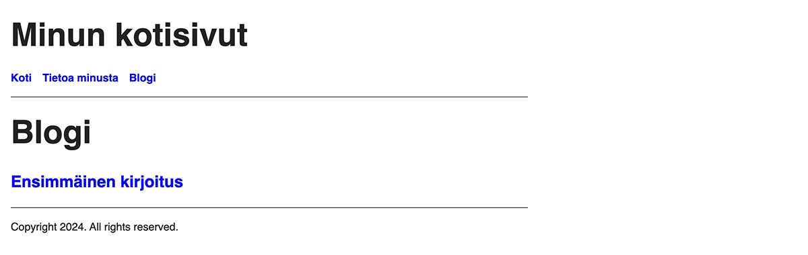

Tämä on oppaan kahdeksas osa, jossa alamme viritellä blogia ja samalla tutustumme sisältöpohjiin, eli archetypeihin.

<!--more-->

### Valikko ajan tasalle

Aivan oppaan alkumetreillä loit kaksi alasivua: tietoa minusta sekä yhteystiedot. Näiden tehtävänä oli lähinnä näyttää eri tavat, joilla Hugossa voi luoda sisältöä. Emme tarvitse yhteystiedot-sivua mihinkään, joten sen voi huoletta poistaa. Poista *content/yhteystiedot* hakemisto sekä sen sisältö.

Vaikka poistaisit kyseisen hakemiston, linkki ei katoa navigointipalkista, koska se on määritelty erikseen Hugon asetustiedostossa. Sen sijaan, että poistaisit valikkoelementin, muuta se niin, että se osoittaa tulevaan blogiin. Blogia ei ole vielä olemassa, mutta teemme sen pian. Muuta siis projektin juuressa oleva *hugo.toml* tällaiseksi:


baseURL = 'https://example.org/'
languageCode = 'fi'
title = 'Minun kotisivut'
theme = 'minun-teema'

[[menus.main]]
name = 'Koti'
pageRef = '/'
weight = 10

[[menus.main]]
name = 'Tietoa minusta'
pageRef = '/tietoa-minusta'
weight = 20

[[menus.main]]
name = 'Blogi'
pageRef = '/blogi'
weight = 30


### Blogin luonti

Ajatuksena on luoda uusi alasivu, jonka nimi on blogi. Blogi sisältää luonnollisesti kirjoituksia, joita voi ajan saatossa olla satoja. Tavoitteena on luona blogin etusivu, joka listaa muutaman tuoreimman kirjoituksen. Jos muistat oppaan alkupuolelta, tällainen sivu on tyypiltään *listasivu*.

Jotta blogikirjoitukset olisi helppo listata ja erotella kaikesta muusta sisällöstä, tehdään blogille oma hakemisto. Kaikki blogikirjoitukset tulevat sen alle. Aloitetaan blogin etusivusta.

Luo blogin etusivu *hugo new content* komennolla, jota käytit oppaan alussa:


$ hugo new content blogi/_index.md


Huomaa, että koska blogin etusivu on listasivu, se on nimeltään *_index.md*. Käynnistä Hugon esikatselu tuttuun tapaan:


$ hugo serve --buildDrafts --cleanDestinationDir 


Nyt navigointipalkista löytyy blogi ja linkki myös toimii. Sivulla ei kylläkään ole mitään sisältöä. Eikä pitäisikään olla, koska se on vielä luomatta.

Koska blogikirjoitukset saattavat sisältää kuvia, jotka koskettavat vain yksittäistä kirjoitusta, luodaan myös niille omat hakemistot. Voit itse nimetä hakemistot niin kuin haluat. Itse pidän siitä, että hakemiston alussa on päivämäärä ja sen jälkeen kirjoituksen otsikko. Näin kirjoitukset pysyvät aikajärjestyksessä.

Luo uusi blogikirjoitus seuraavalla komennolla *hugo new content* komennolla:


$ hugo new content blogi/2024-12-29-ensimmäinen-kirjoitus/index.md


Avaa juuri luotu tiedosto. Sen sisältö näyttää tältä:


+++
date = '2024-12-29T12:19:09+02:00'
draft = true
title = '2024 12 29 Ensimmäinen Kirjoitus'
+++


Tiedosto näyttää ihan samalta, kuin kaikki aikaisemmatkin sivut. Mutta mistä nämä kolme kenttää tulevat front matteriin? Kuinka Hugo osasi asettaa päivämäärän ja kirjoituksen otsikon?

### Archetypet
Tähän mennessä olemme käsitelleet sivujen HTML-pohjia, mutta Hugossa on pohjat myös sisältötiedostoille. Näitä sisältöpohjia kutsutaan *archetypeksi* ja ne sijaitsevat *archetypes* hakemistossa. Kuten monessa muussakin asiassa, myös teemalla on omat archetypet. Tässä tapauksessa emme halua sisältöpohjien olevan riippuvaisia teemoista, joten voit poistaa *themes/minun-teema/archetypes* hakemiston.

Avaa sen jälkeen *archetypes/default.md*. Se näyttää tältä:


+++
date = '{{ .Date }}'
draft = true
title = '{{ replace .File.ContentBaseName "-" " " | title }}'
+++


Tämä on se tiedosto, jonka pohjalta Hugo luo jokaisen uuden sisältötiedoston. Kuten huomaat, myös näissä voi käyttää funktioita ja hakea tietoa kontekstista, mutta touhu on rajoitetumpaa.

Archetypeillä on konteksti, joka sisältää vain neljä kenttää:
- *Date*, joka on tämänhetkinen päivämäärä ja kellonaika
- *File*, joka sisältää tietoa luotavasta tiedostosta
- *Type*, joka sisältää tietoa luotavan sivun tyypistä
- *Site*, joka sisältää tietoa sivustosta ja sen asetuksista

*Default.md* archetypessä *date* kenttään asetetaan sen hetkinen kellonaika ja päivämäärä, joka tulee kontekstista. *Draft* kentän arvoksi tulee aina true, eli jokainen uusi sisältö on oletuksena luonnos, eikä näin ollen tule vahingossa julkaistuksi.

*Title* kentän kohdalla tehdään hieman enemmän. Siinä kutsutaan [replace](https://gohugo.io/functions/strings/replace/)-funktiota, joka korvaa tietyt merkit jollain toisella. Tässä tapauksessa viivat korvataan välilyönnillä. Tälle funktiolle annetaan parametrina luotavan tiedoston nimi, joka tulee kontekstissa olevan [File](https://gohugo.io/methods/page/file/)-objektin [ContentBaseName](https://gohugo.io/methods/page/file/#contentbasename) kentästä. Tämän jälkeen lopputulos viskataan eteenpäin [title](https://gohugo.io/functions/strings/title/)-funktiolle, joka muuttaa jokaisen sanan alkamaan isolla kirjaimella.

Tämä toimii ihan kivasti normaaleiden alasivujen kohdalla, mutta blogikirjoituksissa ei. Kuten näit, blogikirjoituksen otsikoksi tuli *2024 12 29 Ensimmäinen Kirjoitus*. Vaikka päivämäärä onkin hakemiston nimessä, emme me sitä otsikkoon halua. Blogikirjoituksilla on myös taipumus aika ajoin päivittyä, joten ehkä mukana olisi hyvä olla myös muokkauspäivämäärä.

### Oma archetype blogikirjoituksille

Aikaisemmin tarkasteltu *archetypes/default.md* on oletuspohja, jota Hugo käyttää, mikäli mitään muuta ei ole tarjolla. Se kuitenkin yrittää etsiä sopivampaa pohjaa hakemistorakenteen pohjalta.

Koska teit blogille oman hakemiston, voit luoda uuden archetypen, joka on saman niminen. Luo käsin uusi archetype *archetypes/blogi.md* ja kopioi sinne *archetypes/default.md* archetypen sisältö. Käytämme sitä lähtökohtana.

Aloitetaan sillä, että lisätään frontmatterin uusi kenttä, [lastmod](https://gohugo.io/methods/page/lastmod/), joka kertoo, milloin tiedostoa on päivitetty. Sen arvoksi tulee sama *{{ .Date }}*, joka on asetettu *date* kenttään. Uusi archetype *archetypes/blogi.md* näyttää nyt tältä:


+++
date = '{{ .Date }}'
lastmod = '{{ .Date }}'
draft = true
title = '{{ replace .File.ContentBaseName "-" " " | title }}'
+++


Yritetään seuraavaksi korjata otsikko. Koska se vaatii useamman välivaiheen, käytetään muuttujia, jotta kaikkea ei tarvitse kirjoittaa yhdelle riville.

Ensimmäiseksi meidän on hankkiuduttava eroon päivämäärästä. Koska kirjoitusten hakemiston nimi noudattaa muotoa *vvvv-kk-vv-otsikko*, voimme yksinkertaisesti poistaa ensimmäiset 11 merkkiä, jolloin jäljelle jää pelkkä otsikko. Se onnistuu [strings.SliceString](https://gohugo.io/functions/strings/slicestring/) funktiolla ja näyttää tältä:


{{ $title := strings.SliceString .File.ContentBaseName 11 }}


Jos hakemiston nimenä oli *2024-12-29-ensimmäinen-kirjoitus*, niin nyt *$title* muuttujan arvona *ensimmäinen-kirjoitus*.

Seuraavaksi pitää korvata väliviivat välilyönneillä. Tästä oletuspohja antoikin jo esimerkin. Se onnistuu [strings.Replace](https://gohugo.io/functions/strings/replace/) funktiolla. Meidän ei tarvitse luoda joka välivaiheelle uutta muuttujaa, vaan voimme päivittää olemassa olevaa. Se tapahtuu näin:


{{ $title = strings.Replace $title "-" " " }}


Kun muuttujan arvoa päivitetään, käytetään pelkkää *=* merkkiä alustuksessa käytettävien *:=* merkkien sijaan. Tässä [strings.Replace](https://gohugo.io/functions/strings/replace/)-funktiolle annetaan parametrina muuttujan vanha arvo. Sen jälkeen kerrotaan, että mikä merkki halutaan korvata. Viimeisenä kerrotaan, että millä merkillä se halutaan korvata.

Jos muuttujan arvo oli aikaisemmin *ensimmäinen-kirjoitus*, nyt se on *ensimmäinen kirjoitus*. Lopuksi otsikon ensimmäinen kirjain pitäisi saada suureksi.

Yhdysvalloissa on tapana laittaa otsikon jokainen sana alkamaan isolla kirjaimella, mutta tämä ei kuulu suomenkieleen. Sen sijaan, että käyttäisimme [strings.Title](https://gohugo.io/functions/strings/title/) funktiota, käytämme [strings.FirstUpper](https://gohugo.io/functions/strings/firstupper/)-funktiota, joka tekee juuri sen, mitä haluamme. Se onnistuu näin:


{{ $title = strings.FirstUpper $title }}


[strings.FirstUpper](https://gohugo.io/functions/strings/firstupper/) tarvitsee vain yhden parametrin, joten annamme sille muuttujan vanhan arvon. Jos vanha arvo oli *ensimmäinen kirjoitus*, nyt se on *Ensimmäinen kirjoitus*. Se on juuri sitä, mitä tarvitsemme!

Lopuksi sen voi asettaa *title* kentän arvoksi:


title = '{{ $title }}'


Kun kaikki laitetaan yhteen, archetype-tiedosto näyttää tältä:


+++
date = '{{ .Date }}'
lastmod = '{{ .Date }}'
draft = true
{{ $title := strings.SliceString .File.ContentBaseName 11 }}
{{ $title = strings.Replace $title "-" " " }}
{{ $title = strings.FirstUpper $title }}
title = '{{ $title }}'
+++


Poista aikaisemmin luotu hakemisto *content/blogi/2024-12-29-ensimmäinen-kirjoitus/*. Luodaan se uudelleen, jotta näemme, että archetype todella toimii:


$ hugo new content blogi/2024-12-29-ensimmäinen-kirjoitus/index.md


Kaikki näyttäisi toimivan muuten, mutta front matterissa on ylimääräisiä tyhjiä rivejä:


+++
date = '2024-12-29T12:56:02+02:00'
lastmod = '2024-12-29T12:56:02+02:00'
draft = true

title = 'Ensimmäinen kirjoitus'
+++


Tyhjiä rivit näyttäisivät olevan juuri siinä kohtaa, jossa pyörittelimme muuttujan arvoja. Sattumaako? Ei.

Vaikka Hugo ei sinänsä tulostakaan mitään muuttujien pyörittelystä, niiden perässä olevat rivinvaihdot tulevat silti näkyviin. Tämä sama ilmiö käy myös sivupohjissa. Tähän on onneksi olemassa helppo ratkaisu: lisää jokaisen muuttujamäärittelyn loppuun viiva (*-*) juuri ennen kaarisulkujen sulkemista:


+++
date = '{{ .Date }}'
lastmod = '{{ .Date }}'
draft = true
{{ $title := strings.SliceString .File.ContentBaseName 11 -}}
{{ $title = strings.Replace $title "-" " " -}}
{{ $title = strings.FirstUpper $title -}}
title = '{{ $title }}'
+++


Poista luotu blogikirjoitus *content/blogi/2024-12-29-ensimmäinen-kirjoitus/* ja luo se vielä kerran uudelleen:


$ hugo new content blogi/2024-12-29-ensimmäinen-kirjoitus/index.md


Nyt kaikki näyttää paremmalta!


+++
date = '2024-12-29T13:07:24+02:00'
lastmod = '2024-12-29T13:07:24+02:00'
draft = true
title = 'Ensimmäinen kirjoitus'
+++


Käynnistä Hugon esikatselu:


$ hugo serve --buildDrafts --cleanDestinationDir 


Avaa blogin etusivu ja huomaat, että uusi kirjoitus on automaattisesti listattuna.

### Slug

Avaa tuoreen blogikirjoituksen esikatselu auki. Mitään sisältöähän siellä ei ole, koska et ole sitä vielä kirjoittanut. Katso kuitenkin selaimen osoiteriviä. Se näyttää todennäköisesti tältä: http://localhost:1313/blogi/2024-12-29-ensimm%C3%A4inen-kirjoitus/

Tässä on kaksi pientä ongelmaa. Ensinnäkin päivämäärä on tässä aivan turha ja tekee osoitteesta tarpeettoman pitkän. Toisekseen, vaikka ääkköset ovatkin sallittuja myös osoitteissa, ne aiheuttavat riesaa kaikille, joilla ei ole suomenkielistä näppäimistöä käytettävissään. Olisi hyvä, jos polun voisi määritellä otsikosta ja hakemistonimestä irrallaan.

Sen voi ja ratkaisun nimi on [Slug](https://gohugo.io/methods/page/slug/). Lisäämällä front matteriin *slug* kentän, voit päättää itse, minkälaisesta polusta kirjoitus löytyy. Lisätään se äsken luotuun kirjoitukseen *content/blogi/2024-12-29-ensimmäinen-kirjoitus/index.md*:


+++
date = '2024-12-29T13:07:24+02:00'
lastmod = '2024-12-29T13:07:24+02:00'
draft = true
title = 'Ensimmäinen kirjoitus'
slug = 'ensimmainen-kirjoitus'
+++


Jos menet esikatselussa takaisin blogin etusivulle ja siirryt kirjoitukseen siellä olevan linkin kautta, huomaat, että osoite on nyt *http://localhost:1313/blogi/ensimmainen-kirjoitus/*. Paljon siistimpää!

Jotta sinun ei tarvitsisi lisätä slug-kenttää joka kerta erikseen, lisätään se archetypeen, jolloin se on aina käytössäsi. Koska tämä onnistuu samoilla funktioilla kuin mitä olemme tähän asti käyttäneet, en käy niitä tässä rivi riviltä läpi. Lopputulos näyttää kuitenkin tältä:


+++
date = '{{ .Date }}'
lastmod = '{{ .Date }}'
draft = true
{{ $title := strings.SliceString .File.ContentBaseName 11 -}}
{{ $title = strings.Replace $title "-" " " -}}
{{ $title = strings.FirstUpper $title -}}
title = '{{ $title }}'
{{ $slug := strings.SliceString .File.ContentBaseName 11 -}}
{{ $slug = strings.ToLower $slug -}}
{{ $slug = strings.Replace $slug "ä" "a" -}}
{{ $slug = strings.Replace $slug "ö" "o" -}}
{{ $slug = strings.Replace $slug "å" "a" -}}
slug = '{{ $slug }}'
+++


Tässä hakemistonimestä poistetaan 11 ensimmäistä merkkiä, kaikki muutetaan pieneksi kirjaimeksi ja sen jälkeen ääkköset korvataan a:lla ja o:lla.

Seuraavassa osassa tutustutaan hieman lähemmin kontekstista löytyvään [Summary](https://gohugo.io/methods/page/summary/)-kenttään.