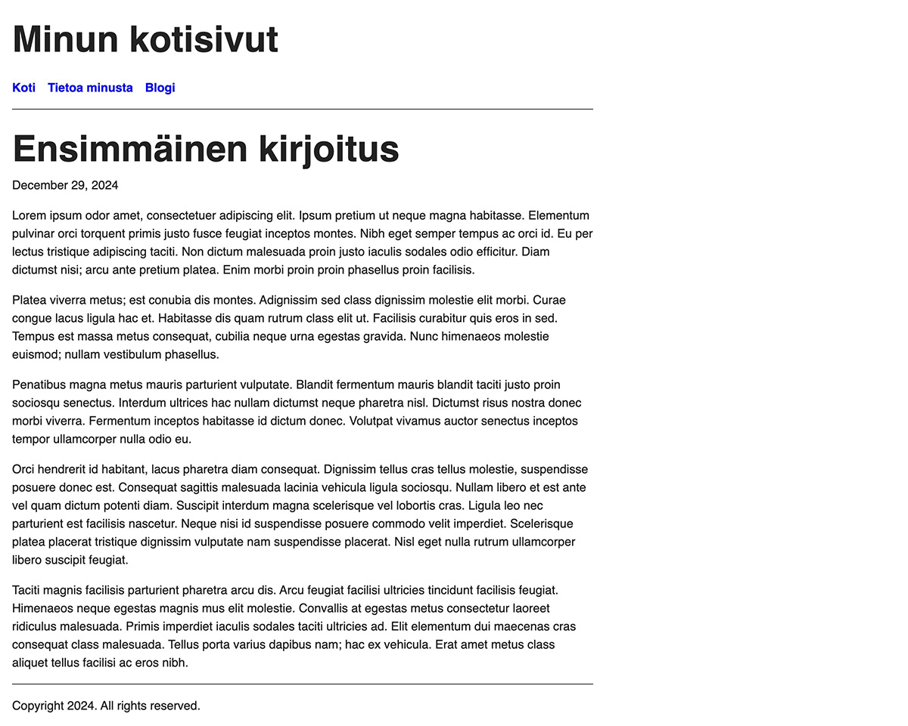

Oppaan yhdeksännessä osassa tutustumme lähemmin sivujen tiivistelmiin.

<!--more-->

### Tiivistelmä näkyviin

Käytimme kontekstista löytyvää [Summary](https://gohugo.io/methods/page/summary/)-kenttää aikaisemmassa osassa. Silloin lisäsimme front matteriin uuden *summary* kentän, johon tiivistelmä kirjoitettiin. Tämä ei ole kuitenkaan ainut tapa.

Jotta tiivistelmien testaaminen olisi helpompaa, lisätään edellisessä osassa tehtyyn blogikirjoitukseen sisältöä. Voit käyttää sisällön generointiin esimerkiksi [Lorem Ipsum Generaattoria](https://loremipsum.io/generator?n=5&t=p). Nyt *content/blogi/2024-12-29-ensimmäinen-kirjoitus/index.md* näyttää tältä (esimerkkiä on lyhennetty):


+++
date = '2024-12-29T13:22:05+02:00'
lastmod = '2024-12-29T13:22:05+02:00'
draft = true
title = 'Ensimmäinen kirjoitus'
slug = 'ensimmainen-kirjoitus'
+++

Lorem ipsum odor amet, consectetuer adipiscing elit.
Ipsum pretium ut neque magna habitasse.
Elementum pulvinar orci torquent primis justo fusce feugiat inceptos montes.
...


Esikatselussa kirjoitus näyttää tältä:

Palaa nyt blogin pääsivulle. Huomaat, että osa kirjoituksesta näkyy myös siellä, mutta ei kokonaan. Mystistä!

### Tiivistelmän määritteleminen

Mikäli sisältöön ei ole määritelty erillistä tiivistelmää, Hugo tekee sen automaattisesti. Myös tämä asia löytyy [Hugon dokumentaatiosta](https://gohugo.io/content-management/summaries/#automatic-summary).

Oletuksena Hugo ottaa mukaan sisällön ne kappaleet, jotka sisältävät ensimmäiset 70 merkkiä. Tähän voi vaikuttaa *hugo.toml* asetustiedostossa lisäämällä sinne [summaryLength](https://gohugo.io/getting-started/configuration/#summarylength) kentän. Esimerkiksi:


baseURL = 'https://example.org/'
languageCode = 'fi'
title = 'Minun kotisivut'
theme = 'minun-teema'

summaryLength = 120
...


Tämän myötä Hugo ottaa mukaan ne kappaleet, jotka sisältävät ensimmäiset 120 merkkiä. Voit testata tätä, jos haluat. Asettamalla arvo kymmeneen, blogin etusivu näyttää tältä:

Toinen vaihto tiivistelmän määrittämiseen on se, jota käytimme aikaisemmin. Voit lisätä sivun front matteriin [summary](https://gohugo.io/content-management/summaries/#front-matter-summary)-kentän, jolloin voit itse valita, mitä tiivistelmässä lukee. Tämän vaihtoehdon hyvä puoli on siinä, että tiivistelmä voi olla täysin erillään varsinaisesta sisällöstä.

Voit kokeilla lisätä [summary](https://gohugo.io/content-management/summaries/#front-matter-summary)-kentän uuteen blogikirjoitukseen:


+++
date = '2024-12-29T13:22:05+02:00'
lastmod = '2024-12-29T13:22:05+02:00'
draft = true
title = 'Ensimmäinen kirjoitus'
slug = 'ensimmainen-kirjoitus'
summary = 'Tämä on tiivistelmä, joka on täysin erillään sisällöstä.'
+++


Lopputulos näyttää tältä:

Kolmas tapa on se, jota käytän yleensä itse. Siinä tiivistelmä voidaan määritellä suoraan sisällössä. Esimerkiksi:


Lorem ipsum odor amet, consectetuer adipiscing elit....

<!--more-->

Platea viverra metus; est conubia dis montes...


Kaikki *more* kohdan yläpuolella oleva luokitellaan sivun tiivistelmäksi. Tämän vaihtoehdon hyvä puoli on siinä, että saat täyden vapauden siihen mitä ja kuinka paljon tiivistelmässä näkyy. Tämä ei kuitenkaan toimi silloin, kun haluat tiivistelmään jotain sellaista, jota ei lue leipätekstissä. Siinä tapauksessa front matterin käyttäminen on parempi vaihtoehto.

Oppaan viimeisessä osassa toteutetaan blogin etusivulle sivutus.