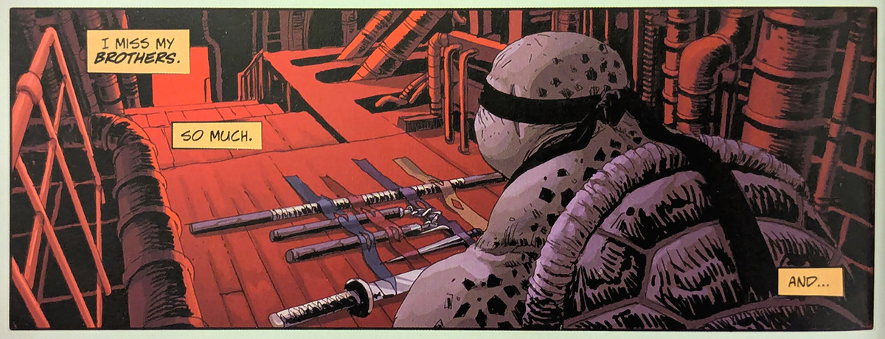

Kaverini vinkkasi minulle Turtles-sarjakuvasta, joka kertoo hieman erilaisen tarinan ninjakilppareista. Halusin lukea tarinan, ennen kuin sen pohjalta rakennettu peli ja elokuva julkaistaan.

<!--more-->

The Last Ronin kertoo varsin synkän tarinan ainoasta elossa olevasta kilpikonnaveljeksestä. Kolme muuta, samoin kuin Splinter, ovat kuolleet. Elossa olevalla veljeksellä on perheestään jäljellä ainoastaan aseet sekä Splinterin päiväkirja, jonka avulla hän opettelee kaikki ne asiat, joita Splinter ei hänelle ehtinyt elossa ollessaan kouluttaa.

The Last Ronin ei kerro tarinaa teini-ikäisestä kilpikonnasta. Se kertoo tarinan vanhasta, rikkinäisestä kilpikonnasta, joka on tullut kostamaan menneet tapahtumat ja päättämään kauan aikaa jatkuneen sodan. Mutta kuka neljästä kilpikonnasta on elossa?

Jostain syystä minulla on ollut viehätys synkkiin versioihin lapsuuteni suosikkisarjakuvista ja -animaatioista. Totta puhuen Turtles on tässä mielessä hienoinen poikkeus, sillä alkuperäiset Turtles-sarjakuvat olivat synkkiä ja väkivaltaisia. Sävy muuttui kevyemmäksi vasta, kun lapsille suunnattu animaatio julkaistiin. Tässä mielessä The Last Ronin on paluu juurille.

Pidin todella paljon The Last Roninin lähtökohdasta. Ajatus murheen alla hajonneesta, koston kierteessä olevasta ninjakilpikonnasta puhutteli minua. Kun aloin lukea sarjakuvaa, toivoin salaa, ettei elossa olevan kilpikonnan henkilöllisyyttä paljastettaisi lainkaan, tai se tehtäisiin vasta lopussa.

Toisin kuitenkin kävi ja asia paljastuu heti ensimmäisen osan lopussa. Tavallaan sääli, koska tämä olisi antanut tarinaan hyvän mysteerin, joka olisi paljastunut lukijalle hiljalleen sitä mukaa, kun muiden kuolemaan johtavia tapahtumia käydään läpi.

The Last Ronin alkaa tavalla, joka nostatti odotuksia. Se antaa kuvan, että tarinassa käsitellään vakavia teemoja perheestä, menetyksestä, surusta, ystävyydestä ja kostosta. Pieneksi pettymykseksi se muuttuu varsin geneerikseksi räiskinnäksi, jonka keskiössä on toiminta ja taistelut. Tarina on aika yksinkertainen ja yllätyksetön.

Itseäni harmittaa eniten se, että lähtökohdat huomioon ottaen se tuntui menetetyltä mahdollisuudelta. Vaikka menetyksen synnyttämä kosto on miljoonaan kertaan käsitelty aihe, tässä olisi ollut aineksia johonkin ainutlaatuiseen.

Sarjakuvan visuaalinen tyyli iski minuun täysillä. Se käyttää värejä[^1], mutta pitää silti synkän tyylinsä. Eri sijainnit ja aikakaudet on helppo tunnistaa toisistaan.

Tarinaa oli pääsääntöisesti helppo seurata, mutta siellä täällä minulla oli hienoisia vaikeuksia hahmottaa, mitä ruuduissa lopulta tapahtuu. Välillä seuraamisen kannalta oleelliset yksityiskohdat olivat niin pieniä, etten tajunnut, mitä kahden ruudun välillä oikein tapahtui. Tämä oli kuitenkin lähes olematon ongelma ja sarjakuvaa oli ilo katsella.

Odotan tulevaa peliä ja elokuvaa pelonsekaisella innostuksella. Innostuksella siksi, että näistä lähtökohdista voisi saada oikeasti kiinnostavan ja synkän Turtles-tarinan. The Last Roninissa on kaikki mahdollisuudet olemassa, jos ne vaan osataan hyödyntää.

Elokuvan kohdalla pelko syntyy siitä, että elokuvan käsikirjoittaa vain muutaman videopelikäsikirjoituksen kokemuksella ponnistava Tyler Burton Smith. Positiivista on, että yksi näistä peleistä on Alan Wake 2. Tuottajana toimii Walter Hamada, jonka ansiolista koostuu lähinnä tusinatuotetusta supersankarirainasta ja kauhuelokuvista. Joukossa on kuitenkin joitain onnistumisiakin, kuten tuorein Batman-elokuva sekä Joker. En kuitenkaan pidätä hengitystäni sen puolesta, että elokuvasta on tulossa älykäs ja ajatuksia herättävä.

Pelin takana on saksalainen Black Forest Games, joka ei ole tunnettu tarinavetoisista peleistä. Pelitalo on tehnyt vain muutaman oman tuotannon ja muut ovat lähinnä remakeja. Lisäksi Black Forest Games irtisanoi 50 % devaustiimistään viime vuoden alussa. Ei voi sanoa olevani erityisen toiveikas tämänkään projektin suhteen, mutta eihän sitä koskaan tiedä!

[^1]: Kirjoitukseen liitetty kuva ei ole hyvä esimerkki sarjakuvan väripaletista. Sarjakuva on värikkäämpi kuin mitä kuva antaa ymmärtää. En halunnut liittää enempää kuvia, etten spoilaa tarinan tapahtumia ja hahmoja.