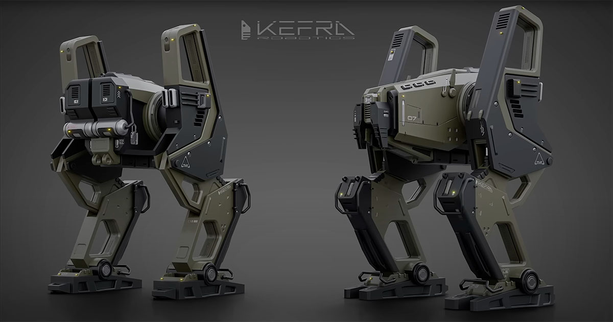
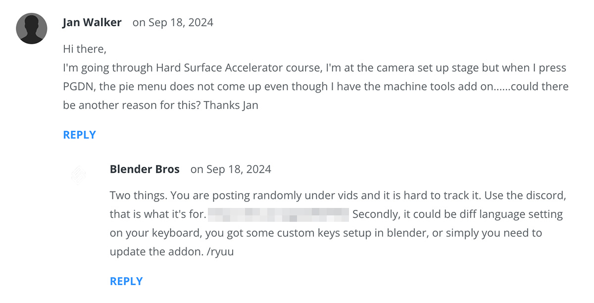

Aloitin tämän vuoden oppimisteeman online-kurssilla, jonka kuvittelin parantavan Blender-taitojani. Harmillisesti kurssi oli aikamoinen pettymys.

<!--more-->



Olen seurannut [Josh Gambrellia](https://www.youtube.com/@JoshGambrell) YouTubessa useamman vuoden ja pitänyt häntä varsin taitavana 3D-artistina. Hänen YouTube-kanavalta löytyy useita hyödyllisiä [Blender](https://www.blender.org)-oppaita. Joshin ja [Ponte Ryuuruin](https://www.youtube.com/c/PonteRyuurui) pyörittämä [Blenderbros.com](https://www.blenderbros.com) tarjoaa kursseja hard surface -mallinnukseen, joten ajattelin, että tämän vuoden oppimisteeman nimissä voisin ostaa heidän [The Hard Surface Accelerator -kurssin](https://www.blenderbros.com/accelerator).

Katselin kurssin esittelyvideon ja vielä senkin jälkeen minulle tuli fiilis, että se voisi syventää taitojani erityisesti hard surface -mallinnuksessa. Kurssin hintalappu on *197 dollaria*, mutta nyt sen sai *97 dollarilla*, joten pidin sitä ihan kohtuullisena diilinä.

Kävi ilmi, että kurssi ei ollut yhtään sitä, mitä kuvittelin sen olevan.

### Se ei tarjoa mitään ainutlaatuista

Kurssin ilmeisin ongelma on se, että rahoilleen ei saa vastinetta. Se ei tarjoa mitään ainutlaatuista ilmaiseen verrattuna.

Josh kyllä mainitsee esittelyvideossa, että kurssi sopii aloittelijoille, mutta antaa samaan aikaan kuvan, että kyseessä olisi erityisesti hard surface -mallinnukseen keskittyvä kurssi. Kurssin suoritusajan mainostetaan olevan kaksi viikkoa ja tästä syystä kuvittelin itsekin, että se menisi varsin syvälle sisällysluettelossa oleviin asioihin.

Käytännössä se on Blenderin peruskurssi, eikä se ole erityisen hyvä edes siinä. Kun pääsin kurssin lopussa olevaan harjoitusosioon, en ollut oppinut kurssista kirjaimellisesti mitään muuta, kuin parin (maksullisen) lisäosan käytön. Lisäosat ovat toki hyödyllisiä ja nopeuttavat työskentelyä, joten ei se täysin hukkaan mennyt.

Mikäli olet aloittelija ja haluat oppia Blenderin käytön, suosittelen tekemään [Blender Gurun](https://www.youtube.com/@blenderguru) [Blender 4.0 Beginner Donut Tutorialin](https://www.youtube.com/playlist?list=PLjEaoINr3zgEPv5y--4MKpciLaoQYZB1Z). Se on paljon selkeämpi ja hauskempi aloittelijakurssi, eikä se nojaa yhteenkään lisäosaan. Se on lisäksi **täysin ilmainen**.

Nimestään huolimatta Accelerator-kurssi ei tarjoa juuri mitään, mikä liittyisi erityisesti hard surface -mallinnukseen. Siinä on kyllä yksi ihan hyödyllinen osio, jossa käydään nopeasti läpi shader-ongelmien syitä, mutta siihen se sitten jääkin. Onneksi sentään lopputyö kuuluu hard surface -kategoriaan, sillä siinä rakennetaan metallinen mech.

### Piilokuluja

Kurssin esittelyssä mainitaan, että kurssiin ei liity minkäänlaisia piilokuluja. Tämä on puhdas valhe.

Ensinnäkin kurssi nojaa lisäosiin, jotka eivät ole ilmaisia. Ne ovat ilmeisesti joskus olleet sitä, mutta eivät ole enää. Näiden kohdalla kysymys ei ole isosta lisäkulusta, sillä lisäosat saa itselleen viidellä eurolla.

Suurempi ongelma on se, että kurssissa on kokonaan oma osionsa Adobe Photoshopille. Se maksaa 27,41 €/kk eli *328,92 € vuodessa*! Minusta tämä on melkoinen piilokulu!

Minuun tällä ei ollut vaikutusta, sillä maksan Photoshopin tilauksesta muutenkin, mutta muille tämä voi olla melkoinen yllätys.

Tuntuva siivu kurssista on Photoshopin perusteiden läpikäyntiä. Sillä ei ole mitään tekemistä Blenderin tai edes 3D-mallinnuksen kanssa. Kurssi antaa sellaisen kuvan, että ilman Photoshopilla tehtävää jälkikäsittelyä, et voi millään olla uskottava 3D-artisti. Sen lisäksi, että tällainen viesti on aloittelijan näkökulmasta lannistava, pidän sitä myös yksinkertaisesti vääränä.

Tietenkin kuvien jälkikäsittely voi nostaa lopputuloksen seuraavalle tasolle, mutta kun kurssin keskeisin sisältö on kirjaimellisesti 3D-mallintamisen *perusteet*, tällaisella hienostelulla ei ole mitään merkitystä.

### Sekava kokonaisuus

Josh mainostaa kurssia ehjänä kokonaisuutena ja perustelee tällä myös sen varsin kallista hintaa. Olen tästä hieman eri mieltä.

Kurssi on kyllä jaoteltu selkeisiin kokonaisuuksiin, mutta niiden sisällä se tuntuu pomppivan vähän mihin sattuu ilman selkeää punaista lankaa. Josh saattaa selittää aivan Blenderin perusteita ja seuraavassa hetkessä pompata johonkin kummalliseen yksityiskohtaan, joka on aloittelijalle täysin yhdentekevä.

Kurssin aikana Josh toteaa monta kertaa, että hän palaa asiaan tarkemmin hieman myöhemmin. Suurimman osan näistä sivupoluista olisi voinut jättää tekemättä ja esitellä vasta siinä kohtaa, kun niitä oikeasti tarvitaan.

Kurssin osa-alueet jäävät isosti teorian tasolle, sillä niiden aikana ei tehdä mitään oikeaa. Se opettaa monia asioita, mutta unohtaa kertoa, miksi ne ovat tärkeitä tai mihin niitä käytetään. Tässäkin mielessä Blender Gurun kurssi on paljon parempi. Siinä kurssin tavoitteena on mallintaa herkullinen donitsi ja kaikki opeteltavat asiat sidotaan donitsin tekemiseen

The Hard Surface Accelerator päättyy harjoitustyöhön, jossa mallinnetaan varsin komean näköinen, futuristinen mech. Tässä kohtaa monet opetetut asiat muuttuvat konkreettiseksi, mutta monelle aloittelijalle se voi olla myöhäistä. Kurssi olisi ollut paljon parempi, jos se olisi aloittanut mechin rakentamisen heti alussa ja esitellyt opeteltavat asiat siinä kontekstissa.

### Ristiriitaiset työskentelytavat

Kurssin alkuosan vetää Josh ja hän opettaa Blenderin perusteet. Loppuosan sekä kurssin harjoitustyön ohjaa Ryuu. Ongelmana on, että kaverit eivät ole sopineet, mitä opetetaan ja miten työskentely tapahtuu.

Josh aloittaa kurssin käymällä läpi Blenderin käyttöliittymän. Heti alussa hän neuvoo piilottamaan sieltä monia elementtejä. Se on hyvä esimerkki workflow-optimoinnista, joka on aloittelijalle täysin epäoleellinen. Suurempi ongelma on kuitenkin se, että kun Ryuu aloittaa opettamisen, hän käskee tehdä asioita piilotetuilla elementeillä!

Toinen hyvä esimerkki sekavuudesta on se, että Josh opettaa kurssin alussa erilaisten lisäosien asentamisen. Hän ei kuitenkaan koskaan kerro, kuinka ne pitäisi konfiguroida. Myöhemmin Ryuu käyttää lisäosista ominaisuuksia, joita ei ole kytketty päälle. Tämä näkyykin hyvin kurssivideoiden alla olevista kommenttiosiosta, jossa hämmentyneet ihmiset ovat kyselleet ratkaisua ongelmaan.

### Ylimielistä käärmeöljykauppaa

Kurssin ympärillä leijuu vahva kaupallisuuden henki. Josh ja Ryuu yrittävät myydä kurssia sillä ajatuksella, että se tuo sinulle kaupallista menestystä. Joku sanoi joskus, että paras tapa rikastua nopeasti, on kirjoittaa kirja siitä, kuinka rikastua nopeasti. Tässä kurssissa on hieman samanlainen fiilis.

Josh mainostaa kurssia jonkinlaisena erityisdiilinä, joka valmistaa opiskelijan ovista ja ikkunoista tuleviin työtarjouksiin ja rikkauksiin. Tämä on ihan puhdasta mielikuvilla myymistä. Kurssin läpäisemällä et osaa mitään muuta kuin Blenderin perusteet.

Joshin ja Ryuun ongelmana on tietynlainen ylimielisyys, joka näkyy kommenteissa. He eivät suostu vastailemaan kysymyksiin, vaan kehottavat ihmisiä kasvattamaan heidän yhteisöään liittymällä Discordiin. Osa vastauksista on suoraan sanottuna tylyjä.

Jos videon alla olevassa kommenttiosiossa ei saa kysyä siihen liittyviä kysymyksiä, miksi koko kommenttiosion virka on? Sekö, että ihmiset saavat ylistää Joshin ja Ryuun erinomaisuutta?

### Huono opettaja ja abstrakteja konsepteja

Opettaminen on vaikeaa. Se on kokonaan oma taitonsa. Olen oman työurani aikana huomannut, että vaikka olisit hyvä tekemään jotain, et todennäköisesti ole hyvä opettamaan sitä. Sain tästä itse hyvän muistutuksen, kun yritin rääppiä kokoon [Hugo-opasta](). Minä en ole erityisen hyvä opettaja ja tiedostan sen.

Kurssin kahdesta vetäjästä Josh osaa asiansa tuntuvasti paremmin. Hän muistaa tehdä asiat riittävän rauhallisesti. Hänen puheensa on selkeää ja sitä on vaivatonta kuunnella pitkiäkin aikoja. Vaikka hän sinkoileekin välillä epäoleellisuuksiin, hän on ihan hyvä opettaja ja juuri hänen opasvideonsa YouTubesta saivat minut kiinnostumaan tästä kurssista.

Ikävä kirjoittaa näin, mutta Ryuu on aivan surkea opettaja. Hänen äänensä on epäselvää muminaa ja täynnä maneereja, jotka käyvät nopeasti häiritseväksi: "Tee näin, okei? Sitten tee näin, okei? Seuraavaksi mene tänne, okei, ja sitten tee näin, okei."

Hän tekee kaiken aivan liian nopeasti. Kun kurssin lopussa lähdetään rakentamaan mechiä, hän lisäilee näkymään kuutioita kertomatta lainkaan siitä, miksi hän niitä lisäilee ja mitä niistä olisi tarkoitus syntyä. Opiskelijana et voi tehdä muuta kuin seurata sokeasti perässä.

Kurssissa on pitkä osio, jonka voisi ajatella olevan graafisen suunnittelun, sommittelun ja valokuvauksen perusteita. Ryuu käy läpi monta abstraktia konseptia, ja käyttää omia kuvia esimerkkeinä kaikista niistä. Konseptit sinänsä ovat ihan asiallisia, mutta jälleen kerran ne ovat aloittelevalle mallintajalle täysin hyödyttömiä.

Ryuun esimerkit eivät ole hyviä ja niitä on aivan liian vähän. Ne sopivat kyllä joihinkin konsepteihin, mutta isolta osin kuvista on mahdotonta nähdä asioita, joita Ryuu yrittää niiden avulla esittää. Hänen olisi pitänyt käyttää muiden tekemiä kuvia, joissa konseptit olisivat tulleet selkeästi näkyviin. Nyt koko touhu näyttää enemmän itsekehulta.

### Online-kurssien ongelmat

The Hard Surface Accelerator -kurssi on esimerkki ongelmasta, joka vaivaa monia online-kursseja: ne ovat lähinnä rahastusta. Sinun on vaikea etukäteen tietää, mitä kurssi *oikeasti* tarjoilee. Sisällysluettelo voidaan saada näyttämään hyödylliseltä ja kiinnostavalta, mutta todellinen sisältö on jotain ihan muuta.

Tämä kurssin oli itselleni 100 euroa hukkaan heitettyä rahaa. En oppinut siitä mitään uutta. En ole kokenut Blenderin käyttäjä, mutta osaan sen perusteet. Tätä kurssia mainostettiin hard surface -kurssina, vaikka se ei ole mitään muuta, kuin Blenderin peruskurssi.

Toisaalta jotkut kurssit voivat mennä sellaiselle tasolle, ettei minun pohjatietoni riitä niihin. YouTube on täynnä opasvideoita, jotka ylittävät oman tietotaitoni. Online-kursseista on vaikea tietää, mitkä niiden pohjavaatimukset ovat.

Yksi online-kurssien ongelmana on se, että ne on pilkottu naurattavan pieniin osiin. Kun katsoo Accelerator-kurssin sisältöä, sinulle voi tulla käsitys, että se sisältää hirveän määrän asiaa. Todellisuudessa suurin osa osioista on 1-2 minuutin mittaisia videoita, jossa yksinkertainen asia on venytetty tuohon mittaan.

Sen lisäksi, että tämä tuntuu asiakkaan pettämiseltä, se tekee myös kurssin suorittamisesta kömpelöä, sillä joudut parin minuutin välein siirtymään videosta toiseen ja merkkaamaan kurssiosioita suoritetuksi. Tämä sama ongelma tuli vastaan viime keväänä, kun suoritin [Divemaster-kurssin]() teoriat online-kurssina.

### Yhteenveto

Itse en pysty suosittelemaan Blenderbrosin kurssia. Mikäli aloitat nollasta, käytä aikasi mieluummin [Blender Gurun kurssiin](https://www.youtube.com/playlist?list=PLjEaoINr3zgEPv5y--4MKpciLaoQYZB1Z). Se ei maksa mitään ja antaa käytännössä saman perusosaamisen paljon mukavammassa ja selkeämmässä paketissa.

Epäilemättä Josh ja Ryuu ovat taitavia tekijöitä. Blenderbrosin tekemisessä on kuitenkin jonkinlaista käärmeöljykauppiaan tuntua ja kaupallista ylimielisyyttä, josta en vaan pidä.

Mikäli haluat oppia heiltä jotain, kannattaa seurata heidän YouTube-kanaviaan. Suorittamalla ensin Blender Gurun kurssin, pystyt varsin vaivattomasti seuraamaan heidän lyhyitä, ilmaisia opasvideoita. Ne eivät ole ehjiä kokonaisuuksia, mutta saat niistä ihan samat tiedot kuin mitä saisit tästä kurssista. Eivätkä ne maksa mitään.

Tästä pettymyksestä huolimatta haluan edelleen syventää Blender-osaamistani, joten jatkan sopivien kurssien etsintää.

