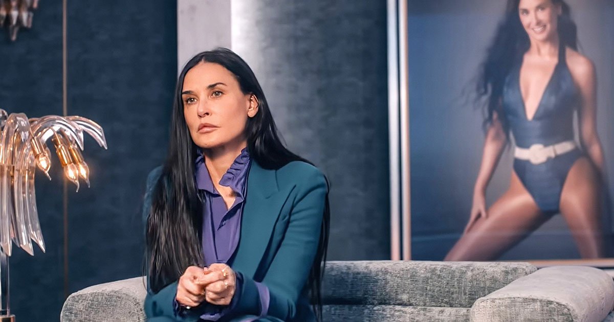
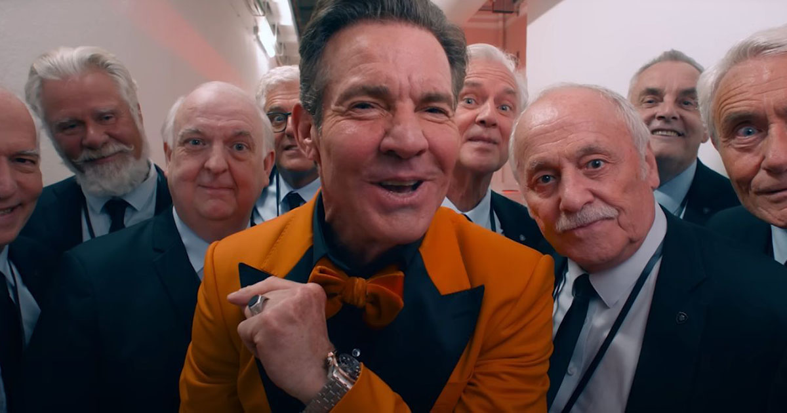

Sain joululahjaksi elokuvaliput, joten kävin katsomassa Cannesin elokuvafestivaalien parhaan käsikirjoituksen voittaneen The Substancen.

<!--more-->



### Tarina

**Elisabeth** on 50-vuotta täyttävä TV-tähti, joka tuli nuorempana tunnetuksi television fitness-ohjaajana. Hän kokee, että aika on kuitenkin ajamasta hänestä ohi. Eikä hän ole ainut. Myös limainen tv- ja elokuvamoguli **Harvey** suunnittelee Elisabethin syrjäyttämistä nuoremmalla ja hehkeämmällä tähdellä.

Sattumien seurauksena Elisabeth tutustuu The Substance -nimiseen aineeseen, joka lupaa ikuista nuoruutta ja tarjota täydellisimmän version itsestäsi. Kun menetetty tähteys ja peilistä näkyvä keho alkavat ahdistaa tarpeeksi, Elisabeth päättää tarttua tilaisuuteen. 

Aineen käyttöön liittyy kuitenkin rajoitus: se tarjoaa täydellisen kehon ja nuoruuden vain viikoksi kerrallaan. Elisabethin on vietettävä joka toinen viikko ikääntyvässä kehossa.

### Ajatuksia herättävä

Kun astelin elokuvateatterista pihalle, minulla oli olo, että olin juuri nähnyt [Unelmien sielunmessun](https://www.imdb.com/title/tt0180093/) jatko-osan. Elokuva on ajatuksia herättävä ja ihmiset tuntuvat tulkitsevan sitä eri tavoin. Samaan aikaan on kuitenkin vaikea sanoa, että onko se nerokas, vai yksinkertaisia ideoita kaksin käsin naamaan hierovaa roskaa. Raja on häilyvä, mutta käännyn itse enemmän ensimmäisen vaihtoehdon puoleen.

The Substance voitti viime vuonna Cannesin elokuvajuhlien parhaan käsikirjoituksen palkinnon hyvästä syystä. Se ei tarvitse lukuisia henkilöhahmoja, tapahtumapaikkoja tai juonenkäänteitä. Elokuva onnistuu kertomaan varsin simppelin tarinan omaperäisellä ja kiinnostavalla tavalla. Se saa ajattelemaan.

Elokuva käsittelee nuoruuden ja täydellisen vartalon ihannointia, sekä ikääntymiseen liittyviä paineita. Monet sanovat, että se kritisoi näitä asioita. Ymmärrän, miksi ihmiset ajattelevat näin, mutta itse en kokenut elokuvaa erityisenä kritiikkinä. Se tuntui enemmän sanovan, että jos valitset elää elämääsi tietyllä tavalla, edessäsi on todennäköisesti suuri pettymys.

Elokuvassa on lukuisia kohtauksia, jotka esittävät nuoruuden sekä omasta kehosta huolehtimisen positiivisessa valossa. Se muistuttaa siitä, että kauneus on katsojan silmissä. Kysymys on enemmän siitä, kuinka itse suhtaudut omaan peilikuvaasi sekä siitä, valitsetko seurata elämässäsi ihmisiä, jotka kohtelevat sinua kuin roskaa. Elokuvassa on myös kohtauksia, jotka muistuttavat siitä, kuinka ulkonäköä voidaan käyttää häikäilemättömästi hyödyksi.

The Substancen voisi tietyllä tavalla nähdä jonkinlaisena mediateollisuuden kritiikkinä, mutta jopa tämä tuntuu itsestäni turhalta yksinkertaistukselta. Elokuvan pahuus kiteytyy lähinnä Harveyn roolihahmoon. Käytännössä kaikki muut kohtelevat ihmisiä ihmisenä, eivätkä pelkkänä kehon ympärille rakennettavana tuotteena. Mutta koska Harvey on se, jonka kautta menestykseen pääsee kiinni, ihmiset päätyvät mielistelemään planeetan suurinta kusipäätä.

Jos elokuva pitäisi nähdä kritiikkinä, niin minusta kritiikki kohdistuu siihen, kuinka jotkut ihmiset keskittyvät elämässään pinnalliseen liitelyyn, jossa oma elämä ja identiteetti rakentuu muilta tulevien katseiden ja suosion varaan. Se kritisoi ajattelutapaa, jossa itseä kohtaan ei rakenneta luonnollista hyväksyntää, vaan se ammennetaan puhtaasti tuntemattomien ihmisten mielipiteistä. 

Elokuvasta tulee mieleen [Black Mirror](https://www.imdb.com/title/tt2085059/) -tv-sarjan [toinen jakso](https://www.imdb.com/title/tt2089049/). Se kertoo ihmisestä, joka tekee mitä tahansa saavuttaakseen tuntemattomien ihmisten suosion. Ihmisestä, joka ei osaa arvostaa niitä ihmisiä, jotka pitävät hänestä juuri sellaisena kuin hän on.

### Näyttelijät

**Demi Moore** on loistava valinta elokuvan päähenkilöksi. Siinä on jotain nerokasta itseironiaa ja -kritiikkiä, kun yli 60-vuotias plastiikkakirurgilla naamansa veistellyt Moore näyttelee ikäkriisin parissa kamppailevaa 50-vuotiasta fitness-tähteä. Hän istuu rooliin täydellisesti ja vetää sen upeasti. Moore on upeassa kunnossa ja sopii juuri siksi rooliin täydellisesti. Ilman Mooren vahvaa suoritusta ja ulkonäköä elokuva ei vaan toimisi. En olisi yllättynyt, jos hän voittaisi suorituksestaan palkintoja[^1].

**Margaret Qualleyn** esittämä nuorempi Elisabeth on sekin tyylikäs roolisuoritus. Hän on onnistunut kaivamaan itsestään juuri oikeanlaisen bimbon, joka tekee lähes mitä vaan saadakseen paistatella muun maailman parrasvaloissa. Jonkinlaista itseironiaa häneltäkin on löydyttävä, jotta suostui tällaiseen rooliin. Qualleyn roolihahmo ei ole kuitenkaan koko elokuvan ajan pelkkä takalistoaan kameran edessä pyörittävä fitness-bimbo, ja hän vetää myös elokuvan synkemmät hetket uskottavalla tavalla.

Olen vuosien ajan miettinyt, että **Dennis Quaid** olisi hyvä näyttelijä Jokerin rooliin. The Substance vaan vahvisti sitä ajatusta. Hänen maksimoi Harveyn ällöttävyyden juuri oikealla tavalla. Vaikka hahmo menee hetkittäin jonkinlaisen karikatyyrin puolelle, Quaid onnistuu olemuksellaan kantamaan sen tavalla, joka ei riko elokuvan tunnelmaa. Quaidin näyttelemä Harvey mielenkiintoinen pahis. Hän on kuvottava ja kohtelee ihmisiä kuin roskaa, mutta hän tekee sitä vain ihmisille, jotka sallivat sen. Hän ei koskaan pakota ketään mihinkään.

### Varoitus: elokuva ei sovi kaikille

The Substance on elokuva, joka ei olisi oma valintani romanttisille ensitreffeille.

Se edustaa body horror genreä ja tekee sen yllättävän roisilla tavalla. Elokuvan ohjaaja ja käsikirjoittaja **Coralie Fargeat** osaa repiä oikeista naruista. Puolisoni, jolle TV:n paisetohtorit ovat suurta viihdettä, joutui välillä sulkemaan silmänsä. Itse taas en voi lainkaan sietää paisetohtoreita, mutta pystyin katsomaan tämän elokuvan ongelmitta.

Se oli juuri tämä roisiksi menevä kerrontatyyli, joka sai minut kyseenalaistamaan sitä, onko elokuva oikeasti nerokas, vai hierooko se yksinkertaista sanomaansa katsojan naamaan hirveällä raivolla. Hetkittäin yritys maksimoida ällötys tuntui lähes epätoivoiselta. The Substance pysyi minusta rajan paremmalle puolella, mutta rimaa hipoen.

Elokuva on teemoiltaan melko raskasta katsottavaa. Se maksimoi painolastin visuaalisella tyylillä, musiikilla ja äänimaisemalla. The Substance ei ole hyvän mielen elokuva.

Loppuun on vielä kehuttava Fargeatin kykyä yhdistää seksuaalisuus ällötykseen.

Treenatuista kehoista ja 80-luvun fitness-estetiikasta pitävän heteromiehen silmin elokuvassa on paljon kohtauksia, jotka ovat hyvin ystävällisiä silmille. Vaikka elokuvassa ei olekaan juuri lainkaan seksiä, siinä on paljon alastomuutta ja touhu muistuttaa hetkittäin pehmopornoa. Ilman alastomuuttakin Fargeat osaa kuljettaa kameraa Margaret Qualleyn kropalla hyvin seksuaalisella tavalla.

Tähän tunteeseen ei kuitenkaan kannata jättäytyä liian pitkäksi aikaa, sillä The Substance palauttaa maan pinnalle. Se tekee sen iskemällä isolla lapiolla naamaan. Tämä lienee ollut Fargeatin tarkoituskin ja hän onnistuu siinä täydellisesti!

The Substance sai ajattelemaan ja kokemaan tunteita, joten eihän tätä voi kuin suositella. Mutta ole varovainen. Elokuva ei sovi kaikille!

[^1]: Lisäys 26.1.2025: Demo Moore voitti [Golden Globen parhaan naispääosan palkinnon](https://yle.fi/a/74-20135175).