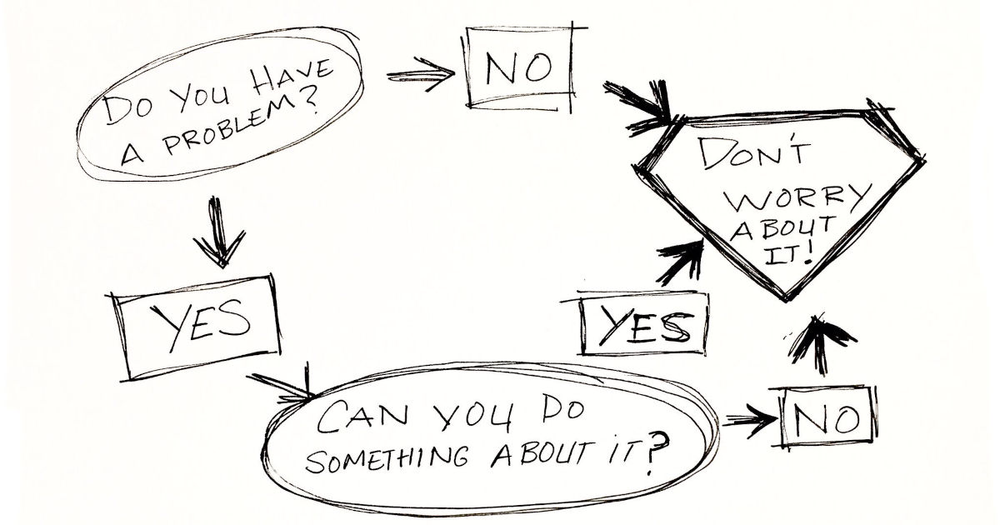

Katselin eilen puolison itkuista taistelua työstressin kanssa. Stressi on mielenkiintoinen, mutta usein tarpeeton reaktio, joka leviää myös muihin.

<!--more-->



Stressiin on useita enemmän tai vähemmän virallisia luokituksia. Näin maallikkona olen kokenut hyödyllisimmäksi jakaa stressin kahteen eri luokkaan sen mukaan, onko se seurausta omasta ajattelusta, vai jostain ulkoisesta ärsykkeestä.

En ole aiheen asiantuntija, joten kirjoitus kokoaa lähinnä omia ajatuksiani ja kokemuksiani stressistä.

### Ulkoisen ärsykkeen aiheuttama stressi

Ulkoisen ärsykkeen aiheuttama stressi on itselle usein tahdosta riippumatonta. Esimerkiksi sairastuminen, liika treenaaminen tai liian vähäiset yöunet voivat sysätä kehon stressitilaan. Tällaista tilaa on lähes mahdotonta korjata pelkällä omalla ajattelulla tai hengitysharjoituksilla. Ne vaativat konkreettisia toimia ja juurisyyn poistamisen.

Omassa arjessa yleisimpiä ulkoisia stressin aiheuttajia ovat kovat äänet sekä unen puute. Näistä erityisesti äänet ovat sellainen, johon keho reagoi paljon nopeammin kuin pää. En välttämättä ajattele aiheuttajaa lainkaan, tai anna sille erityistä huomiota. Huomaan stressin vasta, kun se pakottaa rintakehää ja tunnen oloni ahdistuneeksi.

Yksi ulkoisen stressitilan kivoja puolia on, että sen olemassaolo on verrattain helppo todeta. Sykevälivaihtelu on tyypillinen proxy, jonka kautta kehon stressitilaa voi mitata. Monet urheilukellot kykenevät seuraamaan sykevälivaihtelua ja raportoimaan päivän aikana koetusta stressistä.

On kuitenkin muistettava, että kaikki stressi ei ole pahasta. Juoksulenkki sysää kehon hetkellisesti stressitilaan, mutta sen vaikutus on positiivinen, kunhan keholle antaa mahdollisuuden palautua.

Mikäli juurisyystä ei pääse eroon, seurauksena voi olla jatkuva stressitilassa eläminen, jolla on lukuisia hyvinvointia ja terveyttä heikentäviä vaikutuksia. Ihmiset ovat mestareita mukautumaan, joten stressitilasta voi tulla uusi normaali. Sen haittavaikutukset eivät kuitenkaan poistu mihinkään.

Vietin itse tällaisessa tilassa lähes kolme vuotta asuessani melusaasteen keskellä.

### Oman ajattelun aiheuttama stressi

Oman ajattelun aiheuttama stressi syntyy isolta osin omien mielikuvien, sekä oman asenteen seurauksena. Kehossa se näkyy kuitenkin ihan samalla tavalla. Selkein ero on siinä, että fyysisen huonon olon päälle tulee henkinen kuorma.

Joskus tilanteeseen voi liittyä jonkin ympäristössä oleva jännittävä asia, mutta se itsessään ei kykene aiheuttamaan stressiä. Stressi vaatii, että rakennamme asiasta omassa päässämme paljon suuremman, kuin mitä se oikeasti on.

Tällainen stressi on monella tapaa turha, sillä se ei kerro mitään ympäristössä olevasta todellisesta uhkasta tai vaarasta. Alamme kuvitella ja ennustaa tulevaa. Nämä ajatukset sysäävät kehon stressitilaan. Suurin osa meistä on muodossa tai toisessa taipuvaisia tähän.

Taipumusta vastaan voi kuitenkin yllättävän hyvin taistella. Ajattelun aiheuttaman stressin välttämisessä itseäni auttoi havainto sen turhuudesta. Siitä on harvoin mitään hyötyä, mutta aina se huonontaa oloa. Pitkäkestoisena se romahduttaa terveyden siinä missä mikä tahansa muukin stressi.

Miksi tekisin oloni vapaaehtoisesti huonommaksi?

### Kuinka vältän stressiä

Aloitan yleensä tilanteen tarkastelulla. Uhkaako minua oikeasti jokin, vai kumpuaako olotila omasta ajattelusta?

Arvioinnissa on sellainen pieni haaste, että päädymme usein ulkoistamaan itse luodut ongelmat. Analysoinnin tulos voi olla esimerkiksi se, että "minulla on liikaa töitä". Mutta mitä se edes tarkoittaa?

Mikä on liikaa töitä? Miksi se määrä on liikaa? Miten työmäärä selittää stressin? Onko juurisyy todella liika työmäärä, vai onko liika työmäärä oire jostain muusta ongelmasta? Tunnenko sen olevan liikaa, koska olen väsynyt tai en osaa keskittyä? Onko se liikaa, koska minulla on elämässä muita murheita?

Omalla kohdalla kyse on useimmiten siitä, että 90 % stressistä syntyy omassa päässä. Loput 10 % ovat ulkoisia asioita, jotka voivat olla tylsiä ja ärsyttäviä, mutta eivät sellaisenaan selitä stressiä.

Ulkoisten asioiden kohdalla kysyn yleensä itseltäni, että ovatko ne *oikeasti* hyvä syy stressiin. Juuri koskaan ne eivät ole. Poikkeuksiakin tietenkin on. Esimerkiksi terveyteen liittyvät huolet voivat ihan hyvästä syystä aiheuttaa pientä stressiä. Jos stressiä aiheuttaa joulusiivous tai lomalle lähteminen, ehkä asiaa kannattaa tarkastella vähän syvemmin.

Kun tunnistan, että ulkoisilla asioilla on vaikutusta itseeni, mietin seuraavaksi, että voinko tehdä niille jotain. Jos minulla on liikaa töitä, ehkä voin kieltäytyä uusista töistä useammin. Ehkä voin antaa enemmän vastuuta muille. Ehkä voin keskustella pomon kanssa ja kertoa, että tarvitsen kaveriksi toisen työntekijän.

Moneen asiaan voi vaikuttaa. Vielä useampaan ei. On vaan hyväksyttävä se tosiasia, että kaikkeen ei voi vaikuttaa. Tästä päästäänkin siihen, että mitä tehdä sen 90 % kanssa, joka syntyy omassa päässä. Mitä tehdä niille asioille, jotka eivät ole omissa käsissä?

"Lopeta murehtiminen" kuulostaa typerän self-help -kirjan ohjeelta, mutta samaan aikaan se kiteyttää juuri sen, mitä voit tehdä. Voit vaikuttaa itseesi enemmän, kuin mihinkään muuhun asiaan. Siitä on hyvä aloittaa.

Kouluaikana stressasin hirvittävästi ihmisten edessä esiintymistä. Saatoin jännittää sitä monta päivää etukäteen ja tuhosin stressaamisella myös yöuneni. Nykyään se tuntuu ihan hölmöltä, sillä 100 % siitä stressistä syntyi omassa päässä. Silloin mietin, että entä jos mokaan? Entä jos kaikki nauraa minulle? Entä jos esitykseni tai sen sisältö on ihan surkea? Entä jos joku kysyy kysymyksen, johon en osaa vastata?

Samankaltaisia ajatuksia putkahtelee nykyäänkin mieleeni. Erona on se, että nykyään osaan kysyä myös "Mitä sitten?" Mitä sitten, vaikka mokaankin jotain? Mitä sitten, jos en osaa vastata johonkin? Mikä on pahinta mitä voisi tapahtua? Vaikka pitäisin mielikuvitukseni oikein kunnolla peliin, en kykenisi keksimään mitään kovin vakavaa.

Kun nykyään joudun puhumaan ihmisten edessä, tiedän, että jokainen on tullut kuuntelemaan minua ja toivoo, että onnistun. Jos teen jonkun mokan, ketään ei kiinnosta. Ehkä sille nauretaan hyväntahtoisesti ja minä voin nauraa mukana. Jos en osaa vastata johonkin, vastaan "en tiedä, mutta voin selvittää myöhemmin." Muiden edessä oleminen on minulle edelleen myrkkyä johtuen introverttiudesta, mutta ainakaan minä en pahenna tilannetta omalla ajattelulla. En pidä siitä, mutta en myöskään stressaa siitä.

Avainasemassa oli ajattelutavan muutos. Aloin suhtautua muiden edessä olemiseen eri tavalla. Asioiden katsominen uudessa valossa on taito, jota voi harjoitella. 

Pyrin käyttämään samaa tekniikkaa kaikkeen, joka aiheuttaa stressiä. Kun liskoaivot alkavat generoida huonoa oloa, pyrin pysäyttämään sen paljon kestävämmillä ajatuksilla. Itselleni "mikä on pahinta mitä voisi tapahtua?" -ajattelu toimii hyvin, koska se konkretisoi sen, kuinka tarpeetonta ja usein naurettavaa stressaaminen on. Kaikille se ei tietenkään sovi ja voi johtaa jopa suurempaan stressiin.

### Kun stressistä tulee tapa

Olen tavannut elämäni aikana jonkin verran ihmisiä, joille stressaaminen tuntuu olevan opittu tapa. Oma puolisonikin vaikuttaa kuuluvan tähän kategoriaan. Omien kokemusten perusteella tällaisilla ihmisillä on kaksi yhteistä piirrettä: he eivät osaa selkeästi yksilöidä stressin aiheuttajaa, ja stressi tulee vastaan useilla elämän osa-alueilla.

Kun puolisoni alkoi toissa päivänä parkua sitä, että hänellä on liikaa töitä tai liikaa vastuuta, yritin kysyä häneltä, että mikä häntä tarkalleen ottaen stressaa. Muistutin häntä samalla siitä, että hän on vain rivityöntekijä, jolla ei sellaisenaan ole päätäntävaltaa töiden määrään, priorisointiin tai prosesseihin, mutta ei myöskään vastuuta siitä, jos asiat menevät pieleen.

Sain vastauksena hirveän määrän yksityiskohtaista nippelitietoa siitä, miten henkilö A ei tee asiaa B ja kuinka asia X sotkee projektin Y. Lista vaan kasvoi ja kasvoi, eikä hän tuntunut osaavan millään tasolla konkretisoida sitä, miksi ne asiat aiheuttavat stressiä. Kaikki asiat aiheuttivat stressiä. Ne aiheuttavat stressiä, koska ne aiheuttavat stressiä. Se oli itsensä selittävä ja itseään ruokkiva voima.

Sitten on ne muut elämän osa-alueet. Liikaa töitä? Stressi. Joulusiivous? Stressi. Lomalle lähtö? Stressi. Vieraita tulossa kylään? Stressi. Uusi projekti? Stressi. Arkiasioita hoidettavana? Stressi. Tällainen tapa suhtautua ympäröivään maailmaan on raskasta paitsi itselle, niin myös lähellä eläville ihmisille. Stressillä on myös tapana tarttua ja se näkyy selvästi etenkin työyhteisöissä.

Meillä modernia länsimaista elämää elävillä ihmisillä on loppujen lopuksi hyvin vähän todellisia syitä stressiin. Tietenkin jotkut asiat voivat olla jännittäviä, jopa stressaavia. Kun irtisanoutuu uuden työpaikan takia, siinä on mukana pieni taloudelliseen turvallisuuteen liittyvä riski. Ehkä pieni stressi on ihan oikeasuhtainen reaktio. Jos tällaiset tai tätä pienemmät arjen epävarmuudet aiheuttavat halvaannuttavaa stressiä ja kyyneliä, ehkä siinä kohtaa kannattaa kääntää katsetta enemmän sisään päin.

Sillä on yllättävän paljon vaikutusta, kuinka asioihin suhtautuu. Ei se tietenkään tee immuuniksi stressille, mutta opettelemalla omien ajatusten hallintaa, itse aiheutetun stressin määrää voi tuntuvasti vähentää. Työ lienee yksi typerimmistä syöstä pilata oma terveys. Kukaan ei tule koskaan palkitsemaan tai kiittämään sinua siitä, että stressasit niin paljon.

### Joskus stressi kuuluu asiaan

Tapasin jokin aika sitten ystäväni, jota en ollut nähnyt moneen vuoteen. Näin hänestä heti, että hän on stressaantunut ja huolissaan. Kysyinkin suoraan, että mikä on mielen päällä. Hän kertoi, että hoitaa nykyään muistisairasta äitiään. Hänellä ei ole juurikaan aikaa itselleen ja on muutenkin surullista seurata sivusta äidin muuttumista.

Minun on helppo ymmärtää, miksi tällainen tilanne luo stressiä. Stressi tuntuu ihan perustellulta. Emme ole robotteja. Kaverini osasi kuitenkin yksilöidä stressin aiheuttajan suoraan, mikä jo itsessään kertoo minulle siitä, että se on ensisijaisesti olosuhteiden aiheuttamaa.

Ajattelen, että stressi on eräänlainen evoluution varoitussignaali, joka tekee toistuvia vääriä hälytyksiä. Sillä on ollut selkeä käyttötarve historiassa, mutta modernissa maailmassa ne tarpeet ovat harvassa. Välillä ne varoitukset ovat kuitenkin aiheellisia.

Silloin ne kannattaa huomioida ja niihin kannattaa reagoida. Ne ovat kehon tapa muistuttaa, että sinun on pidettävä huolta itsestäsi.

Samaan aikaan pyrin suhtautumaan niihin hetkellisinä hälytyksinä. Stressi on kuin kello, joka ilmoittaa koululaisille, että nyt on aika pitää tauko ja mennä välitunnille. Kellon pirinää ei tarvitse jäädä kuuntelemaan päiväkausiksi tai kuukausiksi.

Joskus tarvitsemme välituntia elämästä ja omasta ajattelusta.
