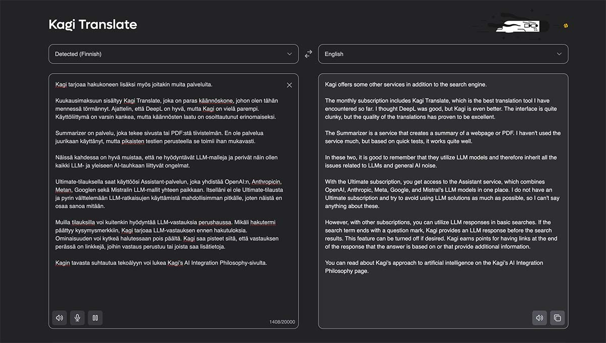

Olen käyttänyt maksullista [Kagi](https://kagi.com)-hakukonetta neljä kuukautta. Kannattaako hakukoneesta maksaa?

<!--more-->



Kagia voi kokeilla sadan haun verran ilmaiseksi. Sen jälkeen tarjolla on kolme eri hintaista tilausta. 300 hakuun rajoitettu start-tilaus maksaa **$5/kk**, rajaton professional-tilaus **$10/kk** ja viimeisenä on **$25/kk** maksava ultimate-tilaus, johon kuuluu lisäksi erilaisia LLM-malleja hyödyntävä assistant-palvelu. Ilmoitetut hinnat eivät sisällä veroja.

Itse päädyin professional-tilaukseen. Arvelin, että 300 hakua kuukaudessa ei riitä minulle. Arvaus osui oikeaan ja asia on ollut helppo vahvistaa, sillä tilin takaa löytyvät hakutilastot, josta asian voi helposti varmistaa. Esimerkiksi viime kuussa tein 1284 hakua.

Mitä rahalla sitten saa? Lyhyesti: vapauden mainoksista ja seurannasta, hallintaa sekä hyvät hakutulokset.

### Ei mainoksia eikä seurantaa

Koska Kagin toiminta ei perustu käyttäjien datan keräämiseen ja mainoksiin, se on täysin vapaa mainoksista. Hakutuloksissa ei ole näy sponsoroituja mainoksia.

Kagi on käytännössä täysin vapaa käyttäjien seurannasta ja siinä on ominaisuuksia, jotka estävät myös kolmannen osapuolen seurannan. Kaikki nämä asiat on avattu yksityiskohtaisesti [Kagin tietosuojasivulla](https://kagi.com/privacy).

### Hakuominaisuudet

Itselleni yksi tärkeimpiä ominaisuuksia, joka erottaa Kagin muista hakukoneista, on sen tarjoama hallinta.

Pystyn [räätälöimään hakutuloksia](https://help.kagi.com/kagi/features/website-info-personalized-results.html) mieltymyksieni mukaan. Voin asettaa tietyt sivut korkeammalle prioriteetissa, jolloin ne myös näkyvät hakutuloksena ensimmäisenä. Vastaavasti voin myös priorisoida niitä alemmaksi tai piilottaa kokonaan. Sama ominaisuus toimii myös videokanaviin. Olen käyttänyt tätä muun muassa siihen, että voin priorisoida maksumuurin takana olevat sivut alemmaksi. Olen myös blokannut sellaisia sivuja, jotka harrastavat räävitöntä käyttäjätietojen louhimista. Videopuolella olen pystynyt piilottamaan MrBeastin kaltaiset roskakanavat, sekä AI-generoitua sisältöä suoltavat kanavat.

Toinen Kagin mukava ominaisuus on [Lenses](https://help.kagi.com/kagi/features/lenses.html). Niiden avulla voin määrittää itse, että millaisiin sivuihin haku kohdistuu tai mitkä sivut jätetään aina pois tuloksista. Lisäksi linssiin voi asettaa myös muita rajoituksia esimerkiksi kieleen, yksittäisiin sanoihin tai aikaan liittyen. Tämän avulla pystyin tekemään erillisen linssin, joka hakee tuoreita uusia muutamasta suomenkielisestä uutislähteestä. Kagi tarjoaa oletuksena joitakin hyödyllisiä linssejä, joiden avulla hakuja voi kohdistaa muun muassa ohjelmointiin, tieteelliseen tutkimukseen sekä foorumeihin.

Näiden kahden ominaisuuden lisäksi Kagista löytyy läjäpäin asetuksia, joilla hakukokemusta saa muokattua itselleen mieluisaksi.

### Muut palvelut ja AI

Kagi tarjoaa hakukoneen lisäksi myös joitakin muita palveluita.

Kuukausimaksuun sisältyy [Kagi Translate](https://help.kagi.com/kagi/ai/translate.html), joka on paras käännöskone, johon olen tähän mennessä törmännyt. Ajattelin, että DeepL on hyvä, mutta Kagi on vielä parempi. Käyttöliittymä on varsin kankea, mutta käännösten laatu on osoittautunut erinomaiseksi.

[Summarizer](https://help.kagi.com/kagi/ai/summarize-page.html) on palvelu, joka tekee sivusta tai PDF:stä tiivistelmän. En ole palvelua juurikaan käyttänyt, mutta pikaisten testien perusteella se toimii ihan mukavasti.

Näissä kahdessa on hyvä muistaa, että ne hyödyntävät LLM-malleja ja perivät näin ollen kaikki LLM- ja yleiseen AI-tauhkaan liittyvät ongelmat.

Ultimate-tilauksella saat käyttöösi [Assistant-palvelun](https://help.kagi.com/kagi/ai/assistant.html), joka yhdistää OpenAI:n, Anthropicin, Metan, Googlen sekä Mistralin LLM-mallit yhteen paikkaan. Itselläni ei ole Ultimate-tilausta ja pyrin välttelemään LLM-ratkaisujen käyttämistä mahdollisimman pitkälle, joten näistä en osaa sanoa mitään.

Muilla tilauksilla voi kuitenkin hyödyntää LLM-vastauksia perushaussa. Mikäli hakutermi päättyy kysymysmerkkiin, Kagi tarjoaa LLM-vastauksen ennen hakutuloksia. Ominaisuuden voi kytkeä halutessaan pois päältä. Kagi saa pisteet siitä, että vastauksen perässä on linkkejä, joihin vastaus perustuu tai joista saa lisätietoja.

Kagin tavasta suhtautua tekoälyyn voi lukea [Kagi's AI Integration Philosophy](https://help.kagi.com/kagi/why-kagi/ai-philosophy.html)-sivulta.

### Hakutulosten laatu

Hakukoneella ei tee mitään, ellei se pysty tarjoamaan järkeviä hakutuloksia. Oman kokemukseni mukaan Kagi toimii tässä suhteessa erinomaisesti. Ilman räätälöityjä asetuksiakin hakemani löytyy usein ensimmäiseltä sivulta, mutta niiden kanssa tulosten laatu paranee entisestään.

Kagi toimii ongelmitta myös Suomeksi. Myös sen LLM-vastaukset kääntyvät Suomeksi, mikäli kysymys on esitetty suomeksi.

Kuvahaun puolella palvelu osaa jonkinlaisella menestyksellä tunnistaa AI-generoidut kuvat. Ne voi halutessaan piilottaa tuloksista. En ole itse ihan hirveästi törmännyt Kagin tuloksessa generoituihin kuviin, joten ominaisuus on ollut aika vähällä käytöllä. Testien perusteella monet ilmiselvät AI-kuvat kuitenkin pääsevät Kagin filtteristä läpi.

Kagin tuloksissa on kuitenkin pari piirrettä, jonka voi nähdä ongelmana.

Sen tuloksissa näkyy usein tismalleen samat jättisivustot, jotka näkyvät kaikissa hakukoneissa. Tämä on tullut vastaan esimerkiksi silloin, kun on halunnut etsiä matkailuun liittyvää tietoa. Samat booking.comit ja tripadvisorit jyräävät helposti alleen pienemmät sivut, joilta voisi löytää paljon mielenkiintoisempaa sisältöä. Luonnollisesti suuret matkailusivustot ovat monella tapaa hyödyllisiä, mutta tämä on hyvä tiedostaa. Tietenkin voit aina luoda oman linssin, jossa nämä suuret sivustot on piilotettu.

Toinen piirre on se, että tulokset sisältävät paljon AI-generoituja roskasivustoja. Jos et tiedä mistä on kysymys, kannattaa katsoa Freya Holmérin video [Generative AI is a Parasitic Cancer](https://www.youtube.com/watch?v=-opBifFfsMY). Netti on niin täynnä generoituja ja hakukoneoptimoituja roskasivustoja, että oikean tiedon löytäminen on monesti vaikeaa. Ongelma on ole varsinaisesti Kagissa vaan siinä, minkälaiseksi web on muuttunut. Kaikki hakukoneet kärsivät tästä ongelmasta.

Toivoisin kuitenkin, että Kagi toisi hakukoneeseen kuvahaun kaltaisen ominaisuuden, joka tunnistaisi AI-generoidun roskan, ja tarjoaisi helpon mahdollisuuden suodattaa ne pois hakutuloksista.

### Hakuindeksit

Kagilla on oma hakuindeksinsä, mutta sen lisäksi se hyödyntää myös muiden hakukoneiden indeksejä. Palveluun on integroitu muitakin palveluita, kuten [Wolfran Alphan](https://www.wolframalpha.com), [Open Street Maps](https://www.openstreetmap.org) sekä [Tripadvisor](https://www.tripadvisor.com). Joitakin voi kiinnostaa myös se, että palveluiden joukossa on myös venäläinen Yandex.

Siitä minulla ei ole tietoa, kuinka Kagi lopulta hyödyntää ulkopuolisia palveluita, mutta Kagin dokumentaatio antaa jotain suuntaa [periaatteista, joilla ulkopuolisia palveluita käytetään](https://help.kagi.com/kagi/search-details/search-sources.html).

Kaikki ulkopuolisiin palveluihin kohdistuvat kyselyt menevät Kagin läpi niin, ettei niiden mukana kulje käyttäjätietoja.

### Saako rahoilleen vastinetta?

Mielestäni saa. Yksityisyyttä suojaava, mainoksista vapaa ja hyvät hakutulokset tarjoava hakukone tuntuu raikkaalta tuulahdukselta nykyisten hakukoneiden rinnalla. Olen käyttänyt aikaisemmin [Startpagea](https://www.startpage.com), [DuckDuckGota](https://duckduckgo.com) sekä [Brave Searchia](https://search.brave.com). Vaikka kaikki näistä tarjoavatkin yksityisyyttä, hakutulosten laatu sekä käyttökokemus ovat Kagissa aivan toisella tasolla.

Kun hakukoneen kaveriksi saa erinomaisen käännöskoneen, diili tuntuu ainakin minusta hyvältä. Positiivista on myös se, että Kagi kehittää jatkuvasti uusia ominaisuuksia, jotka parantavat käyttökokemusta.

Vaikka en pidäkään siitä, kuinka vahvasti Kagi panostaa AI-hypeen, kokonaisuudessaan se on tuntunut hyvältä palvelulta.

