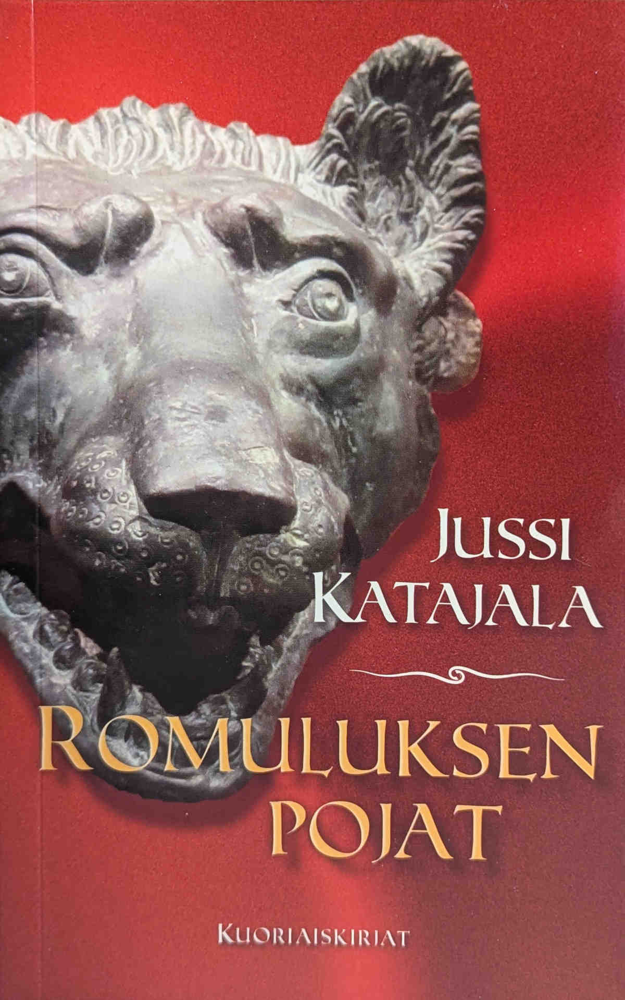

Kun haluamaani kirja ei ollut kirjastossa vapaana, päätin ottaa lukuun puolison hyllystä löytyneen pienoisromaanin, Jussi Katajalan kirjoittaman Romululuksen pojat.

<!--more-->

### Tarina

Eletään vuotta 22 ennen ajanlaskumme alkua. **Marcus Merula** on Roomassa asuva olympiaurheilija ja [pankration](https://fi.wikipedia.org/wiki/Pankration)-mestari. Hän on taitava ottelija, jolle urheilu on kunnia asia. Hänen silmissään olympialaiset ovat tapahtuma, jossa otellaan jumalten edessä.

Merulan vuokraisäntänsä, majataloa pitävä **Vibius**, haluaisi leipoa hänestä gladiaattorin. Tämä sotii Merulan periaatteitaan vastaan, mutta totuus on, että hän tarvitsee rahaa. Marcus alkaa olla unohdettu tähti, eikä hänen taidoilleen ole juurikaan käyttöä olympialaisten ulkopuolella.

Kohtalo puuttuu peliin, sillä Vibiuksen majataloon astelee senaattori **Picens**, joka kantaa mukanaan kadulta löytynyttä, henkihieveriin hakattua miestä. Vastentahtoisesti Vibius ottaa uhrin majataloonsa ja Marcus päätyy vahtimaan hänen vointiaan yöllä. Hän yrittää selvittää, kuka miehen kimppuun kävi ja mies vastaa vain yhdellä sanalla: "Lupus" - susi. Aamulla mies on kuollut.

Vibius haluaa selvittää murhan, vaikka hän ei tuntenut uhria. Hänen maineensa on vaakalaudalla, jos ihmiset tietävät, että hänen majatalossaan kuolee ihmisiä. Hän palkkaa Merulan selvittämään murhan tekijää. Marcus tarvitsee rahaa, joten hän suostuu. 

### Antiikkinen jännäri

Jussi Katajala on tuttavani, mutta en ole koskaan lukenut hänen tuotantoaan. Tiesin hänen kirjoittavan scifi-tarinoita, joten olin hieman yllättynyt, että kirja sijoittuikin antiikin Roomaan. En tiennyt yhtään, mitä odottaa.

Romuluksen pojat on reilut 130 sivua pitkä rikosjännäri ja murhamysteeri. Sen näyttämönä toimii antiikin Rooma, mutta monelta osin tarina voisi tapahtua myös nykyhetkessä.

En itse tiedä antiikin Rooman kuvioista juuri mitään, mutta Katajala oli onnistunut luomaan ajankuvan tavalla, joka minun oli helppo sisäistää. Hetkittäin tuli kuitenkin fiilis, että ajankuvaan liittyvää nippelitietoa oli vähän liikaakin. Se tuntui päälle liimatulta, ikään kuin kirjailija olisi halunnut korostaa sitä, kuinka paljon hän tietää antiikin Roomasta.

Vaikka historialliset teokset eivät ajatuksena minua kauheasti kiinnosta, Romuluksen pojat oli yllättävän viihdyttävä. Se kertoo yksinkertaisen ja suoraviivaisen tarinan, joka piti minua otteessaan.

### Henkilöhahmot

Kun pokkarilla on mittaa vain 130 sivua, jostain on tingittävä. Se jokin tuntui tässä tapauksessa olevan hahmokehitys.

Päähenkilö Marcus Merula saa kirjassa selvästi eniten huomiota. Hänellä oli selkeä persoona, taustatarina ja motivaatio toimia.

Marcus on kykenevä stoalainen urheilija, joka muistuttaa jonkinlaista supersankaria kuitenkaan olematta sitä. Hän osaa käsitellä ihmisiä, on hyvä puhumaan, kykenee selvittämään rikoksia, ei pelkää mitään ja pystyy pitämään huolta itsestään myös silloin, kun tarvitaan väkivaltaa. Muut ihmiset eivät ole hänelle uhka. Rahahuolet ja yhteiskunnassa pärjääminen on. Hän toimii johdonmukaisesti ja käyttää järkeään, eikä tunteille ole juurikaan sijaa.

Kaikki muut hahmot unohdin samoin tein ja välillä minulla oli jopa vaikeuksia muistaa, kuka on kuka. Päätäni sotkivat muinaisen Rooman nimet, jotka eivät jääneet lainkaan mieleeni.

### Harmiton tarina

Romuluksen pojat on tarina, josta käyttäisin termiä harmiton. Se ei ole erityisen hyvä, nerokas tai yllättävä, mutta se onnistui silti viihdyttämään alusta loppuun.

Pidin Katajalan napakasta tyylistä. Tarina etenee sujuvasti, eikä siinä ole juurikaan turhaa täytettä. Missään kohtaa en päässyt pitkästymään, ja hetkittäin tarina on varsin jännittävä. Pisteet siitä, kuinka kiinnostavaksi historiallinen asetelma oli saatu tällaiselle [hard scifin](https://fi.wikipedia.org/wiki/Kova_tieteiskirjallisuus) ystävälle.

Tykkäsin myös tavasta, jolla Katajala oli tuonut pankrationin ja väkivallan osaksi tarinaa. Se on hetkittäin brutaalia, mutta arkipäiväistä. Kun tarina tapahtuu ajassa, jossa urheilijat saattavat otella kuolemaan asti, ja väliaikaviihdettä ovat rikollisten teloitukset, mitä muutakaan se voisi olla? Kun Marcus käyttää pankrationtaitojaan, hän pyrkii pudottamaan vastustajansa nopeasti ja tehokkaasti. Se tuo mukavaa kontrastia kirjan muuten varsin kepeään kerrontaan ja Marcusin hillittyyn olemukseen.

Suurin kritiikkini kohdistuu tapaan, jolla tarina päättyy. Murhamysteereiden kohdalla kaipaan sitä, että mysteeri avautuu hiljalleen paitsi päähenkilölle, niin myös lukijalle. Myös murhaajan motiivin pitäisi käydä järkeen ja istua kokonaisuuteen. Romuluksen pojat ei oikein onnistu tässä.

Kirjan loppu muistuttaa vanhoja Bond-elokuvia, jossa pääpahis pitää pitkän monologin, jossa hän kertoo, miksi toimi niin kuin toimi. Lukijan pitää vaan uskoa hänen sanaansa. Tarinassa on kyllä selkeä loppu, mutta se ei ole erityisen tyydyttävä. Se ei ole myöskään erityisen uskottava, koska sitä pohjustetaan niin vähän.

Romuluksen pojat oli ihan hauska poikkeus siinä, mitä olen viimeisen vuoden aikana tottunut lukemaan. Se on kelvollinen keskitien miniromaani. Ei huono, mutta ei erityisen hyväkään. Harmiton!

