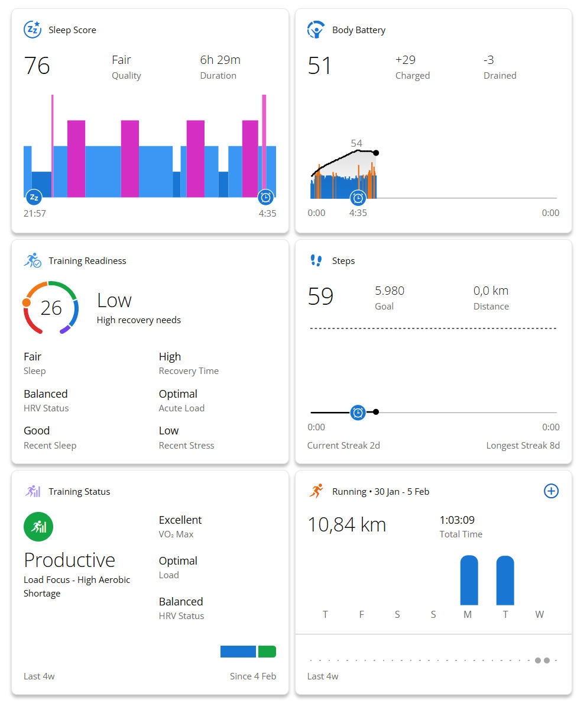

Päivitin reilut kolme viikkoa sitten Garmin Forerunner 935 -urheilukelloni uudempaan versioon.

<!--more-->



Ensimmäinen Garmin-kelloni oli [Forerunner 310XT](https://www.garmin.com/fi-FI/p/27335), jota ei kylläkään voinut kokonsa puolesta kelloksi kutsua. Vuosien käytön jälkeen päivitin sen [Forerunner 935:een](https://www.garmin.com/fi-FI/p/564291), joka päivittyi nyt [Forerunner 965:een](https://www.garmin.com/fi-FI/p/886725/pn/010-02809-10).

Päivittämiseen ajoi erityisesti kaksi asiaa: vanhan kellon sykesensori ei toiminut kunnolla[^1] ja halusin paremman unen seurannan. Kellossa on lisäksi kourallinen muitakin ominaisuuksia, jotka kiinnostivat.

Kun iskin kellon ranteeseen, ensimmäisenä huomioni kiinnittyi sen erinomaiseen *AMOLED*-näyttöön. Näyttö on kirkas ja sitä on helppo lukea myös aurinkoisella säällä. Kyseessä on kosketusnäyttö, mikä on neljän fyysisen napin kaverina mukava lisä. Jotkin asiat on kivempi tehdä näyttöä pyyhkimällä. Kirkkaat värit ja hyvä kontrasti tekevät käyttöliittymästä ainakin omaan silmään selkeän, joskin oletuksena oleva kellotaulu oli aivan liian sekava.

Forerunner 965:n sykesensori toimii varsin hyvin. Se pystyy mittaamaan myös veren happisaturaation. Juostessa käytän aina erillistä sykevyötä, mutta laitteen omallakin sensorilla pääsee ihan hyviin tarkkuuksiin. Yleisen hyvinvoinnin seurannassa itselleni tärkeintä on se, että pystyn tarkastelemaan sykevälivaihtelua (HRV), sillä se on yksi parhaista indikaattoreista kehon stressitilasta. Omalla kohdalla se on myös hyvä henkisen hyvinvoinnin mittari.

Vaikka Forerunner 965 on ensisijaisesti urheilukäyttöön tarkoitettu, siinä on myös hyvät työkalut unen ja yleisen vireystilan seurantaan. Luonnollisesti kuuntelen kehoani, mutta työkalut auttavat seuraamaan pidemmän aikavälin muutoksia. Ne osaavat myös muistuttaa asioista, joita ei joka hetki muista itse huomioida.

Pidän itse siitä, että kello näyttää joka aamu raportin edellisestä yöstä ja antaa suosituksen siitä, kuinka tuleva päivä olisi hyvä hoitaa. Iltasin kello muistuttaa, jos keho kaipaa rauhoittumista ennen nukkumaan menoa. Garminin oma Body Battery -mittari kiteyttää mukavasti stressin, unien ja liikunnan yhteisvaikutuksen. Jos päivä alkaa puolilla tehoilla, tiedät, että jossain on parannettavaa.

Kartat ovat iso juoksemiseen liittyvä parannus. Aikaisemmassa kellossa oli kyllä opastus, mutta karttojen puutteen takia niiden seuraaminen oli välillä todella vaikeaa. Tykkään tehdä juoksulenkkejä, joissa valitsen satunnaisen määränpään, enkä välttämättä tiedä reittiä sinne. Kartat tulevat varmasti helpottamaan ensi kesän pidempiä juoksuja.

Kellossa on sisäänrakennettu onnettomuuden tunnistus ja hälytysjärjestelmä. Onnettomuuden tunnistus pohjautuu tietojeni mukaan siihen, että kello havaitsee äkkipysähdyksen, jota seuraa liikkumattomuus. Sen jälkeen se lähettää ilmoituksen merkityille yhteyshenkilöille. Yhteishenkilöt näkevät suoraan kartalta, missä olet. Hälytyksen voi aktivoida myös itse.

Vaikka minulla ei tällä hetkellä ole selkeitä juoksu- tai kuntotavoitteita, tykkään silti käyttää urheilukelloa harjoittelun tukena. Minulla on taipumus treenata liikaa ja liian kovaa. Tässä auttaa Garminin oma training status sekä training readiness. Ensimmäinen kertoo siitä, kuinka kehittävää viime päivien treenaaminen on ollut. Jälkimmäinen puolestaan kertoo, kuinka vastaanottavainen keho on treenille. Siinä huomioidaan myös muut asiat, kuten uni ja stressi.

Kello toi parannuksia myös varsinaisten urheilusuoritusten analysointiin. Nyt minun on mahdollista nähdä mäet huomioon ottava tahti, eli grade adjusted pace. Sen avulla on helpompi vertailla juoksulenkkejä keskenään, vaikka toinen lenkeistä sisältäisi enemmän ylä- ja alamäkiä.

Toinen mukava lisäys on juoksuteho eli tieto siitä, kuinka monta wattia kehosta irtoaa juoksun aikana. Vaikka ensisijaisesti pidänkin sykeohjatuista harjoituksista, teho-ohjatut harjoitukset ovat mukava vaihtoehto. Tehosta on hyötyä myös pitkillä matkoilla, sillä sen avulla on helpompi arvioida, kuinka pitkälle energiat riittävät. Kellossa on myös oma näkymä, joka arvioi koko ajan sitä, kuinka paljon kropassa riittää paukkuja.

Forerunner 965:ssa on joitakin urheilun ja hyvinvoinnin ulkopuolisia uusia ominaisuuksia, kuten sisäisen musiikkisoittimen sekä Garmin Pay -maksamisen. En tarvitse kumpaakaan, mutta kiva silti, että ne ovat olemassa.

Kaiken kaikkiaan kello on ollut tosi mukava päivitys edelliseen. Pidän myös siitä, ettei sen käyttäminen vaadi minkäänlaista tilausta. Garmin Connect -palvelua voi käyttää ilman kuukausimaksua. Tämä onkin ihan suotavaa, sillä *669 euron* hintalapun päälle ei kiinnostele maksaa mitään ylimääräistä.

Toivottavasti tässä olisi kello moneksi vuodeksi eteenpäin!

[^1]: Onnistuin pudottamaan sen kylpyhuoneen lattialle melkein heti hankinnan jälkeen. Sen seurauksena sykesensorin edessä oleva lasi murtui, mikä oli varmasti omiaan huonontamaan sykesensorin toimintaa. Pärjäsin sen kanssa kuitenkin monta vuotta, joskaan veteen en uskaltanut kelloa enää upottaa.