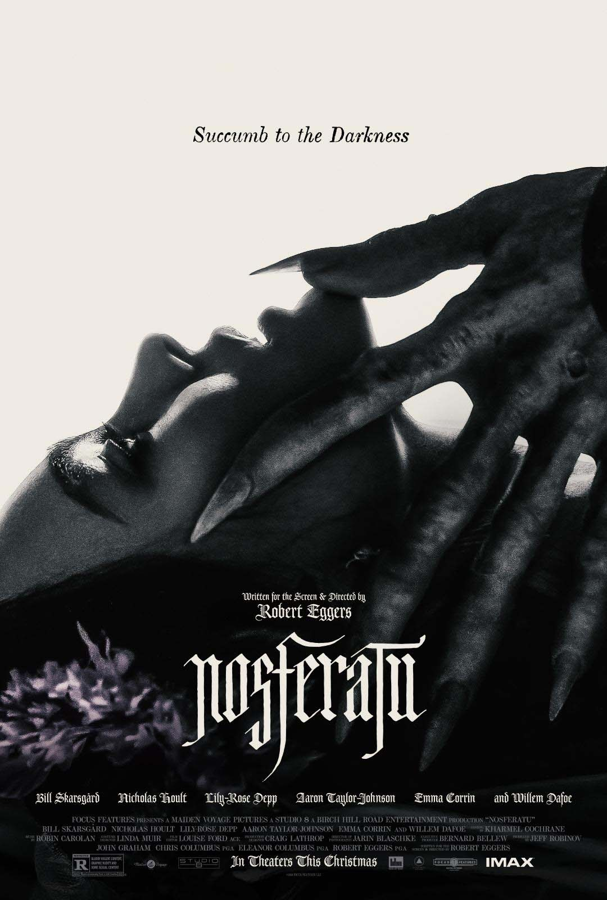
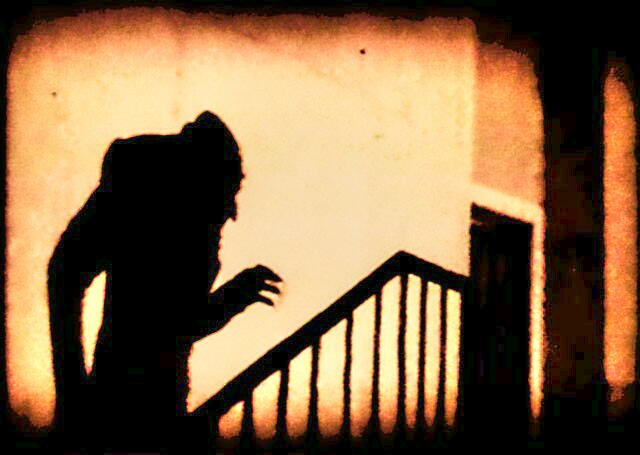

Minulla on hienoinen angsti vanhoja klassikkoelokuvia ja remakeja kohtaan, mutta kun kuulin hyvää uudesta Nosferatusta, pitihän se käydä katsomassa. Ja ihan hyvähän se olikin!

<!--more-->

### Synopsis

**Thomas** saa työtehtävän. Hänen on hoidettava kauppakirjaan allekirjoitus kreivi **Orlokilta**, joka on kiinnostunut ostamaan itselleen paikallisen jättimäisen, mutta kulahtaneen kartanon. Thomasille luvataan työstä tuntuva korvaus, mutta siihen liittyy koukku. Orlokin sanotaan olevan niin sairas, ettei hän pääse paikan päälle, joten Thomasin on matkustettava hänen luokseen Transylvaniaan asiakirjojen kanssa.

Thomasin tuore vaimo **Ellen** ei halua, että hänen miehensä on poissa niin kauan. Hänellä on siihen myös toinen syy: hän näkee näkyjä, jotka enteilevät, että Thomasille tapahtuu matkalla jotain pahaa. Thomas ottaa kuitenkin tehtävän vastaan, sillä suuren palkkion myötä he pääsisivät pois köyhyydestä.

Asiat eivät ole kuitenkaan ole niin kuin Thomas kuvitteli. Orlok onkin jotain aivan muuta, kuin tavallinen sairauden rapistama mies. Ellenin näyt eivät ole pelkkiä näkyjä.

Samaan aikaan kotona Ellenin näyt pahenevat ja hän alkaa saada kouristuksen kaltaisia kohtauksia. Hetkittäin hän vaikuttaa siltä, kuin olisi riivattu. Paikallinen lääkäri koettaa auttaa häntä parhaansa mukaan, mutta hänkään ei mahda oireille mitään. Pian kylään saapuu laiva, jonka vaikuttaa tuovan mukanaan ruton ja tuhansia rottia. Laivan mukana tulee myös jotain vielä pahempaa...

### Klassikkotarina

Alkuperäinen 1922 julkaistu mykkäelokuva Nosferatu pohjautuu Bram Strokerin Dracula-romaaniin. Opiskeluaikoina tuli katsottua useita klassikkoteoksia, mutta Nosferatun onnistuin missaamaan. En ole myöskään lukenut Draculaa. Uusi Nosferatu oli minulle näin ollen täysi yllätys ja menin teatteriin ilman ennakko-odotuksia.

Kun lopputekstit alkoivat vieriä, minulle tuli olo, että olin katsonut vanhan elokuvan. Se ei tuntunut modernilta tarinalta, vaikka olikin moderni filmatisointi. Elokuvasta puuttuivat monimutkaiset koukut, joita näkee tyypillisesti nykyelokuvien tarinoissa. Nosferatun tarina on suoraviivainen ja yllätyksetön, mutta se kerrotaan varsin viihdyttävällä tavalla. Arvostan sitä, ettei klassikkoteosta lähdetty modernisoimaan liikaa. En silti ihmettelisi, jos joku pitäisi elokuvaa tylsänä.

Elokuvan visuaalinen tyyli on selkeästi harkittu, mutta samaan aikaan se vaikuttaa kunnioittavan alkuperäistä elokuvaa. Luultavasti jokainen elokuvia enemmän harrastanut on nähnyt kuvan, jossa pitkäkyntisen Orlokin varjo kävelee rappusia ylös. Uusi elokuva vie tämän kerrontatyylin vielä pidemmälle ja tekee sen mielestäni onnistuneesti. Vaikka tämä on värielokuva, värejä on paikoitellen niin vähän, että se tuntuu mustavalkoiselta.

Tyylissä on kuitenkin kaksi asiaa, jotka häiritsivät minua.

Ensimmäinen on se, että elokuva on aivan järkyttävän pimeä. Välillä on vaikea saada tolkkua siitä, mitä ruudulla tapahtuu, kun kaikki tapahtuu himmeän kynttilän valossa. Ehkä tämä oli jonkinlainen kunnianosoitus alkuperäiselle elokuvalle, mutta vähempikin olisi riittänyt.

Toinen on se, että hetkittäin elokuva näyttää typerryttävän digitaaliselta. 1800-luvun kaupungin kaduilla tapahtuvat kohtaukset ja jotkin abstraktimmat hetket olivat upeaa katseltavaa, mutta toiset kohtaukset näyttivät uskomattoman rujoilta ja halvoilta. Välillä tuntui, että elokuva oli tumma osittain siksi, etteivät huonot digitaaliset ympäristöt näyttäisi niin karsealta.

### Näyttelijät ja hahmot

Elokuvassa on läjäpäin hyviä näyttelijöitä. Minun on kuitenkin todettava, että *Willem Dafoe* varastaa shown. Hänen esittämä **Albin Eberhart von Franz** on aivan omassa luokassaan paitsi henkilöhahmona, niin myös roolisuorituksena. Kyseistä hahmoa ei ole sen enempää Draculassa kuin alkuperäisessä Nosferatussakaan, eli se on tähän elokuvaan kirjoitettu uusi hahmo. Omalaatuinen ja värikäs, mutta hieman kajahtanut proffa toi mukavaa keveyttä muuten niin synkkään tarinaan. Hän tuntuu olevan tarinan ainut henkilö, jonka tekemiset vievät tarinaa aidosti eteenpäin.

*Aaron Taylor-Johnson* oli mukava yllätys. Näyttelijä ei ole minulle erityisen tuttu, mutta hän onnistui esittämään uskottavasti vahvasti omiin arvoihinsa ja tieteeseen nojaavaa **Friedrich Hardingia**. Harding on muutenkin mielenkiintoinen hahmo, sillä hän on samaan aikaan päähenkilöiden tukena, mutta toimii hetkittäin myös heitä vastaan. Hänestä tekee mielenkiintoisen myös se, että hän joutuu toistuvasti punnitsemaan ja kyseenalaistamaan omia arvojaan ja kamppailemaan sisäisten ristiriitojen kanssa.

Olin hieman pettynyt *Nicholas Houltin* esittämään **Thomasiin**. Tiedän, että hän on erinomainen näyttelijä, mutta minulle jäi fiilis, että hänen ammattitaitonsa valui hukkaan. Thomas on lähinnä alahuultaan väpättävä nahjus, joka matkustaa tarinan mukana, mutta ei alkua lukuun ottamatta ohjaa itse tarinan suuntaa.

*Lily-Rose Deppin* roolisuoritus oli hieman ristiriitainen. Hän veti uskottavalla tavalla laidasta toiseen seilaavan **Ellenin** roolin, mutta toisaalta ison osan ajasta Ellen on silmät levällään haahuileva yhden ilmeen puunaama. Parhaimmillaan Ellen oli mahtava, huonoimmillaan ärsyttävän tylsä.

Erityismaininta on annettava *Bill Skarsgårdille* ja hänen versiolle kreivi **Orlokista**. Elokuvan Orlok on käsittääkseni tarkin kuvaus alkuperäisestä Draculasta. Hän ei ole kalpeanaamainen luihukorva vaan... noh, jotain ihan muuta. Orlok on hyytävä hahmo paitsi ulkonäöltään, niin myös käytökseltään. [It](https://www.imdb.com/title/tt1396484/) osoitti, että Skarsgårdilla on pelisilmää friikkeihin hahmoihin ja Nosferatu vaan vahvistaa tätä mielikuvaa.

### Ihan hyvä

En ole varsinaisesti kauhuelokuvien suuri ystävä, joten Nosferatu ei ollut ihan minua varten. Se oli kuitenkin viihdyttävä, vaikka hetkittäin meno muuttui omaan makuun turhan hatsaiseksi. Elokuva tuntui myös aavistuksen liian pitkältä, mutta kokonaisuudessaan se oli kuitenkin ihan hyvä. Tarina ei tarjoile mitään erityisen mullistavaa, mutta se kulkee sujuvasti eteenpäin omalla tavallaan ja onnistui viihdyttämään ainakin minua.

