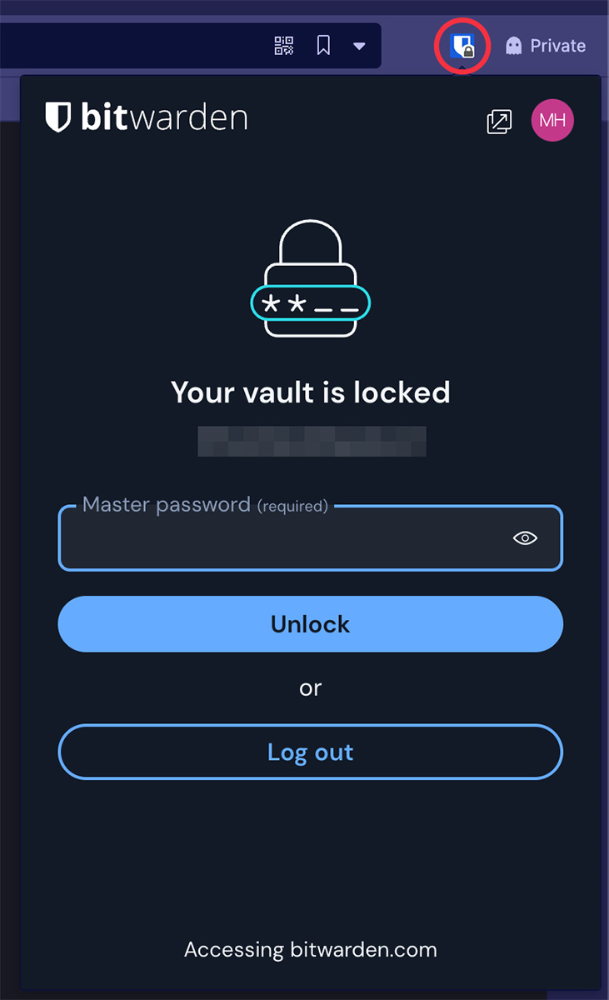
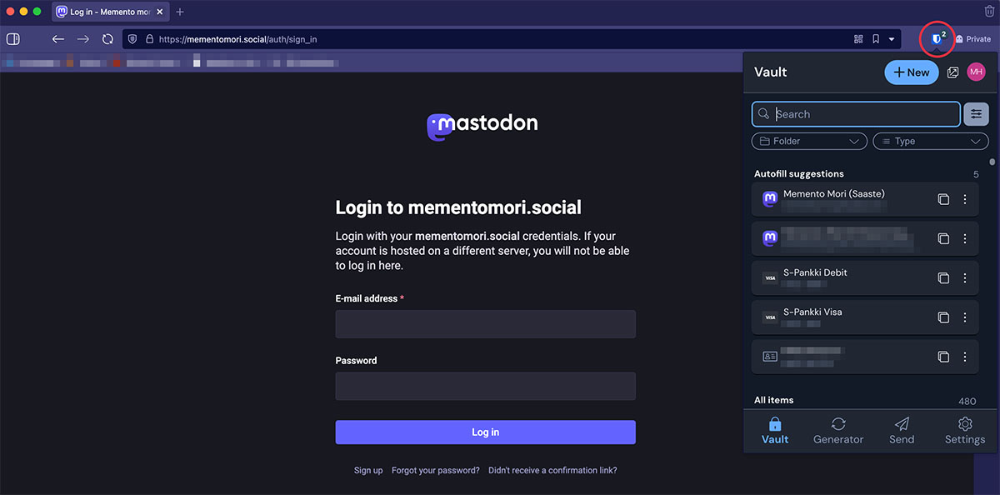
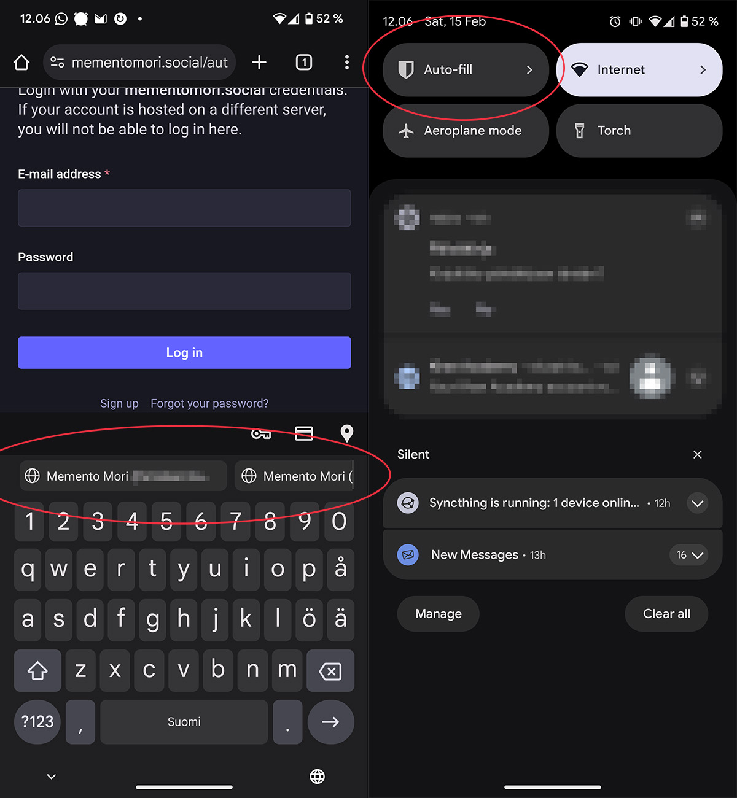
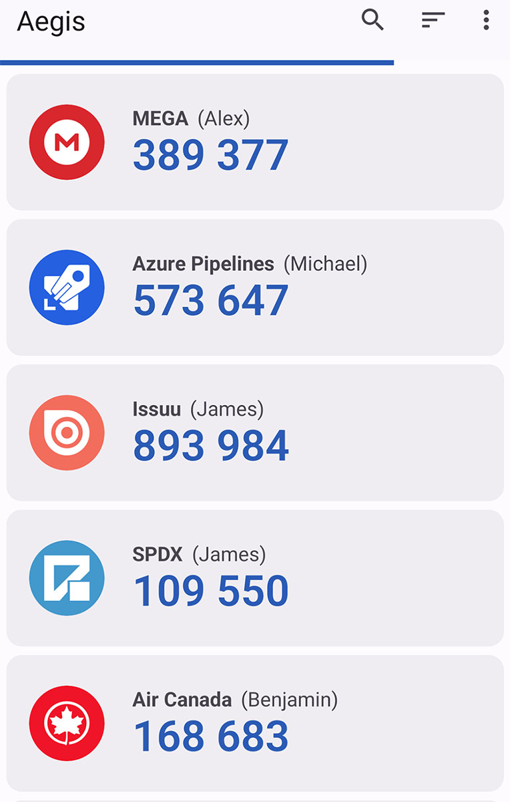

Jos et vielä käytä salasanamanageria, nyt on hyvä aika aloittaa. Mistä niissä on oikeastaan kysymys ja kuinka niitä käytetään?

<!--more-->

### Miksi salasanamanageria tarvitaan?

Salasanojen heikoin lenkki on useimmiten niitä käyttävä ihminen. Useamman salasanan muistaminen on vaikeaa, joten useampi meistä päätyy käyttämään samaa, helposti muistettavaa salasanaa eri palveluissa. Helposti muistettavat salasanat on usein myös helppoja murtaa.

Salasanojen toinen heikkous on niitä vaativat palvelut. Läheskään kaikki palvelut eivät suojaa käyttäjien salasanoja asiaan kuuluvalla tavalla. Käyttäjänä sinun on lähes mahdotonta tietää, kuinka vakavasti käyttämäsi palvelu suhtautuu tietoturvaan.

Kun palveluun murtaudutaan, sieltä voidaan viedä käyttäjätietokanta. Tämän jälkeen murtautuja voi kaikessa rauhassa murtaa salasanasi. Jos salasanoja ei ole salattu mitenkään, murtautujan näkee salasanasi tekemättä mitään. Vaikka salasanat olisi salattu, helpot ja yleisesti käytetyt salasanat murtuvat sekunneissa tai tunneissa[^1].

Kun murtautujat saavat selville sähköpostiosoitteesi ja salasanasi, he voivat kokeilla samaa yhdistelmää myös muihin palveluihin. Ei siis auta, että käyttämäsi verkkokauppa pitää hyvää huolta salasanoistasi, jos käytät samaa salasanaa harrasteseuran sivuilla, jonka tekijä tai ylläpitäjä ei ymmärrä tietoturvasta mitään. Juuri tämä on se syy, miksi samaa salasanaa ei saa käyttää kahdessa paikassa.

Murtautujat tietävät tämän kaiken. Heidän ei kannata murtautua Amazonin verkkokauppaan, koska se on vaikeaa. On paljon helpompaa murtautua paikallisen urheiluseuran sivuille, napata sieltä käyttäjien salasanat ja kokeilla samoja salasanoja Amazonin verkkokauppaan.

### Kuinka salasanamanageri toimii?

Manageri on tietokoneelle ja kännykkään asennettava sovellus, joka tunnistaa nettisivujen ja muiden sovellusten kirjautumis- ja rekisteröitymislomakkeet. Kun luot johonkin palveluun uuden tunnuksen, manageri kysyy, haluatko tallentaa sen. Kun seuraavan kerran kirjaudut palveluun, manageri osaa täyttää kirjautumislomakkeen puolestasi. Sinun ei tarvitse muistaa itse salasanojasi.

Tästä syystä salasanojen ei tarvitse olla helposti muistettavia. Kaikki salasanamanagerit tarjoavat työkalun, joka generoi sinulle turvallisia salasanoja, joita on lähes mahdotonta murtaa. Ne voivat olla 25 merkkiä pitkiä sotkuja, jotka sisältävät isoja ja pieniä kirjaimia, numeroita, erikoismerkkejä, eivätkä salasanat pohjaudu ihmisten ymmärtämiin sanoihin - ne ovat pelkkää sotkua.

Useimmat salasanamanagerit mahdollistavat turvallisten muistiinpanojen tallentamisen, joten ne soveltuvat salasanojen lisäksi myös muiden arkaluontoisten tietojen tallentamiseen. Tällaisia voivat olla esimerkiksi ovikoodit, luottokorttitiedot sekä kassakaappien koodit.

Managereista on lisäksi se hyöty, niiden avulla saat hyvän yleiskuvan siitä, missä kaikkialla sinulla on tunnuksia. Tämä helpottaa vanhojen ja turhien tunnusten poistamista. Ne voivat myös auttaa huijaussivujen tunnistamisessa, sillä ne eivät täytä salasanoja, mikäli osoite ei ole oikea.

### Millainen on hyvä salasana?

Managerin käyttäminen vaatii kirjautumista, joten sinun on muistettava yksi salasana - se, jolla kirjaudut manageriin. Tämän salasanan on oltava todella hyvä, mutta samalla sellainen, että muistat sen itse.

Millainen on hyvä salasana? Mielellään vähintään 14 merkkiä pitkä sekasotku, joka ei koostu selkeistä sanoista, ja sisältää isoja sekä pieniä merkkejä, numeroita ja erikoismerkkejä. Tämä voi olla kuitenkin vaikea muistaa, joten salasanan sijaan kannattaa miettiä salalausetta.

Esimerkiksi `Rölli!AjeLee835#päIvååPolKupyÖrällä?` on luonteeltaan sellainen, ettei sitä ihan niin vaan murreta. Siinä käytetään toki sanoja, mutta niitä käytetään tavalla, joka ei liity suoraan sinuun, ja jossa ei ole ihan hirveästi järkeä. Lisäksi sanojen kirjoitusasua on rikottu. Esimerkki ei välttämättä ole hirvittävän helppo muistaa, mutta se on silti todennäköisesti helpompi muistaa, kuin `RUXRFYPo0wx*vF9l%8dheGCpT`.

Managerin salasanaa ei kannata kirjoittaa mihinkään ylös. Jos et kuitenkaan luota muistiisi, suosittelen kirjoittamaan sen paperille. Paperia kukaan ei voi lukea netin yli. Managerin salasanaa *ei kannata* kirjoittaa talteen mihinkään digitaaliseen tiedostoon.

Ethän käytä kumpaakaan tässä jutussa mainitusta salasanasta. Ne eivät ole turvallisia nyt, kun ne on tässä mainittu.

### Kaikki munat samaan koriin?

Yksi salasanamanagerien ongelmista on se, että luotat salasanasi yhden palvelun hoidettavaksi. Tämä on tietoinen riski, joka sinun on hyvä ymmärtää.

Manageriin kannattaa kuitenkin suhtautua hieman samaan tapaan kuin pankkiin: annat arkaluotoisen asian jonkun sellaisen tahon hoidettavaksi, joka oikeasti tietää mitä on tekemässä, ja jonka ammattitaito on vahvasti tietoturvassa. Saat heiltä holvin, jonne kaikki salaisuudet saa turvaan.

Tunnetut managerit ovat erittäin vaikea murtaa. Historiassa on tilanteita, jossa näin on käynyt, mutta käyttäjien salasanoja ei ole saatu selville. Tämä johtuu siitä, että niihin tallennetut salasanat ovat *erittäin vahvasti salattuja*. Ne on salattu tavalla, jossa tieto salataan ennen kuin se lähetetään palvelun tarjoajan palvelimelle. Lisäksi salauksessa käytetään sinun valitsemaa salasanaa. Tästä johtuen edes palvelua tarjoava taho ei pysty purkamaan salausta.

On siis paljon turvallisempaa luottaa yhteen oikeasti asiansa osaavaan tahoon, kuin käyttää samoja helposti muistettavia ja murrettavia salasanoja. Aivan kuten luotat rahasi pankin hoidettavaksi sen sijaan, että säilöt rahojasi sukan varteen.

Tämä kaikki on erittäin turvallista, kunhan pidät huolen, että palveluun vaadittava pääsalasana on turvallinen eikä helposti arvattava. Se on sinun avaimesi holviin. Pidä siitä hyvää huolta.

### Managereihin liittyvät ongelmat

Vaikka salasanamanagerit ovat lähtökohtaisesti varsin helppokäyttöisiä, nekään eivät ole täysin ongelmattomia.

Ensimmäinen selkeä ongelma on se, että tulet täysin riippuvaiseksi käyttämästäsi managerista. Käytännössä tämä ei ole suuri ongelma, mutta se on hyvä ymmärtää.

Manageria voi käyttää sekä tietokoneella, että kännykällä. Entä jos hukkaat tietokoneesi ja kännykkäsi, tai ne varastetaan sinulta? Omaan salasanaholviin pääse millä tahansa nettiselaimella, joten voit käyttää siihen vaikkapa kaverisi tai kirjaston tietokonetta. Tämä ei ole tietenkään yhtä kätevää, kuin varsinaisten sovellusten ja lisäosien käyttäminen, mutta ainakaan sinun ei tarvitse murehtia siitä, ettet pääsisi omiin salasanoihin käsiksi.

Entä jos unohdat salasanasi? Kun luot tunnuksen, sinulle tarjotaan erilaisia vaihtoehtoja palauttaa salasanasi. Perehdy niihin huolella kun luot tunnuksen. Mikäli unohdat salasanasi ja sivuutat kaikki palautusvaihtoehdot, et pääse salasanoihin enää käsiksi, eikä kukaan muukaan.

Normaalikäytössä managerit tekevät kirjautumisesta helppoa, sillä ne täyttävät kirjautumislomakkeet automaattisesti. Aina tämä ei ole kuitenkaan mahdollista. Kun kirjaudut älytelevision sovellukseen, voi olla, että joudut kirjoittamaan salasanan käsin. Tällöin 25 merkkiä pitkä sekasotku voi olla ärsyttävä naputella, mutta nämä tilanteet ovat varsin harvinaisia.

Managerin käyttämiseen liittyy tietenkin myös pieni oppimiskynnys. Sovellukset itsessään eivät ole vaikeita käyttää, mutta uuden toiminta- ja ajattelutavan omaksuminen voi vaatia aikaa.

### Kuinka alkuun?

Alkuun pääsemistä auttaa se, että sinun ei tarvitse muuttaa salasanojasi opetellaksesi managerin käyttöä. Voit ottaa sen osaksi nykyistä toimintatapaa.

Suosittelen, että asennat managerin puhelimeesi sekä tietokoneen selaimeen lisäosana. Kaksi tunnettua ja hyvässä maineessa olevaa manageripalvelua ovat [Bitwarden](https://bitwarden.com) sekä [1Password](https://1password.com). Keskityn tässä Bitwardeniin, sillä käytän sitä itse.

Kun sovellus ja lisäosa on asennettu, voit jatkaa eri palveluiden käyttöä normaalisti. Kun kirjaudut niihin sisään, Bitwarden todennäköisesti kysyy, että haluatko tallentaa salasanan. Vastaat vaan kyllä. Kun kirjaudut palveluun seuraavan kerran, Bitwarden osaa tarjota sinulle tallennettua salasanaa.

Tämän opettelujakson aikana voit ihan hyvin käyttää vanhoja salasanojasi, jotka muistat itse. Kun managerin käyttö alkaa olla hallussa ja olet oppinut luottamaan siihen, voit alkaa käydä palveluita läpi ja vaihtaa huonot salasanat parempiin. Tällä kertaa et edes yritä muistaa niitä itse, vaan annat managerin generoida sinulle sotkua, jota käytät salasanana.

Bitwardenin peruskäyttö on **ilmaista**. Teet vaan tunnuksen ja alat kokeilla. Kysymyksessä ei ole rajattu kokeiluaika, vaan voit ihan aidosti käyttää Bitwardenia ilmaiseksi, mikäli et tarvitse palvelun lisäominaisuuksia.

### Kuinka Bitwarden käytännössä toimii?

Käytän tässä esimerkkinä selaimen lisäosaa, mutta toimintaperiaate on sama myös puhelimessa.

Kun käynnistät selaimen, Bitwarden on todennäköisesti lukittuna. Näin sen kannattaakin olla, ettei kukaan koneelle päässyt henkilö pääse käsiksi salasanoihisi.

Lisäosan kuvakkeen päällä on lukon kuva. Klikkaamalla kuvaketta aukeaa kirjautumisikkuna, johon sinun on kirjoitettava Bitwardenin tunnus ja **hyvä** salasanasi, jonka vain sinä tiedät.

Kun salasana on tallennettu Bitwardeniin ja menet samalle sivulle myöhemmin, lisäosa osaa ehdottaa sitä sinulle. Mikäli sinulla on samaan palveluun useampi tunnus, se osaa ehdottaa niitä kaikkia. Kuvakkeessa näkyy sivuun mätsäävien tunnusten määrä ja klikkaamalla lisäosan kuvaketta, se näyttää listan, josta voit valita oikean tunnuksen.

Klikkaamalla oikeaa tunnusta lisäosa täyttää tunnus- ja salasanakentän. Vaihtoehtoisesti voit käyttää myös pikanäppäimiä, jolloin sinun ei tarvitse viuhtoa hiirellä lainkaan.

Puhelimessa Bitwarden toimii pitkälti samalla tavalla, mutta siellä se kykenee täyttämään myös sovelluksissa olevat salasanakentät.

Alla on esimerkki siitä, miltä Bitwarden näyttää, kun yritän mennä mobiiliselaimella mementomori.socialiin. Kuvien tapauksessa Bitwardenin lukitus on jo avattu, joten se osaa näyttää suoraan näppäimistön yläpuolella sopivat tunnukset. Mikäli Bitwarden on lukittuna, voin avata sen sormenjäljellä. Salasanaa ei tarvita.

Aina Bitwarden ei kuitenkaan tunnista kirjautumiskenttää. Tätä varten ylävalikkoon on mahdollista lisätä Auto-fill -nappi, josta Bitwardenin saa näppärästi auki ja yleensä viimeistään tässä kohtaa se osaa täyttää kentät.

### Tietoturva ei ole aina helppoa ja sillä on hintansa

Olen huomannut, että kun tekniikasta vähemmän ymmärtävät ihmiset kyselevät kiinnostuneena salasanamanagerien perään, nörtit ryntäävät hukuttamaan ne kaikenlaisella nippelitiedolla ja lukuisilla vaihtoehdoilla. Suurimmalle osalle meistä hyvin pienillä muutoksilla pääsee kuitenkin pitkälle, ja mikä tahansa tunnetuista vaihtoehdoista on hyvä.

Käytitpä sitten [Bitwardendia](https://bitwarden.com/), [1Passwordia](https://1password.com) tai [LastPassia](https://lastpass.com/), kaikki ne tuovat ison parannuksen tietoturvaan. Ne kaikki toimivat suunnilleen samalla tavalla ja tarjoavat jotakuinkin saman turvan ja yksityisyyden tason. Mikäli haluat ja tarvitset jotain enemmän, et ole luultavasti tämän kirjoituksen kohdeyleisöä. 

Haluan rehellisyyden nimissä mainita, että managerisovellukset eivät ole aina täysin ongelmattomia. Itselleni suurin ongelma on ollut se, että uutta salasanaa generoidessa selaimen lisäosa ei olekaan tallentanut salasanaa holviin. Näin päädyt luomaan tunnuksen, jonka salasanasta sinulla ei ole hajuakaan. Käytännössä tämä ei ole kuitenkaan ongelma, sillä kaikissa palveluissa voi resetoida salasanan, joten voit vaan luoda sen uudestaan.

Tämä on kuitenkin johtanut itselläni siihen, että kun luon uuden tunnuksen, generoin salasanan Bitwardenilla, mutta sen jälkeen kopioin sen hetkeksi tekstitiedostoon. Jos lisäosa tai mobiiliäppi ei sitten jostain syystä osaakaan tallentaa salasanaa, voin tallentaa sen sinne käsin.

Tätä tapahtuu harvoin ja isolta osin Bitwarden toimii ongelmitta.

Ikävä kyllä elämme maailmassa, jossa turvallisuudesta joutuu maksamaan. Useimmissa tapauksissa hintana on vain opettelemisen vaiva. Rahalla saa joitakin lisäominaisuuksia, mutta peruskäyttäjä ei niitä mielestäni tarvitse.

Haluan muistuttaa myös siitä, että salasanojen hallintaan on monenlaisia vaihtoehtoja. Esimerkiksi selaimet ovat jo vuosien ajan ehdotelleet salasanojen tallentamista. Nykyään myös tietokoneiden ja puhelimien käyttöjärjestelmät tukevat sitä.

Syy, miksi itse suosittelen Bitwardenin kaltaista *ulkopuolista* palvelua, on laiteriippumattomuus. Mitä tapahtuu, jos joku päivä haluatkin vaihtaa iPhonesta Androidiin? Tai Windowsista Maciin? Entä jos oletkin kirjastossa, eikä sinulla ole omia laitteita? Mitä jos vaihdatkin selainta Chromesta Firefoxiin?

Ulkopuolisten palveluiden hyvä puoli on siinä, että vaikka ne sitovat sinut yhteen palveluun, ne eivät sido sinua yksittäisiin laitevalmistajiin tai yksittäisiin laitteisiin. Bitwardenin tapauksessa sinun on aina mahdollista kopioida salasanasi omalle koneelle. He eivät halua lukita sinua yhteen suljettuun järjestelmään, joten voit aina vaihtaa johonkin toiseen, mikäli Bitwarden ei miellytäkään.

Lopuksi haluan muistuttaa, että palvelut on toteutettu myös sen verran fiksusti, ettei niiden käyttäminen vaadi nettiyhteyttä. Esimerkiksi Bitwarden kopioi holvin omalle koneellesi tai puhelimeesi ja se on aivan yhtä hyvin salattu, kuin Bitwardenin palvelimella ollessa. Pääset siis salasanoihin käsiksi myös ilman nettiyhteyttä.

### Bonusvinkki: kaksivaiheinen kirjautuminen

Suosittelen tutustumaan kaksivaiheiseen kirjautumiseen, josta käytetään usein lyhennettä 2FA (Two-Factor Authentication).

Nimensä mukaisesti kysymys on kirjautumisesta, joka vaatii sinulta kahta eri asiaa:
1) Jotain mitä tiedät
2) jotain mitä sinulla on

Ensimmäinen vaihe sinulta kysytään tyypillisesti salasana. Se on jotain, minkä vain sinä tiedät.

Toisessa vaiheessa sinun on käytettävä jotain fyysistä laitetta - jotain mitä sinulla on. Tyypillisesti se on puhelin, mutta se voi olla myös juuri tähän tarkoitukseen tarkoitettu USB-tikku. Ilman fyysistä laitetta kirjautuminen ei ole mahdollista.

Kaksivaiheisen kirjautuminen on tietenkin kömpelömpää, mutta se suojaa tietomurroilta. Vaikka joku onnistuisi saamaan selville Bitwardenin salasanasi, hän ei pystyisi kirjautumaan, ellei hän saa käsiinsä myös kännykkääsi.

Vaikka et käyttäisi kaksivaiheista kirjautumista muissa palveluissa, suosittelen ottamaan sen käyttöön salasanamanagerissa, sillä se on avain kaikkiin muihin salasanoihin.

Itse käytän Android-puhelimessa [Aegis Authenticatoria](https://getaegis.app). iPhonelle suosittelen [Raivo OTP](https://raivo-otp.com) -sovellusta.

Nämä kaikki 2FA-sovellukset pohjautuvat samaan standardiin, joten voit käyttää mitä tahansa niistä. Jotkut sivustot saattavat mainita, että sinun on käytettävä Microsoft Authenticatoria tai Google Authenticatoria, mutta se ei pidä paikkaansa. Voit käyttää mitä tahansa 2FA-sovellusta.

Käytännössä 2FA toimii niin, että kun kytket sen päälle, sinun on skannattava puhelimellasi palvelun näyttämä QR-koodi. Näin puhelin ja palvelu sopivat yhdessä oman salaisuutensa, jota kukaan muu ei tiedä.

Tämän jälkeen puhelin osaa generoida numerosarjan, joka on voimassa vain 30 sekuntia. Syöttämällä kirjautumisessa tämän numerosarjan, palvelu tietää, että kirjautuja olet juuri sinä - tai että kirjautujalla on ainakin sinun puhelimesi.

Tässäkin sama muistutus, ottaessasi kaksivaiheisen kirjautumisen käyttöön, luet huolella ohjeet palauttamisesta. Mikäli hajotat tai hukkaat kännykkäsi, et pääse kirjautumaan, ellet pysty kytkemään kaksivaiheista kirjautumista pois päältä. Useimmiten sinulle annetaan kourallinen kertakäyttöisiä koodeja, jotka voit kirjoittaa paperille ylös. Niitä voi käyttää silloin, kun puhelin ei ole käytettävissä.

Luonnollisesti sinun on säilöttävä nämä koodit turvallisesti ja niin, ettei kukaan muu pääse niihin käsiksi.

[^1]: Mikäli haluat nähdä, kuinka salasanojen murtaminen tapahtuu käytännössä, suosittelen katsomaan Computerphilen videon [Password Cracking](https://www.youtube.com/watch?v=7U-RbOKanYs). Video näyttää, kuinka salasanoja murretaan ja miksi huonot salasanat murtuvat niin nopeasti. Video on englanniksi, mutta se ei ole hirvittävän tekninen.