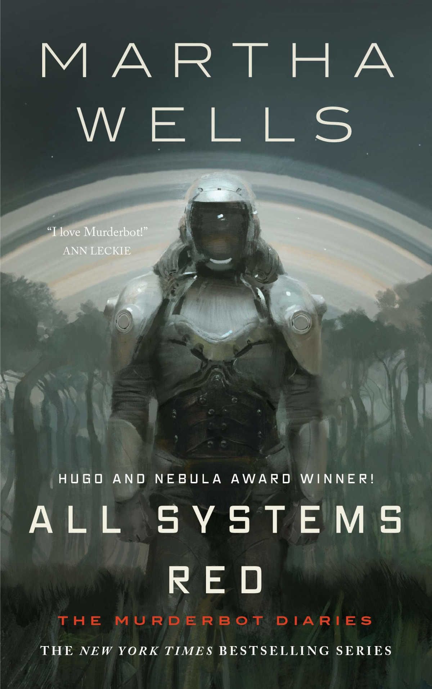

Yksi toivelistalla pitkään roikkuneista teoksista oli Martha Wellsin The Murderbot Diaries -sarjan ensimmäinen osa All Systems Red. Odotukset suosittua kirjasarjaa kohtaan olivat suuret, mutta sarjan ensimmäinen osa oli hämmentävä pettymys.

<!--more-->

### Tarina

PreservationAux-ryhmä joutuu planeettaa tutkiessaan paikallisen otuksen hyökkäyksen kohteeksi. Heidän mukana oleva turvallisuusbotti pelastaa ihmiset tilanteesta.

Selviää, että ryhmälle annetuissa esitiedoissa ei ole mitään mainintaa vaarallisista otuksista. Lisäksi heidän kartastaan on poistettu joitakin alueita. Vaikuttaa siltä, että joku on pettänyt ryhmän. Ryhmä alkaa selvittää, että miksi heille on annettu puutteellisia tietoja ja miksi joku haluaa päästä heistä eroon.

Samaan aikaan SecUnit, eli turvallisuusbotti, joka on nimennyt itsensä murhabotiksi, kamppailee itsensä ja ympäröivän maailman kanssa. Botti on onnistunut murtamaan häneen asennetun ohjausmoduulin, eivätkä ihmiset voi enää käskyttää häntä. Hän yrittää pitää murretun ohjausmoduulin salassa ja pyrkii noudattamaan ihmisten käskyjä mahdollisimman pitkälle, jotta he eivät saisi selville, että botilla on oma tahto.

### Henkilöhahmot

Myönnän heti alkuun: tämä kirja ei ollut minua varten. Sen henkilöhahmot ovat pelkkiä onttoja aihioita.

Tarina kerrotaan **murhabotin** silmin. Teoriassa tämä on ihan kiinnostava valinta, mutta käytännössä se ei toimi mielestäni lainkaan. Koko kirjan ajan murhabotti angstaa ihmisten seurassa olemisesta ja pyrkii välttelemään sitä viimeiseen asti. Tätä angstia ei kuitenkaan onnistuta selittämään oikein mitenkään. Se pitää vaan uskoa, koska kirja käskee niin.

Kirjoitin robotista, koska kirjan alussa kuvittelin, että kyseessä todella on robotti. Sitten selviää, että kyseessä onkin jonkinlainen mekaaninen viritys, johon on yhdistetty orgaanisia ihmisen osia. Loppupuolella käy ilmi, että itse asiassa "robotti" onkin ihan täysiverinen ihminen, joka voi ilman "robottihaarniskaa" liikkua ihmisten joukossa, eikä kukaan kiinnitä siihen mitään huomiota. Mistä koko hahmossa on siis oikeastaan edes kysymys?

Murhabottien taustaa ei avata oikein mitenkään. Miten joistakin ihmisistä on tullut tällaisia? Ovatko he ihmisiä? Miksi tällainen orjatyövoima on sallittua? Miten he ovat onnistuneet poistamaan ihmisiltä oman tahdonvoiman? Kirja ei selitä näitä asioita mitenkään, ne vaan pitää uskoa.

Tarinassa on läjä muitakin ihmisiä. Ketä he ovat? Ei hajuakaan. Läpi kirjan he olivat minulle kourallinen nimiä, joilla ei ole oikeastaan minkäänlaista persoonaa, taustatarinaa, motivaatiota, ulkonäköä tai merkitystä tarinan kannalta. Henkilöiden välillä ei ole toimivaa suhdetta tai kemiaa. Joidenkin mielestä se on tehokeino, joka korostaa sitä, että kertojana toimiva murhabotti ei välitä ihmisistä. Tällöin ihmiset jäävät etäiseksi myös lukijalle. Henkilökohtaisesti koin sen vain huonosti kirjoitetuksi tarinaksi.

Kaikista hahmoista ainut aitoa kiinnostusta herättänyt oli joukon johtaja **Mensah**. Hänelle on onnistuttu kirjoittamaan tunteita ja hän vaikuttaa henkilöltä, joka välittää paitsi muista ihmisistä, niin myös murhabotista. Hänestä oli helppo pitää ja pidin siitä, kuinka hahmossa yhdistyy vaikeita päätöksiä tekevä kylmäpäinen johtaja sekä tunteellinen ja välittävä ihminen. Hetkittäin onnistuin samaistumaan hahmoon. Hän on myös tarinan ainoita henkilöitä, joiden tekemiset ja valinnat vaikuttavat tarinan kulkuun.

Muut tuntuivat olevan täysin yhdentekeviä sivuhahmoja, jotka voisi pudottaa tarinasta pois, eikä se vaikuttaisi tarinan kulkuun oikeastaan mitenkään.

### Kuolettavan tylsä

All Systems Red oli minulle todella vaikea kirja lukea. Ensimmäisen kolmanneksen jälkeen olin ihan valmis laittamaan kirjan pois, sillä tarinassa ei tuntunut tapahtuvan mitään ja aloin kyllästyä murhabotin ihmisangstailuun.

Hieman myöhemmin tarinassa tuli pari kohtausta, jotka olivat ihan jännittäviä, mutta kirja palasi nopeasti tylsyyteen.

Tapahtumat tuntuivat etenevän sattuman ja murhabotin seuraamien feedien (joita ei sen enempää selitetty) kautta. Heti kun ryhmä oli jumissa, murhabotti sai kaiken tarpeellisen feedistä, ja taas jatkettiin matkaa.

Tarinassa ei rakenneta maailmaa juuri lainkaan. Siitä puuttuu lähes kokonaan ympäristöä tai henkilöitä kuvaavat tekstit. Asioille on vaan nimet, mutta lukijana joudut itse keksimään, miltä ympäristö näyttää, kuulostaa tai tuoksuu.

Yleensä minulla ei ole vaikeuksia lukea englanninkielistä tekstiä, mutta tämän kirjan kohdalla oli toisin. Kirjoitustyyli ja lauserakenteet olivat välillä erittäin hämmentäviä. Kirjan luettuani lueskelin muiden arvosteluja. Äidinkielenään englantia puhuvat sanoivat samaa, joten kyse ei ollut ainoastaan minun kielimuurista.

Kun sarjan pahis alkaa selvitä, sillä ei ollut mitään merkitystä. Se oli vain yksi nimi muiden joukossa. Pahisporukan olemus tai motivaatio toimintaan jäi ainakin minulle mysteeriksi, eikä heillä ollut lopulta mitään merkitystä. Se on vain yksi ohi menevä kohtaus, jonka jälkeen jatkettiin eteenpäin.

Koko kirjan voisi tiivistää siihen, että en välittänyt yhtään siitä mitä siinä tai sen henkilöille tapahtuu. Se oli tylsä, yhdentekevä ja unohtaa monet hyvän tarinankerronnan perusasiat.

### Suosittu kirja vai suosittu hahmo?

Tämä ei ole ensimmäinen kerta kun en pidä kirjasta, jota monet pitävät jonkinlaisena mestariteoksena. Tämä on kuitenkin ensimmäinen kerta, kun olen näin hämmentynyt kirjan suosiosta.

Kun katsoin kirjaa ylistäviä arvosteluja, ne eivät tuntuneet ylistävän kirjaa, vaan murhabottia hahmona. Epäsosiaalinen ja sosiaalisesta ahdistuksesta kärsivä hahmo vaikutti olevan lukijoiden voimaeläin. Se riitti siihen, että kirja sai viisi tähteä.

Vaikka olen itse epäsosiaalinen ja kärsin varsin herkästi myös sosiaalisesta ahdistuksesta, en löytänyt tätä samaa yhteyttä. Useampi negatiivinen arvostelu totesi vähän siihen sävyyn, että All Systems Red olisi jonkinlainen autismikirjon puolesta rummuttavien voimafantasia. Näen kyllä, mistä tällaiset ajatukset kumpuavat.

En tiedä kenelle tai minkä ikäisille kirja oli suunnattu, mutta minä en selvästikään ole osa sitä ryhmää. All System Red oli sen verran huono kötöstys, etten todennäköisesti tuhlaa aikaani sarjan muihin osiin. Harmi, sillä halusin kovasti pitää kirjasta.

