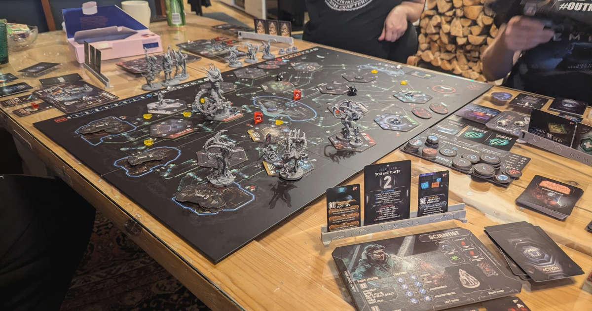
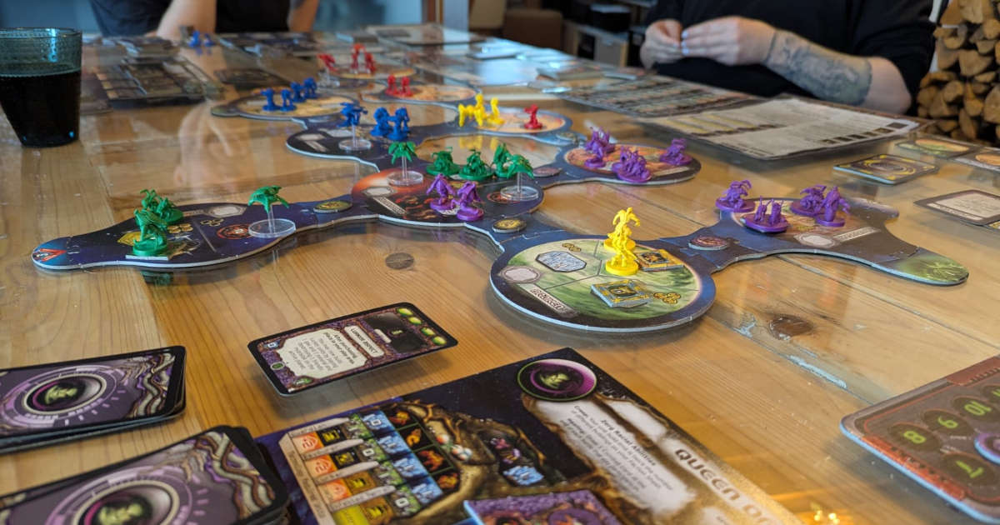

Viikonloppu hurahti Kuopiossa lautapelejä pelaillessa. Pari viikkoa ennen sitä testailin kirjastosta lainailtuja pelejä. Aloin miettiä sitä, millaisista lautapeleistä pidän. Mikä tekee pelistä hyvän?

<!--more-->



Lautapelissä on oltava selkeä maailma ja tarina. Pelaaminen ei saa olla aivotonta nopan heittelyä. Haluan uppoutua siihen maailmaan, jonka peli minulle tarjoaa. Tarina ei usein ole muuta, kuin pieni taustakertomus pelin ohjekirjassa. Jos se on hyvin kirjoitettu, se riittää.

Maailmaan ja tarinaan on helpompi uppoutua, mikäli lautapelin visuaalinen tyyli tukee sitä. Minua ovat aina viehättäneet lautapelit, joissa on upea grafiikka. Vaikka yksiväriset puunapit toimivat peliteknisesti, ne eivät vaan minua puoleen, niin kuin graafisesti kiinnostavat komponentit.

Visuaaliseen tyyliin kuuluvat kiinteänä osana erilaiset figuurit. Kaikki pelit eivät niitä tietenkään tarvitse, mutta huomaan toistuvasti tuntevani vetoa peleihin, jossa komeasti suunniteltuja figuureja voi liikutella suurella pelilaudalla. Silloin minun ei tarvitse kuvitella hahmojen ulkonäköä, sillä ne seisovat suoraan edessäni.

Kaikki edellä mainitut ovat elementtejä, jotka auttavat minua uppoutumaan pelin maailmaan ja tekevät siitä miellyttävän aisteille. Ne eivät kuitenkaan millään tavalla takaa sitä, että pelaaminen itsessään olisi hauskaa.

Pidän peleistä, jossa on verrattain monimutkainen, mutta helposti opittava mekaniikka. Pelaajalla pitää olla mahdollisuus tehdä useita erilaisia asioita ja usein tämä vaatii sitä, että pelistä löytyy erilaisia komponentteja, joita pelaaja voi hyödyntää.

Lautapelien on nojattava ensisijaisesti pelaajan valintoihin. Noppien tuoma satunnaisuus saa tietenkin olla mukana, mutta se ei saa olla ensisijainen tekijä, joka määrittelee pelin etenemisen. En ymmärrä, mitä hauskaa siinä on, jos omilla valinnoilla ei ole mitään merkitystä.

Koska uppoudun herkästi pelin maailmaan ja sen mekaanikkoihin, pidän pitkistä peleistä. Niissä on tietenkin kääntöpuolensa, mutta etenkin näiden peliviikonloppujen aikaan tykkään pelata pelejä, jotka kestävät useamman tunnin.

Olen huomannut, että yhteistyöpelit vetävät minua eniten puoleensa. Tykkään kyllä pelata myös toisia pelaajia vastaan, mutta yhteistyöpelien avoimuus vetoaa minuun. Mikäli peli tarjoaa erilaisia pelihahmoja, toisiaan täydentävistä hahmoista koostuva tiimi puhuttelee minun sisäistä roolipelaajaa.

Mitkä sitten ovat pelejä, joista tykkään?

Yksi tämän hetken suosikkipelejäni on [Nemesis](https://boardgamegeek.com/boardgame/167355/nemesis). Reilusti selkään puukotusta sisältävä yhteistyöpeli tarjoaa monipuolisen pelimekaniikan ja paljon tekemistä. Se on grafiikoiltaan uskomattoman kaunis ja sisältää hienoja figuureja. Pelihahmoja on useita erilaisia ja pelilauta sekä pelaajien tehtävät arvotaan joka pelille erikseen. Tämä lisää sen jälleenpeluuarvoa.

Vastakkain pelattavista peleistä yksi ikisuosikkini on [StarCraft: Brood War](https://boardgamegeek.com/boardgame/38796/starcraft-the-board-game-brood-war-expansion). Se on uskollinen lautapelikäännös nostalgisesta tietokonepelistä. Pelaajien on pidettävä huoli paitsi kartan ja resurssien hallinnasta, niin myös muiden pelaajien tekosista. Kolme eri rotua ja kuusi eri johtajaa, sekä joka peliin arvottava kartta nostavat tämänkin pelin jälleenpeluuarvoa. Vaikka pelissä alkaa näkyä sen ikä, se on silti upean näköinen. Figuurit maalaamalla pelistä saisi vieläkin hienomman, mutta siihen minulla ei ole taitoa.

Jos minun pitäisi sanoa esimerkki pelistä, josta en pidä, niin se olisi ehdottomasti lasten peli Kimble. Pelaajan rooli on toimia aivottomana nopan heittelijänä. Vaikka voitkin valita nappulan, jota liikutat, peli on silti lähes täysin tuuripohjainen. Siihen ei sisälly minkäänlaista maailmaa tai tarinaa. Lisäksi se on ruma ja äänekäs. 

