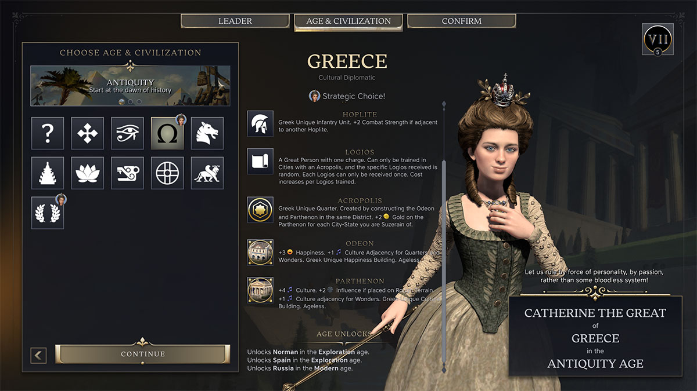
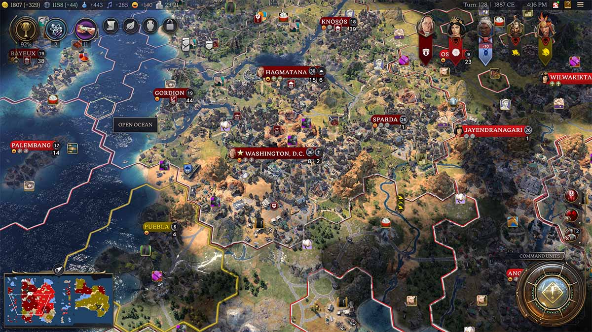
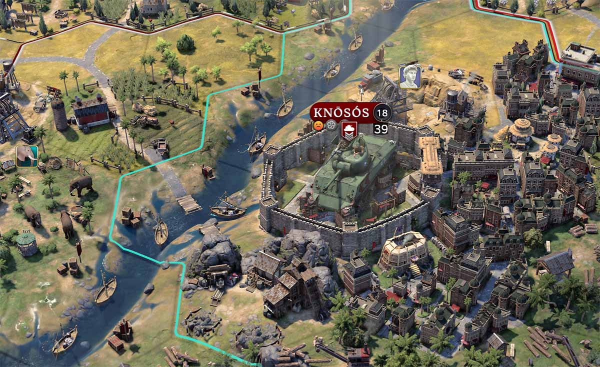

Vuonna 1991 pelaajia hemmoteltiin ensimmäisellä Civilization-pelillä. 34 vuotta myöhemmin pääsin upottamaan käteni pelisarjan seitsemänteen osan.

<!--more-->



Civilization 7 on vuoropohjainen strategiapeli, jossa pelaajan on kuljettava läpi vuosisatojen tavoitellen maapallon herruutta - tuli se sitten sodan, talouden, tieteen tai kulttuurin kautta. Tämä vaatii ympäristön tutkimista, kaupunkien perustamista, resurssien hallintaa, armeijan rakentamista sekä diplomatiaa muiden kansojen kanssa.

Olen pelannut joitakin vanhempia Civilization-pelejä ja käytin tunteja myös pelin edelliseen version, mutta en voi kutsua itseäni Civilization-veteraaniksi. Edellisestä pelikerrasta on useampi vuosi aikaa. Siksi lähestyin Civilization 7:aa avoimin mielin ilman suuria ennakko-odotuksia.

### Aloittelijan kokemus

Civilization -pelit eivät ole erityisen aloittelijaystävällisiä. Niissä on paljon kaikenlaista mikromanageroitavaa, joten odotin mielenkiinnolla, kuinka peli opastaa minut ennestään tuttujen sekä uusien pelimekaniikkojen pariin.

Ensimmäisenä joudut valitsemaan aloitusjohtajan ja -valtion. Uudella pelaajalla saattaa mennä sormi suuhun välittömästi, sillä jokaisella valtiolla ja johtajalla on omat yksilölliset bonukset ja yksiköt. Näitä ei kuitenkaan mitenkään avata pelaajalle, ne vaan pitää tietää. Ongelma on vähän sama, kuin [Baldur's Gate 3:ssa](). Civilization 7:ssa tällä ei ole onneksi ihan hirvittävän suurta merkitystä.

Yksi Civilization 7:n uusista mekaniikoista ovat selvästi erilliset aikakaudet, joita on kolme: antique, exploration ja modern. Valittavissa olevat aloitusvaltiot riippuvat aikakaudesta. Aloitusvaltio määrittää myös sen, mihin valtio kehittyy uudelle aikakaudelle siirryttäessä. Hieman vitsikkäästi johtajan voi valita vapaasti. Näin tuloksena voi syntyä esimerkiksi Venäjää johtava Benjamin Franklin.

Varsinaisen pelin aloittaminen on huomattavasti helpompi kokemus. Erilaiset opasilmoitukset esittelevät uudet asiat yksi kerrallaan sitä mukaa kun ne tulevat pelaajan käytettäväksi.

Ikävä kyllä moni yksityiskohta jää kertomatta. Ei olisi ollenkaan huono juttu, jos peliä voisi pelata erillisessä opastilassa, jolloin pelaajaa opastettaisiin mekaniikan lisäksi myös taktikoinnissa. Nyt pelaajalle annetaan hirvittävästi vaihtoehtoja, mutta ei kerrota, kuinka niitä kannattaa käyttää.

Pelin sisäinen opaskirja ei sekään kata läheskään kaikkia termejä. Yritin oman pelini aikana useaan kertaan etsiä sieltä selvennystä turhaan. Parantamista olisi tälläkin saralla.

### Uudet mekaniikat

Civilization 7 toi joitakin muutoksia, jotka ainakin itse koin tervetulleeksi.

Kaupunkien mikromanagerointi on poissa, mikä tekee useamman kaupungin ylläpitämisestä miellyttävän helppoa. En jäänyt yhtään kaipaamaan Civilization 6:ssa ollutta pelleilyä builder-yksiköiden kanssa.

Asutukset on jaettu kahteen luokkaan: kaupunkeihin ja kyliin. Pääkaupunkia lukuun ottamatta pelaaja ei voi settler-yksiköillä rakentaa kaupunkia, vaan ne rakentavat aina kyliä. Kylät eivät pysty rakentamaan rakennuksia tai yksiköitä, vaan kaikki niihin tulevat päivitykset sekä yksiköt on ostettava rahalla. Myöhemmin kylät voi päivittää kaupungeiksi, joka sekin vaatii rahaa.

Siinä missä kaupungit tuottavat niiden alueilla olevia resursseja, kylissä ne muutetaan rahaksi. Kylät voivat keskittyä eri asioihin. Oletuksena ne pyrkivät kasvamaan, mutta tämän voi muuttaa kerran jokaisen aikakauden aikana. Minusta tämä oli ihan virkistävä muutos, joskaan minulle ei oman läpipeluun aikana selvinnyt, missä suhteessa kyliä ja kaupunkeja kannattaa olla. En myöskään osannut kunnolla hyödyntää kylien erilaisia tavoitteita.

Ehkä pelin hauskin uusi mekaniikka on komentajayksiköt. Siinä missä Civilization 6:ssa jokainen yksikkö pystyi ylenemään, nyt ainoastaan komentajat ylenevät. Komentajien ympärillä on alue, jonka sisällä olevat yksiköt saavat komentajalta bonuksia. Vaikutusalueella tehty vahinko sekä tuhotut vihollisyksiköt lisäävät komentajan kokemusta ja sitä kautta mahdollistavat ylenemisen. Jokainen ylennys tekee komentajasta entistä voimakkaamman. Koska komentajat kulkevat aikakaudesta loppuun, ne voivat pelin loppupuolella olle todella voimakkaita, mikäli saat pidettyä ne elossa.

Komentajat voivat kuljettaa mukanaan neljä yksikköä. Ylennysten myötä tämä määrä voi nousta kuuteen. Näin suurienkin armeijoiden kuljettaminen on vaivatonta ja nopeaa. Aikakauden vaihtuessa kaikki yksiköt, jotka eivät kuulu jonkun komentajat armeijaan, kuolevat. Komentajat ovat siis keskeinen osa armeijoiden pyörittelyä.

Jokainen kolmesta aikakaudesta tuo omat yksiköt, resurssit, teknologiat, pelimekaniikat ja paljon muuta. Aikakausi etenee joka vuorolla, mutta valtiot voivat keskittyä erilaisiin tavoitteisiin, jotka nopeuttavat aikakauden etenemistä. Itse pidin tästä muutoksesta, sillä se antoi jokaisella aikakaudelle selkeän päämäärän ja pudotti turhan mikromanageroinnin määrää. Kun aikakauden vaihtuminen lähenee, jokaista valtiota kohtaa jonkinlainen kriisi, josta sen on selviydyttävä.

Aikakauden vaihtuminen on eräänlainen pehmyt nollaus. Tässä kohtaa voit valita itsellesi uuden valtion. Valittavissa olevat valtiot määräytyvät alussa valitun valtion, johtajan sekä pelissä tehtyjen asioiden perusteella. Mitä enemmän olet tehnyt pelin tarjoamia tehtäviä, sitä enemmän saat legacy-pisteitä. Aikakauden vaihtuessa nämä pisteet voi käyttää bonuksiin, jotka ovat käytössä seuraavalla aikakaudella.

Valintojen jälkeen alkaa uusi aikakausi. Kartta täyttyy uusista resursseista ja samalla pelaaja menettää kaikki sotilasyksiköt, jotka eivät kuuluneet komentajan armeijaan. Ensimmäisellä kerralla muutos oli hämmentävä ja pienen hetken koin, että edellisen aikakauden tekemiset valuivat hukkaan. Pian kuitenkin näin muutoksen edut ja harmitus väistyi. Mikäli haluat lukea aiheesta tarkemmin, kannattaa kurkata [devausblogin kirjoitus aikakausista](https://civilization.2k.com/civ-vii/game-guide/dev-diary/ages/).

Viimeinen itselleni selkeä muutos oli influence-resurssi. Sitä käytetään muiden valtioiden ja yksittäisten kylien välisessä diplomatiassa. Sodassa sillä pystyi tekemään omista sotajoukoista vahvempia. Erityisesti ensimmäisellä aikakaudella keskityin keräämään reilusti influencea ja sen myötä sain puolelleni lukuisia pikkukyliä, jotka auttoivat minua myös myöhemmin alkaneessa sodassa.

### Grafiikka ja musiikki

Civilization 7 on upean näköinen. Kartta ja sinne rakentuvat kaupungit ovat realistisen näköisiä. Yksiköt sekä kaupunkien rakennukset on mallinnettu yksityiskohtaisesti ja animaatioihin on panostettu.

Ikävä kyllä tällä on myös se sivuvaikutus, että peliä on ihan turha yrittää pyörittää heikkotehoisilla koneilla. Tämä on harmillista, sille kyse on kuitenkin vuoropohjaisesta strategiapelistä, jonka kuvittelisi pyörivän vähän heikommallakin raudalla. Omalla MacBook Air M3:lle peli pyöri jotakuinkin kelvolliseksi, kun grafiikat pudotti alhaisemmalle tasolle. Toivottavasti tulevat päivitykset parantavat tilannetta.

Pelin musiikki on aika tuttua Civilization-tavaraa. Musiikkiin on panostettu ja se kuvaa hyvin eri aikakausien henkeä, mutta omaan korvaan se oli useimmiten aika ärsyttävää. Erityisesti antiikin ajan musiikki oli paikoin niin pistävää kilkutusta ja jollotusta, että minun oli pienennettävä musiikin äänenvoimakkuus lähelle nollaa.

Pelin upeassa grafiikassa on kuitenkin myös omat huonot puolet, joista hieman myöhemmin lisää.

### Keskeneräinen peli

Civilization 7 julkaisu ei ollut kovin ruusuinen ja peli sai melkoisesti risuja siitä, että se julkaistiin keskeneräisenä. Nyt kun olen pelannut pelin yhden kerran läpi, voin todeta, että kritiikki oli aiheellista.

Civilization-pelit ovat luonteeltaan sellaisia, että ne vaativat pelaajalta suuren tietomäärän pyörittelyä. Relevantin tiedon on oltava helposti pelaajan ulottuvilla. Civilization 7:ssa näin ei ole, ja se on yksi pelin suurimmista epäonnistumisista.

Pelin valikot ja tietoruudut ovat usein sekavia, eikä niissä näy tiedot, jota juuri siinä hetkessä tarvitset. Yksi ärsyttävimmistä puutteista oli se, että rakennusta päivittäessä et nähnyt, millaisia bonuksia vanha rakennus tuo, joten et näe helposti, onko päivittäminen järkevää. Tämä ongelma korostuu erityisesti kahdella myöhemmällä aikakaudella.

Käyttöliittymästä puuttuu isolta osin Civilization 6:n värikoodaus, joka teki asioiden erottamisesta selkeää. Joukossa on myös joitakin kummallisia puutteita. Esimerkiksi uutta teknologiaa valittaessa näet listan teknologioista. Tässä näet avustajien suositukset, mutta kun siirryt katsomaan teknologiapuuta, suosituksia ei enää näykään. Puusta on myös vaikea erottaa, mitkä teknologioista on tutkittavissa, ja minkä olet valinnut, koska kaikki on saman väristä.

Ongelmat eivät rajoitu pelkästään käyttöliittymään. Pelin realistinen grafiikka tekee yksiköiden ja erilaisten rakennusten erottamisesta vaikeaa. On typerää, että jokin rakennus boostaa vieressä olevia science-rakennuksia, mutta et osaa sijoittaa sija, koska science-rakennukset eivät erotu massasta mitenkään.

Pelissä on erikoisrakennuksia, jotka syntyvät, kun kaksi eri rakennusta rakennetaan samaan ruutuun. Näiden rakentaminen oli ärsyttävää, sillä toisen rakennuksen paikkaa valitessa peli ei mitenkään korosta ruutua, johon ensimmäinen rakennus on laitettu. Minun oli joka kerta käytävä jokainen ruutu yksi kerrallaan läpi, jotta löysin oikean.

Exploration-aikakaudella pelaaja voi levittää omaa uskontoaan. Uskontoa voi levittää erikseen asutusten kaupunki- ja maaseutualueisiin. Uskontopeli oli äärimmäisen turhauttavaa, sillä kaupunkia vahtivan sotilasyksikön symboli meni aina toisen uskontosymbolin päälle. Yritä siinä sitten arvailla, että mikä uskonto siellä alla on.

Kun valtioita on kerrallaan vain kuusi, eikö väripaletista oikeasti löytynyt kuutta väriä, jotka eivät olisi lähellä toisiaan? Esimerkiksi omassa pelissä kahdella valtiolla oli punainen väri ja kahdella keltainen. Erityisesti yksittäisten yksiköiden erottaminen toisistaan oli uskomattoman vaikeaa. Tämän seurauksena itselläni kävi niin, että kuvittelin tuhoavani yhden valtioista, mutta asuinalueen vallattuani tajusin, että sillä oli vielä kaksi kylää jäljellä. Olin koko ajan katsonut, että ne kuuluvat toiselle valtiolle.

Kun menet säätämään yksittäisen kaupungin asioita, kaikki muut kaupungin rajoineen katoavat näkyvistä. Kun samassa ruudussa on komentaja ja yksikkö, niiden välillä vaihtaminen on välillä todella vaikeaa. Kauempaa ampuvien yksiöiden käyttäminen on kummalista varjonyrkkeilyä, sillä et saa klikata vihollisyksikön päälle, vaan sinun on klikattava varsinaista maaplänttiä vihollisen vieressä. Etenkin laajemmalla zoom-levelillä tämä oli ihmeellistä pikselien tähtäilyä. Usein kävi myös sitä, että pelin modelit katosivat kartalta kun niitä klikkasi. Jos erehdyit liikuttamaan sen jälkeen karttaa, siinähän sitten etsit, että missä se valittu yksikkö oli.

Pelissä on aivan käsittämätön määrä tällaisia käyttöliittymään, grafiikkaan ja tiedonsaantiin liittyviä pieniä ja vähän suurempiakin puutteita sekä ongelmia. Niiden ansiosta muuten varsin toimiva peli oli hetkittäin todella puuduttavaa. Tämä on harmillista erityisesti siksi, että nämä eivät ole asioita, joista kehittäjät eivät olisi tietoisia. Kaikki ongelmat olivat poissa pelin aikaisemmassa versiossa. Devaajat olivat varmasti tietoisia ongelmista, mutta peli päätettiin silti julkaista raakileena.

### Hyvä, mutta rahankatkuinen

Vaikka pelissä onkin tuskastuttavia ongelmia, viihdyinkö sen parissa? Kyllä!

Minusta Civilization 7 on varsin onnistunut ja viihdyttävä peli, joka toi sarjaan mukavia muutoksia. Pitkän linjan civ-fanit eivät välttämättä kaikista muutoksista pidä, mutta minusta ne olivat onnistuneita.

En kuitenkaan arvosta sitä, että Civilization 7 yrittää rahastaa DLC:llä. On aika törkeää, että ensimmäiset DLC:t julkaistaan lähes välittömästi pelin julkaisun jälkeen. DLC:t olivat käytännössä julkaisuhetkellä valmiina, mutta näitä ominaisuuksia ei vaan laitettu osaksi peruspeliä, jotta niillä voitaisiin rahastaa erikseen.

Peli tarvitsee kipeästi kehittämistä. Tiedossa olevat ongelmat ja puutteet on korjattava. Tällaisenaan edellistä versiota pelaavien ei mielestäni kannata siirtyä seiskan pariin, ennen kuin perusasiat on saatu kuntoon. Mikäli et omista aikaisempaa Civilization-peliä, siinä tapauksessa seiska voi maistua ihan hyvälle. Ennen korjauspäivityksiä kannattaa kuitenkin valmistautua satunnaiseen hämmentymiseen ja turhautumiseen.
