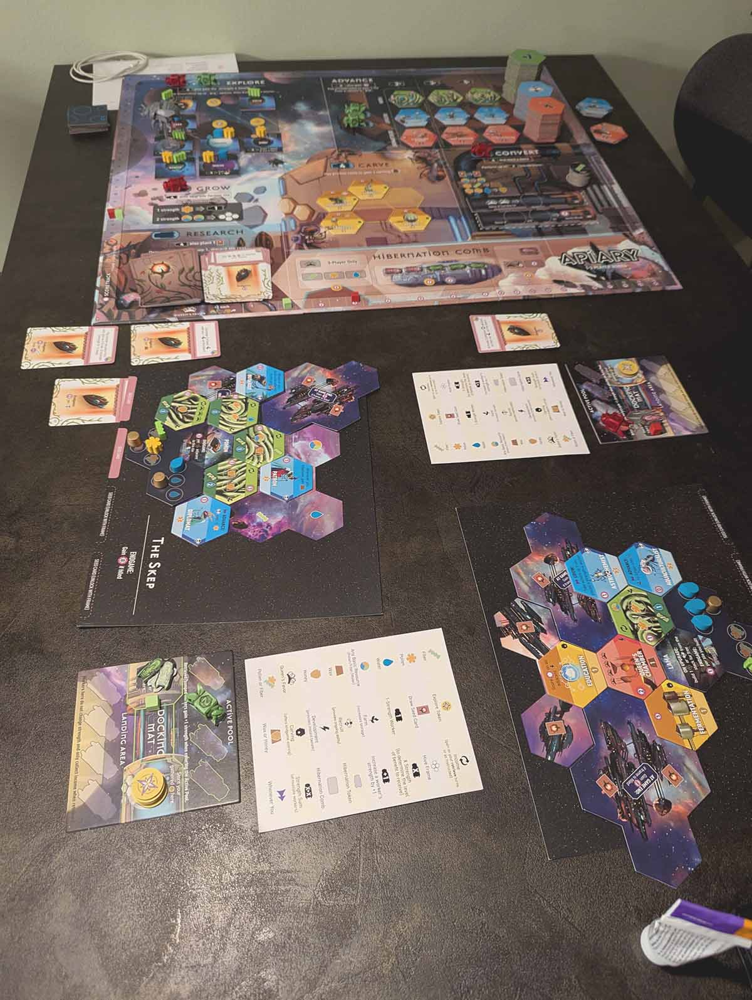
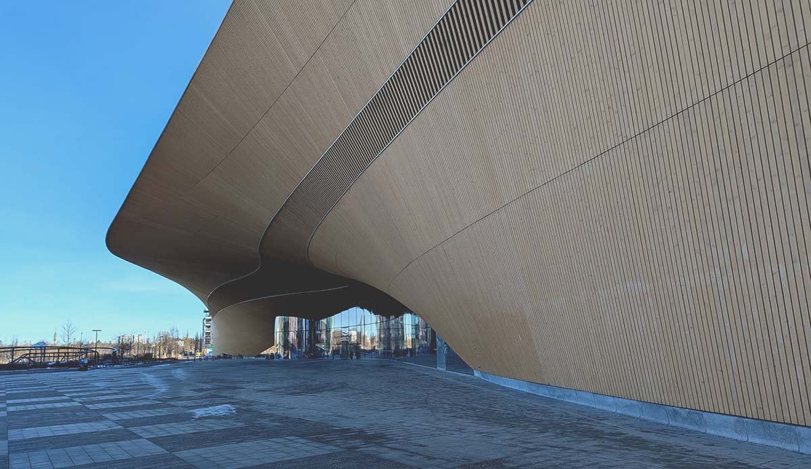

### Viikon kohokohdat
- [Apiary](https://boardgamegeek.com/boardgame/400314/apiary)-lautapelisessio puolison kanssa
- Vauhdilla paraneva juoksukunto
- Parempi yleinen hyvinvointi. Myös vatsa voi paremmin.
- Parisängyn muuttaminen kahdeksi erilliseksi sängyksi. Uudet joustin- ja petauspatjat.
- Seuraava lautapeliviikonloppu varattu
- Tulevan sukellusmatkan järjestelyt hoidettu

### Kiinnostavia linkkejä ja sisältöjä
[The State of Personal Online Security and Confidentiality | SXSW Live](https://www.youtube.com/watch?v=AyH7zoP-JOg) with Meredith Whittaker. Upea tiivistys siitä, miksi yksityisyys ja yksityisyydensuoja on tärkeä meille kaikille. Jopa heille, jotka virheellisesti ajattelevat, ettei heillä ole mitään salattavaa.

[On vaikeaa keksiä pahempaa oman oksan sahaamista kuin tekoälyn lukemien uutisten palkitseminen.](https://journalisti.fi/nakokulmat/2025/03/on-vaikea-keksia-pahempaa-oman-oksan-sahaamista-kuin-tekoalyn-lukemien-radiouutisten-palkitseminen-kirjoittaa-manu-haapalainen/) Hyvin kirjoitettu kommentti siitä, kuinka ihmisen korvaaminen radiotoiminnassa ei palvele kuulijoita, mutta silti Bauerin ja STT:n tekoälyprojekti palkittiin Suurella Journalistipalkinnolla.

[Feel Better, Live More #476: A Monk’s Guide To Finding Happiness, Cultivating Inner Peace & Slowing Down In A Fast-Paced World.](https://drchatterjee.com/a-monks-guide-to-finding-happiness-cultivating-inner-peace-slowing-down-in-a-fast-paced-world-haemin-sunim/) Lähes kaksituntinen podcast, jossa haastatellaan buddhalaista munkkia. Jaksossa keskustellaan muun muassa siitä, kuinka voi olla iloinen ja onnellinen myös silloin, kun asiat eivät mene haluamallaan tavalla.


### Ajatuksia
> "Enjoy the things you can't own." - Haemin Sunim, [Feel Better, Live More #476](https://drchatterjee.com/a-monks-guide-to-finding-happiness-cultivating-inner-peace-slowing-down-in-a-fast-paced-world-haemin-sunim/))

> "Ring the bells that still can ring. Forget your perfect offering. There is a crack a crack in everything. That's how the light gets in." - Leonard Cohen, Anthem

> "Walk as if you are kissing the Earth with your feet." - Thich Nhat Hanh, [Peace in Every Step: The Path of Mindfulness in Everyday Life](https://openlibrary.org/books/OL7816993M/Peace_is_Every_Step)

### Valokuvia

