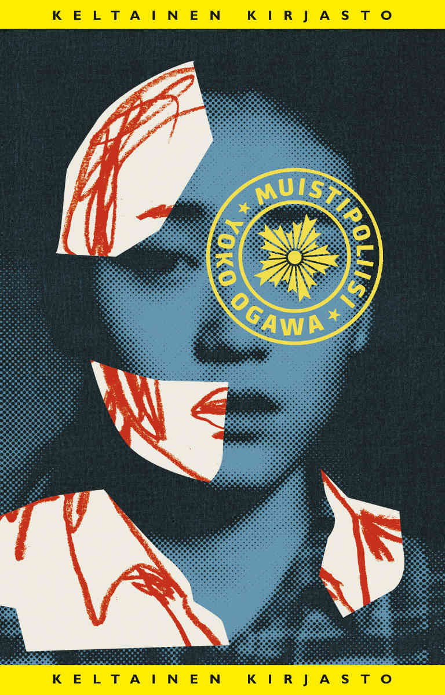

Käteeni tarttui kirjastosta täysin sattumalta Yoko Ogawan Muistipoliisi. Onneksi tarttui, sillä kirja oli hämmentävä, mutta erittäin maistuva kokemus.

<!--more-->

### Tarina

Tarinan päähenkilö on nimetön **kirjailija**, joka asuu saarella, jossa tuntuu olevan ikuinen talvi ja pulaa kaikesta.

Saaren asukkaiden elämää ohjaavat katoavat muistot. Kukaan ei tiedä, mitä minäkin päivänä katoaa, tai milloin katoamisia tapahtuu. Se on kuitenkin varmaa, että kun näin tapahtuu, tunteettomat muistipoliisit pitävät huolen siitä, että kaikki unohdettu tuhotaan. Kadonneiden muistojen piilottaminen on rikos ja muistipoliisit valvovat lakia kovalla kädellä.

Osa saaren ihmisistä ei kykene unohtamaan. Osa heistä yrittää piilottaa kykynsä, toiset piiloutuvat salaisiin turvataloihin. Nämä ihmiset ovat lainsuojattomia ja muistipoliisi tekee kaikkensa saadakseen muistavat ihmiset kiinni.

Kirjailijan äiti oli yksi niistä ihmisistä. Kun kirjailija oli nuori, muistipoliisit kävivät hakemassa hänet kotoaan. Viikkoa myöhemmin äiti palasi kotiin vainajana. Kuolinsyyksi kerrottiin sydänkohtaus.

Kirjailijan perhetuttu **pappa** on hänen läheisin ihminen. Pappa on ollut hänen elämässään lapsesta lähtien ja hän asuu laituriin kiinnitetyssä lautassa. Lautta ei kuitenkaan enää liikennöi, sillä lauttojen muistot ovat kadonneet. Saaren ihmisille se on vain veden päälle rakennettu koti. Kukaan ei pääse saarelle, tai sieltä pois. Kukaan ei muista, kuinka se tapahtuu. Eivätkä he välitä, sillä he eivät voi kaivata jotain, mitä eivät muista.

Kirjailija on keskustelemassa uudesta teoksestaan oman kustannustoimittajansa **R**:n kanssa. Hänelle selviää, että R ei kykene unohtamaan. Kirjailija ei halua, että R:lle käy kuten hänen äidilleen. Hän rakentaa papan avustuksella kotiinsa pienen salahuoneen ja piilottaa R:n sinne.

Kaikkien kolmen yksinkertainen ja harmiton elämä muuttuu jatkuvaksi salailuksi. Samalla kirjailija ja R saavat kokea konkreettisella tavalla kuilun, joka seisoo muistavien ja unohtavien ihmisten välissä.

### Henkilöhahmot

Kirjassa on käytännössä vain kolme henkilöä: kertojana toimiva kirjailija, pappa sekä kustannustoimittaja R.

Kukaan hahmoista ei ole erityisen räiskyvä. He tuntuvat monella tapaa hyvin tavallisilta, normaaleilta ihmisiltä, joilla ei ole mitään kovin erikoisia piirteitä. Ehkä juuri tästä syystä heihin on helppo samaistua.

**Kirjailija** on ajatteleva nainen, joka toimii elämässään omien periaatteidensa mukaan. Hän ei anna ikävien asioiden tulla elämänsä tielle ja on oppinut olemaan sinut sen kanssa, että asioita katoaa. Hän elää elämänsä päivä kerrallaan. Katoamiset tuntuvat aluksi vaikealta, mutta pian niihin tottuu ja elämä jatkuu. Tarina kulkee hänen silmiensä kautta, joten lukija pääsee tutustumaan hyvin kirjailijan ajatusmaailmaan.

**Pappa** on vanha ja viisas mies, joka osaa nähdä asioiden positiiviset puolet. Hän on kätevä käsistään ja kohtelee kirjailijaa, niin kuin tämä olisi hänen oma tytär. Hän on kirjailijan eräänlainen tuki ja olkapää, joka ymmärtää, miltä unohtaminen tuntuu. Hän ei koskaan halua olla riesaksi muille, vaikka osaakin nauttia niistä hetkistä, kun on huomion keskipisteenä.

**R** on kohtelias herrasmies, joka uskoo vakaasti siihen, että kaikki kykenevät lopulta muistamaan, jos vaan haluavat. Hänelle tarinat ovat kaikki kaikessa. Häntä ohjaa ajatus siitä, että kirjailijakin kykenee lopulta muistamaan, jos oikein kovasti haluaa ja yrittää. Hänen maailmansa on hyvin erilainen, kuin kirjailijan ja papan maailma.

### Hämmentävä kirja

Muistipoliisi on hämmentävä kirja. Siinä ei loppujen lopuksi tapahdu ihan kauheasti. Joku saattaisi pitää sitä jopa tylsänä.

Olin hieman yllättynyt huomatessani, että kaikesta huolimatta uppouduin kirjan maailmaan. Ajatus kollektiivisesti unohtavista ihmisistä tuntui aluksi naurettavalta. Varsin nopeasti kirja onnistui kuitenkin tekemään siitä uskottavan.

Kritisoin joskus sitä, että tarinoissa tapahtuu asioita ja lukijan on uskottava ne, koska kirja käskee tehdä niin. Muistipoliisi on hyvä esimerkki siitä, kuinka epäuskottavista asioista voidaan tehdä uskottavia. Ogawa ei pyydä lukijaa uskomaan yhtään mitään, vaan toivottaa hänet tervetulleeksi maailmaan ja luomaan itse omat johtopäätökset.

Kirja osaa hetkittäin olla yllättävän jännittävä. Ogawa ei pidä kerronnassaan kiirettä, joten jännityksestä tulee pitkäkestoinen, jatkuvasti taka-alalla piinaava tunne. Lukiessa minulle tuli olo, niin kuin olisin joutunut itse elämään arkeani jonkin suuren salaisuuden kanssa.

Alkuperäinen teos on kirjoitettu japaniksi. On vaikea sanoa, millaista kieltä siinä käytetään. Suomentaja *Markus Julinin* käännös on mielestäni todella onnistunut. Teksti maalailee hienolla tavalla ympäristöä, mikä saa maailman tuntumaan kaikessa ankeudessaan värikkäältä ja uskottavalta. Tarinassa kilpailee jatkuvasti ympäröivän maailman harmaus, sekä päähenkilöiden tietynlainen toiveikkuus ja yritys selvitä päivästä toiseen katoavien muistojen kanssa.

### Ajatuksia herättävä

Muistipoliisi ei ole varsinainen hyvän mielen kirja. Se on synkkä, mutta siinä on myös ripaus toivoa.

Kun pääsin kirjan loppuun, minulle tuli olo, että se halusi sanoa jotain. Kirjan dystooppinen maailma muistipoliiseineen alleviivaa sitä, kuinka ihmiset voidaan alistaa väkivaltaiselle vallalle, ja kuinka suuri rooli muistoilla sekä ympäröivällä maailmalla on siinä, millaisia olemme ihmisinä. Kaikki tämä tuntuu kuitenkin päivänselvältä ja koin, että kirjassa oli jokin hienovaraisempikin viesti.

Huomasin kirjaa lukiessani kiinnittäväni huomiota siihen, kuinka helposti tarinan ihmiset tyytyivät kohtaloonsa. Heille kurjuudesta ja asioiden unohtamisesta on tullut uusi normaali. He ovat yhteisesti hyväksyneet sen, että jokin muu päättää heidän puolestaan, millaisia ihmisiä he ovat. Jollain tavalla se toi mieleen nykyisen maailman, jossa ihmiset ovat hyväksyneet sen, että he ovat jättiyritysten armoilla.

Siitä on tullut uusi normaali, että jättikorporaatiot päättävät algoritmeineen, mitä näemme, mitä ajattelemme ja mihin ryhmään kuulumme. Sen sijaan, että muodostaisimme itse omat muistomme ja kokemuksemme, olemme taantuneet algoritmien kuluttajiksi, jotka pää homeessa odottaa, että joku muu toisi sisältöä elämään ja tekisi päätökset puolestamme. Suorastaan ahmimme päähän kaadettavia sisältöjä ja teemme sitä niin paljon, että se saa monet meistä voimaan huonosti.

Ehkä tämä ei ollut Yoko Ogawan viesti, mutta juuri se tekeekin Muistipoliisista niin hienon, ettei se ole erityisen alleviivaava. Se jättää reilusti tilaa ajattelulle ja mahdollistaa sen, että jokainen voi vetää omat johtopäätökset kirjan sanomasta.

Muistipoliisi ei varmasti ole kirja jokaisen mieleen, mutta minä pidin siitä todella paljon. Olen edelleen yllättynyt, kuinka paljon. Mikäli kaipaat kirjaa, joka kannustaa ajattelemaan ja jossa on tunnelmallinen tarina ja maailma, rauhallinen kerronta ja pitkään viipyvää jännitystä, suosittelen tätä lämpimästi!

