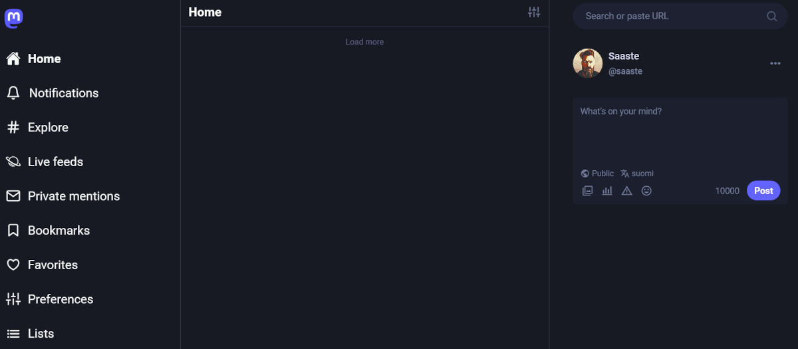

Tein joitakin vuosia sitten yhden parhaista päätöksistä: vähensin online-sisältöjen määrää elämässäni.

<!--more-->



Omalla kohdallani muutos oli aika suuri, sillä olen kuitenkin pohjimmiltani nörtti, joka tykkää testata uusia palveluita. Tämän seurauksena elämääni oli hiipinyt suuri määrä erilaisia sisältöjä. Suurinta osaa en oikeasti tarvinnut, mutta ne roikkuivat mukana niiden kuvitteellisen viihdearvon takia. Osa jäi päälle siksi, ettei niistä ollut mitään haittaa.

Tai näin kuvittelin.

### Koukussa sisältöihin

Muistelen usein opiskeluaikojani 2000-luvun taitteessa. Siinä ajassa minua kiehtoo erityisesti se, että minulla ei ollut kotona nettiyhteyttä. Ennen tätä aikaa olin ehtinyt elää useita vuosia arkea, jossa nettiin pääsi modeemilla. Se tuntui monella tapaa askeleelta taaksepäin. Miten viihdyin kodissani ilman nettiä? Miten en pitkästynyt?

Kun muistelin noita aikoja, huomasin usein päätyväni siihen ajatukseen, että monet ihmiset olivat koukussa sisältöihin. Minä olin koukussa sisältöihin. Kännykät pahensivat asiaa, sillä niiden myötä sisällöt olivat aina tarjolla.

Tämä on tietenkin vain minun henkilökohtainen kokemukseni, mutta suuri määrä sisältöä ja jatkuvat sisältövirrat eivät ole hyväksi hyvinvoinnille. Minun on vaikea pukea sitä sanoiksi, mutta jatkuvalla sisällöllä on jollain tavalla turruttava vaikutus. Sisältöä on niin paljon, ja sitä tulee joka suunnasta, ettei mikään tunnu oikein miltään.

Pahinta on se, että ilman sisältöjä oleminen aiheuttaa vieroitusoireita. Näitä ovat muun muassa keskittymiskyvyn puute, ikävältä tuntuva pitkästymisen tunne, sekä kyvyttömyys olla omien ajatuksiensa kanssa. Oleminen tuntuu tyhjiöltä, jonka haluaa lähes pakonomaisesti täyttää sisällöllä.

Tämä tuli parhaiten esiin tilanteissa, jossa jäin yksin ajatuksieni kanssa. Sen sijaan, että olisin antanut ajatuksieni virrata, kaivoin taskusta kännykän, ja täytin tämän ikävän tunteen muuttamalla itseni passiiviseksi sisältöjen kuluttajaksi.

En ole palannut 2000-luvun alun tilanteeseen. Kotonani löytyy nopea nettiyhteys, enkä ole luopunut kännykästä. Olen kuitenkin tehnyt tietoisen päätöksen sisältöjen rajoittamisesta. Rajoitan myös sitä, kuinka sisällöt tulevat elämääni. Näillä rajoituksilla on ollut suuri positiivinen vaikutus elämääni ja hyvinvointiini.

Mitä rajoittaminen omalla kohdallani käytännössä tarkoittaa?

### Online-sisällöt

Se tarkoittaa sitä, etten käytä palveluita, jotka *tunkevat* sisältöjä elämääni. Useimmiten nämä ovat sosiaalisen median palveluita, mutta olen pudottanut aktiivisesta käytöstä myös palveluita, kuten Pinterest ja ArtStation. Niin upea kuin ArtStationin loputon inspiraatiovirta onkin, se virta on yksinkertaisesti liikaa.

Suurin sisältövirta lienee tällä hetkellä Mastodon. Senkin kohdalla olen tehnyt tuntuvia rajoituksia. Estettyjen sanojen lista on pitkä, mutta sen lisäksi piilotan kaikki keskustelut ja boostit. Oma Mastodon-syötteeni on monesti lähes tyhjä.

Postasin pari päivää sitten kuvan tyhjästä kotinäkymästäni ja totesin puoliksi vitsillä, että siinä on sosiaalisen median syöte, joka ei ahdista. Mutta se on totta! Näen hyvin rajallisen määrän sisältöjä, mutta juuri tämä rajallisuus tekee siitä merkityksellistä. Tietenkin jään myös paljosta paitsi, mutta en tarvitse paljoutta. En koe minkäänlaista menettämisen pelkoa. Jos kokisin, se tuntuisi jonkinlaiselta vieroitusoireelta.

Kun "kulutan" sisältöä, minulle on tärkeää, että aloite tulee minulta. Käytän edelleen ArtStationia inspiraation lähteenä, mutta menen sinne vain silloin, kun tiedän, mitä tarvitsen. En selaa ArtStationin syötettä vain siksi, että se on olemassa.

RSS-syötteet ovat toinen tapa, jolla pidän sisällöt kurissa. RSS-lukijassa minä valitsen, mitä seuraan. Siellä ei ole suosittelualgoritmia, eikä sinne ilmesty mitään itsestään. Kaikki sisältö on minun valitsemaa. Tämän lisäksi voin valita sen, mitä kertyneestä sisällöstä luen, ja milloin teen sen. RSS-lukija ei lähettele ilmoituksia, eikä pidä itsestään meteliä.

Tästä näkökulmasta on ollut mielenkiintoista seurata keskustelua siitä, kuinka Mastodonin löytäneet ihmiset etsivät suurella vimmalla muita Fediversen sisältöjä. Mastodon ei riitä, vaan pitää olla tunnus myös Pixelfedissä, Friendicassa, Lemmyssä sekä BookWyrmissa[^1]. Ei siinä tietenkään mitään väärää ole, mutta kyllä se hetkittäin näyttää itsestä vähän hassulta.

### Televisio ja uutiset

Olen maininnut joskus aikaisemmin, etten katso käytännössä lainkaan televisiota, enkä seuraa uutisia. Molemmat ovat osaltaan seurausta tietoisesta sisällön rajoittamisesta.

Television kohdalla se tapahtui oikeastaan itsestään, kun menetin mielenkiintoni tv-sarjoihin. Nykyään tv-sarjan katsominen on harkittu päätös. Vuoden aikana olen katsonut vain kaksi: [Arcane]() ja [Blue Eye Samurai](). Sarjoista ja television katselemisesta on yksinkertaisesti tullut sisältöä, jota en vaan kaipaa elämääni.

Uutisten pois jättäminen oli enemmän tietoinen valinta. Suurin osa uutisista ei ole uutisia alkuunkaan. Ne ovat viihdettä, jossa varsinaisen tiedon jakaminen on hyvin pieni osa kokonaisuutta. Monet uutiseksi luokiteltavat asiat ovat usein vain erilaisia haastatteluja ja erilaisen asiantuntijoiden mielipiteitä sekä ennustuksia.

Kun maailmalla tapahtuu jotain merkittävää, saatan lukea tietoisesti siitä yhden uutisjutun. Useimmiten luen tapahtuneesta Ylen sivuilta. Sen jälkeen tiedän asiasta ja se riittää minulle. En harrasta lainkaan "mitä maailmalla on tapahtunut?" -tyyppistä uutisten selaamista. Siitä huolimatta pysyn hyvin kärryillä maailman tärkeistä asioista.

Kaikista sisällöistä uutisten vähentämisellä on ollut kenties tuntuvin vaikutus. Parasta siinä on se, että ahdistuksen määrä on vähentynyt tuntuvasti. Uutiset ovat lähtökohtaisesti negatiivista sisältöä. Sillä on taipumus synnyttää minussa ahdistusta. Mitä vähemmän uutisia tulvii elämääni, sitä vähemmän minua ahdistaa.

### Kokeilemisen arvoista?

Tämä kaikki on tietenkin vain minun elämääni. Nämä päätökset sopivat minulle. En väitä, että kaikkien pitäisi tehdä samoin. En myöskään oleta, että sisältöjen vähentäminen näkyisi kaikkien arjessa samalla tavalla.

Kannustan kuitenkin ihmisiä kokeilemaan sisältöjen rajoittamista. Sillä voi olla suuri positiivinen vaikutus omaan hyvinvointiin monella eri tavalla.

Vaikka se voi aluksi tuntua tylsyydeltä, me tarvitsemme tylsyyttä. Tylsyys on polttoainetta inspiraatiolle ja omille ajatuksille. Syvän ajattelun tasolle on vaikea päästä, jos pään täyttää ulkopuolelta tuleva sisältö.

Tylsältä tuntuvat hetket ovat tilaisuuksia tutustua itseensä. Pian sitä huomaa, ettei se olekaan enää tylsyyttä, vaan jotain ihan muuta.

Saatat löytää itsestäsi puolia, ajatuksia ja tunteita, joiden olemassa olosta et ollut tietoinen. Saatat saada uusia ideoita ja ajatuksia. Saatat oppia arvostamaan sisältöjä aivan uudella tavalla.

[^1]: Minullakin on tunnus BookWyrmin päälle rakennetussa kirja.casassa, sillä ajattelin, että se voisi toimia yhteisön ylläpitämänä avoimena kirjatietokantana. Käytännössä se ei kuitenkaan ole sitä, ja koen sen muutenkin tarpeettomaksi ja varsin huonoksi palveluksi.