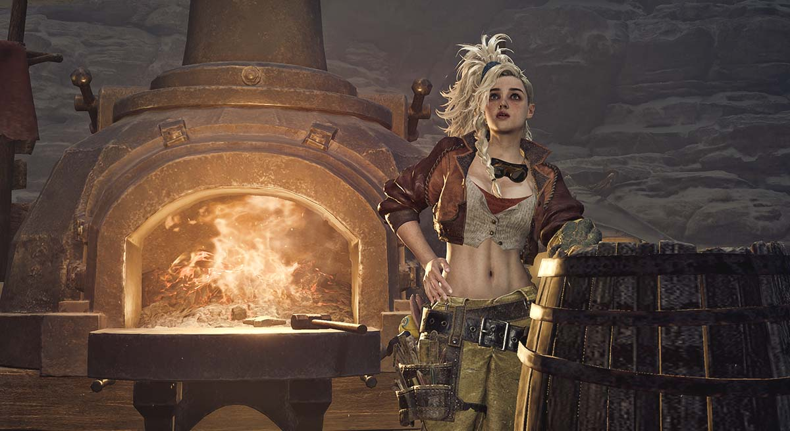
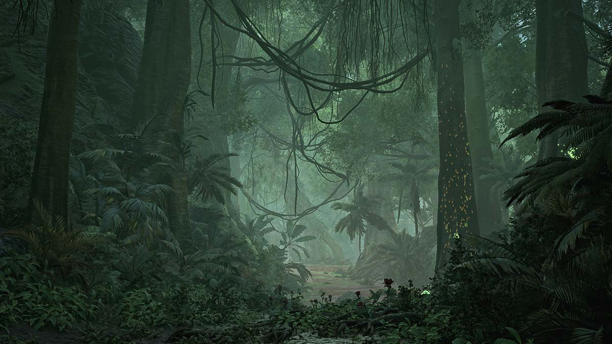
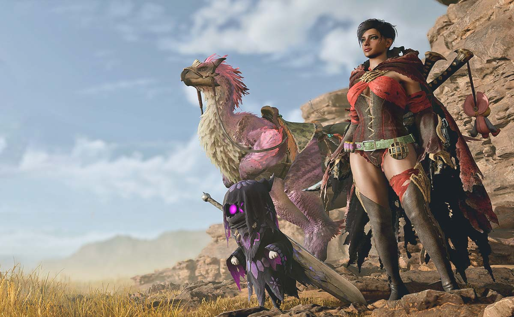
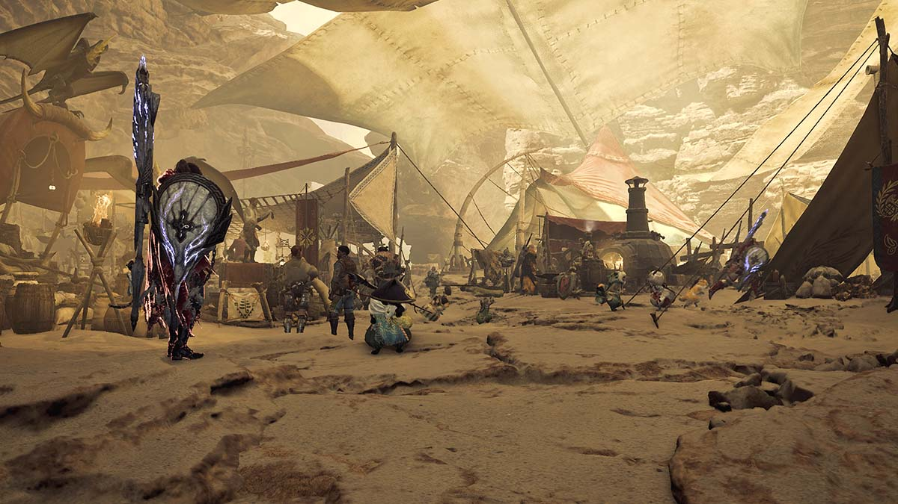

Monster Hunter -pelisarjalla on ikää 21 vuotta. Millainen on sarjan tuorein tulokas Monster Hunter Wilds?

<!--more-->



### Hirviöiden metsästystä

Monster Hunter Wilds on nimensä mukaisesti hirviönmetsästyspeli. Mörköjen jahtaamisen lisäksi pelaaja pääsee tutkimaan ympäristöä, keräämään sieltä raaka-aineita ja rakentamaan niistä parempia aseita sekä varusteita. Kaiken tämän rinnalla kulkee ohut tarina.

Peli on suunniteltu alusta loppuun niin, että sitä voi pelata yksin tai yhdessä neljän kaverin kanssa. Kunnollinen moninpeli tosi pääsee vauhtiin vasta, kun lyhyen tarinan on pelannut läpi. Monille Monster Hunter Wilds käynnistyy toden teolla vasta tarinan jälkeen.

### Pelimekaniikka

Monster Hunter Wildsia voisi monella tapaa pitää soulslike-pelinä. Pelihahmo liikkuu harkitusti ja monien aseiden liikkeet ovat hitaita. Pelaajan on tunnettava paitsi oma aseensa, niin myös monstereiden liikkeet, ja ajoitettava hyökkäykset oikeisiin hetkiin. Kokemattomalle ensimmäiset taistelut voivat olla yllättävän vaikeita, vaikkei Monster Hunter Wilds mikään Sekiron tasoinen elämänhalun tappaja olekaan.

Vihollisilla ei ole lainkaan energiapalkkeja. Monsterin väsymisen alkaa huomata sen liikkeistä ja peli ilmoittaa ainoastaan sen, kun monsteri on niin heikko, että sen voi ottaa ansalla kiinni. Hirviöitä voi väsyttää, myrkyttää ja halvaannuttaa, mutta myöskään näitä ei indikoida käyttöliittymässä. Sinun on vaan opeteltava tuntemaan vihollisesi.

Pelissä on erillinen monsteriopas, joka kertoo tietoja monstereiden heikkouksista, immuniteeteista ja niistä saatavista materiaaleista, mutta tiedot täyttyvät vasta, kun olet tapellut samaa monsteria vastaan useamman kerran.

Pelaajalla on valittavinaan 14 eri asetyyppiä. Jokainen on erilainen, sopii tietynlaiseen pelityyliin ja vaatii opettelua. Monster Hunter -peleissä aseet rakennetaan monstereiden osista. Niinpä jokaisen 14 asetyypin alta löytyy lukuisia eri versioita, joita pelaaja voi rakentaa. Aseilla on yksilöllisiä ominaisuuksia ja ne tekevät eri tyyppistä vahinkoa riippuen siitä, minkälaisesta monsterista ne on rakennettu.

Monster Hunter Wildissä on myös ripaus roolipelimäistä hahmon kehitystä. Pelihahmo itsessään ei kehity, vaan kaikki sen kyvyt tulevat käytössä olevista varusteista ja aseista. Aseiden tapaan monstereiden osista voi valmistaa myös varusteita. Varusteiden osia voi sekoittaa mielensä mukaan, mutta kaikissa varusteissa on bonus, jonka saa, jos päällä on riittävän monta saman sarjan osaa.

Tämän lisäksi pelissä on suuri määrä esineitä, kuten juomia, jotka parantavat, lisäävät aseiden tekemää vahinkoa, suojaavat kylmältä tai kumoavat erilaisten myrkkyjen vaikutuksen. Joitakin näistä voi ostaa myyjiltä, mutta monet on valmistettava itse. Kaikki raakamateriaali on kerättävä ympäristöstä.

### Tarina

Tarina on todella lyhyt. Ostin pelin perjantaina töiden jälkeen ja lopputekstit vierivät ruudulla lauantai iltana. Sen voi siis helposti pelata vuorokaudessa läpi.

Tarinassa ryhmä tutkimusmatkailijoita löytää nuoren pojan, *Natan*, aavikkoalueelta, jonka luultiin olleen asumaton satojen vuosien ajan. Nata kertoo joutuneensa eroon muista paetessaan suurta monsteria, sukupuuttoon kuolleeksi luultua White Wrathia.

Tästä alkaa seikkailu, jossa yritetään löytää Natan mystinen heimo sekä kylä, ja selvittää White Wrathin mysteeri. Vaikka tarinassa onkin parhaimmillaan jännittävä, siltä ei kannata odottaa ihmeitä. Se on enemmän tekosyy monstereiden metsästämiselle.

Tarinan parasta antia ovat peliin kirjoitetut henkilöhahmot. Kaikki ovat mukavan erilaisia ja niistä on helppo pitää. Osa hahmoista, kuten *Alma*, *Gemma* ja *Nata*, jäävät osaksi pelimaailmaa myös tarinan jälkeen, ja niillä on roolinsa myös siellä.

Oma näkemykseni on, että tähän peliin ei kannata tarttua tarinan takia. Se ei ole hirvittävän huono tarina, mutta se on todella lyhyt ja kevyt.

### Grafiikka

Pelaan peliä Playstation 5:llä, joten omat kokemukseni tulevat sieltä. Monster Hunter Wilds on kaunis peli, mutta se ei tavoittele valokuvantarkkaa realismia. Pelin taistelutyylistä johtuen on tärkeää, että peli pyörii sulavasti, ja sitä se myös tekee. Kehittäjät ovat onnistuneet pitämään oikeanlaisen tasapainon silmäkarkin ja suorituskyvyn välillä.

Graafinen tyyli on aavistuksen sarjakuvamainen ja hyvä niin, sillä realistinen monstereiden lahtaaminen voisi olla brutaali kokemus. Osa ympäristöistä, erityisesti Scarlet Forest, ovat todella kauniita ja yksityiskohtaisia.

Ehkä grafiikkaa tärkeämpää on se, kuinka eläviltä ympäristöt tuntuvat. Ne ovat täynnä elämää ja peli onnistuu luomaan tunteen siitä, ympäristö elää myös silloin, kun pelaaja ei ole läsnä. Pienemmät eläimet sekä monsterit reagoivat myös toisiinsa.

Leppoisat laiduntajat saattavat paeta suurina joukkoina, mikäli suuri monsteri päätyy heidän alueilleen. Monstereiden välillä voi tulla näyttäviä reviiritaisteluita. Joukko pienempiä petoja saattaa hyökätä laumana suuremman monsterin kimppuun. Osa metsien asukkaista on aktiivisia vain öisin. Yksi osa peliä onkin maailman tutkiminen.

### Äänimaisema ja musiikki

Äänimaisema tukee graafista monimuotoisuutta hienosti. Ympäristöt ovat täynnä ääntä ja tiedät pelkästään kuuntelemalla, missä olet. Olitpa missä tahansa, jostain kuuluu aina jotain kiinnostavaa rapinaa.

Pääosassa ovat tietenkin monsterit, sekä niiden karjahdukset ja hyökkäysten tuottamat äänet. Tällä osa-alueella on onnistuttu aivan yhtä hyvin, kuin muillakin. Monsterit paitsi näyttävät, niin myös kuulostavat komeilta ja aidosti yksilöllisiltä.

Monster Hunter Wilds musiikki on dynaamista, eli se muuttuu ympäristön ja tilanteiden mukaan. Tämä antaa pelille hyvin elokuvamaisen tunnelman. Musiikki on isolta osin komeaa orkestraalitykitystä, johon on siellä täällä yhdistetty myös ripaus elektronisia saundeja. Kaiken kaikkiaan upeaa kuunneltavaa!

### Endgame ja moninpeli

Pelin alussa tarina kuljettaa pelaajaa, mutta sen jälkeen maailma on täysin auki. Sitä voi tutkia vapaasti, tai sitten pelaaja voi metsästää annettuja tehtäviä yksin tai kavereiden kanssa.

Peli muuttuu tarinasta avoimen maailman roolipeliksi, missä tavoitteena on rakentaa parempia varusteita, opetella paremmaksi ja voittaa entistä voimakkaampia vihollisia. Pelissä on kaksi tasoa: low rank ja high rank. Tarina pelataan täysin low rank tasolla, mutta lopputekstien jälkeen aukeaa vaikeampi high rank. Samalla pelaaja pääsee käsiksi kaikkiin high rank varusteisiin ja aseisiin.

Iso osa peliä on "fashion hunting", eli itseä miellyttävän varustesetin kokoaminen. Tähän peli kannustaa sillä, että varusteiden ulkonäön voi vaihtaa. Sinulla voi siis olla pelin kovin varuste, mutta voit laittaa sen näyttämään aloitusarmorilta.

Lopputekstien jälkeen tulee läjä kokonaan uusia vihollisia, joita ei tarinassa esitelty. Kehittymisen myötä maailmaan ilmestyy monstereiden tempered-versioita, jotka ovat vielä kiukkuisempia ja satuttavat entistä enemmän. Useimpia tempered-monstereita vastaan on turha edes yrittää, ellei varusteet ole kunnossa ja taidot hyppysissä. Kuolema korjaa helposti.

Monster Hunter -sarja on tunnettu siitä, että sinne tulee tasaisin väliajoin uutta sisältöä. Tämä voi tarkoittaa uusia haasteita, uusia monstereita tai vaikka muiden pelien kanssa tehtyjä yhteistyötapahtumia. Esimerkiksi Monster Hunter World -pelissä oli Final Fantasy -tapahtuma, jossa pelihahmolleen sai kaikenlaista Final Fantasy krääsää, mutta siinä pääsi taistelemaan myös Behemothia vastaan.

Moninpeli käynnistyy kunnolla vasta tarinan jälkeen, sillä pelaajaa ei voi liittyä taistelemaan sellaista monsteria vastaan, jota hän ei ole itse nähnyt. Tarinan jälkeen tämä rajoitus kuitenkin poistuu ja sen jälkeen ainut rajoittava tekijä on hunter rank. Hunter Rank kasvaa tehtäviä tekemällä ja monstereita metsästämällä. Tällä varmistetaan se, etteivät pelaajat lähde vaikeampia monstereita vastaan ilman kokemusta.

Peli on käytännössä aina online, mutta voit pelata sitä solo online -tilassa, jolloin olet maailmassa yksin. Voit myös liittyä lobbyyn, jossa noin 100 satunnaista pelaajaa jakaa maailman kanssasi. Lisäksi voit tehdä kavereidesi kanssa oman lobbyn.

Olitpa missä tilassa tahansa, voit aina lähellä tehtävän alussa tai sen aikana SOS-signaalin, johon kuka tahansa pelaaja voi vastata ja liittyä mukaan. Vastaavasti myös sinä voit liittyä muiden peleihin. Tämä on yleisin ja helpoin tapa päästä moninpeliin mukaan.

Satunnaisten pelaajien kanssa pelaaminen toimii pääsääntöisesti hyvin. Etenkin vaikeammissa monstereissa näkee välillä sitä, että taisteluun liittyy pelaaja, joka ei selvästikään ole varustautunut asianmukaisesti, eikä välttämättä osaa myöskään pelata riittävän hyvin. Tästä seuraa se, että sama pelaaja kuolee muutaman kerran matsin aikana ja tappelu loppuu sen jälkeen kaikilta. Tätä tapahtuu onneksi verrattain harvoin.

Tuttujen kanssa voit muodostaa erillisen linkin, jolloin muut linkissä olevat pelaajat saavat automaattisesti ilmoituksen, kun lähdet metsälle. He voivat liittyä tehtävään mukaan ilman erillisiä kutsuja.

### Mahtava peli!

Olen koristanut oman peliluolani pelifiguureilla ja niiden joukossa on Nergigante, yksi Monster Hunter World -pelin pahamaineisimmista monstereista. Monster Hunter World on yksi kaikkien aikojen suosikkipelejäni ja Monster Hunter Wilds jatkaa sen jalanjäljissä esimerkillisesti.

Se ei ole lähtenyt korjaamaan jotain, mikä ei ole rikki. Silti Wilds onnistuu tuomaan hyvään reseptiin kourallisen uusia juttuja ja pieniä parannuksia, jotka tekevät siitä monella tapaa edeltäjäänsä paremman. Monster Hunter Wilds ei välttämättä ole jokaisen peli, sillä siinä voi olla kokemattomille pelaajille varsin suuri oppimiskynnys. Kun siihen pääsee sisään, se tarjoaa aivan pirullisen hyvää viihdettä pitkäksi aikaa.

Vaikka peli on julkaisupäivästä lähtien ollut lähes täysin bugiton, sillä on omat pienet ongelmansa.

Päällimmäinen risu tulee siitä, että aivan liian usein toisen peliin liittyminen epäonnistuu virheeseen. Todennäköisesti syy on se, että joku muu ehti liittyä peliin ja neljän pelaajan raja tuli täyteen, mutta jatkuva virheilmoitusten tuijottaminen käy välillä turhauttavaksi.

Pelissä on todella paljon asioita, joita pelaaja voi tehdä ja pyöritellä. Tästä seuraa se, että Monster Hunter Wilds on täynnä erilaisia valikoita. Vaikka pelasin edeltäjää satoja tunteja, Wildsin pariin tuleminen oli silti melkoisen hämmentävä kokemus. Tiedon hallinta ja siihen liittyvä käyttöliittymä kaipaisi selkeyttämistä.

Uusille pelaajille Monster Hunter Wilds tarjoaa varmasti runsaasti haastetta, mutta vanhoille konkareille Wilds on verrattain helppo. Tämä on tietenkin ymmärrettävää, sillä julkaisusta on vasta pari viikkoa, joten pelistä puuttuu kokonaan kaikista haastavin end game sisältö. Tätä on varmasti lähitulevaisuudessa tulossa, joten täytyy vain odottaa.

Mikäli et ole koskaan pelannut Monster Hunter -pelejä, suosittelen testaamaan! Monster Hunter Wilds on pirullisen hauska peli, kun sen hieman hämmentävän alun yli pääsee!
