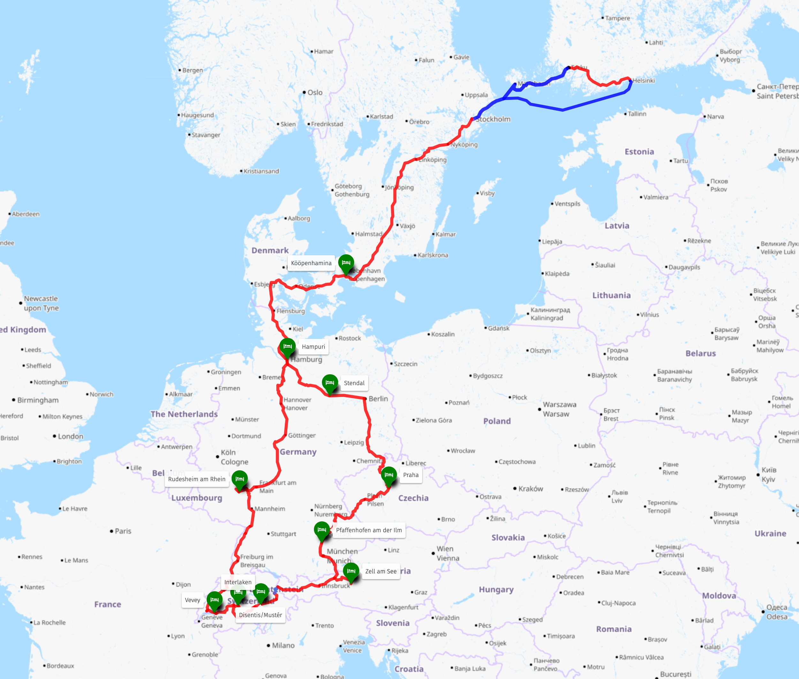

Tein puolisoni kanssa Interrail-seikkailun **22.8. - 14.9.2024**. Matkan kesto oli **kolme viikkoa**. Sinä aikana matkustimme **4793 kilometriä**. Reitille mahtui **38 junaa** ja **7 maata**: Ruotsi, Tanska, Saksa, Sveitsi, Liechenstein, Itävalta sekä Tšekki. Junassa tuli vietettyä aikaa yhteensä **2 päivää, 12 tuntia ja 13 minuuttia**.

### Reitti
Alla oleva reitti sisältää ainoastaan siirtymät paikasta toiseen. Teimme lisäksi myös joitakin päiväretkiä, joissa hyödynsimme junia, lauttoja, funikulaareja, tuolihissejä sekä polkupyöriä.

[Tarkempi reittikartta](https://umap.openstreetmap.fr/en/map/interrail-2024_1114661)



### Majoitukset
Majoitusten hinnat ovat koko yöpymisen ajalta per huone/hytti.

| Kaupunki                  | Majoitus                                                                                     | Öitä  |  Hinta     |
| ------------------------- | -------------------------------------------------------------------------------------------- | ----- | ---------- |
| Turku - Tukholma          | Yölautta, M/S Viking Grace                                                                   | 1     | 83,00 €    |
| Hampuri                   | [Hotel Alte Wache](https://www.booking.com/hotel/de/alte-wache-hamburg.de.html)              | 1     | 117,42 €   |
| Rüdesheim am Rhein        | [Weingut Prasser](http://gruselweinprobe.com/)                                               | 3     | 294,00 €   |
| Vevey                     | [Visionapartments](https://www.booking.com/hotel/ch/hotelfamille.html?aid=304142)            | 2     | 255,50 €   |
| Vevey                     | [Astra Vevey Hotel & Restaurant](https://www.booking.com/hotel/ch/astra-pavillon-vevey.html) | 1     | 229,86 €   |
| Interlaken                | [Carlton-Europe Vintage Adults Hotel](https://www.booking.com/hotel/ch/villaeurope.html)     | 2     | 613,53 €   |
| Disentis/Mustér           | [Hotel Alpsu](https://www.booking.com/hotel/ch/alpsu.html)                                   | 2     | 390,00 €   |
| Zell am See               | [Gästehaus Haffner](https://www.booking.com/hotel/at/gastehaus-haffner.html)                 | 3     | 389,94 €   |
| Pfaffenhofen am der Ilm   | [Hotel Moosburger Hof](https://www.booking.com/hotel/de/moosburger-hof.html)                 | 1     | 109,49 €   |
| Praha                     | [Hotel Meteor Plaza Prague](https://www.booking.com/hotel/cz/hotelmeteor.html)               | 3     | 369,36 €   |
| Stendal                   | [Hotel Schwarzer Adler Stendal](https://www.booking.com/hotel/de/altmarkhotel.html)          | 1     | 108,00 €   |
| Kööpenhamina              | [Next House Copenhagen](https://www.booking.com/hotel/dk/next-house-copenhagen.html)         | 2     | 288,00 €   |
| Tukholma - Helsinki       | Yölautta, M/S Viking Gabriella (sisältää premium-aamupalan)                                  | 1     | 113,50 €   |

### Kustannukset
Seurasimme matkan aikana kustannuksia [Splitwise](https://www.splitwise.com/) -sovelluksella. Alla listatut kustannukset ovat **kahdelta** henkilöltä yhteensä.

| Kategoria                         | Hinta         | Huomiot                                                                           |
| --------------------------------- | ------------- | --------------------------------------------------------------------------------- |
| Majoitukset                       | 3361,60 €     | Sisältää yölauttojen liput                                                        |
| Ruoka ja juoma                    | 2309,74 €     | Ravintolat, viinit, drinkit, matkaeväät                                           |
| Interrail-lippu                   | 1266,00 €     | Global Pass, 1. luokka, 22 päivää                                                 |
| Junien paikkavaraukset            | 209,96 €      | Iso osa ei ollut pakollisia, mutta varasimme paikat silti                         |
| Polkupyörävuokrat                 | 208,70 €      | Kuormapyörä, 2 x sähköpyörä, 2 x pyörä                                            |
| Muut matkustuskulut               | 225,84 €      | Funikulaarit, risteilyt, erikoisjunat, lautat, tuolihissit                        |
| Prepaid-liittymät                 | 43,00 €       | [Sunrisen](https://www.sunrise.ch/en/mobile/prepaid-visitors) liittymät Sveitsiin |
| **YHTEENSÄ**                      | **7624,84 €** | **181,54 €/päivä/hlö**                                                            |

### Matkatavarat
Matkatavarat ovat isolta osin minun henkilökohtaisia tavaroita, mutta mukana on myös joitakin, jotka jaamme puolison kanssa. Kaikki listan tavarat kulkivat kuitenkin minun rinkkassa ja puolisolla oli omansa.

Ennen lähtöä punnitsin matkatavarat rinkkoineen ja painoa oli yhteensä reilut **9 kiloa**.

Rinkka: [Osprey Farpoint 55L]()



\* Tavarat joita en tarvinnut matkan aikana