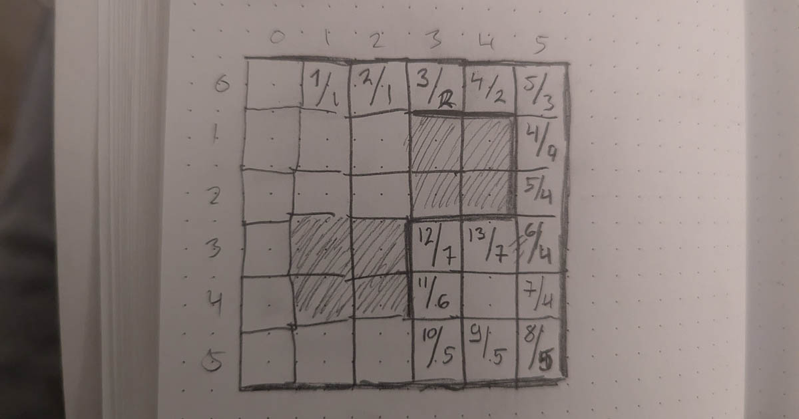

### Ensimmäinen osa
Tehtävän syötteenä on kartta. Kartta on ruudukko, jossa jokainen ruutu kuvaa yhtä palsta-aluetta. Palstalla voidaan viljellä eri kasveja ja nämä on merkitty karttaan kirjaimilla.

AAAA
BBCD
BBCC
EEEC


Yllä olevassa esimerkissä viljellään viittä eri kasvia `A-E`. Jokaiselle kasville on varattu oma alueensa. Alueet eivät ole välttämättä neliöitä tai suorakaiteita. Yllä olevan esimerkin alueet näyttävät tältä:


+-+-+-+-+
|A A A A|
+-+-+-+-+     +-+
              |D|
+-+-+   +-+   +-+
|B B|   |C|
+   +   + +-+
|B B|   |C C|
+-+-+   +-+ +
          |C|
+-+-+-+   +-+
|E E E|
+-+-+-+


Pellolle pitäisi rakentaa aitaa, mutta sitä varten on selvitettävä, kuinka paljon sitä tarvitaan ja kuinka paljon aitojen vaatimat materiaalit maksavat. Tämä vaatii jokaisen alueen ympärysmitan ja pinta-alan selvittämistä. Esimerkissä A, B ja C alueiden pinta-ala on `4` palstaa. D:n pinta-ala on `1` palsta ja E:n `3` palstaa. A ja C alueiden ympärysmitta on `10`, B ja E alueiden `8` ja D alueen `4`.

Tehtävässä täytyy huomioida myös se, että alueet voivat olla toistensa sisällä. Esimerkiksi:

OOOOO
OXOXO
OOOOO
OXOXO
OOOOO


Esimerkissä on yksi alue `O`, jonka sisällä on neljä `X` aluetta. Jokainen X alueen pinta-ala on `1` ja ympärysmitta `4`. Vastaavasti O alueen pinta-ala on 21 ja sen ympärysmitta `36`. Tästä `20` tulee ulkokehästä ja `16` neljän X-alueen vieressä olevasta sisäreunasta.

Materiaalien hinta noudattaa "modernia" hinnoittelua, jossa ympärysmitta ja pinta-ala kerrotaan keskenään. Tehtävänä on laskea koko pellon alueelle tarvittavan aitamateriaalin hinta.

Ensimmäinen ajatukseni oli parsia kartta `map`-tietorakenteeksi, jossa avaimena toimii aikaisempien tehtävien tapaan koordinaatti ja arvona ruudussa oleva kirjain. Näin pystyisin helposti tutkimaan vierekkäisiä ruutuja, eikä minun tarvitsisi tarkastella reunaehtoja. Alueiden keräämiseen päätin käyttää structia, joka näytti tältä:

type Area struct {
	Code      string
	Plots     map[string]Point2D
	Area      int
	Perimeter int
}


En ollut varma, tarvitsinko yksittäisten palstojen keräämistä, mutta se selviäisi aikanaan.

Palstojen selvittämiseen ajattelin käyttää taas rekursiivista funktiota. Funktio lähtisi tutkimaan karttaa *vasemmasta yläkulmasta*. Ensimmäisen esimerkin tapauksessa se loisi uuden alueen, jonka tunnus on `A`, pinta-ala `1` ja ympärysmitta `0`. Samaan aikaan se pitää kirjaa palstoista, jotka on jo tarkastettu, joten tämä ensimmäinen palsta lisätään listaan.

Seuraavaksi funktio kutsuu itseään kaikilla neljän ilmansuunnan naapureilla. Ensin mennään ylös. Siellä ei ole mitään, joten suoritus pysähtyy, mutta sitä ennen aktiiviseen alueen ympärysmittaa kasvatetaan yhdellä. Sitten mennään alas. Siellä on palsta, jossa on eri kirjain. Se ei kuulu aktiiviseen alueeseen, joten suoritus pysähtyy. Sitä ennen aktiiviseen alueen ympärysmittaa kasvatetaan yhdellä.

Seuraavaksi mennään vasemmalle. Sielläkään ei ole mitään, joten toiminta on sama kuin ylöspäin mennessä.

Lopuksi mennään oikealle. Sieltä löytyy `A`, joka vastaa aktiivista aluetta. Kasvatetaan alueen kokoa yhdellä ja merkitään palsta tarkastetuksi. Seuraavaksi tutkitaan tämän alueen naapurit. Näin jatketaan, kunnes A-alueeseen ei löydy enää yhtään palstaa. Samalla sekä pinta-ala että ympärysmitta on laskettu valmiiksi. Lopuksi A-alue lisätään kerättyjen alueiden listaan.

Aikaisemmin koodi lähti suorittamaan vasemman yläkulman ruutua. Sitten hypätään seuraavaan ruutuun. Tämä ruutu on kuitenkin jo tarkistettu, joten se ohitetaan. Sama pätee kaikkiin ylärivin ruutuihin, joten ne eivät tee mitään.

Sitten on aika katsoa toisen rivin ensimmäinen ruutu. Sieltä löytyy `B`. Tämä synnyttää uuden alueen ja suoritus toistuu aivan samalla tavalla kuin A:n kanssa. Koodi ajaa koko ruudukon läpi, hyppää käsiteltyjen ruutujen yli ja kerää talteen löytyneet alueet sekä niiden pinta-alat ja ympärysmitat.

Kun kaikki alueet oli kerätty, minun tarvitse vai summata jokaisen alueen pinta-ala ja ympärysmitta. Sain oikean vastauksen ensimmäisellä yrityksellä eikä suoritus kestänyt kuin 41 millisekuntia. Oikein kelvollinen lopputulos.

### Toinen osa

Suuria määriä tilatessa aitamateriaalista saa paljousalennusta. Sen sijaan, että hinnassa käytettäisiin ympärysmittaa, siinä käytetäänkin alueen *sivujen* määriä. Muilta osin tehtävä on ihan samanlainen.

Tämä vaatikin vähän miettimistä. Satuin ensimmäisessä osassa lisäämään `Area` structiin alueeseen kuuluvat palstat. En tehnyt niillä ensimmäisessä osassa mitään, mutta nyt niistä saattaisi olla hyötyä.

Ajatukseni oli, että `Point2D` pisteen sijaan se pitäisikin sisällään listan `Plot` structeja. Tämä struct pitäisi tiedon siitä, onko kyseinen palsta rajapalsta ja jos on, missä suunnissa sen seinät ovat. Sen jälkeen voisin jollain tavalla kulkea näitä rajapalstoja pitkin ja tarkastaa sitä kautta, montako sivua alueella on.

Pienen hahmottelun jälkeen tämä alkoi tuntua kuitenkin turhalta. Tajusin, että kun rakennan alueita, ensimmäinen alueeseen lisättävän palstan on oltava rajalla. Kun siirryn tarkastelemaan naapureita, minun pitäisi pystyä tarkastamaan, että onko niillä samat seinät. Jos on, tai niillä ei ole lainkaan seiniä, ne eivät kasvata laitojen määriä. Jos taas naapurilla on seiniä, joita nykyisellä palstalla ei ole, jokainen uusi seinä kasvattaa laitojen määriä yhdellä.

Miten tämä tehtäisiin koodissa? Siitä minulla ei ollut tässä kohtaa hajuakaan. Lähdin hahmottelemaan...

...ja sitä touhua riittä useammaksi tunniksi! En meinannut päästä oikein alkua pidemmälle. Kävin välillä ulkona ja ruokakaupassa tuulettamassa päätä ja sitten jatkoin. Lopulta sain oivalluksen: bittioperaatiot.

Omassa hähmäisessä ratkaisuideassa minun oli pystyttävä vertailemaan kahden vierekkäisen rajaruudun seiniä. Jokaisen neljän seinän käsittely erillisessä muuttujassa tuntui erittäin kömpelöltä, mutta bittioperaatioilla se voisi onnistua.

Ajatukseni oli, että yläseinä esitettäisiin luvulla `1`, oikea seinä luvulla `2`, alaseinä luvulla `4` ja vasen seinä luvulla `8`. Näin esimerkiksi luku `3` tarkoittaisi, että ruudulla on seinä oikealla ja ylhäällä (1 + 2). Vastaavasti luku `7` tarkoittaa, että ruudusta löytyy seinä ylhäältä, oikealta ja alhaalta (1+2+4). Jokainen kombinaatio olisi mahdollista esittää yhdellä luvulla.

Mutta juttu paranee sillä, että voisin myös vertailla kahta viereistä palstaa hyödyntämällä bittioperaatioita. Otetaan esimerkiksi se, että haluan tietää, kuinka monta uutta seinää viereisellä seinällä on.

Oletetaan, että A-ruudulla on seinät *ylhäällä ja oikealla*, jolloin sen seinäluku on `3` eli binäärinä `00000011`. Sen viereisellä ruudulla on seinät *oikealla ja alhaalla*, jolloin sen seinäluku on `6` eli binäärinä `00000110`.

Ensimmäisenä näiden kahden välillä on tehtävä **XOR** operaatio. Tällöin bitti on 1 vain, jos toinen jompikumpi on 1. Jos molemmat ovat 1 tai 0, tulos on nolla.

    00000011
NOT 00000110
    --------
    00000101


Tämän jälkeen voi tehdä AND-operaation edellisen tuloksen ja viereisen huoneen välille. Tällöin bitti on 1 vain jos kumpikin on 1.

    00000101
AND 00000110
    --------
    00000100


Lopuksi voin käyttää Go:n `OnesCount`-funktiota, joka laskee kuinka monta ykköstä tavussa on. Tässä tapauksessa vastaus on yksi, eli viereisessä huoneessa on yksi uusi seinä.

Bittioperaatioilla selvitin myös ruudussa olevien seinien lukumäärän, sekä kahden ruudun yhteiset seinät.

Nyt kun pystyin vertailemaan ruutujen seiniä, minun piti karttaa luodessa kerätä talteen alueiden kaikki rajaruudut. En ole kiinnostunut ruuduista, jotka ovat alueiden keskellä, koska niillä ei ole seiniä eivätkä ne täten vaikuta lopputulokseen.

Sen jälkeen valitsen ensimmäisen rajaruudun ja asetan alueen sivujen määräksi ensimmäisen ruudun seinien määrän. Merkkaan myös, että tämän ruudun tarkistusnumero on `0` ja tallennan ruudun välimuistiin (tämän oivalsin myöhemmin ja palaan siihen hetken päästä).

Seuraavaksi etsin kaikki neljä naapuria ja siirryn niihin yksi kerrallaan. Näiden naapurien tarkastusnumeroksi tule yksi suurempi, eli `1`, ja myös ne päätyvät yksi kerrallaan välimuistiin. Naapuria tarkastaessa tsekkaan, kuinka monta uutta seinää naapurilla on ja lisään alueen sivujen määrää yhtä paljon. Ja sen jälkeen pureudun taas syvemmälle seuraaviin naapureihin, mutta tässä kohtaa varmistan, etten palaa takaisin sinne mistä olen tulossa.

Minun on kuitenkin pidettävä huoli, etten tarkasta samoja ruutuja kahdesti. Siksi ennen jokaista tarkastusta tsekkaan, onko ruutu välimuistissa. Jos on, sitä ei tarkasteta. Näin käydään kaikki ruudut läpi.

Sainkin varsin hyviä tuloksia, mutta kaikki annetut esimerkkisyötteet eivät toimineet. Tässä kohtaa kaivoin esiin kynän ja paperin ja piirtelin alueita ylös sitä mukaa kun debuggasin niitä koodissa.

Ensimmäinen löytö oli se, että osa alueista on silmukoita, jotka päätyvät takaisin ensimmäiseen tarkastettuun ruutuun. En siis voikaan täysin skipata aikaisemmin tarkastettuja lukuja, vaan minun on tarkastettava, että onko jotkin sivut jo tarkastettu niiden toimesta. Jos on, minun on vähennettävä sivujen määrästä yhteisten seinien määrä.

Sain tuloksen paremmaksi, mutta vieläkin osa syötteistä antoi virheellisiä lukuja. Kynä ja paperi kuitenkin teki tehtävänsä ja kysymys oli vaan siitä, kuinka kauan tässä menisi.

Seuraava löytö oli se, että joissain tapauksessa silmukka ei päätyisikään aloitusruutuun vaan johonkin ihan muuhun ruutuun. Tässä kohtaa minun oli taas vähennettävä yhteiset seinät. Tässä kohtaa tajusin, että aina kun törmään tarkastettuun ruutuun, minun olisi tsekattava, onko sillä yhteisiä seiniä ja vähennettävä se lopputuloksesta. Tämä yksinkertaistus yksinkertaisti myös koodia.

Pari tulosta oli vieläkin väärin. Kynä sauhuten sain selville, että joissain tapauksissa tarkastettavilla ruuduilla voi olla sama tarkastusnumero, jolloin ne vähentävät liian paljon yhteisten seinien määriä. Minun oli tässä kohtaa jo hieman vaikea pysyä kärryillä, että miksi näin oli, mutta lisäsin ehdon, että yhteiset seinät vähennetään vain, mikäli naapuriseinän tarkastusnumero on pienempi.

Vieläkin yksi tulos oli väärin. Viimeinen löytö oli se, että joissakin alueissa osa ruuduista voi jäädä kokonaan käymättä läpi. Tämä ratkesi sillä, että kävin läpi kaikki alueen ruudut siltä varalta, että joku on jäänyt tarkastamatta. Koska tarkastetut ruudut olivat välimuistissa, tämä oli helppo tehdä.

Boom! Oikea lopputulos!

Tämä oli toistaiseksi eniten ajattelua ja miettimistä vaativin haaste. Aluksi tuntui, ettei pääse lainkaan toisen osan ratkaisuun, mutta kyllä se miettimisellä lopulla ratkesi. Olen jopa jossain määrin ylpeä bittioperaatioiden käyttämisestä, joskin samaan aikaan minulla on kutina, että tähän ongelmaan on jokin huomattavasti helpompikin ratkaisu.

Jälleen yksi haaste, jossa odotan mielenkiinnolla muiden ratkaisuja!


$ go run . -d 12 -s 1
Day 12 / Step 1 result: 1363682
Execution time 34.460625ms

$ go run . -d 12 -s 2
Day 12 / Step 2 result: 787680
Execution time 43.264708ms


- [Haastesivu](https://adventofcode.com/2024/day/12)
- [Ratkaisun koodi](https://github.com/saaste/advent-of-code-2024/blob/main/pkg/puzzle/12.go)