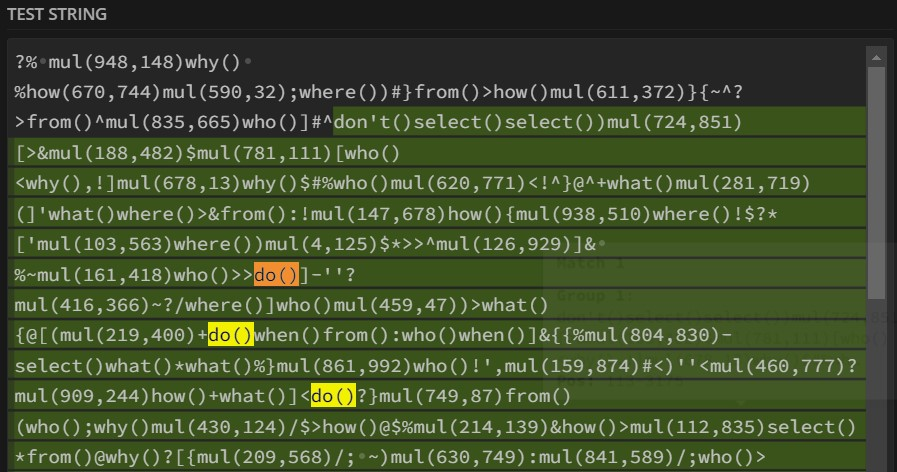
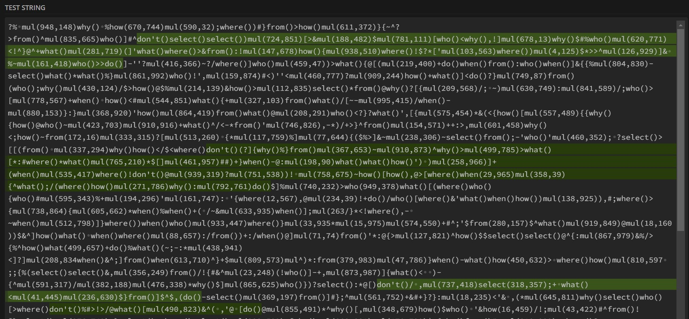

### Ensimmäinen osa
Syötteenä on tällä kertaa melkoinen sekasotku, joka näyttää tältä: `xmul(2,4)%&mul[3,7]!@^do_not_mul(5,5)+mul(32,64]then(mul(11,8)mul(8,5))`. Data esittää tietokoneen muistin sisältöä, mutta muisti on pahemman kerran korruptoitunut.

Tietokoneella ajettavan sovelluksen on tarkoitus tehdä kertolaskuja luvuilla, jotka ovat 1-3 numeron pituisia. Syötteessä jakolasku ilmaistaan näin: `mul(x,y)`. Esimerkiksi `mul(44,46)` kertoo yhteen 44 ja 46, jolloin tulokseksi tulee 2024. Tehtävänä on etsiä korruptoituneesta muistista kaikki validit kertolaskut ja laskea näiden tulot yhteen. Kuten esimerkistä näkee, ylimääärisiä merkkejä voi olla missä tahansa kohdassa.

Heti ensimmäisenä mieleen tuli, että tehtävä on kuin luotu [regular expressionin](https://en.wikipedia.org/wiki/Regular_expression) käytölle. Periaatteessa ongelman voisi ratkaista myös rakentamalla erillinen parseri, mutta se tuntui ainakin tässä kohtaa tarpeettomalta työläältä. Oletin myös, että toisessa osassa ongelma vaikeutuu niin, että sekasotkun keskeltä on löydettävä myös sellaiset kertolaskut, joiden keskellä on ylimääräisiä merkkejä. Regular expression voisi ratkaista myös sen ongelman.

Tällä ajatuksella lähdin liikkelle. Hyvä työkalu regular expressionien rakentamiseen ja testaamiseen on [Regular Expressions 101](https://regex101.com). Ensimmäinen kokeilemani regex oli `/(mul\(\d{1,3},\d{1,3}\))/`. Tämä etsii merkkijonosta kaikki kohdat, jotka alkavat `mul` tekstillä. Sitä pitää seurata sulut, joiden sisällä on kaksi pilkulla erotettua numeroa, jotka ovat 1-3 merkkiä pitkiä.

Seuraavaksi kävin löytyneet osumat läpi, ja poistin niistä `mul(` sekä `)` tekstit, jolloin jäljelle jäi vain pilkulla erotetut numerot. Esimerkiksi `mul(44,46)`-tekstistä tuli `44,46`. Tämän jälkeen pilkoin merkkijonon kahteen osan pilkun kohdalta. Nyt minulla oli kaksi lukua, jotka pystyin kertomaan yhteen. Kävin tällä tavalla kaikki löydöt läpi, summasin tulot yhteen ja sain oikean vastauksen.

### Toinen osa
Seuraava vaihe ei ollutkaan ihan sitä mitä ensimmäisessä vaiheessa odotin. Selvisi, että sekasotkun sisällä on kaksi ehto-komentoa: `do()` ja `don't()`. Nämä kaksi ohjetta kontrolloivat sitä, lasketaanko kertolaskut mukaan vai ei. Mikäli kertolaskua edeltää `don't()`, sitä ei lasketa mukaan. Näin jatketaan niin pitkään, kunnes vastaan tulee `do()`-komento, jonka jälkeen tulevat kertolaskut lasketaan summaan. Syötteen alussa olevat kertolaskut lasketaan mukaan, vaikka syöte ei alakaan `do()`-komennolla.

Hetken aikaa mietittyäni tajusin, että tehtävä on loppujen lopuksi ihan sama kuin ensimmäisessä osassa, mutta keskeisimpänä erona on se, että minun olisi hylättävä sellaiset osat syötettä, jotka alkavat `don't()` ohjeella ja päättyvät `do()`-ohjeeseen tai päädyn syötteen loppuun. Minun ei sinänsä tarvitse välittää `do()`-ohjeesta sen enempää, sillä se ei muuta toimintaa mitenkään.

Niinpä yritin rakentaa regular expressionin, joka etsisi kaikki `don't()`-alkuiset ohjeet. Päädyin tähän: `(don't\(\).*(?:do\(\)))`. Kun sain poimittua syötteestä kaikki `dont()` osat pois, jäljelle jäi pelkästään se osa, jonka voisin käsitellä kuten ensimmäisessä osassa. Testasin koodin haasteen esimerkkisyötteellä ja se toimi! Ongelmana oli vain se, että koodini ei toiminut minun omalla syötteellä. Vastaukseni oli liian pieni. Se tarkoitti sitä, että tekemäni koodi poisti syötteestä kertolaskuja, joita sen ei olisi pitänyt poistaa. Ei muuta kuin leuka rintaan ja kohti uusia pettymyksiä.

Tutkin kötöstystäni regex101:n avulla ja sieltä näin suoraan, että tekemäni regex ei toimi niin kuin pitää. Vihreällä olevat osat ovat niitä, jotka koodi tulee poistamaan, ja niiden sisältä löytyi `do()` ohjeita. Ei hyvä.

Seuraavaksi kokeilin tätä: `(don't\(\).*?do\(\))`. Regex101-testillä se näytti tekevän juuri sitä mitä pitikin, eli etsi kaikki kohteet jotka alkavat `don't()` kommennolla ja päättyvät *ensimmäiseen* `do()`-komentoon. Näytti lupaavalta!

Vertasin vielä tuloksia regex101:n ja oman koodini välillä. Kummatkin löysivät syötteestä 18 don't()-komentoa. Viimeisenä varmistuksena ajoin koodin annettua testisyötettä vastaan ja sain siitä oikean tuloksen. Kaikki piti olla kunnossa, mutta kun ajoin koodin, sain edelleen väärän vastauksen. Mitä ihmettä?!

Pieni tarkastelu osoitti, että syötteen loppupuolella on `don't()`-komentoja, jotka eivät koskaan pääty `do()`-komentoon. Tekemäni regular expression ei mätsää niihin. Tässä kohtaa totesin, että omat regular expression -taidot ja kärsivällisyys eivät riittäneet, joten päätin kirjoittaa funktion, joka siivoaisi turhat osat syötteestä pois ilman regular expression -taikuutta.

Funktion idea on seuraava:
1) Etsi syötteestä ensimmäinen `don't()`-komento. Mikäli tätä ei löydy, käsittely on valmis.
2) Etsi syötteestä ensimmäinen `do()`-komento, joka on edellisen `don't()`-komennon jälkeen. Mikäli `do()`-komentoa ei löydy, poista koko syötteen loppu ja käsittely on valmis.
3) Poista syötteestä osa, joka on äsken löydettyjen komentojen välissä.
4) Kutsu samaa funktiota siistityllä syötteellä

Kyseessä on siis [rekursiivinen funktio](https://en.wikipedia.org/wiki/Recursion_(computer_science)), eli funktio, joka kutsuu itse itseään ja pureutuu näin koko ajan syvemmälle syötteeseen. Jokaisella kutsulla syötteestä poistetaan yksi `don't()`-osio ja tätä tehdään niin pitkään, ettei niitä ole lainkaan jäljellä. Kun ajoin koodin uudella funktiolla, sain vihdoinkin oikean vastauksen.

Haaste oli hyvä esimerkki siitä, että vaikka regular expressionit ovat monessa tilanteessa hurjan näppäriä, ne ovat lähes yhtä useasti kohta, jossa kompastuu helposti. Niiden toimintaa on usein vaikea ymmärtää ja yhtä vaikea debugata ilman erillisiä työkaluja.


$ go run . -d 3 -s 1
Day 3 / Step 1 result: 187833789
Execution time 1.658ms

$ go run . -d 3 -s 2
Day 3 / Step 2 result: 94455185
Execution time 1.4314ms


- [Haastesivu](https://adventofcode.com/2024/day/3)
- [Ratkaisun koodi](https://github.com/saaste/advent-of-code-2024/blob/main/pkg/puzzle/3.go)