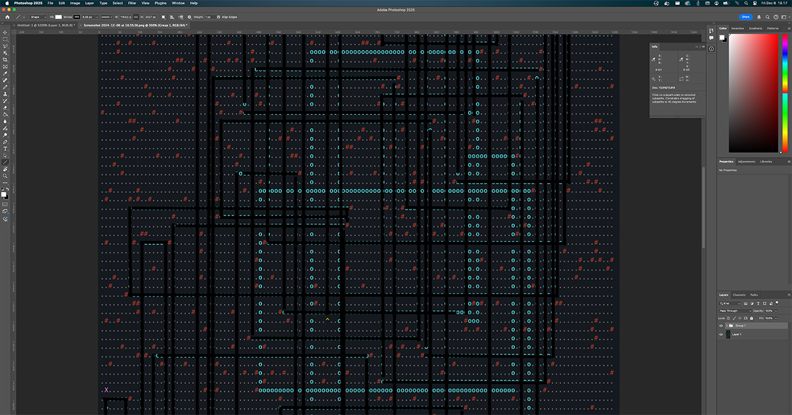

### Ensimmäinen osa
Tehtävänä on väistellä vartijaa. Päivän syöte on kartta, joka näyttää tältä:


....#.....
.........#
..........
..#.......
.......#..
..........
.#..^.....
........#.
#.........
......#...


Vartija on merkitty karttaan `^`-merkillä. Samalla kartasta selviää, että vartija katsoo tällä hetkellä pohjoiseen. Ympäristössä olevat esteet on merkitty `#`-merkeillä.

Vartijan partiointireitti noudattaa kahta yksinkertaista ohjetta:
1) Jos edessä on este, käänny 90 astetta oikealle
2) Muussa tapauksessa ota askel eteenpäin

Tehtävänä on selvittää kaikki karttapisteet, jossa vartija tulee partiointinsa aikana käymään, ennen kuin hän poistuu kartan ulkopuolelle. On täysin mahdollista, että vartijan reitti kulkee useamman kerran saman karttapisteen kautta. Pulman lopullisena vastauksena on annettava vartijan vierailemien *yksilöllisten* karttapisteiden määrä.

Ajattelin lähteä ratkomaan tätä yksinkertaisesti simuloimalla vartijan liikkeet askel kerrallaan. Tätä varten ajattelin, että minun pitäisi joka askeleella
- tietää missä kohtaa vartija on menossa
- tietää mihin suuntaan vartija on menossa
- onko vartijan edessä jotain
- pitää kirjaa yksilöllisistä pisteistä, jossa vartija on käynyt

Ensiksi olisi kuitenkin muutettava kartta sellaiseen muotoon, että voisin helposti tarkastaa vierekkäisiä ruutuja esteiden varalta. Ensimmäinen idea oli rakentaa perinteinen kaksiulotteinen array, jonka tein [4. päivän]() tehtävässä.

Muistin kuitenkin [Juhiksen](https://mastodon.world/@hamatti) [ratkaisun](https://hamatti.org/adventofcode/2024/solutions/day-04) samalta päivältä. Hän käyttää map-tietorakennetta (jota kutsutaan Python-kielessä dictionaryksi), eli avain-arvo-pareja, jossa avaimena ovat koordinaatit ja arvona tieto siitä, mitä kyseisessä koordinaatissa on. Pidin ratkaisusta niin paljon, että päätin koettaa samaa itse.

Päätin tällä kertaa toteuttaa ratkaisun Go:n structeilla. Keräsin structiin kartan lisäksi myös vartijan sijainnin sekä vektorin, johon suuntaan hän katsoo. Tämän jälkeen lisäsin apumetodin, joka kertoo, onko vartijan edessä jotain.

Seuraavaksi tein toinen apumetodin, joka liikuttaisi vartijaa yhden askeleen.

Kolmantena tein metodin, joka kääntää vartijaa 90 astetta oikealle. Tämä on varsin helppoa. Jos meillä on vektori `(x, y)`, niin käännettynä myötäpäivään se on `(-y, x)`.

Lopuksi piti vielä tehdä funktio, joka kertoisi, onko vartija kulkenut kartalta ulos.

Nyt minulla pitäisi olla kaikki palaset kasassa ja voisin alkaa simuloida vartijan liikkeitä askel kerrallaan ja pitää kirjaa kaikista pisteistä, jossa hän käy. Sovellus käyntiin ja muutaman millisekunnin jälkeen se oksensi pihalle oikean vastauksen.

### Toinen osa
Toisessa osassa pitäisi muuttaa karttaa lisäämällä sinne yksi este. Tavoitteena oli asetella este niin, että vartija ei koskaan poistu kartalta, vaan vartiointireitti alkaa kiertämään kehää. Estettä ei voi laittaa siihen paikkaan, josta vartija lähtee liikkeelle, koska hän huomaisi jos hänen niskaansa putoisi jotain.

Tällaisia paikkoja on kuitenkin enemmän kuin yksi ja tehtävänä onkin selvittää, että kuinka monta tällaista kehän aiheuttavaa estepistettä kartalta löytyy.

Todellinen syötä on kartta, jonka koko on `130 x 130`. Karttapisteitä on siis yhteensä *16 900* kappaletta. Potentiaalisia vaihtoehtoja ei ole aivan niin paljoa, sillä pisteistä voi poistaa vartijan aloitussijainnin sekä olemassa olevat esteet, joita omassa syötteessäni on 824. Potentiaalisia uusia estepisteitä on siis 16 900 - 824 = *16 076*.

Kehäreitin selvittämiseksi olisi tiedettävä, että onko vartija ollut samassa pisteessä aikaisemmin ja katsonut samaan suuntaan. Jos on, tiedämme, että reitti kulkee kehää. Olisi siis pidettävä kirjaa sekä kuljetuista karttapisteistä, että suunnista, johon vartija on kyseisessä pisteessä katsonut.

Ensimmäisessä tehtävässä vartija otti *5339* askelta, ennen kuin hän poistui kartalta. Yhden reitin pituus voi siis olla hyvin pitkä. Jos ajatellaan, että jokainen reitti olisi noin pitkä ja simuloisin kaikki 16 076 vaihtoehtoa, minun olisi tutkittava yli 85 miljoonaa askelta. Jaiks!

Koska mieleeni ei tullut suoraan tapaa, jolla tätä voisi optimoida, jätin ajatuksen hautumaan ja lähdin toteuttamaan brute force -ratkaisua, joka testaisi kaikki reittivaihtoehdot. Ajattelin, että ehkä oppisin matkalla jotain.

Ensiksi tein uuden map-tietorakenteen, mutta nyt avain sisältäisi vartijan sijainnin lisäksi myös vektorin, johon suuntaan hän on katsonut. Näin voin todella nopeasti tarkastaa, että ollaanko samassa tilanteessa oltu aikaisemmin.

Sen jälkeen aloin käydä läpi jokaista karttapistettä. Jokaisen kohdalla muutin pisteen esteeksi ja aloin simuloida vartijan kävelyä uudelleen. Jos vartija käveli kartalta ulos, simulointi voitiin pysäyttää. Sama juttu, jos palattiin tilanteeseen, jossa oltiin oltu aikaisemmin. Tässä tapauksessa kirjasin ylös, että löysin kehän.

Testasin toteutusta ensiksi pienellä testisyötteellä. Sain oikean vastauksen eikä ajokaan kestänyt kuin 2,5 millisekuntia. Lupaavaa!

Sitten prosessori hurisemaan oikealla syötteellä. Tässä kestikin sitten 33 sekuntia ja sain vastaukseksi `1777`, joka ei kuitenkaan ollut oikea vastaus. Se oli liian vähän, joten jostain syystä kävelysimulaattorini ei päätynyt kehäreitille, vaikka sen olisi pitänyt päätyä.

Nämä ovat Advent of Coden kinkkisimpiä tilanteita, jossa koodi toimii testisyötteellä, eikä se anna virheitä, mutta et saa myöskään oikeaa tulosta. Usein oikea syöte on niin massiivinen, että sen debuggaaminen voi olla vaikeaa, tai jopa mahdotonta. Käärin kuitenkin hihat ja aloin hommiin.

Ensimmäisenä tarkastin, että kulkeeko vartijani samoja reittejä kuin esimerkeissä. Lisäsin pienen pätkän koodia, joka piirtää reitit ruudulle. Vertasin niitä annettuihin esimerkkireitteihin ja kaikki olivat oikein. Pirulauta!

Piirsin myös oikeiden syötteiden synnyttämiä reittejä ja koetin silmämääräisesti katsoa, löytäisinkö sieltä jotain omituisuutta. Ja siinä kohtaa tajusin, etten ollut tajunnut yhtä päivänselvää optimointia.

Koska vartija lähtee aina samasta paikasta ja samaan suuntaan, tiedän mitä reittiä hän kulkee ilman esteitä. Ainoat paikat, joilla esteillä on mitään merkitystä, on tämän reitin varrella. Voin siis huoletta jättää testaamatta kaikki sellaiset pisteet, jotka ovat alkuperäisen reitin ulkopuolella. Tämä ei tietenkään ratkaise ongelmaani, mutta nopeuttaa suoritusta tuntuvasti.

Härveli käyntiin ja tulos tuli nyt pihalle reilussa seitsemässä sekunnissa. Hämmentävää oli kuitenkin se, että sain myös uuden tuloksen: `1943`. Tämä oli suurempi kuin aikaisempi vastaus, joten päätin testata sitä. Ei, vastaus oli edelleen väärä. Tällä kertaa se oli liian suuri. Oikea vastaus olisi siis jossain 1777:n ja 1943:n välillä. Koodissa oli edelleen virhe.

Kokeilin samaa koodia testisyötteellä ja sain myös siellä yhden reitin liikaa. Hyvä! Pienemmällä syötteellä virhe on helpompi paikallistaa.

Piirrettyjä karttoja katsellessa huomasin, että yksi kartoista on mukana kaksi kertaa. Äh, tietenkin, saman pisteen läpi kuljettiin alkuperäisessä reitissä kahteen kertaan, joten epähuomiossa lisäsin sen myös mahdollisten blokattavien pisteiden listaan kahdesti. Korjasin virheen ja nyt sain testisyötteellä oikean tuloksen. Oikealla syötteellä sain kuitenkin edelleen saman väärän 1777 vastauksen.

Tästä alkoikin sitten tuntikausia kestävä debuggaaminen. Päädyin myös kirjoittamaan koko koodin uusiksi kopioimatta yhtäkään kohtaa vanhasta koodista. Lopputulos? Sain tismalleen samat vastaukset.

Koska [Juhis](https://mastodon.world/@hamatti) oli tässä kohtaa ratkaissut oman haasteensa, pyysin häntä ajamaan oman toimivan koodinsa minun syötteellä, jotta tietäisin, että kuinka paljon oma vastaukseni on vinossa. Sen myötä sain selville, että minulta puuttuu *19* estettä. Juhis tarjosi myös ystävällisesti debuggausapua, mutta halusin vielä tässä kohtaa nuijia päätäni seinään ihan yksin.

Olisin tietenkin voinut tässä kohtaa naputella Juhiksen kertoman vastauksen palveluun ja väittää ratkaisseeni sen. Se olisi tietenkin typerää, koska eihän haasteen pointtina ole kertoa oikeaa vastausta vaan onnistua kirjoittamaan koodi, joka kertoo sen. Ja sitä en ole vielä tehnyt.

Kun kirjoitin koko ratkaisun uusiksi, ennakoin myös sitä, että haluan testata sitä. Siksi pilkoin osaset pienempiin funktioihin, joita olisi helpompi testata. Aloin siis kirjoitella yksikkötestejä, jotta varmistuisin siitä, että funktiot toimivat niin kuin pitää. Löysinkö testeillä mitään? En. Kaikki näytti toimivan kuten piti.

Koska en löytänyt mitään selkeää syytä väärään tulokseen, kysyin Juhikselta, voisiko hän toimittaa minulle listan sijainneista, jotka aiheuttavat kehän. Hän sellaisen minulle ystävällisesti toimitti ja ajattelin, että tämän avulla voin iskeä koodiin breakpointeja, jotka mätsäävät vain puuttuviin pisteisiin ja näin voin kohdistaa katseeni juuri oikeaan paikkaan. Olin varma, että ongelma ratkaisi helposti.

Todellisuus? Olin entistä enemmän sekaisin. Kuvittelin, että vertaamalla löydöksiä löytäisin ne 19 puuttuvaa pistettä, mutta toisin kävi. Juhiksen listassa oli yli 200 sellaista pistettä, joita minulla ei ollut. Vastaavasti minulla löytyi sellaisia pisteitä, joita Juhiksen *validissa* listassa ei löytynyt. Minun koodi tuotti siis edelleen pelkkää paskaa ja se, että tulokseni oli "melkein oikein", tuntui olevan lähinnä sattumaa.

Päätin yrittää visuaalista debuggaamista. Valitsin Juhiksen listasta yhden pisteen, joka ei toiminut minun koodilla. Jättimäisen [ASCII-grafiikan](https://en.wikipedia.org/wiki/ASCII_art) debuggaaminen on vaikeaa, mutta onnistuin rakentamaan [termbox-go](https://github.com/nsf/termbox-go)-kirjaston avulla virityksen, joka piirsi minulle vartijan kulkemaa reittiä sitä mukaa kuin koodi sitä tarkasteli.

Vaikka katsoin reittiä monta kertaa, en onnistunut löytämään siitä yhtään kohtaa, jossa koodi toimisi minusta väärin. Ongelmana oli kuitenkin se, että grafiikka oli niin hiivatin pientä, että sitä oli vaikea seurata.

Elämäni ensimmäisen kerran selvitin koodiongelmia Adobe Photoshopilla. Otin grafiikasta kuvaruutukaappauksen ja avasin sen Photoshopiin, jotta voisin käydä jokaisen kuljetun suoran yksi kerrallaan läpi. Mutta... edes tämä ei auttanut. Päädyin viivaa seuraamalla kartasta pihalle, vaikka seurasin sitä orjallisesti. Tuntui niin kuin eläisin aivan eri todellisuudessa kuin muut.

Purin turhautumista laittamalla Juhikselle kuvan omista ASCII-virityksistä. Ja kuinka ollakaan, Juhis huomasi jollain ilveellä, että minun ASCII-kuvasta puuttuu yksi seinä. MITÄ?!

Kun tiesin mitä katsoa, laitoin vartijan taas kulkemaan reittiä pitkin ja keskitin katseeni siihen kohtaan, jossa seinän piti olla. Ja siellähän se oli. Mutta miksi sitä ei näkynyt aikaisemmassa kuvassa?

Annoin vartijan kulkea ja kun se tuli kohtaan, jossa seinä oli... se paineli siitä läpi. Ja koska koodini piirsi vartijan reittiviivaa, se piirsi sen myös seinän päälle, enkä tajunnut, että siinä piti olla seinä. Tästä syystä en huomannut sitä myöskään Photoshopissa.

Tämän huomattua tajusin heti mikä virheeni oli.

Koodini tutki joka askeleella, että voiko vartija mennä eteenpäin. Jos edessä on seinä, vartija kääntyy oikealle ja jatkaa matkaansa - *tarkastamatta onko siinä seinää*! En ollut ottanut koodissani huomioon kulmapaikkoja, jossa vartijan on tehtävä kaksi käännöstä.

Kohdassa, jossa vartija paineli seinän läpi, oli vieressä toinenkin seinä. Vartija kyllä väisti sitä ja kääntyi oikealle, mutta ei välittänyt toisesta seinästä lainkaan. Virheeni oli, että olin odottanut yhden käännöksen riittävän.

Muutin samoin tein koodia niin, että käännöksen jälkeen seinätarkastus tehdään uudelleen niin monta kertaa, että vartijalla on vapaa reitti. Ajoin koodin ja sain vihdoinkin **oikean lopputulos**. Uudella koodilla ensimmäinen vaihe meni läpi reilussa millisekunnissa ja toinen noin viidessä sekunnissa. Varsin hyvä parannus alun 30 sekunnista.

Tästä tuli tämän vuoden ensimmäinen AoC-haaste, jonka traumoja parannellaan vielä vuosien päästä. Iso kiitos [Juhikselle](https://mastodon.world/@hamatti) avusta ja tarkkasilmäisyydestä! Muistakaa käydä lukemassa myös [hänen ratkaisunsa](https://hamatti.org/adventofcode/2024/Solutions/Day-06) tämän päivän tehtävään. Nyt minäkin uskallan sen lukea, kun sain oman kötöstykseni toimimaan eikä tarvitse vältellä spoilereita.

Tämä päivä oli myös hyvä muistutus siitä, kuinka suuri apu ylimääräisestä silmäparista voi olla.


$ go run . -d 6 -s 1
Day 6 / Step 1 result: 4819
Execution time 1.299209ms

$ go run . -d 6 -s 2
Day 6 / Step 2 result: 1796
Execution time 4.935905167s


- [Haastesivu](https://adventofcode.com/2024/day/6)
- [Ratkaisun koodi](https://github.com/saaste/advent-of-code-2024/blob/main/pkg/puzzle/6.go)