Päätin vuoden 2024 lopussa opetella käsityötaitoja. Tätä varten tarvitsin opetteluprojektin, joka tarjoaisi mukavaa haastetta, mutta olisi myös oikeasti hyödyllinen.

Olen jo pidemmän aikaa halunnut korvata työpöydällä lojuvan Harman/Kardon -bluetooth-kaiuttimen kunnollisilla stereokaiuttimilla, joten se tuntui hyvältä projektilta. Siinä pääsisin puutöiden pariin, mutta saisin kosketusta myös elektroniikkapuoleen.

### 2.1.2025 - Rakennussarja

Kyselin projektiin vinkkejä [Helsingin Hacklabin](https://helsinki.hacklab.fi) väeltä. Minulle suositeltiin [Uraltonen](https://uraltone.com) rakennussarjoja, joten päätin lähteä niillä liikenteeseen.

Mittasin, että näytön molemmilla puolilla on noin 19 cm tilaa kaiuttimille. Kaiuttimien olisi siis oltava verrattain pienet.

Päädyin tilaamaan [UT HLS-10 -rakennussarjan](https://uraltone.com/ut-hls-10-2-tie-hifi-kaiutinrakennussarja-samu-saurama-design.html). Paketissa on neljän tuuman bassoelementti, tuuman diskanttielementti, terminaali sekä komponentit jakosuotimen rakentamista varten. Sarjalla oli hintaa 99 euroa. Koska tarvitse kaksi kaiutinta, minun oli tilattava kaksi sarjaa, eli yhteensä **198 €**.

Kotelot on rakennettava itse, mutta mukana toimitetaan rakennusohjeet. Ohjeet olivat hienoinen pettymys, sillä ne ovat ruutupaperille kynällä piirretty töherrys. Kyllä siinä varmasti kaikki oleellinen on mukana, mutta antaa rakennussarjasta hieman epäammattimaisen kuvan.

Ensimmäisenä avasin paketin ja varmistin, että siellä on kaikki tarpeellinen mukana. Näytti olevan. Seuraavaksi täytyy päättää, että noudatanko mukana tulevaa rakennusohjetta orjallisesti, vai muokkaanko sitä itseäni miellyttävään suuntaan.

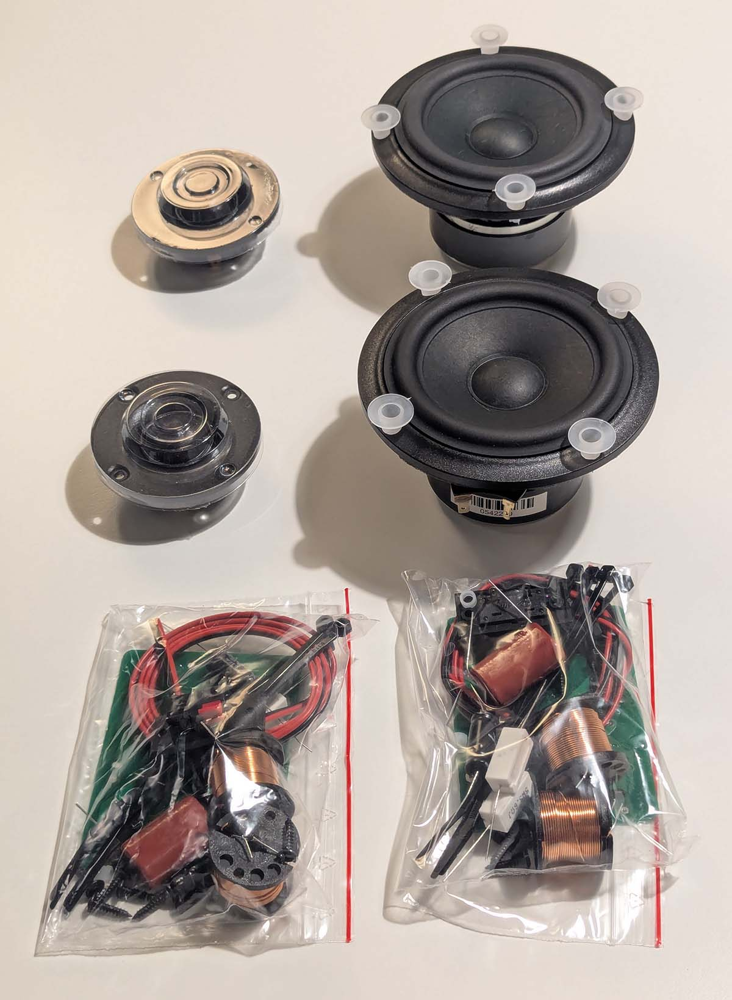

### 8.1.2025 - Materiaalit koteloon

Suunnittelin aluksi tekeväni kotelon MDF:stä. Kun kuulin, että se tuottaa hirveän määrän hienoa pölyä työstötavasta riippumatta, päädyin lopulta vaneriin. Vaihtoehtona olisi ollut myös massiivipuu, mutta se on turhan arvokasta tavaraa minun harjoitteluihin.

Askartelin mukana tulleiden ohjeiden ja mittojen pohjalta itselleni 3D-mallin Blenderillä. Enhän minä sitä mallia sinänsä mihinkään tarvitse, mutta se auttaa minua hahmottamaan, mitä olen tekemässä. Siitä tuli hieman myöhemmin myös yllättävää hyötyä.

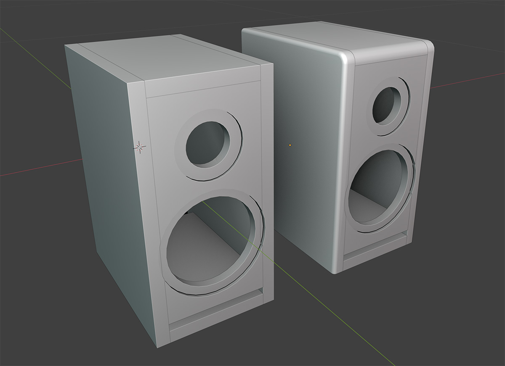

Seuraava haaste oli materiaalin hankinta. Vaneria saa kyllä lähes joka rautakaupasta, mutta suurin osa myy vain kokonaisia levyjä, jotka ovat aivan liian suuria pieneen kaiutinprojektiin. Esimerkiksi [STARKin myymät levyt](https://www.stark-suomi.fi/tuote/koivuvaneri-bb-wg-15x1220x2440-mm-2-98-m2-hs72) ovat kooltaan 1220 x 2440 mm.

Tässä kohtaa 3D-malli oli hyödyksi, sillä sen avulla minun oli helppo asetella palaset levylle ja näin suoraan, kuinka paljon materiaalia tarvitsisin. Minulle riittäisi 1/4 levy.

Sain selville, että [Petikon STARK](https://www.stark-suomi.fi/myymalat/vantaa-petikko) myy puolikkaita levyjä. Ystävällinen varastojamppa suostui pistämään puolikkaan palasenkin puoliksi. Tämä tulikin tarpeeseen, sillä minun piti saada kuljetettua materiaalit kotiin kuormapyörällä. Puolikkaassa levyssä on tuplasti enemmän materiaalia tarpeeseen nähden, mutta onpahan vara tehdä virheitä, eikä tarvitse pelätä heti vanerin loppumista.

Hintaa 15 mm paksulla 1220 x 1220 mm kokoisella levyllä oli **54,83 €**.

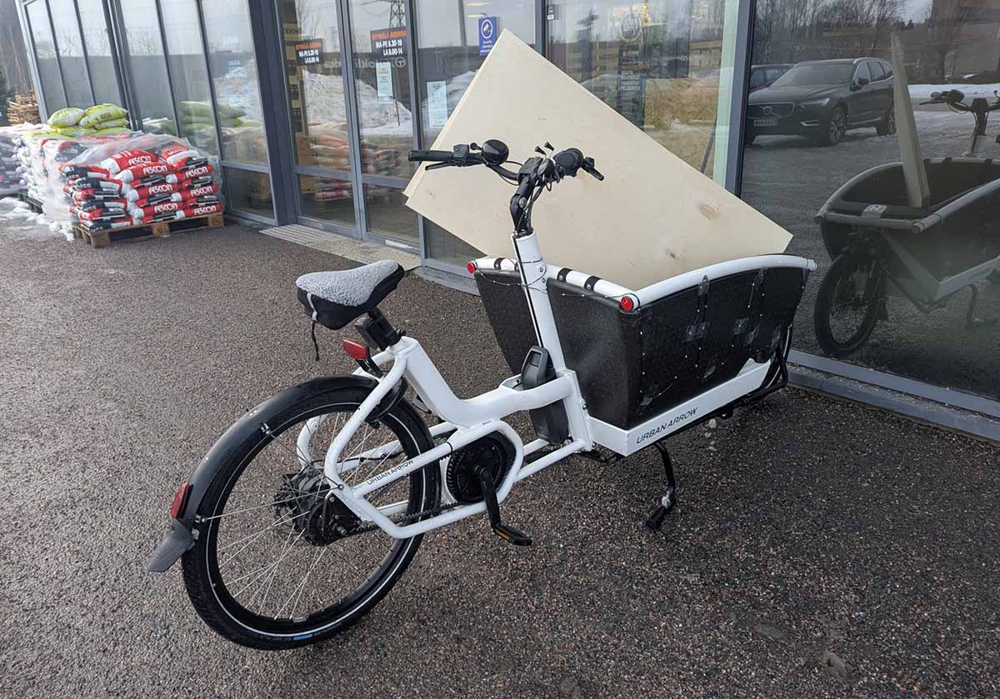

### 10.1.2025 - Kotelon osien leikkaus

Kiikutin eilen vanerilevyn puutyötilaan. Siellä mittailin ja piirtelin levyyn jokaisen palasin, mutta en alkanut vielä leikkaamaan palasia. Syitä oli tasan yksi: pöytäsaha kuumottaa minua hiivatisti.

Ukkini oli puuseppä ja hän menetti siinä touhussa myös pari sormeaan. Vaikka tämä tapahtuikin höylässä, minulle on jäänyt tapahtuneesta hienoinen pelko ja jättimäinen kunnioitus puutyökoneita kohtaan. Joku mainitsi joskus, että puuverstaan laitteet on suunniteltu rikkomaan ihmiskeho mitä moninaisimmilla tavoilla, mutta välillä niillä voi tehdä myös puutöitä. Olen samaa mieltä.

Kävin kyllä muutama kuukausi sitten pöytäsahan perehdytyksen, mutta nyt en ole päässyt laitetta koskaan käyttämään. Virkistin tänä aamuna muistiani katsomalla YouTubessa parit laitteen käyttöön liittyvää videota ja niillä eväillä lähdin kokeilemaan onneani. Onneksi verstaalla oli muitakin, niin sain heiltä hieman lisätukea.

Loppujen lopuksi leikkaus sujui ilman ongelmia. Isossa pöytäsahassa oli hyvät mittaustyökalut, joiden avulla sain leikattua palat juuri oikean kokoiseksi.

Kotona aloin selvittää kotelon sisään tulevan vaimennusmateriaalin hankintaa. Ongelma ratkesi itsestään, sillä toisella Hacklabin jäsenellä sattui olevaan omasta kaiutinprojektista yli jäänyttä vaimennusmateriaalia.

Huomisen ohjelmassa olisi kotelon liimaaminen. Saan myös vaimennusmateriaalit huomenna, joten herättelen toiveita siitä, että saisin kiinnitettyä ne samalla käynnillä.

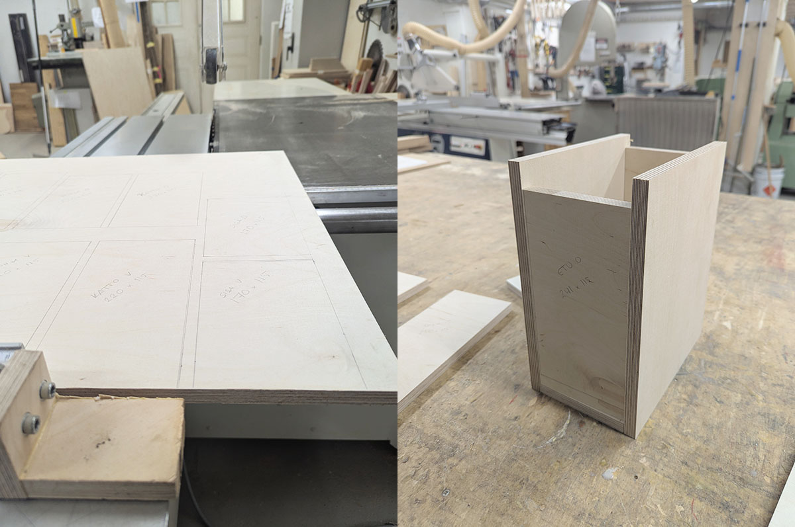

### 11.1.2024 - Jakosuodin ja kotelon liimaus

Sain päivällä hyvän määrän vaimennusmateriaalia. Materiaalia oli yli neliömetri, eli reilusti yli omien tarpeiden. Vaan onpahan nyt silläkin puolella vara epäonnistua ja yrittää uudelleen. Hintaa tuolla neliöllä oli **20 €**.

Tavoitteena oli saada liimattua molempien koteloiden sisäosat kasaan. Sivuseinät jätin toistaiseksi tarkoituksella auki, jotta voisin valmistella kaikki sisälle tulevat asiat. Käytännössä se tarkoittaa jakosuodinta, johtoja ja vaimennusmateriaalia.

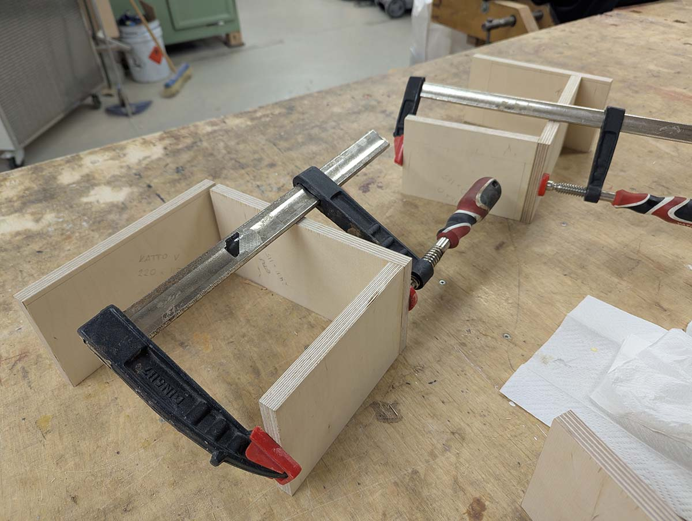

Harkitsin aluksi, että olisin paukauttanut liimattavat palaset kiinni toisiinsa viimeistelynaulaimella, jotta saisin palat varmasti 90 asteen kulmaan. Pieni testi osoitti kuitenkin, ettei sille ollut tarvetta. Pöytäsahalla tehdyt leikkaukset olivat niin suoria, että liimaaminen onnistui helposti pelkkien puristimien avulla.

Kotelo ei ole suljettu, vaan sen etuseinässä on refleksiaukko. Tästä syystä en pystynyt liimaamaan kaikkia neljää seinää yhtä aikaa, vaan liimasin ne kulma kerrallaan. Vei vähän enemmän aikaa, mutta eipä minulla ollut mihinkään kiire. Ihan hyvä siitä tuli!

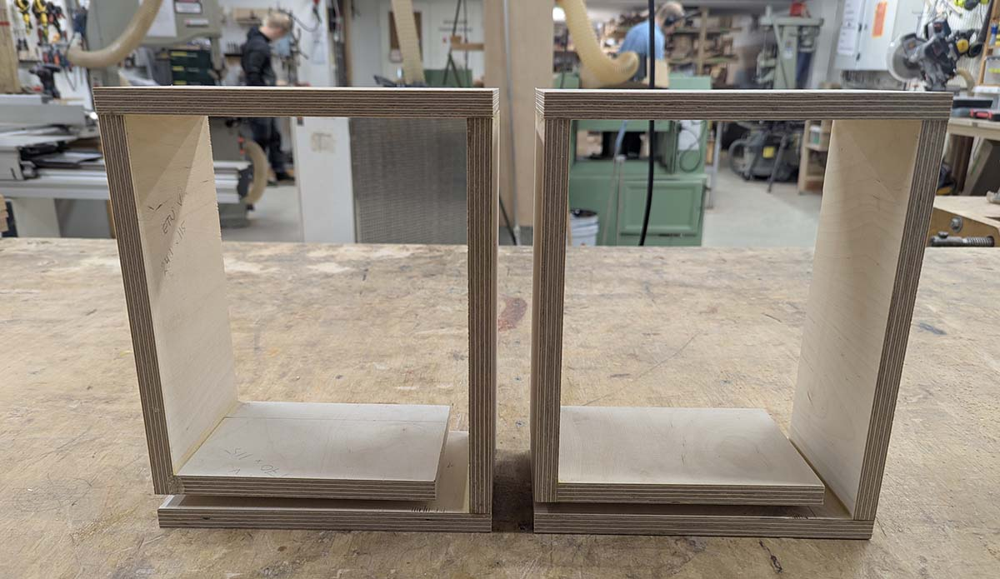

Liiman kuivumista odotellessa pistin jakosuotimet kasaan. En juurikaan ymmärrä elektroniikasta, mutta osaan seurata ohjeita. Komponenttien paikat oli helppo löytää selkeän ohjeen avulla. Vähän kolvin sekä tinan heiluttelua, ja homma oli paketissa. Piuhoja en kuitenkaan vielä kiinnittänyt.

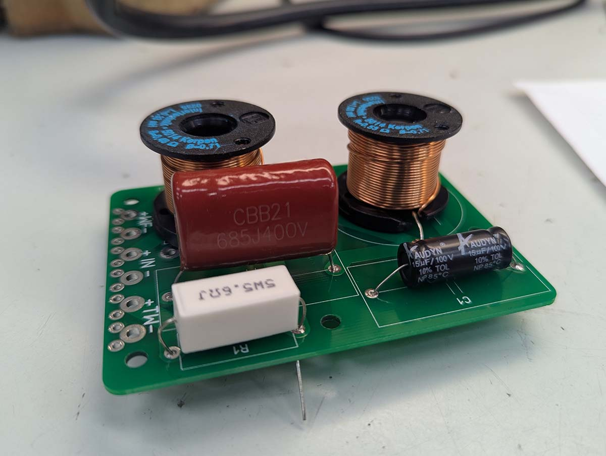

### 12.1.2024 - Yläjyrsimen harjoittelua

Projekti ei juurikaan tämän päivän aikana edennyt - mutta minä etenin! Kokeneempi Hacklabin jäsen nimittäin lupasi tulla opastamaan minulle ylä- ja käsijyrsimen käytön. Laite on ratkaisevassa roolissa kaiutinelementtien reikien sekä asennusurien tekemisessä.

Iltapäivä hurahtikin sitten erilaisia tekniikoita, työkaluja ja teriä ihmetellessä. Tehtiin myös parit harjoitusreiät jämälautoihin, niin ei tarvinnut pelkän teorian varassa olla.

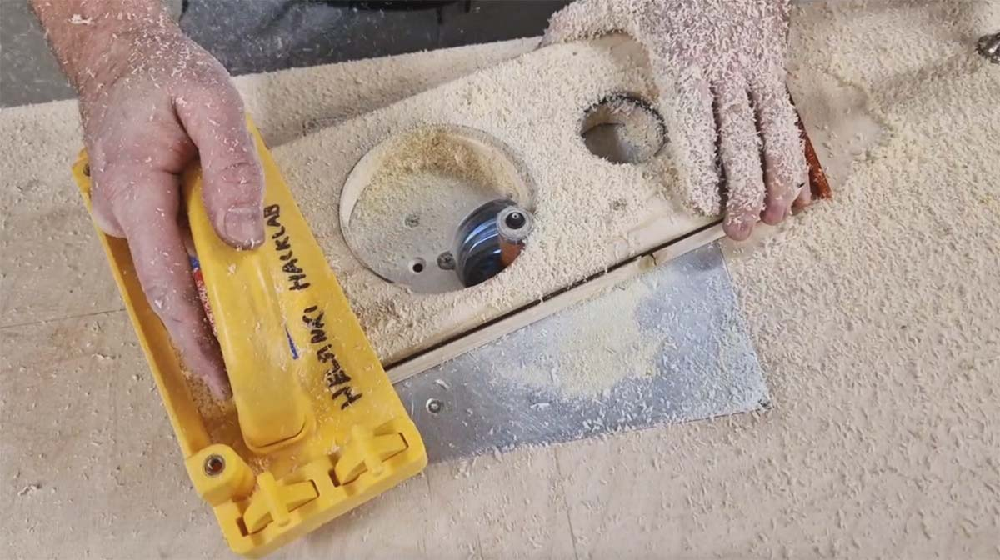

Uskoisin, että minulla on nyt riittävä tietotaito tehdä sopivat reiät varsinaiseen koteloon. Täytyy vaan olla tarkkana, etten mitätöi kaikkea tähän asti tehtyä tekemällä väärän kokoiset reiät.

Ennen kuin hypättiin jyrsimien kimppuun, minulla oli sen verran aikaa, että päätin kolvata jakosuotimiin kaapeloinnit paikoilleen. Siinä kolvaillessa toinen jäsen tuli juttelemaan. Tällä jäsenellä sattui olemaan myynnissä pienikokoinen vahvistin, joka sopisi hyvin tulevien kaiuttimien kaveriksi. Olinkin miettinyt sellaisen hankintaa, mutta nyt sekin ongelma taitaa ratketa kuin itsestään.

### 13.1.2024 - Epäonnistumisia

Tämä päivä ei ollut erityisen suuri menestys.

Ensimmäisenä halusin kiinnittää jakosuotimen kotelon takaseinään. Voidaan yhdessä miettiä, että olisiko se ollut helpompaa, jos olisin kiinnittänyt sen ennen liimaamista. Nyt piirilevyn ruuvaaminen oli ihan hirveää ähräämistä, jossa meni tarpeettoman paljon aikaa. Valitsemani työjärjestys ei ollut erityisen fiksu, mutta osasin varautua tähän. Sain kuitenkin jakosuotimet kiinni, joten niiltä osin ongelma on hoidossa. Lisäsin pariin komponenttiin myös pari tippaa kuumaaliimaa, jotta ne eivät heiluisi.

Siinä jakosuotimen kanssa ährätessä onnistuin moukaroimaan toista koteloa niin, että yksi sen liimauksista petti. Tiesin, etteivät liimaukset kestä hirveitä ilman sivuseiniä ja koetin olla varovainen. En ollut tarpeeksi varovainen. Koetin korjata sitä lisäämällä uutta liimaa. Loppujen lopuksi sivuseinät pitävät kotelon isolta osin kasassa, joten ehkä tuo on ihan kelvollinen pikakorjaus.

Seuraavaksi aloin leikata reikiä elementeille. Tässä vastaan tuli sama ongelma: se olisi ollut paljon helpompi tehdä ennen liimaamista. Nyt jouduin tukemaan koteloa, että pystyisi kasassa ilman sivuseiniä. Onnistuin kuitenkin tekemään alustavat reiät, jotka voin viimeistellä jyrsimellä.

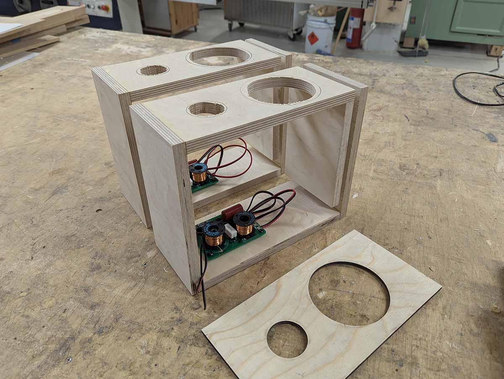

En kuitenkaan muistanut sitä, että eiliset testipalikat olivat juuri niitä: testipalikoita. Koska niitä ei oltu liimattu mihinkään, pystyin ongelmitta käyttämään alajyrsintä. Varsinaisten kaiuttimien kanssa se ei onnistukaan, koska en pääse etulevyyn käsiksi sen alapuolelta.

Viime yön huonot yöunet pitivät huolen, että aivot olivat pelkkää mössöä. Päätin viheltää pelin poikki ja tuumailla asiaa huomenna hieman virkeämmillä aivoilla.

Päivitän tätä sivua sitä mukaa kun projekti etenee.

### 15.1.2024 - Reiät elementeille ja moka

Tarkoitus oli jo eilen aloittaa reikien teko kaiutinelementtejä varten, mutta en päässyt tekemään tarvittavia sapluunoita, koska laserleikkuri oli varattuna. Edistin projektia kuitenkin sen verran, että liimasin toisen sivuseinistä paikoilleen ja leikkelin vaimennusmateriaaleista sopivia palasia.

Tänään pääsinkin sitten kunnolla vauhtiin. Olin laskenut ja piirtänyt valmiiksi oikeassa mittasuhteessa olevan vektorikuvan, jonka pystyin syöttämään laserleikkurille. Sen avulla leikkasin vanerista sapluunat, joilla tulisin ohjaamaan yläjyrsimen kulkua. Tarvitsin yhteensä neljä sapluunaa: kaksi elementtien rei'ille ja kaksi niiden syvennyksille. Päätin tehdä aluksi sapluunat pelkästään rei'ille.

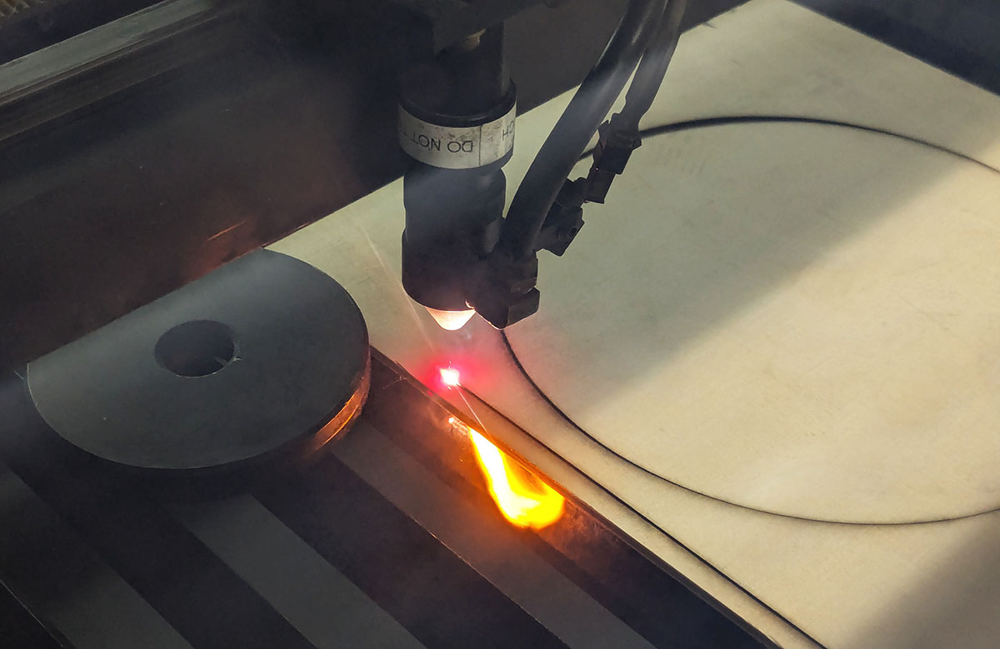

Laitoin kotelon kiinni ruuvipenkkiin ja asemoin sapluunan oikeaan kohtaan sen päälle. Sapluuna pysyi paikoillaan kaksipuoleisella teipillä. Mallailin vielä sapluunan paikkaa jyrsimellä, ja kun kaikki näytti olevan kunnossa, laitoin jyrsimen laulamaan.

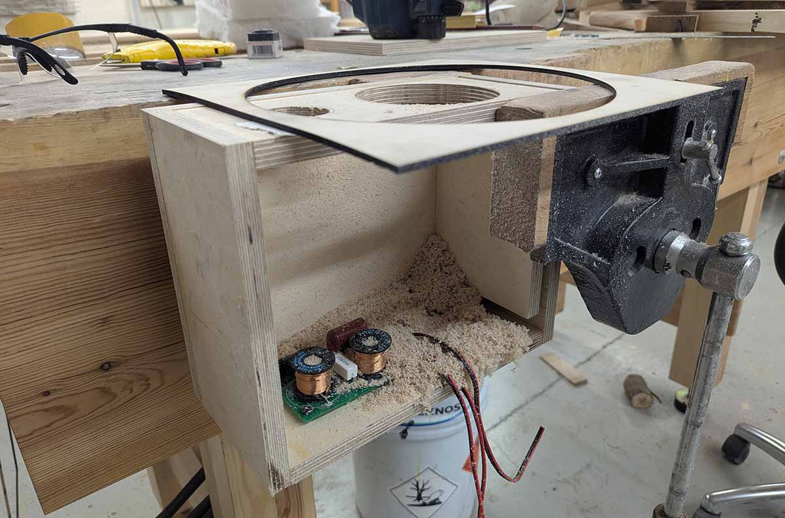

Kuljin rauhalliseen tahtiin sapluunan reunoja pitkin ja lopputuloksena syntyi varsin siisti reikä! Sen jälkeen kotelo irti ja toinen tilalle. Sekin onnistui hienosti. Sama homma piti tehdä myös molempien kaiuttimien pienemmille reille. Olin positiivisesti yllättynyt, kuinka hyvin kaikki sujui.

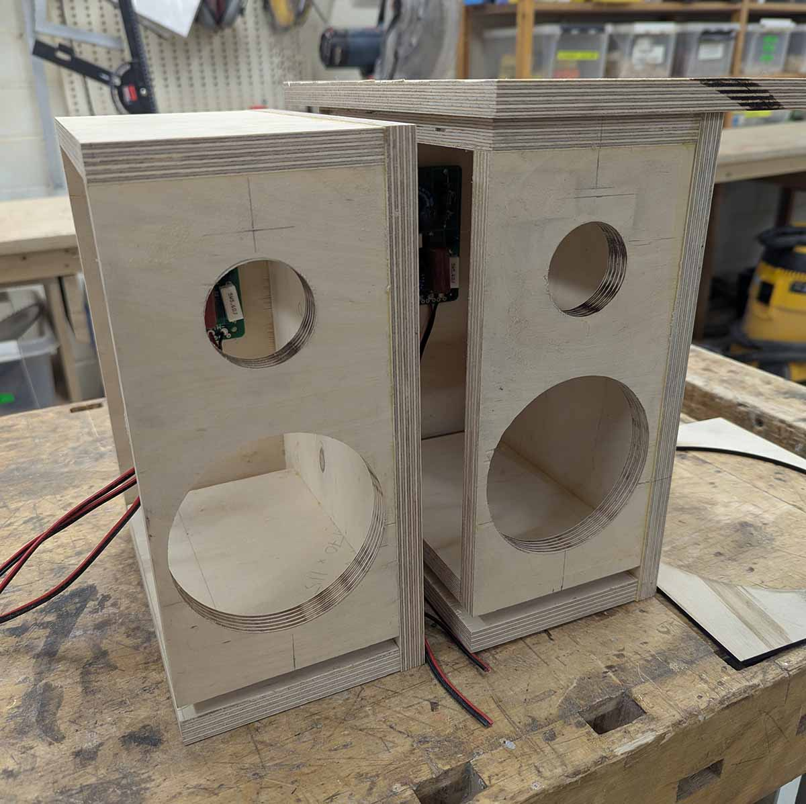

Sitten palasin takaisin laserleikkurille ja tein sapluunat syvennyksiä varten. Tässä kohtaa puutyötilaan oli ehtinyt tulla toinen kaveri, joka oli ottanut käyttöön saman työpöydän, jota itse käytin aikaisemmin. Siirryin sitten toisen pöydän ääreen duunailemaan.

Tässä kohtaa minun piti liimata myös kotelon toinen seinä umpeen. Jos tämän jälkeen kotelon sisällä pitää jotain tehdä, se on tehtävä reikien kautta. Odottelin liiman kuivumista reilut 30 minuuttia ja sen jälkeen runttasin toisen koteloista pöydän puristimeen kiinni. Harmillisesti uuden pöydän puristin ei ollut yhtä hyvä kuin aikaisempi, ja jouduin harrastamaan virittelyä, että sain kotelon pysymään siinä tukevasti. Koska syvennysten sapluunat olivat aikaisempia suurempia, niidenkin asemointi otti oman aikansa. Lopulta kaikki näytti kuitenkin hyvältä.

Upotusten pitäisi olla noin viisi millimetriä syviä. Liiman kuivumista odotellessa olin asettanut jyrsimen terän valmiiksi oikeaan kohtaan ja testannut sitä roskapuuhun. Aikaisempien onnistumisen piristämänä aloin jyrsiä syvennystä ja jälki näytti upealta. Ja sitten sapluuna irtosi teipeistä! Tuloksena jyrsin raapaisi syvennyksen kohtaan, jossa ei todellakaan pitäisi olla syvennystä.

Näin jälkeen päin voi kysyä, että miksi sapluuna oli kiinni pelkästään teipeillä eikä omilla puristimilla? Vastaus on yksinkertainen: koska olen kokematon idiootti 🤪

Vahinko ei ole onneksi suuren suuri, sillä minun on joka tapauksessa ajatuksena viiluttaa kotelot. Vaneriin tulleet pienet mokat jäävät viilujen alle. Tehdyn mokan voi lisäksi aika hyvin paikata.

Tässä kohtaa olin ährännyt projektin parissa kuusi tuntia. Kello alkoi olla sen verran paljon, että päätin lopettaa tältä päivältä ja jatkaa huomenna.